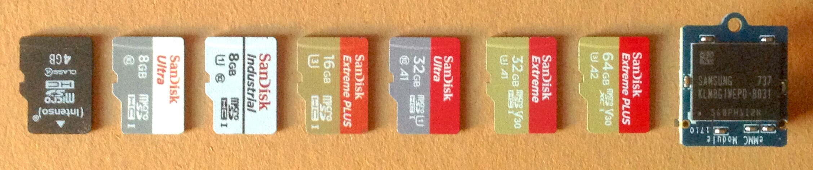

# Performance impact of MMC storage used on SBC

Not any contents yet

## 1st round of tests

All tests happen on NanoPi NEO4 with UHS/SDR104 mode enabled (for reliability reasons limiting SD host controller clock source PLL configuration in a similar way to what [Hardkernel did on ODROID-N1](https://forum.odroid.com/viewtopic.php?f=153&t=30247#p216250) therefore bottlenecking sequential performance to ~67MB/s). All tests done with [Armbian_5.64_Nanopineo4_Debian_stretch_default_4.4.159.7z](https://dl.armbian.com/nanopineo4/archive/) using Armbian defaults (ext4, 600 sec commit interval). The eMMC install has been transferred using `nand-sata-install`.

An `iozone` run pinned to a big core and set to max CPU clockspeed is used for basic benchmarking (IOPS and sequential transfer speeds): `taskset -c 5 iozone -e -I -a -s 100M -r 1k -r 2k -r 4k -r 16k -r 128k -r 512k -r 1024k -r 16384k -i 0 -i 1 -i 2`. Then a grep for `detected capacity change from 0 to 52428800` in `dmesg` output is used to compare influence of the used card on boot speeds. And finally time needed to install LXDE desktop environment was measured (`time apt-get -y install lxde`)

9 different storage types were tested:

* Intenso 'Class 4' 4GB (this card is used as an equivalent for 'average SD card' SBC users pulled out of an old digital camera and use now for the rootfs)
* SanDisk 'Ultra' 8GB
* SanDisk Industrial 8GB
* SanDisk Extreme Plus (neither A1 nor A2)
* SanDisk Ultra A1 32GB
* SanDisk Extreme A1 32GB
* SanDisk Extreme Plus A2 64GB (seems not to be A2 compliant since performance way too low)
* SanDisk Extreme Pro A2 64GB (seems not to be A2 compliant since performance way too low)
* FriendlyELEC's Samsung eMMC 8GB module

## Additional test

I returned the SanDisk Extreme Plus A2 64GB at Amazon and bought a SanDisk Extreme Pro A2 64GB instead. Quick test showed even worse performance.

## Results overview

|            | Average card | SanDisk Ultra | Industrial | Extreme Plus | Ultra A1 | Extreme A1 | Extreme Pro A2 | Extreme Plus A2 | eMMC |
| ---------: | :-----: | :-----: | :-----: | :-----: | :-----: | :-----: | :-----: | :-----: | :-----: |
|   1k read IOPS | 1469 | 2173 | 2116 | 3484 | 2539 | 3990 | 2438 | 2113 | 5350 |
|  1k write IOPS |   97 |  179 |  421 |  542 |  469 |  834 |  462 |  453 | 1489 |
|   4k read IOPS | 1699 | 2144 | 1807 | 2463 | 2708 | 3298 | 1670 | 1343 | 4942 |
|  4k write IOPS |   34 |  161 |  753 |  737 |  905 | 1472 |  597 |  581 | 2276 |
|  16k read IOPS |  708 | 1413 | 1357 | 1901 | 1670 | 2152 | 1559 | 1250 | 3571 |
| 16k write IOPS |    2 |    5 |  446 |  562 |  529 | 1089 |  678 |  656 | 1593 |
|      read MB/s |   43 |   45 |   67 |   67 |   67 |   67 |   67 |   67 |  129 |
|     write MB/s |   10 |   13 |   32 |   62 |   19 |   61 |   51 |   50 |   46 |
|  boot time (in sec) |  8.4 |  5.4 |  5.7 |  5.3 |  5.2 |  5.3 |  5.4 |  5.5 | 4.7 |
|   LXDE install (in sec) |  398 |  139 |   89 |   84 |   72 |   59 |   74 |  72 |   56 |

## Obvious results

* The newly bought SanDisk A2 rated cards seem not to be A2 compliant since way too slow. At least when used with ext4 they're slower than good A1 rated cards. I need to test with ExFAT but a quick check on Linux resulted in bogus results since ExFAT on Linux is handled by FUSE (userspace) and then read results are cached and not reflecting storage performance (e.g. 760 MB/s sequential reads reported)
* 'Average' SD cards show horribly low random write performance (for whatever reasons especially at 16k block size -- here the slowest card 'performs' over 500 times worse compared to the eMMC module)
* The boot time test is insufficient. Measured time until execution of `/etc/rc.local` might give a better idea (quick test showed 14.93 secs with fastest card vs. 23.59 with the slow Intenso card)
* LXDE installation time correlates with **random** write and not sequential write performance (compare 'Class 4' with SanDisk Ultra A1, compare Extreme Plus with Extreme A1 and especially Ultra A1)

## Storage access patterns while booting

I added the following to `/etc/rc.local` to get an idea how storage access patterns look like while booting:

    awk '{print $1}' /proc/uptime >/root/iostat.txt
    iostat 10 >>/root/iostat.txt &

This will write uptime to a log and then collects storage access counters (absolute amount of data, transactions per second (tps) and KB/s). While booting less than 1MB will be written and slightly above 120 MB will be read. Testing 4 times with fastest and slowest SD card:

#### SanDisk Extreme A1 32GB

On average `/etc/rc.local` will be executed after 14.93 secs. 

    13.80
    Device:            tps    kB_read/s    kB_wrtn/s    kB_read    kB_wrtn
    mmcblk0         179.81      8771.13        58.18     121217        804
    mmcblk0           4.60       138.40         0.40       1384          4
    mmcblk0           0.00         0.00         0.00          0          0
    mmcblk0           0.90         0.00         4.00          0         40
    
    15.11
    Device:            tps    kB_read/s    kB_wrtn/s    kB_read    kB_wrtn
    mmcblk0         165.81      8087.10        53.97     122277        816
    mmcblk0           5.70       181.20         0.00       1812          0
    mmcblk0           0.00         0.00         0.00          0          0
    mmcblk0           1.00         0.00         4.40          0         44
    
    16.58
    Device:            tps    kB_read/s    kB_wrtn/s    kB_read    kB_wrtn
    mmcblk0         150.84      7416.45        47.47     123113        788
    mmcblk0           4.40       138.00         0.00       1380          0
    mmcblk0           0.00         0.00         0.00          0          0
    mmcblk0          10.30       211.60         1.60       2116         16
    
    14.26
    Device:            tps    kB_read/s    kB_wrtn/s    kB_read    kB_wrtn
    mmcblk0         175.75      8689.63        54.66     124001        780
    mmcblk0           4.30       137.60         0.00       1376          0
    mmcblk0           0.00         0.00         0.00          0          0
    mmcblk0           0.90         0.00         4.00          0         40

#### Intenso 'Class 4' 4 GB

On average `/etc/rc.local` will be executed after 23.59 secs. 

    21.90
    Device:            tps    kB_read/s    kB_wrtn/s    kB_read    kB_wrtn
    mmcblk0         115.34      5778.32        36.74     126603        805
    mmcblk0           4.60       141.60         0.00       1416          0
    mmcblk0           0.00         0.00         0.00          0          0
    mmcblk0           1.20         0.00         4.80          0         48
    
    24.25
    Device:            tps    kB_read/s    kB_wrtn/s    kB_read    kB_wrtn
    mmcblk0         104.08      5234.57        31.85     127043        773
    mmcblk0           4.70       138.40         0.00       1384          0
    mmcblk0           1.20         0.00         4.80          0         48
    mmcblk0           0.00         0.00         0.00          0          0
    
    21.49
    Device:            tps    kB_read/s    kB_wrtn/s    kB_read    kB_wrtn
    mmcblk0         117.67      5954.95        35.75     128091        769
    mmcblk0           4.40       138.00         0.00       1380          0
    mmcblk0           0.00         0.00         0.00          0          0
    mmcblk0           1.10         0.00         4.40          0         44
    
    26.72
    Device:            tps    kB_read/s    kB_wrtn/s    kB_read    kB_wrtn
    mmcblk0         121.98      7386.32        27.48     199283        741
    mmcblk0           5.40       146.40         0.00       1464          0
    mmcblk0          22.30       604.40         4.80       6044         48
    mmcblk0           0.00         0.00         0.00          0          0

Test flawed since the installation on the Intenso card reads more on average compared to fast card above. And log output reveals that this installation is somewhat corrupted (maybe the Intenso is already dying, it's the last of a batch of 5 and the other 4 are already dead)

## Individual test results

`iozone` results, parsed `dmesg` output and `apt-get -y install lxde` numbers below. The links are `armbianmonitor -u` output to be able to verify results:

#### [FriendlyELEC eMMC 8GB](http://ix.io/1oSp)

                                                        random    random
        kB  reclen    write  rewrite    read    reread    read     write
    102400       1     1725     1645     7036     7055     5350     1489
    102400       2     4011     3668    13632    13572    10446     3273
    102400       4     9113     9373    25221    25197    19767     9103
    102400      16    26820    27158    67420    67510    57136    25484
    102400     128    43550    43759   115285   115340   111551    39000
    102400     512    45873    46294   126238   126779   125928    44290
    102400    1024    47050    46465   129243   129898   126701    44586
    102400   16384    45631    45505   128793   128908   129072    46700
    
    [    4.802578] zram0: detected capacity change from 0 to 52428800
    [    4.588468] zram0: detected capacity change from 0 to 52428800
    
    real	0m55.681s
    user	0m20.721s
    sys	0m12.667s

#### [SanDisk Extreme Pro A2 64GB](http://ix.io/1p2L)

                                                        random    random
        kB  reclen    write  rewrite    read    reread    read     write
    102400       1      567      402     2147     2113     2113      453
    102400       2     1178      827     3918     4088     4405     1145
    102400       4     1971     1992     7182     7061     5373     2324
    102400      16     7193     7211    21557    21114    19999    10498
    102400     128    30657    29972    53150    52185    52588    22742
    102400     512    46646    45891    62557    63204    62857    42485
    102400    1024    50939    50722    64786    64811    64823    47495
    102400   16384    50591    50280    66915    66582    67026    50872
    
    [    5.724544] zram0: detected capacity change from 0 to 52428800
    [    5.267945] zram0: detected capacity change from 0 to 52428800
    
    real	1m13.938s
    user	0m22.362s
    sys	0m11.716s

#### [SanDisk Extreme Plus A2 64GB](http://ix.io/1oQi)

                                                        random    random
        kB  reclen    write  rewrite    read    reread    read     write
    102400       1      561      395     2479     2456     2438      462
    102400       2     1275      875     4935     4963     4999     1035
    102400       4     1990     1998     8892     9017     6679     2389
    102400      16     7231     7263    25427    25110    24941    10843
    102400     128    29209    31152    54320    53372    53023    24436
    102400     512    46073    46501    62286    62298    62374    41978
    102400    1024    50246    50328    64373    64397    64337    47815
    102400   16384    51429    51246    66967    66836    66843    50995
    
    [    5.603406] zram0: detected capacity change from 0 to 52428800
    [    5.322362] zram0: detected capacity change from 0 to 52428800
    
    real	1m14.177s
    user	0m23.367s
    sys	0m12.273s

#### [SanDisk Extreme A1 32GB](http://ix.io/1oU7)

                                                        random    random
        kB  reclen    write  rewrite    read    reread    read     write
    102400       1     1022      728     4395     4427     3990      834
    102400       2     2216     1575     8280     8276     7444     1970
    102400       4     3523     3566    14627    14501    13190     5888
    102400      16    11383    11445    35235    34261    34426    17431
    102400     128    32768    33067    57534    57002    56853    30835
    102400     512    52901    56009    63771    63367    63556    50015
    102400    1024    59780    59496    64627    64813    64998    57174
    102400   16384    61120    62397    67433    67549    67397    60207
    
    [    5.644375] zram0: detected capacity change from 0 to 52428800
    [    4.969854] zram0: detected capacity change from 0 to 52428800
    
    real	0m58.518s
    user	0m19.985s
    sys	0m11.457s

#### [SanDisk Ultra A1 32GB](http://ix.io/1oQs)

                                                        random    random
        kB  reclen    write  rewrite    read    reread    read     write
    102400       1      741      728     3072     2873     2539      469
    102400       2     1416     1500     7239     7196     6087     1088
    102400       4     3078     3976    12989    12972    10833     3619
    102400      16     4724     7848    31050    30202    26719     8458
    102400     128     9601    14261    54354    54568    53179    14653
    102400     512    15596    17336    62917    62926    62427    16309
    102400    1024    17370    15794    64553    64551    64401    17353
    102400   16384    17942    17443    67039    67064    67177    19108
    
    [    5.382811] zram0: detected capacity change from 0 to 52428800
    [    5.080334] zram0: detected capacity change from 0 to 52428800
    
    real	1m12.146s
    user	0m21.360s
    sys	0m11.998s

#### [SanDisk Extreme Plus 16GB](http://ix.io/1oR0)

                                                        random    random
        kB  reclen    write  rewrite    read    reread    read     write
    102400       1      628      728     3395     3409     3484      542
    102400       2     1180     1448     6663     6693     6384     1211
    102400       4     3328     3411    12544    12498     9851     2948
    102400      16    10809    11375    31876    30612    30419     8997
    102400     128    35725    39308    56064    56071    56346    17967
    102400     512    58648    58898    63287    63241    63278    58297
    102400    1024    60008    60340    65003    64827    64950    58819
    102400   16384    62628    61968    67312    67268    67413    61844
    
    [    5.519882] zram0: detected capacity change from 0 to 52428800
    [    5.094977] zram0: detected capacity change from 0 to 52428800
    
    real	1m23.630s
    user	0m20.005s
    sys	0m11.157s

#### [SanDisk Industrial 8GB](http://ix.io/1oQz)

                                                        random    random
        kB  reclen    write  rewrite    read    reread    read     write
    102400       1      608      566     2589     2571     2116      421
    102400       2      933     1205     4994     4972     4044     1181
    102400       4     2312     2675     9286     9289     7227     3012
    102400      16     7930     7958    24944    23602    21717     7138
    102400     128    15612    15785    51994    51960    51868    15745
    102400     512    19677    29209    59553    59601    61480    25490
    102400    1024    22298    32347    62415    62530    62249    31149
    102400   16384    27557    32705    66970    66981    66974    32785
    
    [    5.633479] zram0: detected capacity change from 0 to 52428800
    [    5.779378] zram0: detected capacity change from 0 to 52428800
    
    real	1m28.914s
    user	0m23.946s
    sys	0m12.179s

#### [SanDisk 'Ultra' 8GB](http://ix.io/1oQP)

                                                        random    random
        kB  reclen    write  rewrite    read    reread    read     write
    102400       1      145      455     2581     2572     2173      179
    102400       2      523     1115     4897     4896     4854      392
    102400       4     2347     2515     8794     8779     8576      644
    102400      16     6261     5402    22981    22891    22608       84
    102400     128    10803    10984    40066    39787    39844      708
    102400     512    10352    10216    43473    43351    43357     2637
    102400    1024     7832    11369    44651    44640    44654     5303
    102400   16384    10025    13070    45874    45851    45842    12895
    
    [    6.466794] zram0: detected capacity change from 0 to 52428800
    [    5.318249] zram0: detected capacity change from 0 to 52428800
    [    5.431797] zram0: detected capacity change from 0 to 52428800
    
    real	2m18.543s
    user	0m20.010s
    sys	0m11.300s

#### [Intenso 'Class 4' 4GB](http://ix.io/1oSl)

                                                        random    random
        kB  reclen    write  rewrite    read    reread    read     write
    102400       1      104      366     1808     1826     1469       97
    102400       2      118      719     3853     3725     3092      120
    102400       4     1312     1392     9682     9678     6795      138
    102400      16     5998     6068    12473    12314    11324       38
    102400     128     8686     8557    29933    24681    29268      307
    102400     512     9199     9108    39489    38871    29798     1230
    102400    1024     9308     9192    41760    40806    40590     2340
    102400   16384    10607    10630    43731    43963    43714    10604
    
    [    6.888544] zram0: detected capacity change from 0 to 52428800
    [    9.377240] zram0: detected capacity change from 0 to 52428800
    [    8.993906] zram0: detected capacity change from 0 to 52428800
    
    real	6m38.115s
    user	0m20.593s
    sys	0m12.215s