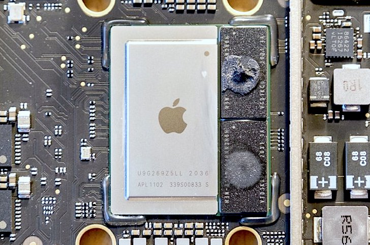

# Exploring Apple Silicon on a MacBookAir10

**WORK IN PROGRESS**

## Basics

As of Nov 2020 Apple startet to produce Mac computers based on their own SoCs instead of relying on Intel/AMD CPUs/GPUs. Below the M1 SoC with two LPDDRX4 modules soldered right next to it on a Mac Mini mainboard ([image source](https://egpu.io/forums/desktop-computing/teardown-late-2020-mac-mini-apple-silicon-m1-thunderbolt-4-usb4-pcie-4/)):

While most people talk about the ISA only (switching from Intel to ARM) the transition is a bit more than this since those Apple SoCs also contain a lot more than just CPU cores (GPU and Machine Learning cores, SSD and memory controller, various accelerators for video, crypto, etc.)

For a more broad overview what to expect with the new platform check [Anandtech](https://www.anandtech.com/show/16252/mac-mini-apple-m1-tested) or others. For some closer looks inside the new laptops visit [iFixit](https://www.ifixit.com/News/46884/m1-macbook-teardowns-something-old-something-new). I try to focus on the stuff that is not mentioned everywhere else on the Internet.

## Gathering information

### The lazy way

Setting this new laptop up the easy/lazy/noob way: finishing last TimeMachine backup on my i7 MacBook Pro 16", firing up the new MacBook Air, connecting the TM disk to the Air and let Migration Assistant transfer everything (this includes a lot of stuff below `/usr/local/` e.g. my whole [homebrew](https://brew.sh) install and some other `x86_64` binaries).

After this migration, a macOS update to 11.0.1 and a reboot everything works as it should. Safari starts with the ~60 tabs open I had on the Intel MBP, my text editor opens with all the documents I had opened on the Intel MacBook (lots of unsaved documents too) but random `x86_64` CLI tools below `/usr/local/bin/` do not execute. I needed to fire up one of the many 'migrated' Intel GUI applications below `/Applications/` first so I've been asked whether I want to install Rosetta2. After this step all my `x86_64` stuff works since Rosetta2 kicks in with first invocation and does the 'binary translation' job so from then on the translated binary will be invoked directly. Longest Rosetta2 translation run was for Google Chrome. This took ~8 seconds until `x86_64` Chrome opened on ARM.

I realized one minor exception when I wanted to explore binaries with the `lipo` tool since all the 'Xcode command line tools' remained in `x86_64` and there was a library mismatch. Reinstalling the Universal Binary version of the tools did the trick:

    sudo rm -rf /Library/Developer/CommandLineTools/
    sudo xcode-select --install

For now I'm staying with the whole userland below `/usr/local/` being `x86_64` so everything I run from there needs to be translated using Rosetta2 to `arm64e` once. I'm reluctant to start over with `arm64e` native homebrew for now since it is not quite ready for `arm64e` yet (some formulas will break). As such it's important to stay on the 'wrong' architecture when dealing with homebrew for the next weeks. To install for example a tool to examine/use transparent filesystem compression I can't call `brew` directly but have to use the `arch` command instead:

    arch -x86_64 brew install afsctool

(defining `alias brew="arch -x86_64 brew"` might be a good idea in such a situation and an alternative when always working directly sitting in front of the machine is to tick the 'open in Rosetta' checkbox of Terminal.app or iTerm.app in Finder since the architecture the app is running with will be inherited to every process executed from within)

Since Migration Assistant transferred everything including all settings also the hostnames were identical which is a bit disturbing given that I'm accessing the new MacBook often via SSH. To rename the new Mac from mac-tk to mac-tk-air I did the following:

    sudo scutil --set ComputerName mac-tk-air
    sudo scutil --set HostName mac-tk-air
    sudo scutil --set LocalHostName mac-tk-air.local

### First impressions

The "Apple Silicon" MacBook Air feels faster than my 16" Intel MacBook ([Core i7-9750H](https://ark.intel.com/content/www/de/de/ark/products/191045/intel-core-i7-9750h-processor-12m-cache-up-to-4-50-ghz.html), also 16 GB RAM), opening applications with lots of documents (~60 tabs in Safari, ~50 partially large text documents in BBEdit) is faster, sleep/wake is literally immediate but sound output is not that great as on the larger Intel MacBook ;)

### Basic collection of information

  * `ioregl -l` output: https://raw.githubusercontent.com/ThomasKaiser/Knowledge/master/media/ioreg-MacBookAir10.txt
  * `hidutil list` output: http://ix.io/2EUV (19 thermal sensors inside)
  * `system_profiler` output: http://ix.io/2EVx
  * When looking at CPU utilization (be it with `htop`, `Activity Monitor` or `powermetrics`) it's important to realize that cpu0-cpu3 are efficiency cores and cpu4-cpu7 are the performance cores.

### CPU performance assessment

Since being an energy efficiency fetishist I played around with ARM single board computers as miniature servers for a while. To benchmark those things I found 7-zip's internal benchmark a pretty good representation of ['server workloads in general' since relying on integer/memory](https://github.com/ThomasKaiser/sbc-bench#7-zip). Of course it makes absolutely no sense at all to use this benchmark on a Mac laptop due to totally different use cases.

But I gave it a try just to compare with my Intel MacBook. `/usr/local/bin/7z b` ends up with ~27500 7-zip MIPS (running in Rosetta2 'emulation' mode!). After half an hour some slight throttling kicks in and the results are in the 26000-26500 range. The MacBook Air has no fan, is passively cooled and doesn't even get hot (touch test). 

The very same benchmark running natively on my Intel i7-9750H MacBook Pro (6 cores, 12 threads) results in 29000 7-zip MIPS while the fan kicks in after a minute and screams at +5000 rpm and a little later the CPU thermal sensor reports temperatures above 90°C with fan on maximum operation.

I won't do any further CPU performance testing since 'fast enough' or let's better say *simply impressive* considering the thermal behaviour and that I tested an Intel binary on the ARM laptop running via binary translation. I'll focus on performance/watt measurements solely later on.

Update: When running a native `arm64e` 7-zip binary we're at slightly above 33000 7-zip MIPS (at below 14W consumption) or in other words: only 20% faster compared to Rosetta2 'emulation' mode and ~15% faster than a 6C/12T i7-9750H.

### Internal storage

Fortunately the SSD is still exposed as NVMe storage so SMART queries will work. `ioreg -l` shows

    "IOClass" = "AppleANS3NVMeController"
    "IOPolledInterface" = "IONVMeControllerPolledAdapter is not serializable"
    "IOMaximumSegmentByteCountRead" = 4096
    "IOPlatformPanicAction" = 0
    "IOPersonalityPublisher" = "com.apple.iokit.IONVMeFamily"
    "IOReportLegendPublic" = Yes
    "IOCommandPoolSize" = 64
    "IOProviderClass" = "RTBuddyService"
    "Physical Interconnect Location" = "Internal"
    "IOMaximumSegmentByteCountWrite" = 4096
    "IOMaximumSegmentCountRead" = 256
    "Model Number" = "APPLE SSD AP0512Q"
    "IOProbeScore" = 300000
    "IOPowerManagement" = {"DevicePowerState"=1,"CurrentPowerState"=1,"CapabilityFlags"=32768,"MaxPowerState"=1}
    "IOMaximumSegmentCountWrite" = 256
    "Serial Number" = "---"
    "NVMe Revision Supported" = "1.10"
    "IOPropertyMatch" = {"role"="ANS2"}
    "AppleNANDStatus" = "Ready"
    "Chipset Name" = "SSD Controller"
    "Physical Interconnect" = "Apple Fabric"
    "CFBundleIdentifierKernel" = "com.apple.iokit.IONVMeFamily"
    "Vendor Name" = "Apple"
    "CFBundleIdentifier" = "com.apple.iokit.IONVMeFamily"
    "IOMatchCategory" = "IODefaultMatchCategory"
    "IOMaximumByteCountRead" = 1048576
    "IOMaximumByteCountWrite" = 1048576
    "IOMinimumSegmentAlignmentByteCount" = 4096
    "Controller Characteristics" = {"default-bits-per-cell"=3,"firmware-version"="1161.40.","controller-unique-id"="0ba0102ae3acd80d    ","capacity"=512000000000,"pages-per-block-mlc"=1152,"pages-in-read-verify"=384,"sec-per-full-band-slc"=52224,"pages-per-block0"=0,"cell-type"=3,"bytes-per-sec-meta"=16,"Preferred IO Size"=1048576,"program-scheme"=0,"bus-to-msp"=(0,0,1,1),"num-dip"=34,"nand-marketing-name"="itlc_3d_g4_2p_256               ","package_blocks_at_EOL"=31110,"sec-per-full-band"=156672,"cau-per-die"=2,"page-size"=16384,"pages-per-block-slc"=384,"sec-per-page"=4,"nand-device-desc"=3248925,"num-bus"=4,"block-pairing-scheme"=0,"chip-id"="S5E","Encryption Type"="AES-XTS","vendor-name"="Toshiba         ","blocks-per-cau"=974,"dies-per-bus"=(5,4,4,4),"msp-version"="2.8.7.0.0       ","manufacturer-id"=<983e99b3fae30000>}
    "Firmware Revision" = "1161.40."
    "IOReportLegend" = ({"IOReportChannels"=((5644784279684675442,8590065666,"NVMe Power States")),"IOReportGroupName"="NVMe","IOReportChannelInfo"={"IOReportChannelUnit"=72058115876454424}})
    "DeviceOpenedByEventSystem" = Yes

See "Controller Characteristics" for some internals. `ioreg` entry for the `IOEmbeddedNVMeBlockDevice`:

    "Logical Block Size" = 4096
    "IOMaximumBlockCountWrite" = 256
    "IOMaximumSegmentByteCountRead" = 1048576
    "IOReportLegendPublic" = Yes
    "IOMaximumSegmentByteCountWrite" = 1048576
    "NamespaceID" = 1
    "IOMaximumSegmentCountRead" = 256
    "IOMaximumSegmentCountWrite" = 256
    "IOStorageFeatures" = {"Unmap"=Yes,"Priority"=Yes,"Barrier"=Yes}
    "IOUnit" = 1
    "NamespaceUUID" = 0
    "Encryption" = Yes
    "Device Characteristics" = {"Serial Number"="---","Medium Type"="Solid State","Product Name"="APPLE SSD AP0512Q","Vendor Name"="","Product Revision Level"="1161.40."}
    "IOMaximumBlockCountRead" = 256
    "IOCFPlugInTypes" = {"AA0FA6F9-C2D6-457F-B10B-59A13253292F"="NVMeSMARTLib.plugin"}
    "IOMinimumSegmentAlignmentByteCount" = 4096
    "IOMaximumByteCountRead" = 1048576
    "IOMaximumByteCountWrite" = 1048576
    "device-type" = "Generic"
    "EmbeddedDeviceTypeRoot" = Yes
    "Physical Block Size" = 4096
    "Protocol Characteristics" = {"Physical Interconnect"="Apple Fabric","Physical Interconnect Location"="Internal"}
    "IOReportLegend" = ({"IOReportGroupName"="NVMe","IOReportChannels"=((6082504312848663127,6442450945,"Tier0 BW Scale Factor"),(6082504312865440343,6442450945,"Tier1 BW Scale Factor"),(6082504312882217559,6442450945,"Tier2 BW Scale Factor"),(6082504312898994775,6442450945,"Tier3 BW Scale Factor")),"IOReportChannelInfo"={"IOReportChannelUnit"=0},"IOReportSubGroupName"="BW Limits"},{"IOReportGroupName"="NVMe","IOReportChannels"=((6084209303804800357,6442450945,"Total time elapsed"),(6082504312848654368,6442450945,"Tier0 Throttle Time"),(6082504312865431584,6442450945,"Tier1 Throttle Time"),(6082504312882208800,6442450945,"Tier2 Throttle Time"),(6082504312898986016,6442450945,"Tier3 Throttle Time")),"IOReportChannelInfo"={"IOReportChannelUnit"=0},"IOReportSubGroupName"="Time weighted throttle statistics"})
    "ThermalThrottlingSupported" = Yes
    "NVMe SMART Capable" = Yes
    "Queue Depth Counters" = {"QueueDepths"=(277466,57709,13737,7000,4380,3403,2733,2057,1387,997,732,545,397,318,227,148,32,23,17,24,20,19,20,14,13,14,11,10,10,9,9,9,12,10,12,11,13,11,9,10,10,9,9,7,7,6,6,4,3,4,2,2,4,2,2,2,1,1,1,2,3,4,10,0)}

`smartctl` output (if the MacBook runs on battery SMART queries take ages, most probably related to energy savings):

    bash-3.2# smartctl -q noserial -a /dev/disk0
    smartctl 7.0 2018-12-30 r4883 [Darwin 20.1.0 x86_64] (local build)
    Copyright (C) 2002-18, Bruce Allen, Christian Franke, www.smartmontools.org
    
    === START OF INFORMATION SECTION ===
    Model Number:                       APPLE SSD AP0512Q
    Firmware Version:                   1161.40.
    PCI Vendor/Subsystem ID:            0x106b
    IEEE OUI Identifier:                0x000000
    Controller ID:                      0
    Number of Namespaces:               3
    Local Time is:                      Fri Nov 20 23:26:19 2020 CET
    Firmware Updates (0x02):            1 Slot
    Optional Admin Commands (0x0004):   Frmw_DL
    Optional NVM Commands (0x0004):     DS_Mngmt
    Maximum Data Transfer Size:         256 Pages
    
    Supported Power States
    St Op     Max   Active     Idle   RL RT WL WT  Ent_Lat  Ex_Lat
     0 +     0.00W       -        -    0  0  0  0        0       0
    
    === START OF SMART DATA SECTION ===
    SMART overall-health self-assessment test result: PASSED
    
    SMART/Health Information (NVMe Log 0x02)
    Critical Warning:                   0x00
    Temperature:                        26 Celsius
    Available Spare:                    100%
    Available Spare Threshold:          99%
    Percentage Used:                    0%
    Data Units Read:                    745,421 [381 GB]
    Data Units Written:                 766,941 [392 GB]
    Host Read Commands:                 11,365,081
    Host Write Commands:                5,750,127
    Controller Busy Time:               0
    Power Cycles:                       163
    Power On Hours:                     5
    Unsafe Shutdowns:                   2
    Media and Data Integrity Errors:    0
    Error Information Log Entries:      0
    
    Read Error Information Log failed: NVMe admin command:0x02/page:0x01 is not supported

Let's compare with the Intel MacBook equipped with a T2 chip containing the SSD controller:

|    | T2 controller | M1 SoC |
| ----: | :----: | :----: |
| Controller name | AppleANS2Controller | AppleANS3NVMeController |
| Interconnect | PCIe | Apple Fabric |
| IOPCIPauseCompatible | Yes | n/a |
| NVMe Revision Supported | 1.10 | 1.10 |
| NVMe SMART Capable | Yes | Yes |
| Unmap (TRIM) | Yes | Yes |
| ThermalThrottlingSupported | Yes | Yes |
| Logical Block Size | 4096 | 4096 |
| Physical Block Size | 4096 | 4096 |
| Preferred IO Size | 1048576 | 1048576 |
| Encryption Type | AES-XTS | AES-XTS |
| IOMaximumSegmentByteCountWrite | 4096 | 4096 |
| IOMaximumSegmentCountRead | 256 | 256 |
| IOCommandPoolSize | 128 | 64 |
| IOMinimumSegmentAlignmentByteCount | 4 | 4096 |
| IOMaximumByteCountRead | n/a | 1048576 |
| IOMaximumByteCountWrite | n/a | 1048576 |
| MaxPowerState | 3 | 1 |
| Controller Characteristics | detailed info | basic info |

So Apple is still using NVMe logically but not over PCIe any more. NVMe power management capabilities (active power states, power state transitions) seem to have been replaced entirely by some internal/proprietary solution. Macs with M1 SoC expose a lot more about the SSD internals compared to T2 (e.g. "default-bits-per-cell"=3, "pages-per-block-mlc"=1152, "page-size"=16384, "vendor-name"="Toshiba" or "vendor-name"="Sandisk" in colleague's 13" MacBook Pro).

As with the T2 controller in previous Intel Macs SSD controller, crypto acceleration and 'Secure Enclave' (SE) to store encryption keys are all inside the same chip. Every storage access on those Macs always implies 'full disk encryption' at the controller level (this applies also to all SSD storage benchmark results for recent Apple machines you find somewhere on the net). In theory encryption keys never leave the SE and a secure erase operation can be performed by destroying the encryption keys inside the SE (which is actually going to happen when you enter a wrong FileVault passphrase too often at boot time).

### USB / Thunderbolt / PCIe

The new M1 Macs are advertised as USB4/TB3 capable and all three models only have two USB-C ports. It's important to understand that 'USB4' is the name for a protocol revision and not a synonym for a certain type of link speed.

Those three "Apple Silicon" Macs provide the following at each USB-C port:

  * Thunderbolt 3 compliance
  * *SuperSpeed 10Gbps* maximum USB transfer speeds

A Mac Mini teardown revealed that the TB controller is inside the M1 SoC and there are two [JHL8040R](https://ark.intel.com/content/www/de/de/ark/products/186251/intel-jhl8040r-thunderbolt-4-retimer.html) TB retimer chips soldered next to the USB-C ports. While these chips are TB4 capable Apple only implements TB3. Most probably chip design started prior to Intel finalizing TB4 specs and/or not all of the needed requirements for TB4 could be met:

Quick check with IPoverThunderbolt using `iperf3` with default settings (MTU 1500 bytes): ARM -> Intel results in 17 Gbit/sec (cpu0 almost maxing out on the Intel MacBook for `kernel_task` handling the IRQ processing). In the other direction we're at 15 Gbit/sec, this time cpu5 and cpu6 (both performance cores) busy on the ARM MacBook. Since `iperf3` is `x86_64` and therefore executed by Rosetta2 the results should be taken with a grain of salt but for me it's already 'fast enough' (quick check with MTU 9000 ended up with slightly *lower* numbers for whatever reason).

Quick check with two USB Ethernet dongles (RTL8156 inside so capable of NBase-T/2.5GbE) results in expected numbers: 2.32 Gbit/sec in each direction without retransmits.

Apple showed the term "PCIe 4.0" in their presentations. Again as with USB4 this is a protocol revision and not a synonym for link speeds so you should *not* expect '16GT/h AKA Gen4' if you read PCIe 4.0. Asides the wireless chip (see below) only the two Thunderbolt ports seem to make use of PCIe in a '2 lanes per port' config. When establishing an IPoverThunderbolt link with an active TB3 cable the connection is reported as follows:

    Link Status: 0x2
    Speed: Up to 40 Gb/s x1
    Current Link Width: 0x2

The `ioreg` output suggests that the TB PCIe implementation is limited to 2 lane operation so the aforementioned IPoverThunderbolt bandwidth seems to be already the maximum the connection is capable of at Gen3 speeds. Most probably "Apple Silicon" in form of the M1 SoCs is limited to a few lanes with Gen3 maximum speeds since a more capable PCIe setup isn't needed on current models.

In case the M1 SoCs would have a bunch of Gen4 lanes and would support [CCIX](https://en.wikichip.org/wiki/ccix) we might see larger MacBooks / iMacs with more than one of those M1 interconnected via PCIe (would be some sort of [NUMA](https://en.wikipedia.org/wiki/Non-uniform_memory_access) and would most probably require limiting all applications that are not built for [Grand Central Dispatch](https://en.wikipedia.org/wiki/Grand_Central_Dispatch) to remain on the 1st SoC). 

But maybe Apple chooses a chiplet approach instead and combines several M1 dies + separate IO chip on an interposer. Or maybe they do something entirely different and come up with an advanced CPU design to power the [i]Mac Pro of the future.

### Wireless capabilities

Not really related to "Apple Silicon" but to the 3 models in question: Wi-Fi 6 (802.11ax) and Bluetooth 5.0 are provided by an 'Apple USI 339S00758' chip with BroadCom/Cypress tech inside (BCM4378 via a single PCIe Gen2 lane). MacBook Air und MBP 13" unfortunately are 2T2R only, the Mac Mini's mainboard has connectors for 3 antennas.

Measuring wireless performance in kitchen-sink benchmark style is pointless as always since way too much external factors determine performance in a setup like mine (with tons of neighbours and their wireless networks around). Since my access point is still only capable of Wi-Fi 5 (802.11ac) the Air due to only supporting 2T2R MIMO is currently a downgrade compared to the Intel MacBook Pro that is able to establish a 3x3 connection. With a new 802.11ax capable access point this might change.

## Software

### Universal Binaries

Almost every binary in macOS 11 is now an [Universal Binary](https://en.wikipedia.org/wiki/Universal_binary#Universal_2) in the sense that it contains both `x86_64` and `arm64e`. Notable exceptions: *Rosetta 2 Updater.app* is `arm64e` only and */System/Library/Frameworks/OpenCL.framework* is `x86_64` only (for a list of apps use `Utilities:System Information.app` or `system_profiler SPApplicationsDataType`)

Let's look at an utilitiy that hasn't been upgraded since ages (bash on macOS is still on version 3.2.57). The size of `/bin/bash` in 10.15.7 is 623472 bytes containing only `x86_64`. In 11.0.1 it's 1296640 bytes and the `arm64e` portion is slightly larger:

    mac-tk-air:~ tk$ ls -la /bin/bash
    -r-xr-xr-x  1 root  wheel  1296640  1 Jan  2020 /bin/bash
    mac-tk-air:~ tk$ lipo -detailed_info /bin/bash
    Fat header in: /bin/bash
    fat_magic 0xcafebabe
    nfat_arch 2
    architecture x86_64
        cputype CPU_TYPE_X86_64
        cpusubtype CPU_SUBTYPE_X86_64_ALL
        capabilities 0x0
        offset 16384
        size 627088
        align 2^14 (16384)
    architecture arm64e
        cputype CPU_TYPE_ARM64
        cpusubtype CPU_SUBTYPE_ARM64E
        capabilities PTR_AUTH_VERSION USERSPACE 0
        offset 655360
        size 641280
        align 2^14 (16384)

When looking at other binaries sometimes Intel is larger and sometimes ARM. So let's check a bunch of applications below `/System/Applications/` [ [1] ](#f1):

| App | x86_64 | arm64e |
| -------- | -----: | -----: |
| App Store.app | 4655200 | 4685344 |
| Automator.app | 467008 | 463680 |
| Books.app | 1236560 | 1177872 |
| Calculator.app | 234544 | 248464 |
| Calendar.app | 3492016 | 3367552 |
| Chess.app | 293808 | 290688 |
| Contacts.app | 1459104 | 1439728 |
| Dictionary.app | 381088 | 377792 |
| FaceTime.app | 1625440 | 1596064 |
| FindMy.app | 3315504 | 3364992 |
| Font Book.app | 1139408 | 1095856 |
| Home.app | 796048 | 786912 |
| Image Capture.app | 76256 | 75488 |
| Launchpad.app | 55280 | 38704 |
| Mail.app | 4892320 | 4739744 |
| Maps.app | 18705248 | 18109472 |
| Messages.app | 306784 | 305296 |
| Mission Control.app | 55328 | 38720 |
| Music.app | 31003248 | 29141344 |
| News.app | 7074800 | 6928288 |
| Notes.app | 4942880 | 4857760 |
| Photo Booth.app | 772384 | 748224 |
| Photos.app | 18105216 | 17718384 |
| Podcasts.app | 4914992 | 4901568 |
| Preview.app | 2706848 | 2554464 |
| QuickTime Player.app | 1664432 | 1552528 |
| Reminders.app | 3386624 | 3443552 |
| Siri.app | 55392 | 38800 |
| Stickies.app | 181968 | 180432 |
| Stocks.app | 448432 | 457920 |
| System Preferences.app | 312544 | 292800 |
| TV.app | 22062464 | 20898704 |
| TextEdit.app | 188112 | 186464 |
| Time Machine.app | 55968 | 39328 |
| VoiceMemos.app | 2999936 | 2896928 |
| Summary: | 144063184 | 139039856 |

Intel binaries are roughly 4% larger. Another check for system frameworks [ [2] ](#f2) shows the opposite: here the `arm64e` framework binaries are 4% larger than their Intel counterparts so it's save to assume that the binary portions are roughly identical in size.

It's also save to assume that the storage space requirements for macOS 11 being an 'Universal Binary' release are a bit higher than former macOS versions that were `x86_64` only. But Apple already started with transparent file compression back in OS X 10.6 by tweaking HFS+ in some way. And with APFS today not much has changed and we benefit from compressed data on disk (the `afsctool` isn't on latest version and therefore reports 'HFS+ compression' while in reality we're talking APFS here)

    mac-tk-air:~ tk$ afsctool -v /bin/bash 
    /bin/bash:
    File is HFS+ compressed.
    File content type: public.unix-executable
    File size (uncompressed data fork; reported size by Mac OS 10.6+ Finder): 1296640 bytes / 1.3 MB (megabytes) / 1.2 MiB (mebibytes)
    File size (compressed data fork - decmpfs xattr; reported size by Mac OS 10.0-10.5 Finder): 695527 bytes / 696 KB (kilobytes) / 680 KiB (kibibytes)
    File size (compressed data fork): 695543 bytes / 696 KB (kilobytes) / 680 KiB (kibibytes)
    Compression savings: 46.4%
    Number of extended attributes: 0
    Total size of extended attribute data: 0 bytes
    Approximate overhead of extended attributes: 536 bytes
    Approximate total file size (compressed data fork + EA + EA overhead + file overhead): 697120 bytes / 697 KB (kilobytes) / 681 KiB (kibibytes)

### top

The `top` version included in macOS provides some way to estimate/guess power consumption at the application level. You can execute `top -stats pid,command,cpu,idlew,power -o power -d -s3` for example. To interpret the data see [here](https://blog.mozilla.org/nnethercote/2015/08/26/what-does-the-os-x-activity-monitors-energy-impact-actually-measure/) for example.

### pmset

`pmset` is the tool of choice to 'manipulate power management settings' and to get an idea what's going on behind the scenes.

`pmset -g ac` on Apple laptops shows info about the USB-C charger used and current consumption settings. Comparing Intel MacBook on the left with Apple Silicon MacBook Air on the right:

    Wattage = 94W                               Wattage = 30W
    Current = 4700mA                            Current = 1500mA
    Voltage = 20000mV                           Voltage = 20000mV
    AdapterID = 28674                           AdapterID = 28675
    Manufacturer = Apple Inc.                   Manufacturer = Apple Inc.
    Family Code = 0xe000400a                    Family Code = 0xe000400a
    Adapter Name = 96W USB-C Power Adapter      Adapter Name = 30W USB-C Power Adapter
    Hardware Version = 1.0                      Hardware Version = 1.0
    Firmware Version = 01070051                 Firmware Version = 01030052

Quick check with a 'Khadas' branded random USB-C charger from China:

    mac-tk-air:~ tk$ pmset -g ac 
     Wattage = 24W
     Current = 1600mA
     Voltage = 15000mV
     AdapterID = 0
     Family Code = 0xe000400a

`pmset -g batt` allows to check whether the device is running fully on AC or is draining the battery right now. Works similar on Intel and the new MacBooks:

    mac-tk:~ tk$ pmset -g batt
    Now drawing from 'AC Power'
     -InternalBattery-0 (id=9109603)	100%; charged; 0:00 remaining present: true

    mac-tk-air:~ tk$ pmset -g batt
    Now drawing from 'Battery Power'
     -InternalBattery-0 (id=19136611)	100%; discharging; 18:37 remaining present: true

You get additional battery info by parsing the `ioreg -n AppleSmartBattery` output.

`pmset -g cap` (capabilities) shows an overview which power management related modes are available when running on AC or on battery. Only difference between both modes is `womp` (wake for network access) availabe on AC vs. `lessbright` (dimming the backlight) on battery. Looks like this on Intel:

    Capabilities for AC Power:   Capabilities for Battery Power:
     displaysleep                 displaysleep
     disksleep                    disksleep
     sleep                        sleep
     womp                         lessbright
     acwake                	      acwake
     lidwake                      lidwake
     halfdim                      halfdim
     gpuswitch                    gpuswitch
     standby                      standby
     standbydelayhigh             standbydelayhigh
     standbydelaylow              standbydelaylow
     highstandbythreshold         highstandbythreshold
     powernap                     powernap
     ttyskeepawake                ttyskeepawake
     hibernatemode                hibernatemode
     hibernatefile                hibernatefile
     tcpkeepalive                 tcpkeepalive
     proximitywake                proximitywake
     vactdisabled                 vactdisabled

vs. this currently on Apple Silicon:

    Capabilities for AC Power:   Capabilities for Battery Power:
     displaysleep                 displaysleep
     disksleep                    disksleep
     sleep                        sleep
     womp                         lessbright
     standby                      standby
     powernap                     powernap
     ttyskeepawake                ttyskeepawake
     tcpkeepalive                 tcpkeepalive

While it seems power management has become more primitive due to less modes available on Apple Silicon the opposite is true, just check the `pmset -g log` output for details (translates the 'raw' ASL logs from below `/var/log/powermanagement/` into something human readable).

When testing the new hardware all the `*log` modes of `pmset` are of interest (see `man pmset`), e.g. run in separate terminals `pmset -g thermlog` and `pmset -g pslog` and so on to get an idea what's really happening while benchmarking/testing.

### powermetrics

`powermetrics` is the tool of choice to get an idea about energy consumption, performance and related topics. When being called on Intel with default sample set (tasks,battery,network,disk,interrupts,cpu_power,gpu_power,gpu_agpm_stats,smc) this looks like this: http://ix.io/2FbJ

On Apple Silicon it looks like this instead: http://ix.io/2FbK

Unfortunately it seems no information about SMC stuff (thermals, fan data) is currently available on the Apple Silicon Macs, at least `powermetrics -n 1 -i 1 --samplers smc` on a MacBook Air and the new 13" Pro only output `unrecongnized sampler: smc` while on most Intel machines it looks like this for example:

    **** SMC sensors ****
    
    CPU Thermal level: 0
    GPU Thermal level: 0
    IO Thermal level: 0
    Fan: 1836.76 rpm
    CPU die temperature: 46.96 C
    GPU die temperature: 35.00 C
    CPU Plimit: 0.00
    GPU Plimit (Int): 0.00 
    Number of prochots: 0

But the good news is we get very detailed information around everything consumption/performance relevant on Apple Silicon, e.g. clockspeeds and active/idle residency for both CPU clusters and the GPU cores and also consumption figures for these subsystems as well as RAM, controllers and the whole package.

## Testing in detail

(TBC)

#### Footnotes

1. `for app in /System/Applications/*.app ; do Sizes=$(lipo -detailed_info "${app}/Contents/MacOS/$(basename "${app}" .app)" 2>/dev/null | awk -F" " '/size/ {print $2}'); set $Sizes; echo -e "${app##*/}\t$1\t$2"; done >/Users/tk/app-sizes.txt` [(back)](#a1)
2. `find /System/Library/Frameworks -name "*dylib" | while read ; do Sizes=$(lipo -detailed_info ${REPLY} 2>/dev/null | awk -F" " '/size/ {print $2}'); [ -z $Sizes ] || set $Sizes; echo -e "${REPLY##*/}\t$1\t$2"; done >/Users/tk/framework-sizes.txt` [(back)](#a2)