# Exploring Apple Silicon on a MacBookAir10,1

**WORK IN PROGRESS**

## Basics

As of Nov 2020 Apple startet to produce Mac computers based on their own SoCs instead of relying on Intel/AMD CPUs/GPUs. Below the M1 SoC with two LPDDRX4 modules soldered right next to it on a Mac Mini mainboard ([image source](https://egpu.io/forums/desktop-computing/teardown-late-2020-mac-mini-apple-silicon-m1-thunderbolt-4-usb4-pcie-4/)):

While most people talk about the ISA only (switching from Intel to ARM) the transition is a bit more than this since those Apple SoCs also contain a lot more than just CPU cores (GPU and Machine Learning cores, SSD and memory controller, various accelerators for video, crypto, etc.)

For a more broad overview what to expect with the new platform check [Anandtech](https://www.anandtech.com/show/16252/mac-mini-apple-m1-tested) or others. For some closer looks inside the new laptops visit [iFixit](https://www.ifixit.com/News/46884/m1-macbook-teardowns-something-old-something-new). I try to focus on the stuff that is not mentioned everywhere else on the Internet.

## Gathering information

### The lazy way

Setting this new laptop up the easy/lazy/noob way: finishing last TimeMachine backup on my i7 MacBook Pro 16", firing up the new MacBook Air, connecting the TM disk to the Air and let Migration Assistant transfer everything (this includes a lot of stuff below `/usr/local/` e.g. my whole [homebrew](https://brew.sh) install and some other `x86_64` binaries).

After this migration, a macOS update to 11.0.1 and a reboot everything works as it should. Safari starts with the ~60 tabs open I had on the Intel MBP, my text editor opens with all the documents I had opened on the Intel MacBook (lots of unsaved documents too) but random `x86_64` CLI tools below `/usr/local/bin/` do not execute. I needed to fire up one of the many 'migrated' Intel GUI applications below `/Applications/` first so I've been asked whether I want to install Rosetta2. After this step all my `x86_64` stuff works since Rosetta2 kicks in with first invocation and does the 'binary translation' job so from then on the translated binary will be invoked directly. Longest Rosetta2 translation run was for Google Chrome. This took ~8 seconds until `x86_64` Chrome opened on ARM.

I realized one minor exception when I wanted to explore binaries with the `lipo` tool since all the 'Xcode command line tools' remained in `x86_64` and there was a library mismatch. Reinstalling the Universal Binary version of the tools did the trick:

    sudo rm -rf /Library/Developer/CommandLineTools/
    sudo xcode-select --install

For now I'm staying with the whole userland below `/usr/local/` being `x86_64` so everything I run from there needs to be translated using Rosetta2 to `arm64e` once. I'm reluctant to start over with `arm64e` native homebrew for now since it is not quite ready for `arm64e` yet (some formulas will break). As such it's important to stay on the 'wrong' architecture when dealing with homebrew for the next weeks. To install for example a tool to examine/use transparent filesystem compression I can't call `brew` directly but have to use the `arch` command instead:

    arch -x86_64 brew install afsctool

(defining `alias brew="arch -x86_64 brew"` might be a good idea in such a situation and an alternative when always working directly sitting in front of the machine is to tick the 'open in Rosetta' checkbox of Terminal.app or iTerm.app in Finder since the architecture the app is running with will be inherited to every process executed from within)

Since Migration Assistant transferred everything including all settings also the hostnames were identical which is a bit disturbing given that I'm accessing the new MacBook often via SSH. To rename the new Mac from mac-tk to mac-tk-air I did the following:

    sudo scutil --set ComputerName mac-tk-air
    sudo scutil --set HostName mac-tk-air
    sudo scutil --set LocalHostName mac-tk-air.local

### First impressions

The "Apple Silicon" MacBook Air feels faster than my 16" Intel MacBook ([Core i7-9750H](https://ark.intel.com/content/www/de/de/ark/products/191045/intel-core-i7-9750h-processor-12m-cache-up-to-4-50-ghz.html), also 16 GB RAM), opening applications with lots of documents (~60 tabs in Safari, ~50 partially large text documents in BBEdit) is faster, sleep/wake is literally immediate but sound output is not that great as on the larger Intel MacBook ;)

### Basic collection of information

  * `ioregl -l` output: https://raw.githubusercontent.com/ThomasKaiser/Knowledge/master/media/ioreg-MacBookAir10.txt
  * `hidutil list` output: http://ix.io/2EUV (19 thermal sensors listed but actually [it's 47](https://github.com/ThomasKaiser/Check_MK/blob/da500f3fe4a57382ace3d150630d04bc06879e1b/helpers/process-powermetrics-output.sh#L103-L149))
  * `system_profiler` output: http://ix.io/2EVx
  * When looking at CPU utilization (be it with `htop`, `Activity Monitor` or `powermetrics`) it's important to realize that cpu0-cpu3 are efficiency cores and cpu4-cpu7 are the performance cores.

### CPU performance assessment

Since being an energy efficiency fetishist I played around with ARM single board computers as miniature servers for a while. To benchmark those things I found 7-zip's internal benchmark a pretty good representation of ['server workloads in general' since relying on integer/memory](https://github.com/ThomasKaiser/sbc-bench#7-zip). Of course it makes absolutely no sense at all to use this benchmark on a Mac laptop due to totally different use cases.

I gave it a try just for a quick efficiency comparison with my Intel MacBook. `/usr/local/bin/7z b` ends up with ~27500 7-zip MIPS running in Rosetta2 'emulation' mode. After half an hour some slight throttling happens and the results are in the 26000-26500 range. The MacBook Air has no fan, is passively cooled and doesn't even get hot (touch test). 

The very same benchmark running natively on my Intel i7-9750H MacBook Pro (6 cores, 12 threads) results in roughly 30000 7-zip MIPS while the system draws ~80W from the wall, the fan kicks in after a minute and screams at +5000 rpm and a little later the CPU thermal sensor reports temperatures above 90°C (still with fan on maximum speed).

I won't do any further real CPU performance testing since 'fast enough' or let's better say *simply impressive* considering the thermal behaviour and that I tested an Intel binary on the ARM laptop running via binary translation. I'll focus on performance/watt measurements solely later on.

Update: When running a native `arm64e` 7-zip binary we're at slightly above 33000 7-zip MIPS (at below 14W consumption without any throttling) or in other words: only 20% faster compared to Rosetta2 'emulation' mode and ~10% faster than a 6C/12T i7-9750H.

### Internal storage

Fortunately the SSD is still exposed as NVMe storage so SMART queries will work. `ioreg -l` shows

    "IOClass" = "AppleANS3NVMeController"
    "IOPolledInterface" = "IONVMeControllerPolledAdapter is not serializable"
    "IOMaximumSegmentByteCountRead" = 4096
    "IOPlatformPanicAction" = 0
    "IOPersonalityPublisher" = "com.apple.iokit.IONVMeFamily"
    "IOReportLegendPublic" = Yes
    "IOCommandPoolSize" = 64
    "IOProviderClass" = "RTBuddyService"
    "Physical Interconnect Location" = "Internal"
    "IOMaximumSegmentByteCountWrite" = 4096
    "IOMaximumSegmentCountRead" = 256
    "Model Number" = "APPLE SSD AP0512Q"
    "IOProbeScore" = 300000
    "IOPowerManagement" = {"DevicePowerState"=1,"CurrentPowerState"=1,"CapabilityFlags"=32768,"MaxPowerState"=1}
    "IOMaximumSegmentCountWrite" = 256
    "Serial Number" = "---"
    "NVMe Revision Supported" = "1.10"
    "IOPropertyMatch" = {"role"="ANS2"}
    "AppleNANDStatus" = "Ready"
    "Chipset Name" = "SSD Controller"
    "Physical Interconnect" = "Apple Fabric"
    "CFBundleIdentifierKernel" = "com.apple.iokit.IONVMeFamily"
    "Vendor Name" = "Apple"
    "CFBundleIdentifier" = "com.apple.iokit.IONVMeFamily"
    "IOMatchCategory" = "IODefaultMatchCategory"
    "IOMaximumByteCountRead" = 1048576
    "IOMaximumByteCountWrite" = 1048576
    "IOMinimumSegmentAlignmentByteCount" = 4096
    "Controller Characteristics" = {"default-bits-per-cell"=3,"firmware-version"="1161.40.","controller-unique-id"="0ba0102ae3acd80d    ","capacity"=512000000000,"pages-per-block-mlc"=1152,"pages-in-read-verify"=384,"sec-per-full-band-slc"=52224,"pages-per-block0"=0,"cell-type"=3,"bytes-per-sec-meta"=16,"Preferred IO Size"=1048576,"program-scheme"=0,"bus-to-msp"=(0,0,1,1),"num-dip"=34,"nand-marketing-name"="itlc_3d_g4_2p_256               ","package_blocks_at_EOL"=31110,"sec-per-full-band"=156672,"cau-per-die"=2,"page-size"=16384,"pages-per-block-slc"=384,"sec-per-page"=4,"nand-device-desc"=3248925,"num-bus"=4,"block-pairing-scheme"=0,"chip-id"="S5E","Encryption Type"="AES-XTS","vendor-name"="Toshiba         ","blocks-per-cau"=974,"dies-per-bus"=(5,4,4,4),"msp-version"="2.8.7.0.0       ","manufacturer-id"=<983e99b3fae30000>}
    "Firmware Revision" = "1161.40."
    "IOReportLegend" = ({"IOReportChannels"=((5644784279684675442,8590065666,"NVMe Power States")),"IOReportGroupName"="NVMe","IOReportChannelInfo"={"IOReportChannelUnit"=72058115876454424}})
    "DeviceOpenedByEventSystem" = Yes

See "Controller Characteristics" for some internals. `ioreg` entry for the `IOEmbeddedNVMeBlockDevice`:

    "Logical Block Size" = 4096
    "IOMaximumBlockCountWrite" = 256
    "IOMaximumSegmentByteCountRead" = 1048576
    "IOReportLegendPublic" = Yes
    "IOMaximumSegmentByteCountWrite" = 1048576
    "NamespaceID" = 1
    "IOMaximumSegmentCountRead" = 256
    "IOMaximumSegmentCountWrite" = 256
    "IOStorageFeatures" = {"Unmap"=Yes,"Priority"=Yes,"Barrier"=Yes}
    "IOUnit" = 1
    "NamespaceUUID" = 0
    "Encryption" = Yes
    "Device Characteristics" = {"Serial Number"="---","Medium Type"="Solid State","Product Name"="APPLE SSD AP0512Q","Vendor Name"="","Product Revision Level"="1161.40."}
    "IOMaximumBlockCountRead" = 256
    "IOCFPlugInTypes" = {"AA0FA6F9-C2D6-457F-B10B-59A13253292F"="NVMeSMARTLib.plugin"}
    "IOMinimumSegmentAlignmentByteCount" = 4096
    "IOMaximumByteCountRead" = 1048576
    "IOMaximumByteCountWrite" = 1048576
    "device-type" = "Generic"
    "EmbeddedDeviceTypeRoot" = Yes
    "Physical Block Size" = 4096
    "Protocol Characteristics" = {"Physical Interconnect"="Apple Fabric","Physical Interconnect Location"="Internal"}
    "IOReportLegend" = ({"IOReportGroupName"="NVMe","IOReportChannels"=((6082504312848663127,6442450945,"Tier0 BW Scale Factor"),(6082504312865440343,6442450945,"Tier1 BW Scale Factor"),(6082504312882217559,6442450945,"Tier2 BW Scale Factor"),(6082504312898994775,6442450945,"Tier3 BW Scale Factor")),"IOReportChannelInfo"={"IOReportChannelUnit"=0},"IOReportSubGroupName"="BW Limits"},{"IOReportGroupName"="NVMe","IOReportChannels"=((6084209303804800357,6442450945,"Total time elapsed"),(6082504312848654368,6442450945,"Tier0 Throttle Time"),(6082504312865431584,6442450945,"Tier1 Throttle Time"),(6082504312882208800,6442450945,"Tier2 Throttle Time"),(6082504312898986016,6442450945,"Tier3 Throttle Time")),"IOReportChannelInfo"={"IOReportChannelUnit"=0},"IOReportSubGroupName"="Time weighted throttle statistics"})
    "ThermalThrottlingSupported" = Yes
    "NVMe SMART Capable" = Yes
    "Queue Depth Counters" = {"QueueDepths"=(277466,57709,13737,7000,4380,3403,2733,2057,1387,997,732,545,397,318,227,148,32,23,17,24,20,19,20,14,13,14,11,10,10,9,9,9,12,10,12,11,13,11,9,10,10,9,9,7,7,6,6,4,3,4,2,2,4,2,2,2,1,1,1,2,3,4,10,0)}

`smartctl` output (if the MacBook runs on battery SMART queries take ages, most probably related to energy savings):

    bash-3.2# smartctl -q noserial -a /dev/disk0
    smartctl 7.0 2018-12-30 r4883 [Darwin 20.1.0 x86_64] (local build)
    Copyright (C) 2002-18, Bruce Allen, Christian Franke, www.smartmontools.org
    
    === START OF INFORMATION SECTION ===
    Model Number:                       APPLE SSD AP0512Q
    Firmware Version:                   1161.40.
    PCI Vendor/Subsystem ID:            0x106b
    IEEE OUI Identifier:                0x000000
    Controller ID:                      0
    Number of Namespaces:               3
    Local Time is:                      Fri Nov 20 23:26:19 2020 CET
    Firmware Updates (0x02):            1 Slot
    Optional Admin Commands (0x0004):   Frmw_DL
    Optional NVM Commands (0x0004):     DS_Mngmt
    Maximum Data Transfer Size:         256 Pages
    
    Supported Power States
    St Op     Max   Active     Idle   RL RT WL WT  Ent_Lat  Ex_Lat
     0 +     0.00W       -        -    0  0  0  0        0       0
    
    === START OF SMART DATA SECTION ===
    SMART overall-health self-assessment test result: PASSED
    
    SMART/Health Information (NVMe Log 0x02)
    Critical Warning:                   0x00
    Temperature:                        26 Celsius
    Available Spare:                    100%
    Available Spare Threshold:          99%
    Percentage Used:                    0%
    Data Units Read:                    745,421 [381 GB]
    Data Units Written:                 766,941 [392 GB]
    Host Read Commands:                 11,365,081
    Host Write Commands:                5,750,127
    Controller Busy Time:               0
    Power Cycles:                       163
    Power On Hours:                     5
    Unsafe Shutdowns:                   2
    Media and Data Integrity Errors:    0
    Error Information Log Entries:      0
    
    Read Error Information Log failed: NVMe admin command:0x02/page:0x01 is not supported

Let's compare with the Intel MacBook equipped with a T2 chip containing the SSD controller:

|    | T2 controller | M1 SoC |
| ----: | :----: | :----: |
| Controller name | AppleANS2Controller | AppleANS3NVMeController |
| Interconnect | PCIe | Apple Fabric |
| IOPCIPauseCompatible | Yes | n/a |
| NVMe Revision Supported | 1.10 | 1.10 |
| NVMe SMART Capable | Yes | Yes |
| Unmap (TRIM) | Yes | Yes |
| ThermalThrottlingSupported | Yes | Yes |
| Logical Block Size | 4096 | 4096 |
| Physical Block Size | 4096 | 4096 |
| Preferred IO Size | 1048576 | 1048576 |
| Encryption Type | AES-XTS | AES-XTS |
| IOMaximumSegmentByteCountWrite | 4096 | 4096 |
| IOMaximumSegmentCountRead | 256 | 256 |
| IOCommandPoolSize | 128 | 64 |
| IOMinimumSegmentAlignmentByteCount | 4 | 4096 |
| IOMaximumByteCountRead | n/a | 1048576 |
| IOMaximumByteCountWrite | n/a | 1048576 |
| MaxPowerState | 3 | 1 |
| Controller Characteristics | detailed info | basic info |

So Apple is still using NVMe logically but not over PCIe any more. NVMe power management capabilities (active power states, power state transitions) seem to have been replaced entirely by some internal/proprietary solution. Macs with M1 SoC expose a lot more about the SSD internals compared to T2 (e.g. "default-bits-per-cell"=3, "pages-per-block-mlc"=1152, "page-size"=16384, "vendor-name"="Toshiba" or "vendor-name"="Sandisk" in colleague's 13" MacBook Pro).

As with the T2 controller in previous Intel Macs the SSD controller, crypto acceleration and 'Secure Enclave' (SE) to store encryption keys live all inside the same chip. Every storage access on those Macs always implies 'full disk encryption' at the controller level (this applies also to all SSD storage benchmark results for recent Apple machines you find somewhere on the net). In theory encryption keys never leave the SE and a secure erase operation can be performed by destroying the encryption keys inside the SE (which is actually going to happen when you enter a wrong FileVault passphrase too often at boot time).

### USB / Thunderbolt / PCIe

The new M1 Macs are advertised as USB4/TB3 capable and all three models only have two USB-C ports. It's important to understand that 'USB4' is the name of a protocol revision and not the synonym for a certain type of link speed.

Calling a host 'USB4 compliant' basically means USB-C ports providing at least *SuperSpeed 10Gbps* USB transfer speeds, Thunderbolt 3 with at least 20 Gbps, at least one port providing DisplayPort alt mode and 7.5W per port for USB consumers (15W for TB devices).

And that's exactly what you get with those three new "Apple Silicon" Macs (and more or less the same you got with every MacBook Pro from 2016 on and every MacBook Air from 2018 or later). The two USB-C ports provide:

  * Thunderbolt 3 compliance
  * *SuperSpeed 10Gbps* maximum USB transfer speeds
  * Ability to connect one 6k display to one USB-C port

How a MacBook Air with its 30W charger could fulfill the TB3 powering requirements of '15W per port' is not clear to me but I guess the kind of people choosing the Air are aware that this device is for rather lightweight tasks while the 13" MacBook Pro is up to the job dealing also with some power hungry Thunderbolt peripherals (it comes with a 61W charger for a reason).

A Mac Mini teardown revealed that the TB controller is inside the M1 SoC and there are two [JHL8040R](https://ark.intel.com/content/www/de/de/ark/products/186251/intel-jhl8040r-thunderbolt-4-retimer.html) TB retimer chips soldered next to the USB-C ports. While these chips are TB4 capable Apple only implements TB3. Most probably chip design started prior to Intel finalizing TB4 specs and/or not all of the needed requirements for TB4 could be met:

Quick check with IPoverThunderbolt using `iperf3` with default settings (MTU 1500 bytes): ARM -> Intel results in 17 Gbit/sec (cpu0 almost maxing out on the Intel MacBook for `kernel_task` handling the IRQ processing). In the other direction we're at 15 Gbit/sec, this time cpu5 and cpu6 (both performance cores) busy on the ARM MacBook. Since `iperf3` is `x86_64` and therefore executed by Rosetta2 the results should be taken with a grain of salt but for me it's already 'fast enough' (quick check with MTU 9000 ended up with slightly *lower* numbers for whatever reason).

Quick check with two USB Ethernet dongles (RTL8156 inside so capable of NBase-T/2.5GbE) results in expected numbers: 2.32 Gbit/sec in each direction without retransmits.

Apple showed the term "PCIe 4.0" in their presentations. Again as with USB4 this is a protocol revision and not a synonym for link speeds so you should *not* expect '16GT/h AKA Gen4' if you read PCIe 4.0. Asides the wireless chip (see below) only the two Thunderbolt ports seem to make use of PCIe in a '2 lanes per port' config. When establishing an IPoverThunderbolt link with an active TB3 cable the connection is reported as follows:

    Link Status: 0x2
    Speed: Up to 40 Gb/s x1
    Current Link Width: 0x2

The `ioreg` output suggests that the TB PCIe implementation is limited to 2 lane operation so the aforementioned IPoverThunderbolt bandwidth seems to be already the maximum the connection is capable of at Gen3 speeds. Most probably "Apple Silicon" in form of the M1 SoCs is limited to a few lanes with Gen3 maximum speeds since a more capable PCIe setup isn't needed on current models.

In case the M1 SoCs would have a bunch of Gen4 lanes and would support [CCIX](https://en.wikichip.org/wiki/ccix) we might see larger MacBooks / iMacs with more than one of those M1 interconnected via PCIe (would be some sort of [NUMA](https://en.wikipedia.org/wiki/Non-uniform_memory_access) and would most probably require limiting all applications that are not built for [Grand Central Dispatch](https://en.wikipedia.org/wiki/Grand_Central_Dispatch) to remain on the 1st SoC). 

But maybe Apple chooses a chiplet approach instead and combines several M1 dies + separate IO chip on an interposer. Or maybe they do something entirely different and come up with an advanced CPU design to power larger MacBooks and the [i]Mac Pro of the future.

### Wireless capabilities

Not really related to "Apple Silicon" but to the 3 Macs in question: Wi-Fi 6 (802.11ax) and Bluetooth 5.0 are provided by an 'Apple USI 339S00758' chip most probably made in an advanced process technology with BroadCom/Cypress tech inside (BCM4378 via a single PCIe Gen2 lane). MacBook Air und MBP 13" unfortunately are 2T2R only, the Mac Mini's mainboard has connectors for 3 antennas.

Measuring wireless performance in kitchen-sink benchmark style is pointless as always since way too much external factors determine performance in a setup like mine (with tons of neighbours and their wireless networks around). Since my access point is still only capable of Wi-Fi 5 (802.11ac) the Air due to only supporting 2T2R MIMO is currently a downgrade compared to the Intel MacBook Pro that is able to establish a 3x3 connection. With a new 802.11ax capable access point this might change.

## Software

### Universal Binaries

Almost every binary in macOS 11 is now an [Universal Binary](https://en.wikipedia.org/wiki/Universal_binary#Universal_2) containing both `x86_64` and `arm64e` portions. Notable exceptions: *Rosetta 2 Updater.app* is `arm64e` only and */System/Library/Frameworks/OpenCL.framework* is `x86_64` only (for a list of apps use `Utilities:System Information.app` or `system_profiler SPApplicationsDataType`)

Let's look at an utilitiy that hasn't been upgraded since ages (bash on macOS is still on version 3.2.57). The size of `/bin/bash` in 10.15.7 is 623472 bytes containing only `x86_64`. In 11.0.1 it's 1296640 bytes and the `arm64e` portion is slightly larger:

    mac-tk-air:~ tk$ ls -la /bin/bash
    -r-xr-xr-x  1 root  wheel  1296640  1 Jan  2020 /bin/bash
    mac-tk-air:~ tk$ lipo -detailed_info /bin/bash
    Fat header in: /bin/bash
    fat_magic 0xcafebabe
    nfat_arch 2
    architecture x86_64
        cputype CPU_TYPE_X86_64
        cpusubtype CPU_SUBTYPE_X86_64_ALL
        capabilities 0x0
        offset 16384
        size 627088
        align 2^14 (16384)
    architecture arm64e
        cputype CPU_TYPE_ARM64
        cpusubtype CPU_SUBTYPE_ARM64E
        capabilities PTR_AUTH_VERSION USERSPACE 0
        offset 655360
        size 641280
        align 2^14 (16384)

When looking at other binaries sometimes Intel is larger and sometimes ARM. So let's check a bunch of applications below `/System/Applications/` [ [1] ](#f1):

| App | x86_64 | arm64e |
| -------- | -----: | -----: |
| App Store.app | 4655200 | 4685344 |
| Automator.app | 467008 | 463680 |
| Books.app | 1236560 | 1177872 |
| Calculator.app | 234544 | 248464 |
| Calendar.app | 3492016 | 3367552 |
| Chess.app | 293808 | 290688 |
| Contacts.app | 1459104 | 1439728 |
| Dictionary.app | 381088 | 377792 |
| FaceTime.app | 1625440 | 1596064 |
| FindMy.app | 3315504 | 3364992 |
| Font Book.app | 1139408 | 1095856 |
| Home.app | 796048 | 786912 |
| Image Capture.app | 76256 | 75488 |
| Launchpad.app | 55280 | 38704 |
| Mail.app | 4892320 | 4739744 |
| Maps.app | 18705248 | 18109472 |
| Messages.app | 306784 | 305296 |
| Mission Control.app | 55328 | 38720 |
| Music.app | 31003248 | 29141344 |
| News.app | 7074800 | 6928288 |
| Notes.app | 4942880 | 4857760 |
| Photo Booth.app | 772384 | 748224 |
| Photos.app | 18105216 | 17718384 |
| Podcasts.app | 4914992 | 4901568 |
| Preview.app | 2706848 | 2554464 |
| QuickTime Player.app | 1664432 | 1552528 |
| Reminders.app | 3386624 | 3443552 |
| Siri.app | 55392 | 38800 |
| Stickies.app | 181968 | 180432 |
| Stocks.app | 448432 | 457920 |
| System Preferences.app | 312544 | 292800 |
| TV.app | 22062464 | 20898704 |
| TextEdit.app | 188112 | 186464 |
| Time Machine.app | 55968 | 39328 |
| VoiceMemos.app | 2999936 | 2896928 |
| Summary: | 144063184 | 139039856 |

Intel binaries are roughly 4% larger. Another check for system frameworks [ [2] ](#f2) shows the opposite: here the `arm64e` framework binaries are 4% larger than their Intel counterparts so it's save to assume that the binary portions are roughly identical in size.

It's also save to assume that the storage space requirements for macOS 11 being an 'Universal Binary' release are a bit higher than former macOS versions that were `x86_64` only. But Apple already started with transparent file compression back in OS X 10.6 by tweaking HFS+ in some way. And with APFS today not much has changed and we benefit from compressed data on disk (the `afsctool` isn't on latest version and therefore reports 'HFS+ compression' while in reality we're talking APFS here)

    mac-tk-air:~ tk$ afsctool -v /bin/bash 
    /bin/bash:
    File is HFS+ compressed.
    File content type: public.unix-executable
    File size (uncompressed data fork; reported size by Mac OS 10.6+ Finder): 1296640 bytes / 1.3 MB (megabytes) / 1.2 MiB (mebibytes)
    File size (compressed data fork - decmpfs xattr; reported size by Mac OS 10.0-10.5 Finder): 695527 bytes / 696 KB (kilobytes) / 680 KiB (kibibytes)
    File size (compressed data fork): 695543 bytes / 696 KB (kilobytes) / 680 KiB (kibibytes)
    Compression savings: 46.4%
    Number of extended attributes: 0
    Total size of extended attribute data: 0 bytes
    Approximate overhead of extended attributes: 536 bytes
    Approximate total file size (compressed data fork + EA + EA overhead + file overhead): 697120 bytes / 697 KB (kilobytes) / 681 KiB (kibibytes)

### top

The `top` version included in macOS provides some way to estimate/guess power consumption at the application level. You can execute `top -stats pid,command,cpu,idlew,power -o power -d -s3` for example. To interpret the data see [here](https://blog.mozilla.org/nnethercote/2015/08/26/what-does-the-os-x-activity-monitors-energy-impact-actually-measure/) for example.

If you're not sure how to interpret data please stop here and rely on `Activity Monitor.app` instead.

### pmset

`pmset` is the tool of choice to 'manipulate power management settings' and to get an idea what's going on behind the scenes.

`pmset -g ac` on Apple laptops shows info about the USB-C charger used and current consumption settings. Comparing the chargers for the old Intel MacBook Pro on the left with the one for the Apple Silicon MacBook Air on the right:

    Wattage = 94W                               Wattage = 30W
    Current = 4700mA                            Current = 1500mA
    Voltage = 20000mV                           Voltage = 20000mV
    AdapterID = 28674                           AdapterID = 28675
    Manufacturer = Apple Inc.                   Manufacturer = Apple Inc.
    Family Code = 0xe000400a                    Family Code = 0xe000400a
    Adapter Name = 96W USB-C Power Adapter      Adapter Name = 30W USB-C Power Adapter
    Hardware Version = 1.0                      Hardware Version = 1.0
    Firmware Version = 01070051                 Firmware Version = 01030052

Quick check with a 'Khadas' branded random USB-C charger:

    mac-tk-air:~ tk$ pmset -g ac 
     Wattage = 24W
     Current = 1600mA
     Voltage = 15000mV
     AdapterID = 0
     Family Code = 0xe000400a

`pmset -g batt` allows to check whether the device is running fully on AC or is draining the battery right now. Works similar on Intel and the new MacBooks:

    mac-tk:~ tk$ pmset -g batt
    Now drawing from 'AC Power'
     -InternalBattery-0 (id=9109603)	100%; charged; 0:00 remaining present: true

    mac-tk-air:~ tk$ pmset -g batt
    Now drawing from 'Battery Power'
     -InternalBattery-0 (id=19136611)	100%; discharging; 18:37 remaining present: true

You get additional battery info by parsing the `ioreg -n AppleSmartBattery` output.

`pmset -g cap` (capabilities) shows an overview which power management related modes are available when running on AC or on battery. Only difference between both modes is `womp` (wake for network access) availabe on AC vs. `lessbright` (dimming the backlight) on battery. Looks like this on Intel:

    Capabilities for AC Power:   Capabilities for Battery Power:
     displaysleep                 displaysleep
     disksleep                    disksleep
     sleep                        sleep
     womp                         lessbright
     acwake                	      acwake
     lidwake                      lidwake
     halfdim                      halfdim
     gpuswitch                    gpuswitch
     standby                      standby
     standbydelayhigh             standbydelayhigh
     standbydelaylow              standbydelaylow
     highstandbythreshold         highstandbythreshold
     powernap                     powernap
     ttyskeepawake                ttyskeepawake
     hibernatemode                hibernatemode
     hibernatefile                hibernatefile
     tcpkeepalive                 tcpkeepalive
     proximitywake                proximitywake
     vactdisabled                 vactdisabled

vs. this currently on Apple Silicon:

    Capabilities for AC Power:   Capabilities for Battery Power:
     displaysleep                 displaysleep
     disksleep                    disksleep
     sleep                        sleep
     womp                         lessbright
     standby                      standby
     powernap                     powernap
     ttyskeepawake                ttyskeepawake
     tcpkeepalive                 tcpkeepalive

While it seems power management has become more primitive due to less modes available on Apple Silicon the opposite is true, just check the `pmset -g log` output for details (translates the 'raw' ASL logs from below `/var/log/powermanagement/` into something human readable).

When testing the new hardware all the `*log` modes of `pmset` are of interest (see `man pmset`), e.g. run in separate terminals `pmset -g thermlog` and `pmset -g pslog` and so on to get an idea what's really happening while benchmarking/testing.

### powermetrics

`powermetrics` is the tool of choice to get an idea about energy consumption, performance and related topics. When being called on Intel with default sample set (tasks,battery,network,disk,interrupts,cpu_power,gpu_power,gpu_agpm_stats,smc) this looks like this: http://ix.io/2FbJ

On Apple Silicon it looks like this instead: http://ix.io/2FbK

Unfortunately it seems no information about SMC stuff (thermals, fan data) is currently available on the Apple Silicon Macs, at least `powermetrics -n 1 -i 1 --samplers smc` on a MacBook Air and the new 13" Pro only output `unrecongnized sampler: smc` while on most Intel machines it looks like this for example:

    **** SMC sensors ****
    
    CPU Thermal level: 0
    GPU Thermal level: 0
    IO Thermal level: 0
    Fan: 1836.76 rpm
    CPU die temperature: 46.96 C
    GPU die temperature: 35.00 C
    CPU Plimit: 0.00
    GPU Plimit (Int): 0.00 
    Number of prochots: 0

But the good news is we get very detailed information around everything consumption/performance relevant on Apple Silicon, e.g. clockspeeds and active/idle residency for both CPU clusters and the GPU cores and also consumption figures for these subsystems as well as RAM, controllers and the whole package.

## Testing in detail

### Moving from Intel to ARM

Easy as expected, see above.

### Headless mode

The MacBook Air when being idle for some time after showing a screensaver on the LCD shuts down the backlight while being fully active and e.g. accessible via SSH. Consumption numbers below done with a Brennenstuhl Primera Line PM 231E known to be somewhat precise even in low load conditions. This means measurements at the wall taking into account all losses by the charger and USB-C cable.

The MacBook has established a Wi-Fi connection (ac/Wi-Fi 5, 80 MHz, WPA2, 2x2) and is fully responsive when being queried by ping/ICMP or using an interactive SSH session. Charger behavior is checked constantly by running `while true ; do pmset -g batt; sleep 5; done` via SSH.

  * Apple 94W charger with Apple 2m cable: 0.5W
  * Apple 30W charger with Apple 2m cable: 0.5W
  * Khadas USB-C charger with Apple 2m cable: 0.6W
  * whatever charger with 'random USB-C cable from eBay': +0.7W *more*

While testing `pmset` output has been monitored to be the following so no battery drain has happened and PSU figures are valid:

    Now drawing from 'AC Power'
     -InternalBattery-0 (id=19136611)	100%; charged; 0:00 remaining present: true

Summary: Without activated display but with an *active* 802.11ac wireless network connection the laptop while being fully accessible is idling at 0.5W *measured at the wall*. Sick.

### LCD backlight consumption

When activating the internal display but letting the laptop being totally idle consumption varies between 2.4W (lowest brightness) and 7.3W. The `powermetrics` tool unfortunately isn't able to report power usage for the display since reporting `unable to get backlight node`.

Summary: The internal 2560x1600 display when being active adds between ~2W and ~7W to the overall consumption depending on the brightness level. Keep this in mind when enjoying power consumption reviews of these devices. You get a 5W variation solely based on display brightness.

### Charging behavior

Quick check wrt charging behaviour with the MacBook Air and the bundled 30W charger: 47:30 min from `75%; charging; 1:20 remaining` until `99%; finishing charge; 0:13 remaining`, then 21:30 min until `100%; charged`. The charger's own concumption starts with 27W-31W until the 90% mark, from then on wattage will be constantly reduced and at the end of the `99%` stage less than 5W are drawn from the wall.

To quickly deplete the battery back to 75% I used Cinebench and GfxBench in parallel (for more insights with this combo see 'Looking at GPU utilization and prioritization' below). At the 75% mark I attached the charger cable and... this happened: `75%; AC attached; not charging`. Measured at the wall the USB-C charger consumes between 17W and 21W (that's the two benchmarks running on an overheated/throttled Air) so it seems macOS decided to not charge the battery if remaining power is less than 15W.

Nope, seems to be related to the whole MacBook being overheated. As long as the `gas_gauge_battery` thermal sensor reported 44°C or above the MacBook refused to charge the battery. When temperature goes down, things go back to normal:

When using a more powerful charger things do *not* get significantly faster: the 94W Apple charger for example draws 32W-33W and it takes almost the same time to recharge the battery.

Different situation with the 13" MBP with its 60W charger and somewhat larger battery (according to `ioreg` the `DesignCapacity` is 4382 vs. 5103): 54 minutes from `75%; charging; 1:32 remaining present` until `99%; finishing charge; 0:16 remaining`, then 22 min until `100%; charged`. The charger's own consumption as follows: 75%: 69W, 78%: 63W, 90%: 58W, 93%: 44W, 99%: 24W and then slowly decreasing until 100% were reached.

Please keep in mind that batteries in both laptops are brand new and some of the battery calibration stuff hasn't yet happened so I would believe those 'time remaining' messages become more precise over time.

### Throttling comparison between MacBook Air and 13" MBP

We used Cinebench R23 as load generator. Some people also call this a representative benchmark for reasons unknown to me. It's a rendering benchmark using solely CPU cores, on Intel starting with release R23 utilizing AVX vector extensions if available. So no idea why/how this should be representative for anything other than doing work in Cinema 4D.

Anyway, this tool in its '10 min' mode can be used to check for throttling. When starting the multi core benchmark on both MacBook Air and Pro efficiency cores jump to 2064 MHz and power cores to 2988 MHz (single-threaded workloads run at 3.2GHz but when all power cores are active maximum clockspeeds will be reduced by 200 MHz). On the Air after a short period of time SoC temperature exceeds ~75°C and throttling kicks in (23°C ambient temperature). Clockspeeds of the power cores are slightly but constantly reduced down to 2.5 GHz while the efficiency cores remain at 2 GHz all the time (therefore missing in the graph below):

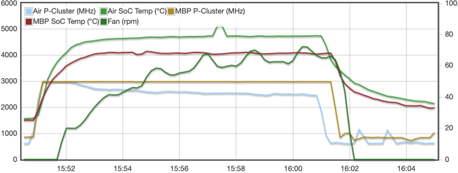

*(clockspeeds and fan rpm are on the left scale while SoC temperatures on the right)*

It seems throttling strategy for the Air is to never exceed 80°C SoC temperature while on the MacBook Pro the fan is used to keep SoC temperature below 70°C having to exceed 4000 rpm after 7 minutes.

When looking at power savings (directly related to heat dissipation) downclocking only the power cores makes totally sense since the efficiency cores even when running fully utilized barely add to the overall power consumption (1.3W on full load). Lowering clockspeeds of the power cores on the Air by 500 MHz (17% frequency less) results in a 5W consumption drop or 33% less which is the expected result of [DVFS](https://en.wikipedia.org/wiki/Power_management#DVFS) at work. On the MacBook Pro the fan keeps clockspeeds up and the power cores consume 14W over the whole benchmark duration:

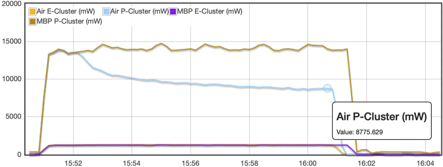

We repeated the run this time the MacBook Air sitting on a huge -18°C icepack cooling down the whole laptop prior to benchmark execution so we started with a SoC temperature of just 12°C.

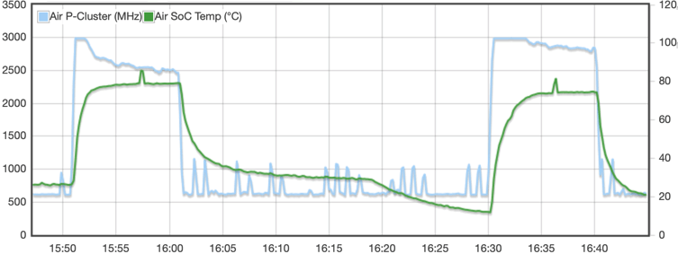

*(temperature is on the right scale while clockspeeds are on the left)*

Throttling started as soon as the SoC temperature hit ~75°C which happened way later than before. This time the power cores were just downclocked by 200 MHz at the end of the 10 min benchmark run. Power consumption also just dropped by 2W this time:

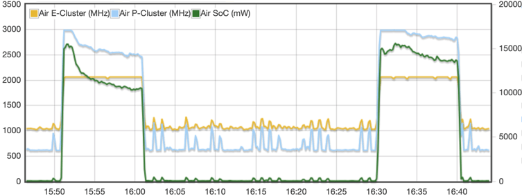

*(consumption in mW is on the right scale while clockspeeds are on the left)*

### Throttling strategy observations

When performing various load tests (CPU or GPU and CPU+GPU) it *seems* there are 3 rules in place:

  * do not let 'SoC temperature' exceed 80°C (naively assuming that 'SoC temperature' can be determined by [collecting the value of each temperature sensor with 'SOC' in its name and calculating an average value from them](https://github.com/ThomasKaiser/Check_MK/blob/2b8139bd48f94219a441e879490354fd636973f9/agents/check_mk_agent.macosx#L419-L423))
  * do not let temperature of a single thermal sensor exceed 95°C (this seems to affect the power management unit only right now, especially the `pACC MTR Temp` sensors)
  * On the MacBook Pro activate the fan on inaudible and fairly low speeds as soon as SoC temperature hits 60°C and increase rpm only later to fulfil first two rules. Same *might* apply to the Mac Mini (not tested since we missed the chance to also order a Mini).

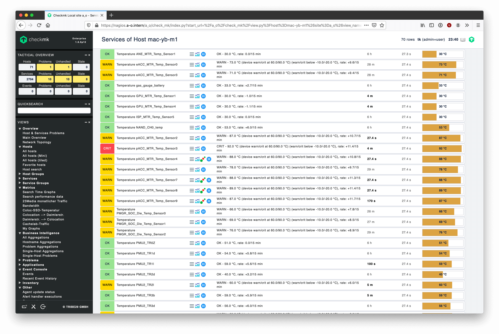

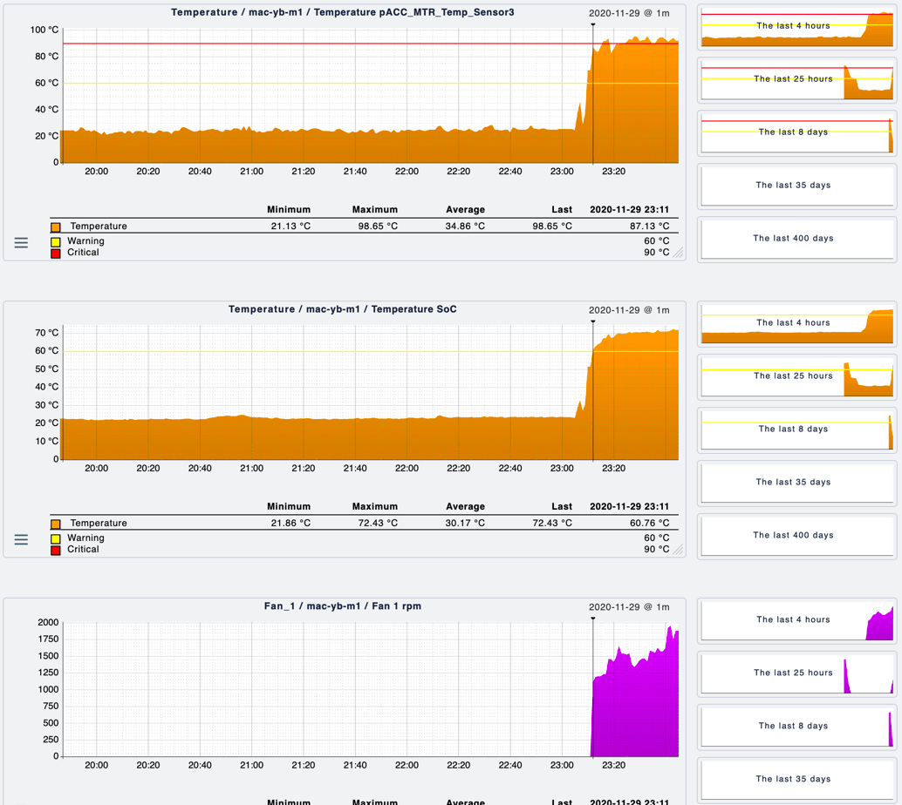

*(graphs plotted this time by [Check_MK](https://checkmk.de), [my macOS agent](https://github.com/ThomasKaiser/Check_MK/blob/master/agents/check_mk_agent.macosx) and [iStatistica](https://www.imagetasks.com/istatistica/))*

### Comparing power cores with efficiency cores

I didn't find a method to assign certain tasks to specific cores (like with `taskset` on Linux or `pbind` on Solaris) since the XNU kernel does all the process scheduling entirely on its own so for now only a pretty unscientific approach choosing a few multi-threaded utilities that can be configured to run on only 4 threads and then comparing both consumption and performance figures to 'running on all 8 cores' seems to be possible.

I chose the following tools for this test:

  * [pigz 2.4](https://zlib.net/pigz/): `-p4` vs. `-p8`
  * pixz (version 1.0.6 bundled with macOS): `-p4` vs. `-p8`
  * pbzip2 (version 1.1.13 from homebrew): `-p4` vs. `-p8`
  * 7z b (version 16.02 from homebrew): `-mmt4` vs. `-mmt8`

The three compressors all take [Linux v5.10-rc4 kernel source](https://github.com/torvalds/linux/releases/tag/v5.10-rc4) as uncompressed tarball concatenated 4 times as input (4.1 GB file size, buffered in RAM) and throw results away to `/dev/null`. No I/O involved.

Explaining the table below: `pigz` when running on all cores finishes in 13.2 seconds while needing 19.1 sec when using the power cores only (`-p4` switch). Adding efficiency cores adds 1270mW to overall consumption. So using the additional 4 efficiency cores  performance improves from 100% to 145% while consumption increase is from 100% to 109%. With `pixz` it's 21.7 sec vs. 29.7 sec so performance increase is 137% and consumption increase is 108%. With `pbzip2` it's 52 vs. 38 seconds: performance increase again to 137% and consumption is at 107.5% compared to 'power cores only'.

7-zip's internal benchmark mode running with 4 vs. 8 threads makes a difference of 22000 vs. 33000 7-zip-MIPS (or 18500 vs. 27500 when running the x86_64 binary via Rosetta2). So the relative performance boost adding the efficiency cores is by 49%-50% with a consumption increase by 9%.

| Tool | power cores | efficiency cores | performance increase | consumption increase |
| ------ | -----: | -----: | -----: | -----: |
| pigz | 13800 mW | 1270 mW | 45% | 9% |
| pixz | 15600 mW | 1250 mW | 37% | 8% |
| pbzip2 | 15900 mW | 1200 mW | 37% | 8% |
| 7z b | 11000 mW | 980 mW | 50% | 9% |
| 7z b (Rosetta2) | 12650 mW | 1100 mW | 49% | 9% |

All test runs have been repeated at least 3 times and carefully monitored (47 thermal sensors and additional 34 sensors for consumption, frequencies and residency) and consumption values have been averaged over multiple runs.

Interpreting the results is not that easy due to the very limited scope of the above tests/utilities. At least the following is obvious:

  * efficiency cores are really power efficient. All four of them doing real heavy work fully utilized on their max cpufreq (2064 MHz) consume less than 1.5W according to `powermetrics` output.
  * In the tests above and with other demanding tasks running fully multi-threaded on all cores the efficiency cores always consume less than 10% compared to the power cores
  * the efficiency cores while contributing less than 10% additional consumption add between 1/3 and 1/2 of the power cores' performance to truly multi-threaded jobs that scale well
  * efficiency cores run at 2/3 clockspeed compared to power cores (3.2 GHz peak single threaded, limited to 3.0 GHz with more performance cores fully active until throttling starts on the Air). Due to their laughable consumption figures efficiency cores aren't affected by throttling and remain on full 2064 MHz while power cores are clocked down once thermal/power budget requires it.

### Looking at GPU utilization and prioritization

As said in the chapter above process scheduling is a black box the OS takes care of. This applies to where processes run (power or efficiency cores), how high the power cores are clocked if the thermal/power envelope needs adjustments and this also applies to decisions how high GPU cores are clocked in which situation.

Let's have a look with both MBP and the MacBook Air since the 30W charger and the passive cooling are limiting factors here. As *load generator* I used again Cinebench R23 (solely CPU bound) and [GfxBench](https://gfxbench.com/) which also utilizes the GPU cores and DRAM more. Those two tools running together could be representative for some 'pro' Apps making intensive use of other engines than just the CPU cores (GPU and the Neural Engine).

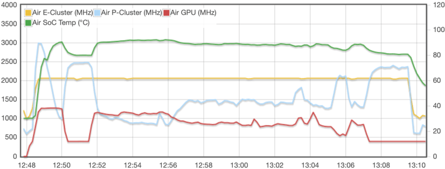

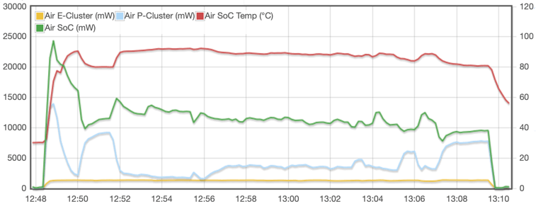

  * My assumption in the chapter above based on 'CPU only' workloads was wrong: the averaged SoC temperature with this combined test exceeded 80°C on the Air easily (92°C max reported by the sensors, the actively cooled MacBook Pro showed peak temperatures of above 81°C with the fan running at audible 7200 rpm)
  * GPU has higher priority than CPU power cores. To stay within the thermal limits the OS prefers to downclock the power cores and let the GPU cores remain on higher frequencies
  * with this test the MacBook Air is thermally limited and not by consumption (having to stay within the 30W power budget). Though throughout the whole test `pmset -g batt` reported to run entirely off AC: `Now drawing from 'AC Power'`.

Now let's compare Air and MacBook Pro:

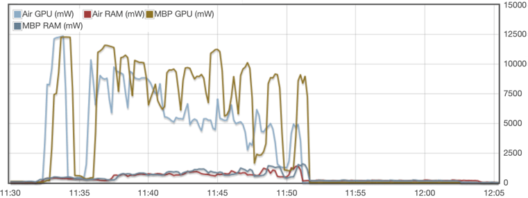

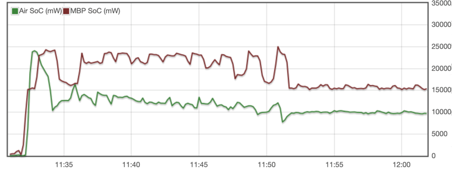

  * Looking at power consumption caused by memory the Cinebench CPU test is rather lightweight just generating 200mW while with GfXBench and especially the last tests RAM consumptions peaks at 1.5W
  * The MacBook Air almost immediately starts to throttle with both CPU and GPU cores being fully utilized. At the beginning of the test both Air and MBP show an overall SoC consumption of 25W but the Air needs to immediately throttle GPU and CPU power cores and consumption drops as low as 12W after 10 minutes full load
  * The MBP remains at much higher GPU and power core clockspeeds so if you're really after sustained performance forget about the fanless Air

Finally the famous 'pillow test' to simulate 'working from bed':

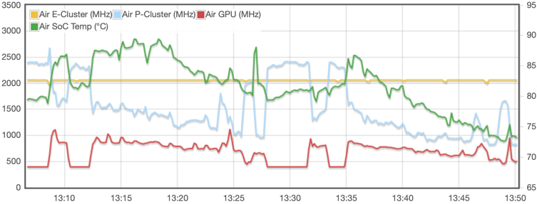

At 13:08 and again at 13:32 GfxBench has been started in addition to Cinebench with the Air sitting on a huge pillow from 13:32 on. Power cores clock as low as 900 MHz and GPU cores below 600 MHz in 'full load' mode. Therefore accessories like [this](https://www.ikea.com/gb/en/p/braeda-laptop-support-black-60150176/) or [that](https://www.ikea.com/gb/en/p/byllan-laptop-support-ebbarp-black-white-90403511/) can result in increased full load performance when working away from flat surfaces like tables. 

### Interpreting 7-zip benchmark scores

*Important: this section has nothing to do at all with what normal users of these laptops and Mini PCs will do with their devices. It's about 'server workloads' where integer/memory performance is key and for this 7-zip scores are a good estimate. A device with twice the 7-zip MIPS will probably handle twice as much server threads as long as we're talking about stuff being CPU bound only.*

Let's hope *BSD and Linux communities overcome the hurdles (e.g. iBoot, different interrupt controller than ARM's GIC) to boot/run other operating systems on those M1 machines so once they do not receive security fixes from Apple any more in a couple of years (AKA 'most recent macOS version') we can still use them with another OS.

The performance/watt ratio makes them pretty interesting for server tasks so let's look a bit closer what to expect and compare [with other platforms/systems](https://s1.hoffart.de/7zip-bench/). Sorting by 6th column (7-zip MIPS per core -- please be aware that 7-zip just like a lot of server applications greatly benefits from SMT like Intel's 'Hyper Threading' and will run with 2 threads per core on such systems).

| Core | cpufreq | cores | threads | 7-zip MIPS | per core | per core/MHz | per core/mW |
| ---- | :----: | :----: | :----: | :----: | :----: | :----: | :----: |
| M1 power cores | 3000 MHz | 4 | 4 | 22000 | 5500 | 1.83 | 0.5 |
| MacBook 16" | 3600 MHz | 6 | 12 | 30000 | 5000 | 1.39 | 0.08 |
| [Cisco UCS B200-M5 07](https://s1.hoffart.de/7zip-bench/) | 3000 MHz | 48 | 96 | 230464 | 4800 | 1.6 | n/a |
| [Amazon m6g.8xlarge](https://github.com/ThomasKaiser/sbc-bench/commit/88a34e5305c639b8206f2fd821234b232abe4623) | 2500 MHz | 32 | 32 | 109000 | 3406 | 1.36 | n/a |
| M1 efficiency cores | 2064 MHz | 4 | 4 | 11000 | 2750 | 1.33 | 2.8 |
| [ODROID N2+](https://github.com/ThomasKaiser/sbc-bench/blob/master/Results.md) | 2266 MHz | 6 | 6 | 9660 | 1610 | 1.4 | n/a |

The MacBook 16" I'm typing this on has an [i7-9750H](https://ark.intel.com/content/www/de/de/ark/products/191045/intel-core-i7-9750h-processor-12m-cache-up-to-4-50-ghz.html) inside with 3.6 GHz base clock. Power consumption has been measured both on the wall (substracting idle from 'fully loaded') and according to averaged `powermetrics` output (60W-65W).

The Cisco server features 2 x [Xeon Gold 6248R](https://ark.intel.com/content/www/de/de/ark/products/199351/intel-xeon-gold-6248r-processor-35-75m-cache-3-00-ghz.html) with a TDP of 205W each which doesn't mean much until measured properly (TDP just like 'process node' is partially marketing BS). See the i7 directly above being a '45W TDP' labeled CPU drawing 60W-65W when running the 7-zip benchmark.

Amazon's m6g.8xlarge instance is based on a Graviton2 CPU with A64 RM Neoverse N1 cores limited to 32 cores.

The ODROID N2+ Single Board Computer is equipped with an Amlogic S922X 12nm ARM SoC consisting of four Cortex-A73 'performance' cores clocking at 2.4 GHz and two Cortex-A55 efficiency cores at 2.0 GHz. All six cores working together end up with a 7-zip-MIPS score 10% lower compared to Apple's four efficiency cores.

While Apple's efficiency cores have a rather low 'per core' score they're way more power efficient than anything else. Over 5 times more efficient than Apple's power cores and over 30 times better than the Intel cores inside the i7-9750H.

Again: this only applies to 'server workloads in general' (which is nothing one would do on these Apple Silicon machines *today*) and should be taken with a huge grain of salt since solely based on a single benchmark result. But some trends are obvious and if Apple is ever going to design a server CPU I clearly opt for a ton of efficiency cores inside and maybe a few power cores for 'burst loads'.

#### Footnotes

1. `for app in /System/Applications/*.app ; do Sizes=$(lipo -detailed_info "${app}/Contents/MacOS/$(basename "${app}" .app)" 2>/dev/null | awk -F" " '/size/ {print $2}'); set $Sizes; echo -e "${app##*/}\t$1\t$2"; done >/Users/tk/app-sizes.txt` [(back)](#a1)
2. `find /System/Library/Frameworks -name "*dylib" | while read ; do Sizes=$(lipo -detailed_info ${REPLY} 2>/dev/null | awk -F" " '/size/ {print $2}'); [ -z $Sizes ] || set $Sizes; echo -e "${REPLY##*/}\t$1\t$2"; done >/Users/tk/framework-sizes.txt` [(back)](#a2)