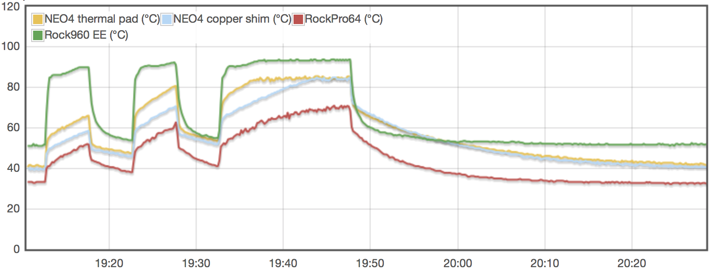
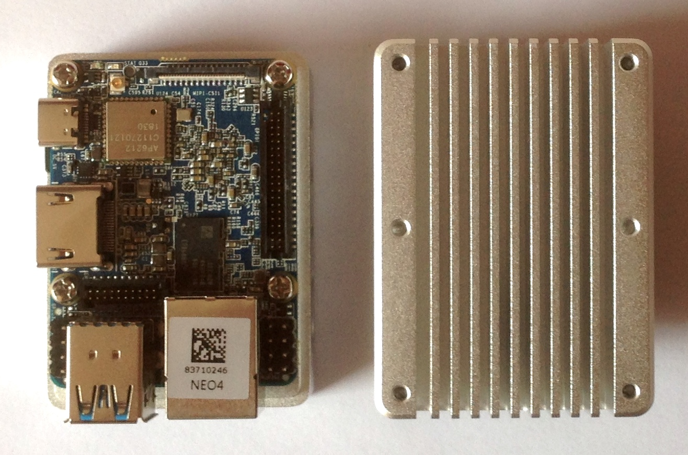

# Heatsink efficiency considerations

The purpose of this test is to check different heatsink implementations on RK3399 equipped development boards. RK3399 since currently being the most interesting ARM SoC for my use cases, plenty of different devices available with board vendors using entirely different heatsink approaches.

## Testbed:

* NanoPi NEO4 N°1 with vendor's stock heatsink and also vendor's thermal pad to attach heatsink to RK3399
* NanoPi NEO4 N°2 with vendor's stock heatsink but 2 copper shims + thermal compound to attach heatsink to SoC (20x20x1mm + 15x15x0.3mm copper shims)
* RockPro64 with vendor's stock tall heatsink but not using the provided thermal pad but [directly connecting RK3399 and heatsink with some old thermal compound](https://forum.armbian.com/topic/7310-rockpro64/?do=findComment&comment=61811)
* Rock960 without any heatsink and fan

All 4 boards run Debian Stretch with kernel 4.4 and cpufreqs limited to 1.4/1.8 GHz. Boards lying next to each other on a table at an ambient temperature of 22°C. As load generators I used [stress](http://people.seas.harvard.edu/~apw/stress/) (lightweight, not a really demanding task) and [cpuminer-multi](https://github.com/tkinjo1985/cpuminer-multi.git) the latter making use of NEON optimizations and able to generate a lot more heat.

1st test setup: 5 minutes `stress` followed by 5 min idle, followed by 5 min `cpuminer`, again 5 min idle, then 15 min `cpuminer`:

    timeout 300 stress -c 6
    sleep 300
    timeout 300 /usr/local/src/cpuminer-multi/cpuminer --benchmark
    sleep 300
    timeout 900 /usr/local/src/cpuminer-multi/cpuminer --benchmark

## Interpreting the results

It's pretty obvious that heat dissipation on RockPro64 works best, followed by the NEO4 with copper shim(s) between RK3399 and heatsink, then the other NEO4 with FriendlyELEC's thermal pad and then [Rock960 EE (also called Ficus)](https://forum.armbian.com/topic/8329-quick-review-of-rock960-enterprise-edition-aka-ficus/).

### Idle temperatures

SoC temperatures reported as follows:

* Rock960: 51.5°C
* NEO4 thermal pad: 42°C
* NEO4 copper shim: 40.5°C
* RockPro64: 32.5°C

### Cpuminer kH/s values

The good thing about cpuminer's benchmark mode is that you get the actual khash/s values constantly reported while running the benchmark. So once the CPU cores start to throttle the benchmark scores will immediately drop too. At the end of the 15 min run the hash rates and temperatures were reported as follows:

* Rock960: 6.88 kH/s at ~94°C
* NEO4 thermal pad: 7.38 kH/s at ~85°C
* NEO4 copper shim: 7.74 kH/s at ~83°C
* RockPro64: 8.15 kH/s at ~72°C

It should be noted that throttling treshold for NEO4 and RockPro64 is set lower than the 

### Looking at the different approaches individually

#### RockPro64

RK3399 directly attached with some thermal compound to this huge heatsink with sufficient fin spacing is the winner. It should also be noted that the PCB itself acts as a heatsink allowing for the SoC's heat to dissipate into the PCB's copper ground plane (see [here](https://forum.armbian.com/topic/7310-rockpro64/?do=findComment&comment=60708) for a thermal image). Large PCB with copper ground plane combined with huge heatsink with excellent heat transfer (no thermal pad) --> great thermal performance

#### NanoPi NEO4

The board is rather small so the PCB does not help that much to dissipate heat away from the SoC. FriendlyELEC chose a huge heatsink out of milled Aluminium which has an own significant thermal mass (the thing gets warm after some time and stores the heat if there's no airflow around). As usual the vendor provided thermal pad performs rather poorly wrt heat transfer so the alternative approach to replace the thermal pad with a copper shim works a lot better. Since distance between SoC and heatsink is ~1.2mm here I needed to combine two copper shims since I have none with 1.2mm height.

#### Rock960 EE AKA Ficus

The board size is huge but this doesn't help with heat dissipation if there's no heatsink attached to RK3399. The vendor's take on this is: ['We think a small heatsink with glue is enough for the big board'](https://forum.armbian.com/topic/8329-quick-review-of-rock960-enterprise-edition-aka-ficus/?do=findComment&comment=63613). By looking at the test results and graphs above I'm not that convinced that a small heatsink is sufficient. RockPro64 shows that it's possible to operate RK3399 even under constant high load with only passive cooling if heat transfer between SoC and heatsink is optimal (only a thin film of thermal compound) and heatsink is constructed appropriately (huge fins with sufficient spacing to let this work without a fan -- if distance between heatsink fins is too small then some airflow AKA fan is needed). But for this you need a rather huge heatsink which requires mounting holes.

## Preliminary conclusions

* optimal heat transfer between SoC and heatsink is important to keep temperatures down. Thermal pads suck (see not only NEO4 above and [RockPro64](https://forum.armbian.com/topic/7310-rockpro64/?do=findComment&comment=61811) but also [NanoPi Fire3](https://forum.armbian.com/topic/7260-quick-review-of-nanopi-fire3/?do=findComment&comment=61661), [NanoPi K1 Plus](https://forum.armbian.com/topic/8125-quick-review-of-nanopi-k1-plus/?do=findComment&comment=61417) and [NanoPi M4](https://forum.armbian.com/topic/8097-nanopi-m4-performance-and-consumption-review/?tab=comments#comment-61786)) and the ideal combination of SoC and heatsink is just an ultra thin film of thermal compound. If that's not possible replacing a thermal pad with a copper shim + thermal compound always greatly improves efficiency.
* huge massive heatsinks with an own thermal mass are sufficient to compensate for shorter load and temperature peaks from time to time but since they store heat under constant high load they won't help that much (without some additional airflow AKA fan then)
* The best performing heatsink for passive cooling seems to be one with low thermal mass but large fins with sufficient spacing to let convection do the job

## TODO

* Testing with a heatsink glued to RK3399 on Ficus
* Testing with Pine Inc's [Graphene heatsink](https://forum.armbian.com/topic/7310-rockpro64/?do=findComment&comment=60708) which needs some airflow to work efficiently.