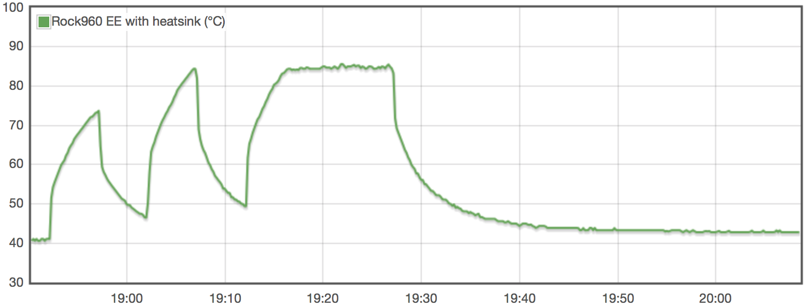
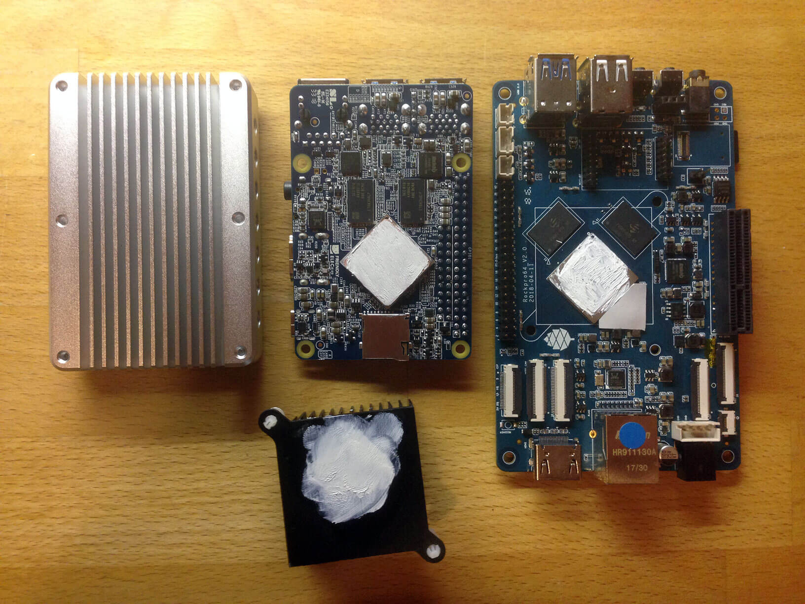
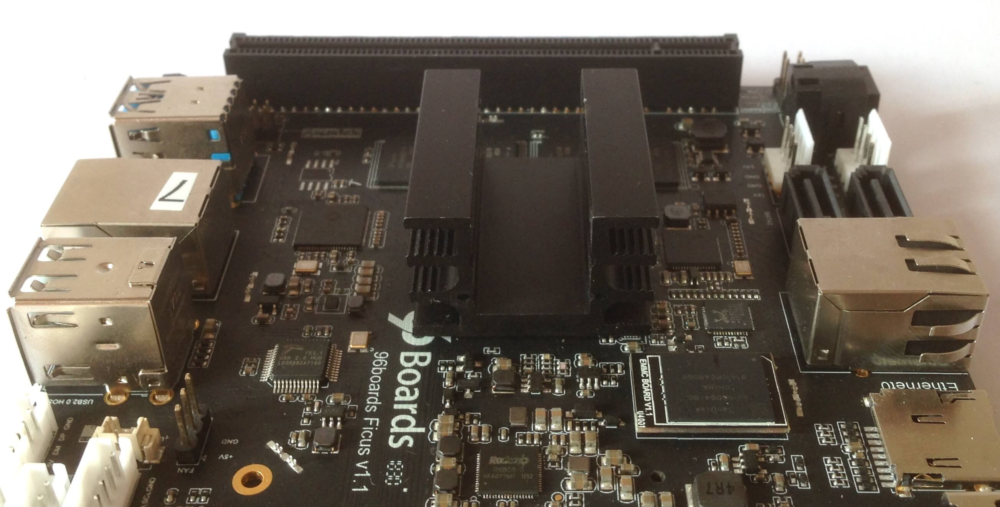
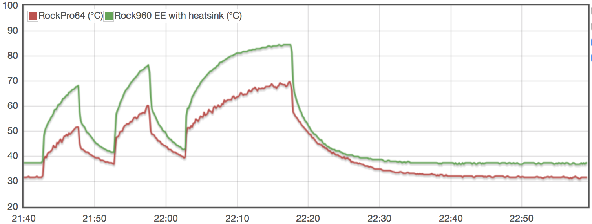

# Heatsink efficiency considerations

The purpose of this test is to check different heatsink implementations on RK3399 equipped development boards. RK3399 since currently being the most interesting ARM SoC for my use cases, plenty of different devices available with board vendors using entirely different heatsink approaches.

## Comparison of different heatsink approaches:

* NanoPi NEO4 N°1 with vendor's stock heatsink and also vendor's thermal pad to attach heatsink to RK3399. Also later without heatsink.
* NanoPi NEO4 N°2 with vendor's stock heatsink but 2 copper shims + thermal compound to attach heatsink to SoC (20x20x1mm + 15x15x0.3mm copper shims).
* RockPro64 with vendor's stock tall heatsink but not using the provided thermal pad but [directly connecting RK3399 and heatsink with some old thermal compound](https://forum.armbian.com/topic/7310-rockpro64/?do=findComment&comment=61811).
* Rock960 without any heatsink and fan. Also later with heatsink glued to RK3399

All 4 boards run Debian Stretch with kernel 4.4 and cpufreqs limited to 1.4/1.8 GHz. Boards lying next to each other on a table at an ambient temperature of 22°C. As load generators I used [stress](http://people.seas.harvard.edu/~apw/stress/) (lightweight, not a really demanding task) and [cpuminer-multi](https://github.com/tkinjo1985/cpuminer-multi.git) the latter making use of NEON optimizations and able to generate a lot more heat.

1st test setup: 5 minutes `stress` followed by 5 min idle, followed by 5 min `cpuminer`, again 5 min idle, then 15 min `cpuminer`:

    timeout 300 stress -c 6
    sleep 300
    timeout 300 /usr/local/src/cpuminer-multi/cpuminer --benchmark
    sleep 300
    timeout 900 /usr/local/src/cpuminer-multi/cpuminer --benchmark

2nd test: same as above but this time running on one NEO4 without any heatsink mounted:

3rd test: same as above but this time after attaching a [Fischer Elektronik SK 76 heatsink](https://www.conrad.de/de/kuehlkoerper-65-kw-l-x-b-x-h-375-x-32-x-20-mm-to-220-to-126-fischer-elektronik-sk-76-375-sa-188964.html) with some thermal glue on Rock960 EE:

### Interpreting the results

It's pretty obvious that heat dissipation on RockPro64 works best, followed by [Rock960 EE (also called Ficus)](https://forum.armbian.com/topic/8329-quick-review-of-rock960-enterprise-edition-aka-ficus/) with glued heatsink, then NEO4 with copper shim(s) between RK3399 and heatsink, then the other NEO4 with FriendlyELEC's thermal pad and finally Rock960 EE and NEO4 without heatsink.

#### Idle temperatures

SoC temperatures reported as follows:

* NEO4 w/o heatsink: 57°C
* Rock960 w/o heatsink: 51.5°C
* Rock960 with heatsink: 42.5°C
* NEO4 thermal pad: 42°C
* NEO4 copper shim: 40.5°C
* RockPro64: 32.5°C

#### Cpuminer kH/s values

The good thing about cpuminer's benchmark mode is that you get the actual khash/s values constantly reported while running the benchmark. So once the CPU cores start to throttle the benchmark scores will immediately drop too. At the end of the 15 min run the hash rates and temperatures were reported as follows:

* NEO4 w/o heatsink: 4.48 kH/s at ~94°C
* Rock960 w/o heatsink: 6.88 kH/s at ~94°C
* NEO4 thermal pad: 7.38 kH/s at ~85°C
* NEO4 copper shim: 7.74 kH/s at ~83°C
* Rock960 with heatsink: 8.11 kH/s at ~85°C
* RockPro64: 8.15 kH/s at ~72°C

It should be noted that throttling tresholds for all 4 boards are similar (trip-point-0 at 70°C and trip-point-1 at 85°C) but the critical treshold is set to 95°C with Ficus (RK default is 115°C). But regardless of the `critical` value none of the boards w/o heatsink exceeded 95°C (NEO4 w/o heatsink throttled down to 408 MHz on the A72 and 1200 MHz on the A53 little cores).

#### Looking at the different approaches individually

##### RockPro64

RK3399 directly attached with some thermal compound to this huge heatsink with sufficient fin spacing is the winner. It should also be noted that the PCB itself acts as a heatsink allowing for the SoC's heat to dissipate into the PCB's copper ground plane (see [here](https://forum.armbian.com/topic/7310-rockpro64/?do=findComment&comment=60708) for a thermal image). Large PCB with copper ground plane combined with huge heatsink with excellent heat transfer (no thermal pad) --> great thermal performance

##### NanoPi NEO4

The board is rather small so the PCB does not help that much to dissipate heat away from the SoC. It's pretty useless to let such a small board run without an efficient heatsink.

FriendlyELEC chose a huge heatsink out of milled Aluminium which has an own significant thermal mass (the thing gets warm after some time and stores the heat if there's no airflow around). As usual the vendor provided thermal pad performs rather poorly wrt heat transfer so the alternative approach to replace the thermal pad with a copper shim works a lot better. Since distance between SoC and heatsink is ~1.2mm here I needed to combine two copper shims since I have none with 1.2mm height.

##### Rock960 EE AKA Ficus

The board size is huge but this doesn't help with heat dissipation if there's no heatsink attached to RK3399. The vendor's take on this is: ['We think a small heatsink with glue is enough for the big board'](https://forum.armbian.com/topic/8329-quick-review-of-rock960-enterprise-edition-aka-ficus/?do=findComment&comment=63613). By looking at the test results and graphs above I'm not that convinced that a small heatsink is sufficient.

So I decided to test again this time with a rather large 37.5 x 32 x 20 mm heatsink glued to RK3399. Idle temperatures 9°C lower and with demanding workloads almost no throttling happened.

## Let convection help

Now a quick test with those larger boards where the PCB itself acts as a heatsink. I've put RockPro64 and Rock960 EE (Ficus) in an upright position so that [convection](https://en.wikipedia.org/wiki/Convection) can help. The boards are oriented in a way that heatsink fins are also vertical to get most airflow possible between the fins:

| Condition | RockPro64 | RockPro64 upright | Ficus | Ficus upright |
| --------: | :-------: | :----------: | :---: | :-----------: |
| Idle | 32.5 | 31.5 | 42.5 | 37 |
| stress 5min | 52 | 51.5 | 74 | 68 |
| cpuminer 5min | 62 | 60 | 84 | 76 |
| cpuminer 15min | 72 | 69 | +85 | 84.5 |

Differences with RockPro64 aren't that huge but with Ficus it really helps a lot. We've 5°C lower temps in idle, 6°C after 5 min `stress`, 8°C less after 5 min `cpuminer` and RK3399 still doesn't throttle after the 15 min `cpuminer` test.

## Heatsink vs. fan

Simple test to compare 'huge but inefficient fan w/o heatsink' with 'large heatsink in ideal position'. I repeated the [sbc-bench](https://github.com/ThomasKaiser/sbc-bench) run from a week ago when the Ficus board was simply lying around and a huge 5V fan was blowing some air over the whole board ([picture](http://kaiser-edv.de/tmp/zSeDwt/Ficus_4.jpg)):

* Fan only: +85.0°C max and slight throttling ([full results](http://ix.io/1nVS))
* Heatsink only: 80°C max and no throttling ([full results](http://ix.io/1oJ5))

The heatsink outperforms the 'fan only' setup as expected. If you want to use a fan for whatever reasons always add at least a tiny heatsink to the IC that needs to be cooled since otherwise any fan is pretty inefficient. Fan w/o heatsink is always a bad idea.

## Preliminary conclusions

* Board size matters since BGA ICs like RK3399 dissipate heat into the PCB's ground plane (compare Rock960 and NEO4 above).
* With large boards orientation matters. Allowing for some airflow around the whole PCB and choosing large heatsink fins with sufficient spacing keeps temperatures down (convection).
* optimal heat transfer between SoC and heatsink is important to keep temperatures down. Vendor provided thermal pads suck (see not only NEO4 above and [RockPro64](https://forum.armbian.com/topic/7310-rockpro64/?do=findComment&comment=61811) but also [NanoPi Fire3](https://forum.armbian.com/topic/7260-quick-review-of-nanopi-fire3/?do=findComment&comment=61661), [NanoPi K1 Plus](https://forum.armbian.com/topic/8125-quick-review-of-nanopi-k1-plus/?do=findComment&comment=61417) and [NanoPi M4](https://forum.armbian.com/topic/8097-nanopi-m4-performance-and-consumption-review/?tab=comments#comment-61786)) and the ideal combination of SoC and heatsink is just an ultra thin film of thermal compound. If that's not possible replacing a thermal pad with a copper shim + thermal compound always greatly improves efficiency.
* huge massive heatsinks with an own thermal mass are sufficient to compensate for shorter load and temperature peaks from time to time but since they store heat under constant high load they won't help that much (without some additional airflow AKA fan then).
* If there are no mounting holes for a heatsink it might be worth a try to buy an oversized heatsink and some thermal glue.
* The best performing heatsink for passive cooling seems to be one with low thermal mass but large fins with sufficient spacing to let convection do the job.
* Using a fan to blow some air around is pretty much useless if there's not also a heatsink mounted greatly improving surface area and therefore heat dissipation.

## TODO

* Testing with Pine Inc's [Graphene heatsink](https://forum.armbian.com/topic/7310-rockpro64/?do=findComment&comment=60708) which needs some airflow to work efficiently.