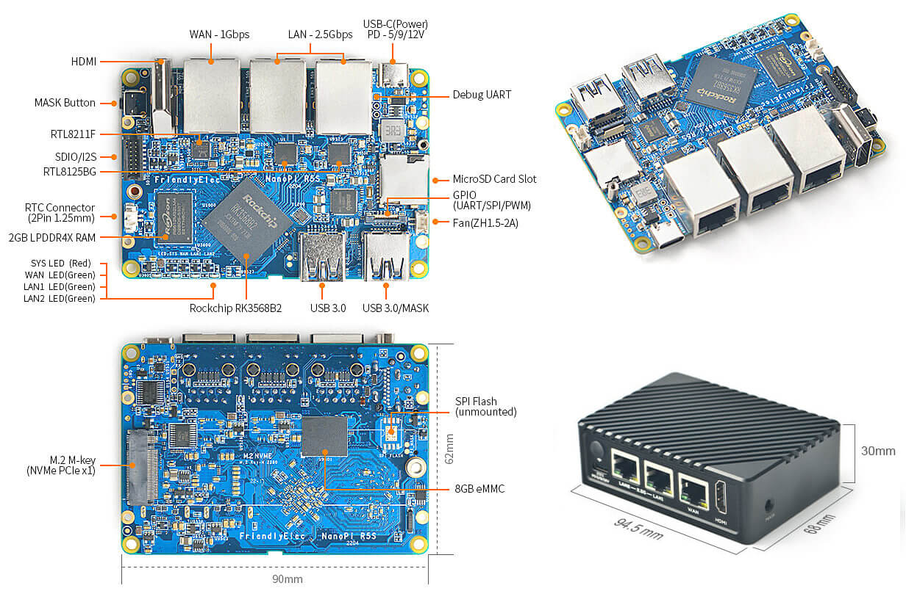
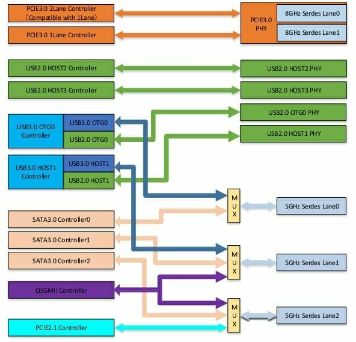
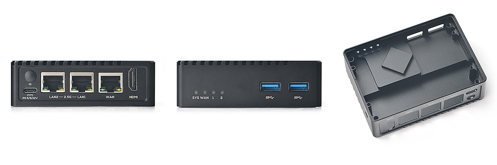

# Quick Preview of NanoPi R5S

**(Work in progress)**

The board obviously wants to be used as router/firewall though other use cases are possible as well since wo USB3 ports, HDMI and I2S are exposed so this device could also be used as a NAS (with a [5-port SATA card in the M.2 slot](https://forum.odroid.com/viewtopic.php?f=212&t=44318)) or a NAS/mediaplayer combo.

But its main feature are of course the two 2.5GbE ports and FriendlyELEC charges [between $59 for the bare board with 2 GB RAM + 8GB eMMC and 85 bucks for 4/16GB with metal enclosure](https://www.friendlyelec.com/index.php?route=product/product&path=69&product_id=287). Unfortunately FriendlyELEC's EU distributor is not going to list new products due to missing CE certification so we ended up ordering two 2GB variants with enclosure directly from China and as such the $150 total turned into ~250€ here in the EU including customs, VAT and DHL shipping/processing.

## Overview

  * SoC: Rockchip RK3568 quad-core Cortex-A55 processor up to 2.0 GHz with Arm Mali-G52 MP2 GPU, 0.8 TOPS AI accelerator, 4Kp60 H.265/H.264/VP9 video decoder, 1080p60 H.264/H.265 video encoder
  * System Memory: 2GB or 4GB LPDDR4X
  * 8GB or 16GB eMMC flash for OS
  * Key M socket for M.2 2280 (PCIe Gen2 x1) NVMe SSD support
  * SDXC compatible Micro-SD card slot
  * HDMI 2.0 port up to 4Kp60, or 1080p120
  * 2 x 2.5GbE RJ45 ports (via Realtek RTL8125BG PCIe controller)
  * 1 x Gigabit Ethernet RJ45 port (RGMII attached with RTL8211F PHY)
  * 2 x USB3 SuperSpeed ports
  * 16-pin 1.27mm pitch GPIO connector with 1 x SDIO 3.0, 1 x I2S (2 x SDO, 3 x SDI)
  * 12-pin 0.5mm pitch FPC connector with up to 1 x SPI, up to 3 x UARTs, up to 4 x PWMs, up to 8 x GPIOs
  * 3-pin debug UART header, 3.3V level, 1500000bps
  * Misc: Mask key for eMMC flash update, RTC battery connector, 5V fan header, 4 x user LEDs
  * Power Supply: 5V/9V/12V USB-C port (USB PD support)
  * Dimensions: PCB 90 x 62 mm, enclosure 94.5 x 68 x 30 mm
  * Weight: 57.5 grams without the case, 260 grams with the metal enclosure

More information can be found in [FriendlyELEC's wiki](https://wiki.friendlyelec.com/wiki/index.php/NanoPi_R5S).

As router/firewall R5S is positioned between the older R2S (RK3328 with 2 x GbE) and R4S (RK3399 with 2 x GbE) and upcoming R6S (RK3588S with 1 x GbE + 2 x 2.5GbE).

## RK3568

`fp asimd evtstrm aes pmull sha1 sha2 crc32 atomics fphp asimdhp cpuid asimdrdm lrcpc dcpop asimddp`

## Powering

Fairchild FUSB302 USB PD controller just as in ROCK 5B's case defaulting only to 5V/9V/12V.

## Consumption

## LEDs

    root@FriendlyWrt:/sys/class/leds# ls -la
    total 0
    drwxr-xr-x  2 root root 0 Aug  4  2017 .
    drwxr-xr-x 76 root root 0 Aug  4  2017 ..
    lrwxrwxrwx  1 root root 0 Aug  4  2017 lan1_led -> ../../devices/platform/gpio-leds/leds/lan1_led
    lrwxrwxrwx  1 root root 0 Aug  4  2017 lan2_led -> ../../devices/platform/gpio-leds/leds/lan2_led
    lrwxrwxrwx  1 root root 0 Aug  4  2017 mmc2:: -> ../../devices/platform/fe310000.sdhci/leds/mmc2::
    lrwxrwxrwx  1 root root 0 Aug  4  2017 sys_led -> ../../devices/platform/gpio-leds/leds/sys_led
    lrwxrwxrwx  1 root root 0 Aug  4  2017 wan_led -> ../../devices/platform/gpio-leds/leds/wan_led

## PCIe

RK3568 features two Gen3 lanes and a single Gen2 lane. To each of the Gen3 lanes is a RTL8125BG 2.5GbE NIC attached and the Gen2 lane is routed to the M.2 key M slot. One could argue that the M.2 slot would've be better Gen3 (twice the bandwidth, lower latency) since the RTL8125BG while attached to the PCIe 3.0 controller only negotiate a Gen2 link: `Speed 5GT/s (ok), Width x1 (ok)`. But maybe the Gen3 lanes even only with Gen2 link speed show lower latency compared to the PCIe 2.1 controller?

## USB

RK3568 relies on [Naneng Micro's USB3.0/PCIE2/SATA3 Combo PHY](http://www.nanengmicro.com/en/combo-phy/) which results in SATA, USB3 and PCIe Gen2 signals all being multiplexed:

In R5S' case we're ending up with 1 x PCIe and 2 x USB3 and no SATA at all (or only if you slap a SATA controller into the M.2 slot). The right USB3 slot can be turned into OTG/MASKROM mode so with an A-to-A USB cable (violating the USB specs) you can turn R5S into an USB gadget or [flash the eMMC via USB](https://wiki.friendlyelec.com/wiki/index.php/NanoPi_R5S#Option_3:_Install_OS_via_USB) .

1.4A overcurrent protection

`/sys/class/typec/` empty

## SD card and eMMC

https://wiki.friendlyelec.com/wiki/index.php/NanoPi_R5S#The_Boot_order_between_eMMC_and_SD_card

The eMMC on both our R5S was prepopulated with FriendlyWRT based on Rockchip's 5.10.66 BSP kernel ([not to be confused with 5.10 LTS from kernel.org](https://www.cnx-software.com/2022/01/09/rock5-model-b-rk3588-single-board-computer/#comment-589709)).

## Networking

    driver: r8125
    version: 9.009.00-NAPI
    firmware-version:
    expansion-rom-version:
    bus-info: 0001:11:00.0
    supports-statistics: yes
    supports-test: no
    supports-eeprom-access: no
    supports-register-dump: yes
    supports-priv-flags: no

root@FriendlyWrt:~# modinfo r8125
filename:       /lib/modules/5.10.110/r8125.ko
version:        9.009.00-NAPI
license:        GPL
description:    Realtek RTL8125 2.5Gigabit Ethernet driver
author:         Realtek and the Linux r8125 crew <netdev@vger.kernel.org>
srcversion:     569E79BC38A800B06207F7F
alias:          pci:v000010ECd00003000sv*sd*bc*sc*i*
alias:          pci:v000010ECd00008162sv*sd*bc*sc*i*
alias:          pci:v000010ECd00008125sv*sd*bc*sc*i*
depends:        
name:           r8125
vermagic:       5.10.110 SMP mod_unload modversions aarch64
parm:           speed_mode:force phy operation. Deprecated by ethtool (8). (uint)
parm:           duplex_mode:force phy operation. Deprecated by ethtool (8). (uint)
parm:           autoneg_mode:force phy operation. Deprecated by ethtool (8). (uint)
parm:           advertising_mode:force phy operation. Deprecated by ethtool (8). (uint)
parm:           aspm:Enable ASPM. (int)
parm:           s5wol:Enable Shutdown Wake On Lan. (int)
parm:           s5_keep_curr_mac:Enable Shutdown Keep Current MAC Address. (int)
parm:           rx_copybreak:Copy breakpoint for copy-only-tiny-frames (int)
parm:           use_dac:Enable PCI DAC. Unsafe on 32 bit PCI slot. (int)
parm:           timer_count:Timer Interrupt Interval. (int)
parm:           eee_enable:Enable Energy Efficient Ethernet. (int)
parm:           hwoptimize:Enable HW optimization function. (ulong)
parm:           s0_magic_packet:Enable S0 Magic Packet. (int)
parm:           tx_no_close_enable:Enable TX No Close. (int)
parm:           enable_ptp_master_mode:Enable PTP Master Mode. (int)
parm:           disable_pm_support:Disable PM support. (int)
parm:           debug:Debug verbosity level (0=none, ..., 16=all) (int)

4a:8d:7a:80:67:1f

Wi-Fi 

iwconfig wlan0 power on

## RTC

A HYM8563TS low-power RTC is on the board, expecting a backup current of 0.25μA TYP (VDD=3.0V) from a user supplied backup battery connected to the 2 pin 1.27/1.25mm Molex 53398-0271 connector.

Quick check for `/dev/rtc0` succeeded: `hwclock -r -f /dev/rtc0 -> 2022-07-13 22:53:46.165661+02:00`.

## SPI NOR flash socket

You could solder yourself an SPI NOR flash to the board but since there's already eMMC this doesn't make much sense. Most probably it's for large custom orders w/o eMMC so the bootloader can be written to the flash to let the board boot from USB, NVMe SSD or network.

## Enclosure

Opening for a Wi-Fi antenna

## FriendlyWRT

