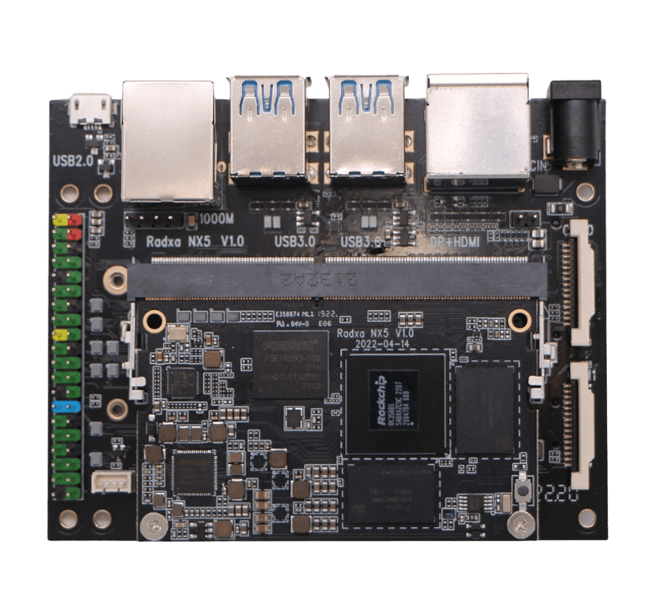

# Quick Preview of ROCK 5B

**(Work in progress)**

On the beginning of July 2022 Radxa sent out a couple Rev. 1.3 dev samples of their long awaited ROCK 5B as part of a [Debug Party](https://forum.radxa.com/t/rock-5b-debug-party-invitation/10483) to spot HW and SW problems. In the following we have a quick look on it focusing on Linux, headless operation and bring-up challenges so if you're interested in Android, gaming or similar stuff this is not for you.

## Overview

The board fortunately leaves the RPi form factor behind and measures 100 x 72mm (Pico-ITX)

  * SoC – Rockchip RK3588 octa-core processor with 4 Cortex-A76 cores @ *up to* 2.4 GHz, 4 Cortex-A55 cores @ 1.8 GHz, ARM Mali G610MC4 GPU, a 6TOPS NPU, 8K 10-bit decoder, 8K encoder
  * System Memory: 4GB, 8GB, or 16GB LPDDR4x (32GB possible but currently no 128Gb LPDDR4x modules available)
  * M.2 2280 key M socket for NVMe SSD (PCIe Gen3 x4)
  * MicroSD card socket
  * eMMC socket ([pinout compatible to ODROID and Pine64](https://wiki.radxa.com/Rock5/hardware/emmc))
  * Three independent displays supported:
  * 2 x HDMI 2.1 out up to 8Kp60 (when 1 display is 8K the other will be 4K)
  * 1 x USB-C via DisplayPort alt. mode up to 8Kp30
  * 1 x micro HDMI input up to 4Kp60
  * 2 x MIPI CSI connectors
  * 1 x 2.5GbE RJ45 port (RTL8125BG) with optional PoE HAT support
  * M.2 2230 key E socket (PCIe Gen2 x1) for an optional WiFi 6E and Bluetooth 5.2 M.2 module or to be used with a cheap mechanical adapter as SATA port
  * USB: 2x USB 3.0 Type-A ports, 1x USB 3.0 Type-C port, 2x USB 2.0 ports. USB3 ports limited to SuperSpeed (5 Gbps)
  * Expansion – 40-pin GPIO header
  * Powering: USB PD compliant through USB-C which carries also display and data signals so 'display with integrated Dock' mode possible

Hardware details including schematics can be found in [Radxa's wiki](https://wiki.radxa.com/Rock5/hardware). The dev samples got some 5V powered heatsinks with integrated fan Radxa found somewhere in a drawer but the final product will feature a different and less noisy heatsink/fan combo supporting PWM.

## RK3588

At the heart of the board is the long awaited [Rockchip RK3588](https://www.cnx-software.com/2019/04/24/rk3588-8k-arm-cortex-a76-a55-soc-rockchip-roadmap-2020/). On the left the variant shown by Radxa, on the right what I found below the fansink on my dev sample:

The CPU cores support the following extensions: fp asimd evtstrm aes pmull sha1 sha2 crc32 atomics fphp asimdhp cpuid asimdrdm lrcpc dcpop asimddp. The topology looks like this:

    CPU sysfs topology (clusters, cpufreq members, clockspeeds)
                    cpufreq   min    max
    CPU    cluster  policy   speed  speed   core type
     0        0        0      408    1800   Cortex-A55 / r2p0
     1        0        0      408    1800   Cortex-A55 / r2p0
     2        0        0      408    1800   Cortex-A55 / r2p0
     3        0        0      408    1800   Cortex-A55 / r2p0
     4        1        4      408    2400   Cortex-A76 / r4p0
     5        1        4      408    2400   Cortex-A76 / r4p0
     6        2        6      408    2400   Cortex-A76 / r4p0
     7        2        6      408    2400   Cortex-A76 / r4p0

So we have three different CPU clusters since `cpu4/cpu5` and `cpu6/cpu7` can be controlled independently. This is important since Rockchip uses PVTM (Process-Voltage-Temperature Monitor) which determines clockspeeds and [is somewhat part of Silicon Lifecycle Management (SLM)](https://www.synopsys.com/glossary/what-are-pvt-sensors.html). The PVT sensors are sensing process variability and operating environment of the SoC at least while booting and both cpufreq driver and an integrated MCU then decide about clockspeeds and most probably also supply voltages which could change over time since silicon is aging.

On my dev sample the cpufreq driver enables the 2400 MHz cpufreq OPP on both A76 clusters but for example on [Willy Tarreau's board `cpu4/cpu5` get only 2304 MHz as highest OPP and `cpu6/cpu7` 2352 MHz](https://forum.radxa.com/t/rock-5b-debug-party-invitation/10483/62).

Real clockspeeds are a different thing since even if on my board the 2400 MHz OPP is enabled [the A76 cores in reality clock with just 2350 MHz](https://forum.radxa.com/t/introduce-rock-5-model-b-arm-desktop-level-sbc/8361/590?u=tkaiser). With Rockchip's BSP kernel `dmesg` output contains some insights about this mechanism, e.g.

    [    3.117399] cpu cpu0: pvtm=1528
    [    3.117491] cpu cpu0: pvtm-volt-sel=5
    [    3.124529] cpu cpu4: pvtm=1785
    [    3.128495] cpu cpu4: pvtm-volt-sel=7
    [    3.136234] cpu cpu6: pvtm=1782
    [    3.140173] cpu cpu6: pvtm-volt-sel=7

(resulting in 1830 MHz on the A55 cluster and 2350 MHz on both A76 clusters) vs. Willy's:

    [    2.606324] cpu cpu0: pvtm=1482
    [    2.606542] cpu cpu0: pvtm-volt-sel=3
    [    2.614206] cpu cpu4: pvtm=1722
    [    2.618389] cpu cpu4: pvtm-volt-sel=5
    [    2.626814] cpu cpu6: pvtm=1744
    [    2.630998] cpu cpu6: pvtm-volt-sel=6

vs. [amazingfate's dev sample](https://gist.github.com/amazingfate/17af25d7d543d253c9d608d1d90ff2c0) which might be even more restricted wrt clockspeeds on the A76 cores:

    [    5.539740] cpu cpu0: pvtm=1486
    [    5.539830] cpu cpu0: pvtm-volt-sel=4
    [    5.546847] cpu cpu4: pvtm=1701
    [    5.550813] cpu cpu4: pvtm-volt-sel=4
    [    5.558544] cpu cpu6: pvtm=1717
    [    5.562484] cpu cpu6: pvtm-volt-sel=5

For more details about the basics behind these mechanisms see chapters 17 and 18 in [RK3588's Technical Reference Manual part 2](https://dl.radxa.com/rock5/hw/datasheet/Rockchip%20RK3588%20TRM%20V1.0-Part2%2020220309.pdf) (beware: that's a ~3700 pages PDF weighing 56 MB).

RK3588's performance is amazing and so far the highest we've seen with any SBC. Numbers are already in `sbc-bench`'s [results collection](https://github.com/ThomasKaiser/sbc-bench/blob/master/Results.md) but let's look directly at the 'most popular SBC in the world' (RPi 4B), another recent octa-core newcomer ([Khadas VIM4](https://www.cnx-software.com/2021/10/21/khadas-vim4-amlogic-a311d2-sbc/) based on Amlogic A311D2) and ROCK 5B:

| SBC | Clockspeed | 7-zip | aes-256-cbc | memcpy | memset | kH/s |
| :-----: | :--------: | ----: | ------: | ------: | -----: | -----: |
| [RPi 4B](http://ix.io/3OBF) | 1800 | 5790 | 36260 | 2330 | 3120 | 8.74 |
| [VIM4](http://ix.io/3Wvv) | 2200/1970 | 12090 | 1253200 | 7810 | 11600 | 22.14 |
| [ROCK 5B](http://ix.io/41BH) | 2350/1830 | 16450 | 1337540 | 10830 | 29220 | 25.31 |

Memory performance is awesome: high bandwidth, low latency, 4 channels, very low inter-core latency since shared L3 cache for all cores. For more details see [here](https://forum.radxa.com/t/rock-5b-debug-party-invitation/10483/44?u=tkaiser) and [there](https://forum.radxa.com/t/rock-5b-debug-party-invitation/10483/61?u=tkaiser).

## Powering / consumption

Powering the board can be done (only?) with an USB PD compatible charger through the USB-C port. QuickCharge isn't supported. The PMU is accessible through I2C so we can ask it what has been negotiated with `sensors tcpm_source_psy_4_0022-i2c-4-22`.

With a 'dumb' 15W RPi USB-C power brick it looks like this:

    in0:           5.00 V  (min =  +5.00 V, max =  +5.00 V)
    curr1:         3.00 A  (max =  +3.00 A)

And with an Apple '96W USB-C Power Adapter' this will be reported:

    in0:           9.00 V  (min =  +9.00 V, max =  +9.00 V)
    curr1:         3.00 A  (max =  +3.00 A)

According to Tom (Radxa's product manager) USB PD negotiation can be controlled via dts / kernel driver. Not sure yet what that means and whether reports about freezes/crashes reported by other testers are related to unfortunate USB PD negotiations.

Consumption figures... I'm measuring with a NetIO PowerBox 4KF in a [rather time consuming process](https://github.com/ThomasKaiser/sbc-bench/blob/e6cfb870c7a297abf96f51b7305600c0e48d1951/sbc-bench.sh#L385-L408) that means 'at the wall' with charger included with averaged idle values over 4 minutes.

The small fan on my dev sample is responsible for ~700mW, switching network between Gigabit Ethernet and 2.5GbE makes up for another ~300mW. Adjusting PCI powermanagement (`/sys/module/pcie_aspm/parameters/policy` – see below why that's important) from `powersave` to `default` makes up for another ~100mW.

So the board idles below 2W w/o any peripherals except Gigabit Ethernet. A fan adds extra juice, 2.5GbE instead of GbE as well, avoiding super powersavings settings also.

The good news: RK3588 is made in such an advanced process that running the most demanding benchmark on this thing ([7-zip's internal benchmark](https://github.com/ThomasKaiser/sbc-bench#7-zip)) on all cores results in ~6W extra consumption compared to idle.

Please be aware that measuring only CPU loads does not really represent the SoC's capabilities since it ignores everything else that makes up RK3588:

  * GPU (2D/3D acceleration)
  * VPU (accelerated video encoding/decoding)
  * NPU
  * in general the media capabilities like display and camera support, ‘picture in picture’ and so on (maybe only ever working in Android and not Linux)
  * IO: RK3588 has serious IO capabilities especially compared to toys like an RPi 4

But if we're only looking at CPU loads, throw away Radxa's fansink and let RK3588 run without any cooling at an ambient temp of 26°C it looks really great [since only slight throttling happens](https://forum.radxa.com/t/rock-5b-debug-party-invitation/10483/97?u=tkaiser)

What happens if we `shutdown -h now` the board: 0W or just a few mW since the power led still lights but everything else is powered down. Compare this for example with an [RPi 4B that sucks ~1.2W from the wall after 'being powered off'](https://hackaday.com/2021/11/01/the-pi-zero-2-w-is-the-most-efficient-pi/).

## LEDs

There's a green led working as power led (lights on when power is supplied and goes off with no power) and there's a blue led called `sta`, living at `/sys/class/leds/sta`, defaulting to `timer` which results in constant blinking.

Other options: `none rfkill-any rfkill-none kbd-scrolllock kbd-numlock kbd-capslock kbd-kanalock kbd-shiftlock kbd-altgrlock kbd-ctrllock kbd-altlock kbd-shiftllock kbd-shiftrlock kbd-ctrlllock kbd-ctrlrlock tcpm-source-psy-4-0022-online [timer] oneshot disk-activity disk-read disk-write ide-disk mtd nand-disk heartbeat backlight gpio cpu cpu0 cpu1 cpu2 cpu3 cpu4 cpu5 cpu6 cpu7 activity default-on transient flash torch panic netdev mmc0 mmc1`

There's also another sysfs entry called `/sys/class/leds/mmc1` but I had no luck finding the corresponding led on the board or such a node in the device-tree file.

Please be aware that we're talking about a developer sample so final product might change. Same applies to the heatsink which was a temporary hack by Radxa to provide us early testers with something. Final heatsink implementation of course will *not* block the M.2 2280 slot on the other PCB side! But I'm still hoping for Radxa coming up with an [elegant metal enclosure dissipating the heat passively away](https://forum.radxa.com/t/rock-5b-debug-party-invitation/10483/113?u=tkaiser) so those heatsink mounting holes are not needed anyway.

## USB

The board features 5 USB ports: 2 Hi-Speed USB-A receptacles (often called 'USB 2.0 ports'), 2 x USB3-A receptacles and 1 x USB-C. The latter 3 are limited to USB SuperSpeed AKA 5 Gbps.

While the USB2 ports share bandwidth since being behind an internal USB hub (`1a40:0101 Terminus Technology Inc. Hub`) the USB3 ports are on their own buses.

I'm not able to test USB-C capabilities since port used for powering and me lacking an USB-C/Thunderbolt dock or an appropriate display. But schematics tell that USB-C supports USB3 OTG and DisplayPort with the following lane combinations: DP x4, USB3 x4 and DP x2 + USB3 x2.

So let's focus on the two USB3 Type-A sockets (maybe the most crappy connector ever invented due to the extra tiny contacts for the SuperSpeed data lines). To spot any internal bottlenecks my test is to connect an UAS capable disk enclosure with an SSD inside to each USB3-A port, setup a RAID0 and see whether we're exceeding 400 MB/s or not (~400 MB/s sequential disk transfers are the maximum you get over a single 5 Gbps USB3 connection)

    root@rock-5b:/home/rock# lsusb -t
    /:  Bus 08.Port 1: Dev 1, Class=root_hub, Driver=xhci-hcd/1p, 5000M
        |__ Port 1: Dev 2, If 0, Class=Mass Storage, Driver=uas, 5000M
    /:  Bus 06.Port 1: Dev 1, Class=root_hub, Driver=xhci-hcd/1p, 5000M
        |__ Port 1: Dev 2, If 0, Class=Mass Storage, Driver=uas, 5000M
    
    root@rock-5b:/home/rock# lsusb
    Bus 006 Device 002: ID 174c:55aa ASMedia Technology Inc. Name: ASM1051E SATA 6Gb/s bridge, ASM1053E SATA 6Gb/s bridge, ASM1153 SATA 3Gb/s bridge, ASM1153E SATA 6Gb/s bridge
    Bus 008 Device 002: ID 152d:3562 JMicron Technology Corp. / JMicron USA Technology Corp. JMS567 SATA 6Gb/s bridge

Creating the RAID0 failed due to the usual reasons (missing parameters like [coherent_pool=2M](https://forum.armbian.com/topic/4811-uas-mainline-kernel-coherent-pool-memory-size/)) and powering problems of one of the USB3 enclosures ([details](https://forum.radxa.com/t/rock-5b-debug-party-invitation/10483/87?u=tkaiser)).

In this stupid SBC world almost everyone will now yell 'Disable UAS!' but it was simply missing parameters and underpowering so once that was resolved testing with `iozone -e -I -a -s 1000M -r 1024k -r 16384k -i 0 -i 1` showed these numbers:

         kB  reclen    write  rewrite    read    reread
    1024000    1024   258830   270261   341979   344249
    1024000   16384   270022   271088   667757   679947

270 MB/s write performance is crap so let's look at the (missing) tunables. After adding this to `/etc/rc.local` (to survive reboots)

    for cpufreqpolicy in 0 4 6 ; do
        echo 1 > /sys/devices/system/cpu/cpufreq/policy${cpufreqpolicy}/ondemand/io_is_busy
        echo 25 > /sys/devices/system/cpu/cpufreq/policy${cpufreqpolicy}/ondemand/up_threshold
        echo 10 > /sys/devices/system/cpu/cpufreq/policy${cpufreqpolicy}/ondemand/sampling_down_factor
        echo 200000 > /sys/devices/system/cpu/cpufreq/policy${cpufreqpolicy}/ondemand/sampling_rate
    done

...even on the little A55 cores we're seeing this since now cpufreq driver ramps up clockspeeds also with storage accesses:

         kB  reclen    write  rewrite    read    reread
    1024000    1024   524857   526483   458726   459194
    1024000   16384   780470   774856   733638   734297

This is fine since close to 800 MB/s means there's no bottleneck and both USB3 type-A receptacles show full bandwidth even when accessed concurrently.

## Storage

Radxa sent a 64GB FORESEE eMMC module with the board which shows high random IO performance and 145/270 MB/s sequential write/read speeds:

`iozone -e -I -a -s 100M -r 4k -r 16k -r 512k -r 1024k -r 16384k -i 0 -i 1 -i 2`

                                                        random    random
        kB  reclen    write  rewrite    read    reread    read     write
    102400       4    34983    36713    48378    48481    34331    34148
    102400      16    75397    80290    77794    79897    60296    76540
    102400     512   142087   141793   244351   244725   239998   143555
    102400    1024   143426   146085   256129   256513   253494   140067
    102400   16384   142751   144883   270066   269172   273974   144779

Which is pretty fine if we compare to the much more expensive ['orange' eMMC modules Hardkernel showcased when sending out dev samples of their canceled ODROID-N1](https://forum.armbian.com/topic/6496-odroid-n1-not-a-review-yet/?do=findComment&comment=49404))

                                                        random    random
        kB  reclen    write  rewrite    read    reread    read     write
    102400       4    32464    36340    30699    30474    27776    31799
    102400      16    94637   100995    89970    90294    83993    96937
    102400     512   147091   151657   278646   278126   269186   146851
    102400    1024   143085   148288   287749   291479   275359   143229
    102400   16384   147880   149969   306523   306023   307040   147470

As for USB3 see above (everything fine with the 5Gbps Type-A ports)

NVMe I can't test currently since having only crappy M.2 SSDs lying around that will be the bottleneck. But since Radxa reports +2700 MB/s sequential read speeds and we know the little sibling RK3568 can saturate PCIe Gen3 x2 while lacking the four big A76 cores I'm pretty confident that we're seeing full Gen3 x4 NVMe performance with this device.

Testing SATA also not possible since lacking the adapter (said to cost just a few bucks) that goes into the M.2 key E slot to turn PCIe into native SATA via a device-tree overlay:

This works since RK3588 features three Combo PIPE PHYs that are [pinmuxed and provide either SATA, PCIe Gen2 or USB3](https://www.cnx-software.com/2021/12/16/rockchip-rk3588-datasheet-sbc-coming-soon/). While I can't provide performance numbers we know from RK3568 that SATA performance is as expected for SATA 6 Gbps. And there are [further possibilities with this little M.2 slot](https://forum.radxa.com/t/radxa-rock5-rk3588-sbc-pcie-lanes-clarification/9580/18?u=tkaiser).

[According to device-tree settings](https://github.com/radxa/kernel/blob/78d311de923fc0644e4700f30813120835fec9cf/arch/arm64/boot/dts/rockchip/rk3588-rock-5b.dts#L426-L440) the SD card interface should be capable of SDR104 mode (switching from 3.3V to 1.8V with up to 104 MB/s sequential transfer speeds). Let's have a look with the usual `iozone` call and two cards:

    older SanDisk Extreme 32GB A1                       random    random
        kB  reclen    write  rewrite    read    reread    read     write
    102400       4     3393     3356    14523    14505    10301     4730
    102400      16    11243    11290    32969    32989    29710     5938
    102400     512    55755    56452    64188    64245    63718    46021
    102400    1024    59655    60323    65364    65524    65416    53838
    102400   16384    61178    61268    68165    68289    68287    61408

    recent SanDisk Extreme 64GB A2                      random    random
        kB  reclen    write  rewrite    read    reread    read     write
    102400       4     2450     2547    11890    11952     9230     4127
    102400      16     9485     9585    30536    30557    30332    13948
    102400     512    51642    51438    64056    64056    64053    45227
    102400    1024    57304    57351    65432    65439    65443    53929
    102400   16384    54927    54567    68243    68243    68247    53363

We're nowhere near 104 MB/s since the interface is lower clocked for some safety headroom and therefore limited to below 70 MB/s sequential transfers but random IO benefits from SDR104 mode and depends on the SD card you buy anyway. [Check more insights on SD card performance and other numbers to compare](https://github.com/ThomasKaiser/Knowledge/blob/master/articles/A1_and_A2_rated_SD_cards.md).

## Networking

The network interface of ROCK 5B is 2.5GbE capable due to an PCIe attached RTL8125BG NIC (using one of the PCIe Gen2 lanes: `Speed 5GT/s (ok), Width x1`). Asking `ethtool enP4p65s0`:

    Settings for enP4p65s0:
    	Supported ports: [ TP ]
    	Supported link modes:   10baseT/Half 10baseT/Full 
    	                        100baseT/Half 100baseT/Full 
    	                        1000baseT/Full 
    	                        2500baseT/Full 
    	Supported pause frame use: Symmetric Receive-only
    	Supports auto-negotiation: Yes
    	Supported FEC modes: Not reported
    	Advertised link modes:  10baseT/Half 10baseT/Full 
    	                        100baseT/Half 100baseT/Full 
    	                        1000baseT/Full 
    	                        2500baseT/Full 
    	Advertised pause frame use: No
    	Advertised auto-negotiation: Yes
    	Advertised FEC modes: Not reported
    	Link partner advertised link modes:  100baseT/Full 
    	                                     1000baseT/Full 
    	                                     2500baseT/Full 
    	                                     5000baseT/Full 
    	Link partner advertised pause frame use: No
    	Link partner advertised auto-negotiation: Yes
    	Link partner advertised FEC modes: Not reported
    	Speed: 2500Mb/s
    	Duplex: Full
    	Port: Twisted Pair
    	PHYAD: 0
    	Transceiver: internal
    	Auto-negotiation: on
    	MDI-X: Unknown
    	Supports Wake-on: pumbg
    	Wake-on: g
    	Current message level: 0x00000033 (51)
    			       drv probe ifdown ifup
    	Link detected: yes

`ethtool -i enP4p65s0`:

    driver: r8125
    version: 9.009.00-NAPI-RSS
    firmware-version: 
    expansion-rom-version: 
    bus-info: 0004:41:00.0
    supports-statistics: yes
    supports-test: no
    supports-eeprom-access: no
    supports-register-dump: yes
    supports-priv-flags: no

Network performance in TX direction was fine since exceeding 2.32 Gbit/sec but in RX direction it sucked (~500 Mbit/sec max). After [adjusting PCIe powermanagement](https://forum.radxa.com/t/rock-5b-debug-party-invitation/10483/86?u=tkaiser) also +2.32 GBit/sec but there's some room for improvements since Rockchip's BSP kernel doesn't care at all about network tunables. This is stuff for further investigation/tuning.

## Software

No mainline Linux support so far (upstreaming will take years but Radxa is collaborating with [Collabora](https://www.collabora.com) here) and as such every RK3588 device runs with Rockchip's BSP kernel that shows currently version number 5.10.66. But this is not 5.10 LTS from kernel.org but [forward ported from 2.6.32 on](https://www.cnx-software.com/2022/01/09/rock5-model-b-rk3588-single-board-computer/#comment-589709). ROCK 5B repos are:

  * [https://github.com/radxa/kernel/tree/stable-5.10-rock5](https://github.com/radxa/kernel/tree/stable-5.10-rock5)
  * [https://github.com/radxa/u-boot/tree/stable-5.10-rock5](https://github.com/radxa/u-boot/tree/stable-5.10-rock5)

BTW: in these repos you can spot other upcoming Radxa devices like both [RK3588S](https://www.cnx-software.com/2022/01/12/rockchip-rk3588s-cost-optimized-cortex-a76-a55-processor/) based ROCK 5A or the Radxa NX5 SoM that looks like this on its carrier board:

## more to come

...

## Suggestions to Radxa

  * set `/sys/module/pcie_aspm/parameters/policy` to `default` instead of `powersave` (w/o network RX performance is ruined)
  * append `coherent_pool=2M` to `extlinux.conf` (w/o most probably ‘UAS hassles’)
  * configure `ondemand` cpufreq governor with `io_is_busy` and friends (w/o storage performance sucks)
  * Write some service that checks at booting whether there's a `/dev/nvme` device and if so check via `lspci -vv` whether there's a mismatch between SSD's advertised capabilities and negotiated ones (except the SSD being capable of Gen4 speeds ofc). Notify user if that happened so user is aware of problems with failed PCIe link training probably caused by dirty contacts in the M.2 slot
  
## Open questions

  * possible to power the board asides USB-C / USB PD e.g. with 5V via GPIO header?
  * RK3588 TRM states wrt SATA 'Port Multiplier with FIS-based switching' but someone should test with a JMicron JMB575
  