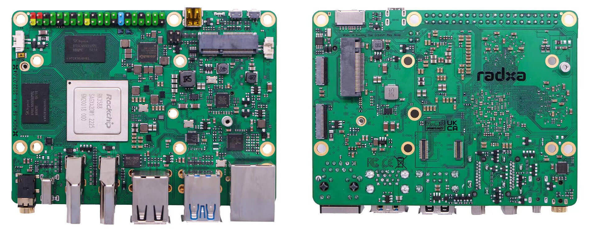
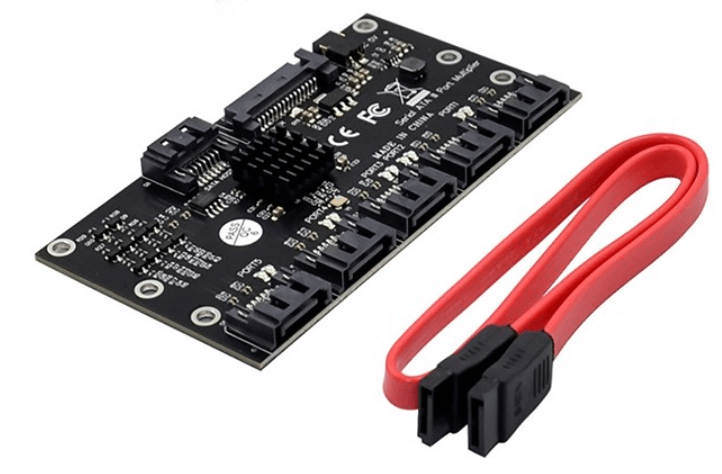
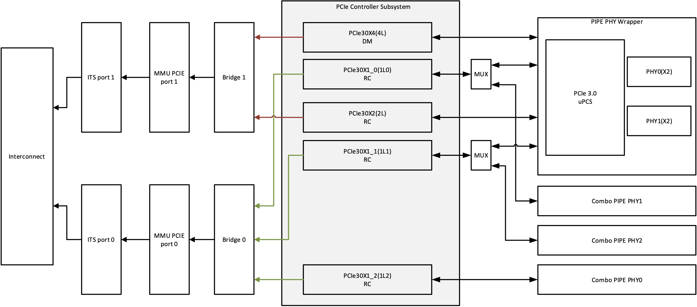
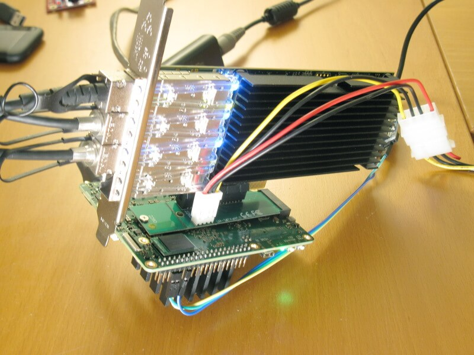
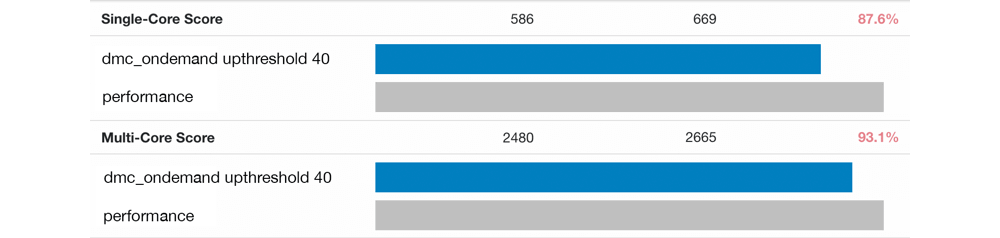
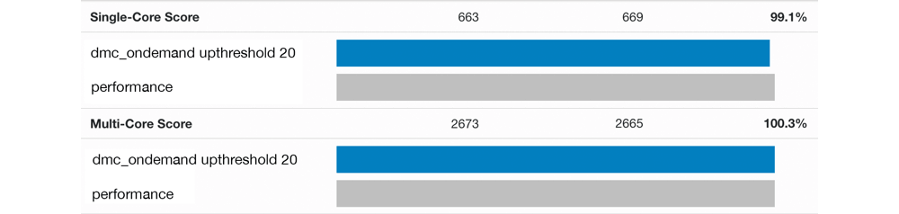

# Quick Preview of ROCK 5B

  * [Overview](#overview)
  * [RK3588](#rk3588)
    + [PVTM](#pvtm)
    + [Performance](#performance)
  * [Powering](#powering)
  * [Consumption](#consumption)
  * [LEDs](#leds)
  * [USB](#usb)
  * [Storage](#storage)
    + [eMMC](#emmc)
    + [SD card](#sd-card)
    + [SPI NOR flash](#spi-nor-flash)
    + [USB](#usb-1)
    + [NVMe](#nvme)
    + [SATA](#sata)
  * [Networking](#networking)
  * [PCIe](#pcie)
  * [Audio codec](#audio-codec)
  * [RTC](#rtc)
  * [Software](#software)
  * [Board bring-up](#board-bring-up)
  * [Suggestions to Radxa](#suggestions-to-radxa)
  * [Open questions](#open-questions)
  * [Important insights and suggested optimisations](#important-insights-and-suggested-optimisations)
  * [Revisiting software support status 20 months later](#revisiting-software-support-status-20-months-later)

Early July 2022 Radxa sent out a couple Rev. 1.3 dev samples of their long awaited ROCK 5B as part of a [Debug Party](https://forum.radxa.com/t/rock-5b-debug-party-invitation/10483) to spot HW and SW problems. In the following we have a quick look on it focusing on Linux, headless operation and bring-up challenges so if you're interested in Android, gaming or similar stuff this is not for you.

In the meantime PCB Rev. 1.4 [appeared](https://nitter.net/AllnetChina/status/1550141093567778820):

## Overview

The board fortunately leaves the RPi form factor behind and measures 100 x 74mm (close to but definitely *not* Pico-ITX – mounting hole positions also differ from Pico-ITX)

  * SoC: Rockchip RK3588 octa-core processor with 4 Cortex-A76 cores @ *up to* 2.4 GHz, 4 Cortex-A55 cores @ ~1.8 GHz, ARM Mali G610MC4 GPU, a 6TOPS NPU, 8K 10-bit decoder, 8K encoder
  * System Memory: 4GB, 8GB, or 16GB LPDDR4x (32GB possible but currently no 128Gb LPDDR4x modules available)
  * M.2 2280 key M socket for NVMe SSD (PCIe Gen3 x4)
  * MicroSD card socket
  * eMMC socket ([pinout compatible to ODROID and Pine64](https://wiki.radxa.com/Rock5/hardware/emmc))
  * Three independent displays supported:
  * 2 x HDMI 2.1 out up to 8Kp60 (when 1 display is 8K the other will be 4K)
  * 1 x USB-C via DisplayPort alt. mode up to 8Kp30
  * 1 x micro HDMI input up to 4Kp60
  * 2 x MIPI CSI connectors (Radxa about to sell an 8MP camera able to stream 4K @ 90 frames/sec based on SONY's IMX415 sensor, current driver is limiting to 30 fps)
  * 1 x 2.5GbE RJ45 port (RTL8125BG) with optional PoE HAT support
  * M.2 2230 key E socket (PCIe Gen2 x1) for an optional WiFi 6E and Bluetooth 5.2 M.2 module or to be used with a cheap mechanical adapter as SATA port
  * USB: 2x USB 3.0 Type-A ports, 1x USB 3.0 Type-C port, 2x USB 2.0 ports. USB3 ports limited to SuperSpeed (5 Gbps)
  * Expansion – 40-pin GPIO header
  * Powering: USB PD compliant through USB-C which carries also display and data signals so 'display with integrated Dock' mode possible

Hardware details including schematics can be found in [Radxa's wiki](https://wiki.radxa.com/Rock5/hardware). The dev samples got some 5V powered heatsinks with integrated fan Radxa found somewhere in a drawer but the final product will be accompanied by a different, regulated and less noisy heatsink/fan combo (small PWM header on the board side). Fortunately Radxa could be convinced to also manufacture a fanless metal enclosure acting as large heatsink to [passively dissipate the SoC's and SSD's heat out of the enclosure](https://forum.radxa.com/t/rock-5b-accessory/11475/18?u=tkaiser).

## RK3588

At the heart of the board is the long awaited [Rockchip RK3588](https://www.cnx-software.com/2019/04/24/rk3588-8k-arm-cortex-a76-a55-soc-rockchip-roadmap-2020/). On the left the variant shown by Radxa, on the right what I found below the fansink on my dev sample:

All RK3588 announcements talk about the SoC being made in an '8nm process' which of course is BS but what the '8nm' really tell us is Rockchip probably relying on Samsung and their 8LPP process since neither TSMC nor Globalfoundries have a process name with an '8' in its name. 8LPP as an *extension* of Samsung's 10LPP process [is said to have a fin pitch of 42nm and a gate pitch of 64nm](https://fuse.wikichip.org/news/1443/vlsi-2018-samsungs-8nm-8lpp-a-10nm-extension/).

The CPU cores support the following extensions: fp asimd evtstrm aes pmull sha1 sha2 crc32 atomics fphp asimdhp cpuid asimdrdm lrcpc dcpop asimddp. The topology looks like this:

    CPU sysfs topology (clusters, cpufreq members, clockspeeds)
                    cpufreq   min    max
    CPU    cluster  policy   speed  speed   core type
     0        0        0      408    1800   Cortex-A55 / r2p0
     1        0        0      408    1800   Cortex-A55 / r2p0
     2        0        0      408    1800   Cortex-A55 / r2p0
     3        0        0      408    1800   Cortex-A55 / r2p0
     4        1        4      408    2400   Cortex-A76 / r4p0
     5        1        4      408    2400   Cortex-A76 / r4p0
     6        2        6      408    2400   Cortex-A76 / r4p0
     7        2        6      408    2400   Cortex-A76 / r4p0

### PVTM

So we have three different CPU clusters since `cpu4/cpu5` and `cpu6/cpu7` can be controlled independently. This is important since Rockchip uses PVTM (Process-Voltage-Temperature Monitor) on its new RK3566/RK3568/RK3588 SoCs which [is somewhat part of Silicon Lifecycle Management (SLM)](https://www.synopsys.com/glossary/what-are-pvt-sensors.html). The PVT sensors are sensing process variability and operating environment of the SoC at least while booting and both cpufreq driver and an integrated MCU then decide about clockspeeds and supply voltages which could change over time since silicon is aging.

The actual clockspeeds are currently controlled by a HW mechanism called [PVTPLL](https://www.collabora.com/news-and-blog/blog/2024/02/21/almost-a-fully-open-source-boot-chain-for-rockchips-rk3588/#qcom4018). Control could be handed over to cpufreq driver but then instabilities might occur with DVFS settings that work well with PVTPLL.

On my dev sample the cpufreq driver enables the 2400 MHz cpufreq OPP on both A76 clusters but for example on [Willy Tarreau's board `cpu4/cpu5` get only 2304 MHz as highest OPP and `cpu6/cpu7` 2352 MHz](https://forum.radxa.com/t/rock-5b-debug-party-invitation/10483/62).

Real clockspeeds are a different thing since even if on my board the 2400 MHz OPP is enabled [the A76 cores in reality clock with just 2350 MHz](https://forum.radxa.com/t/introduce-rock-5-model-b-arm-desktop-level-sbc/8361/590?u=tkaiser). With Rockchip's BSP kernel `dmesg` output contains some PVTM info. My board:

    [    3.117399] cpu cpu0: pvtm=1528
    [    3.117491] cpu cpu0: pvtm-volt-sel=5
    [    3.124529] cpu cpu4: pvtm=1785
    [    3.128495] cpu cpu4: pvtm-volt-sel=7
    [    3.136234] cpu cpu6: pvtm=1782
    [    3.140173] cpu cpu6: pvtm-volt-sel=7

(resulting in 1830 MHz on the A55 cluster and 2350 MHz on both A76 clusters) vs. Willy's:

    [    2.606324] cpu cpu0: pvtm=1482
    [    2.606542] cpu cpu0: pvtm-volt-sel=3
    [    2.614206] cpu cpu4: pvtm=1722
    [    2.618389] cpu cpu4: pvtm-volt-sel=5
    [    2.626814] cpu cpu6: pvtm=1744
    [    2.630998] cpu cpu6: pvtm-volt-sel=6

vs. [amazingfate's board](https://gist.github.com/amazingfate/17af25d7d543d253c9d608d1d90ff2c0) which results in even lower clockspeeds on the A76 cores: [highest cpufreq OPP are 2256 MHz on `cpu4/cpu5` and 2304 MHz on `cpu6/cpu7` while both A76 clusters really clock at around 2.3GHz](https://forum.radxa.com/t/rock-5b-debug-party-invitation/10483/153?u=tkaiser):

    [    5.539740] cpu cpu0: pvtm=1486
    [    5.539830] cpu cpu0: pvtm-volt-sel=4
    [    5.546847] cpu cpu4: pvtm=1701
    [    5.550813] cpu cpu4: pvtm-volt-sel=4
    [    5.558544] cpu cpu6: pvtm=1717
    [    5.562484] cpu cpu6: pvtm-volt-sel=5

Please note that PVTM also handles the GPU and NPU parts of the SoC. For more details about the basics behind these mechanisms see chapters 17 and 18 in [RK3588's Technical Reference Manual part 2](https://dl.radxa.com/rock5/hw/datasheet/Rockchip%20RK3588%20TRM%20V1.0-Part2%2020220309.pdf) (beware: that's a ~3700 pages PDF weighing 56 MB).

Next step: check whether those RK3588 where the kernel denies highest clockspeeds can be convinced by some [slight manual overvolting to allow for max performance](https://forum.radxa.com/t/rock-5b-debug-party-invitation/10483/141?u=tkaiser) (resulting in slightly higher consumption and temperatures at full load of course!).

### Performance

RK3588's CPU performance is amazing and so far the highest we've seen with any somewhat affordable SBC. Numbers are already in `sbc-bench`'s [results collection](https://github.com/ThomasKaiser/sbc-bench/blob/master/Results.md) but let's look directly at the 'most popular SBC in the world' (RPi 4B), ODROID N2+, another recent octa-core newcomer ([Khadas VIM4](https://www.cnx-software.com/2021/10/21/khadas-vim4-amlogic-a311d2-sbc/) based on Amlogic A311D2), Qualcomm QRB5165 (Snapdragon 865) and ROCK 5B:

| SBC | Clockspeed | 7-zip st* | 7-zip mt* | aes-256-cbc | memcpy | memset | kH/s |
| :-----: | :--------: | ----: | ----: | ------: | ------: | -----: | -----: |
| [RPi 4B](http://ix.io/3OBF) | 1800 | 1769 | 5790 | 36260 | 2330 | 3120 | 8.74 |
| [ODROID N2+](http://ix.io/3DtN) | 2400/2015 | 2253 | 9790 | 1366930 | 4300 | 7480 | n/a |
| [VIM4](http://ix.io/3Wvv) | 2200/1970 | 2081 | 12090 | 1253200 | 7810 | 11600 | 22.14 |
| [ROCK 5B](http://ix.io/41BH) | 2350/1830 | 3146 | 16450 | 1337540 | 10830 | 29220 | 25.31 |
| [Qualcomm QRB5165](http://ix.io/49kx) | 2840/2410/1790 | 3898 | 18860  | 1598490 | 14470 | 23910 | 25.56** |

*\* st = single-threaded, mt = multi-threaded* 
**\* cpuminer score would be higher if compiled with a more recent GCC version like the other boards (GCC 7.5 vs. 9/10)*

Even if currently the LPDDR4x is configured to run at only 2112MHz by [some boot BLOB](https://github.com/radxa/rkbin/blob/6d6571d21c1d9e4dda4c37fd54a6e2e847589e9a/bin/rk35/rk3588_ddr_lp4_2112MHz_lp5_2736MHz_v1.07.bin) memory performance is awesome: high bandwidth, low latency, 4 channels, very low inter-core latency since shared L3 cache for all cores. For more details see [here](https://forum.radxa.com/t/rock-5b-debug-party-invitation/10483/44?u=tkaiser) and [there](https://forum.radxa.com/t/rock-5b-debug-party-invitation/10483/61?u=tkaiser).

## Powering

Powering the board can be done through the USB-C port with either an [USB PD](https://en.wikipedia.org/wiki/USB_hardware#USB_Power_Delivery) compliant charger or with a barrel-to-USB-C adapter with a fixed voltage or with 5V via the GPIO header (expect damage/undervoltage/underpowering with anything other than USB PD if you don't know what you do). QuickCharge isn't supported. The PMU is accessible through I2C so we can ask it what has been negotiated with `sensors tcpm_source_psy_4_0022-i2c-4-22`.

With a 'dumb' 15W RPi USB-C power brick (not USB PD compliant) obviously we're ending up with 15W:

    in0:           5.00 V  (min =  +5.00 V, max =  +5.00 V)
    curr1:         3.00 A  (max =  +3.00 A)

With some 24W USB-C charger 18W get negotiated:

    in0:          12.00 V  (min = +12.00 V, max = +12.00 V)
    curr1:         1.50 A  (max =  +1.50 A)

And with an Apple '96W USB-C Power Adapter' we're at 27W:

    in0:           9.00 V  (min =  +9.00 V, max =  +9.00 V)
    curr1:         3.00 A  (max =  +3.00 A)

When [providing static 12V via an adapter to the USB-C port](https://forum.radxa.com/t/fixed-voltage-power-supply-options/10803/9?u=tkaiser) the output *wrongly* reads 5V/1.5A which is the lowest power mode defined with USB-C and reflects the state of the adapter's configuration channel (CC) pins:

    in0:           5.00 V  (min =  +5.00 V, max =  +5.00 V)
    curr1:         1.50 A  (max =  +1.50 A)

Real input voltage is constantly measured and can be accessed via sysfs ([needs to be divided by ~172.5](https://forum.radxa.com/t/rock-5b-debug-party-invitation/10483/317?u=tkaiser)):

	awk '{printf ("%0.2f\n",$1/172.5); }' </sys/devices/iio_sysfs_trigger/subsystem/devices/iio\:device0/in_voltage6_raw
	11.98

Radxa uses an I2C attached Fairchild FUSB302 USB PD controller on the board and the above USB PD negotiations [are exactly what's defined in the `sink-pdos` device-tree node](https://github.com/radxa/kernel/blob/5e6d32859dfb73c1cfeefcc8074282480219caab/arch/arm64/boot/dts/rockchip/rk3588-rock-5b.dts#L676-L679):

    <PDO_FIXED(5000, 3000, PDO_FIXED_USB_COMM)
     PDO_FIXED(9000, 3000, PDO_FIXED_USB_COMM)
     PDO_FIXED(12000, 1500, PDO_FIXED_USB_COMM)>;

Only 5V, 9V and 12V are defined (the USB PD chip should always choose the hightest voltage the charger advertises). Let's adjust the values in the following way (allowing 3A instead of 1.5A with 12V and adding 15V and 20V definitions)

    <PDO_FIXED(5000, 3000, PDO_FIXED_USB_COMM)
    PDO_FIXED(9000, 3000, PDO_FIXED_USB_COMM)
    PDO_FIXED(12000, 3000, PDO_FIXED_USB_COMM)
    PDO_FIXED(15000, 3000, PDO_FIXED_USB_COMM)
    PDO_FIXED(20000, 2250, PDO_FIXED_USB_COMM)>;

Now it looks like this with the aforementioned 24W charger able to provide full 24W since also capable of 15V:

    in0:          15.00 V  (min = +15.00 V, max = +15.00 V)
    curr1:         1.60 A  (max =  +1.60 A)

And with the Apple charger 45W got negotiated as configured:

    in0:          20.00 V  (min = +20.00 V, max = +20.00 V)
    curr1:         2.25 A  (max =  +2.25 A)

ROCK 5B's USB-C details can be accessed via sysfs:

    grep "" /sys/class/typec/port0/* 2>/dev/null
    data_role:host [device]
    orientation:normal
    port_type:[dual] source sink
    power_operation_mode:usb_power_delivery
    power_role:source [sink]
    preferred_role:sink
    supported_accessory_modes:none
    uevent:DEVTYPE=typec_port
    uevent:TYPEC_PORT=port0
    usb_power_delivery_revision:3.0
    usb_typec_revision:1.2
    vconn_source:no
    waiting_for_supplier:0

If `power_operation_mode` is not USB PD then it reflects the state of the CC pins: `3.0A` with the RPi power brick and `1.5A` with the aforementioned 'static' 12V fed by a barrel-to-USB-C adapter. Please note that these amperage numbers never represent any real consumption but are just the result of negotiated USB PD settings / CC pins.

You find some limited information about the other end of the cable below `/sys/class/typec/port0/port0-partner`, e.g. `supports_usb_power_delivery`:

  * no (barrel adapter)
  * no (15W RPi power brick)
  * yes (24W charger)
  * yes (96W charger)

Even more information about FUSB302 negotiations are available with Rockchip's BSP kernel via debugfs:

    cat /sys/kernel/debug/usb/fusb302-4-0022 /sys/kernel/debug/usb/tcpm-4-0022 | sort

That way one for example can look what the connected USB PD compliant charger provides and what the driver then chose:

    [    3.272362]  PDO 0: type 0, 5000 mV, 3000 mA [DE]
    [    3.272371]  PDO 1: type 0, 9000 mV, 2660 mA []
    [    3.272379]  PDO 2: type 0, 12000 mV, 2000 mA []
    [    3.272386]  PDO 3: type 0, 15000 mV, 1600 mA []
    ...
    [    3.272426] cc=2 cc1=0 cc2=5 vbus=0 vconn=sink polarity=1
    [    3.272434] Requesting PDO 3: 15000 mV, 1600 mA

List of chargers successfully tested combined with debugfs info:

  * [12W Apple USB charger with A-to-C cable showing 5V/0A](http://ix.io/45I4)
  * [15W RPi USB-C power brick negotiating 5V/3A](http://ix.io/45HX)
  * [24W charger negotiating 12V/1.5A with original settings](http://ix.io/45HU)
  * [96W Apple USB-C charger negotiating 9V/3A](http://ix.io/45I1)
  * [140W Apple USB-C charger also negotiating 9V/3A](http://ix.io/45I2)

## Consumption

I'm measuring with a NetIO PowerBox 4KF in a [rather time consuming process](https://github.com/ThomasKaiser/sbc-bench/blob/e6cfb870c7a297abf96f51b7305600c0e48d1951/sbc-bench.sh#L385-L408) that means 'at the wall' with charger included with averaged idle values over 4 minutes.

The small fan on my dev sample is responsible for ~700mW, switching network between Gigabit Ethernet and 2.5GbE makes up for another ~300mW. Adjusting PCIe powermanagement (`/sys/module/pcie_aspm/parameters/policy` – see below why that's important) from `powersave` to `default` makes up for another ~100mW.

So the board idles below 1.4W w/o any peripherals except Gigabit Ethernet. A fan adds extra juice, 2.5GbE instead of GbE as well, avoiding super powersavings settings also.

Connecting a HDMI display (`Update mode to 1920x1200p60, type: 11(if:800) for vp0 dclk: 154000000`) increases consumption by ~350mW (though screen blanked) as such 'display activity' of course also increases consumption when HDMI PHY and other SoC engines are active.

Rockchip's Dynamic Memory Interface (DMC) is accompanied by a driver that allows to (dynamically) adjust RAM timings. With the BSP kernel once the `dmc` device-tree node is enabled the `dmc_ondemand` governor is active by default clocking the DRAM with 528 MHz in idle and up to 2112 MHz 'under load' though there are various situations when the [memory clock isn't ramping up fast enough](https://forum.radxa.com/t/rock-5b-debug-party-invitation/10483/423?u=tkaiser). The difference in idle between `dmc_ondemand` and `performance` is a whopping ~600mW. For details see [here](https://forum.radxa.com/t/rock-5b-debug-party-invitation/10483/441?u=tkaiser) and [there](https://forum.radxa.com/t/rock-5b-debug-party-invitation/10483/458?u=tkaiser).

The good news: RK3588 is made in such an advanced process that running the most demanding benchmark on this thing ([7-zip's internal benchmark](https://github.com/ThomasKaiser/sbc-bench#7-zip)) on all cores results in ~6W extra consumption compared to idle.

Please be aware that measuring only CPU loads does not really represent the SoC's capabilities since it ignores everything else that makes up RK3588:

  * GPU (2D/3D acceleration)
  * VPU (accelerated video encoding/decoding)
  * NPU (machine learning: artificial neural networks, random forests)
  * in general the media capabilities like display and camera support, 'picture in picture' and so on (maybe only ever working in Android, [BSP Linux](https://forum.radxa.com/t/rock-5b-debug-party-invitation/10483/384?u=tkaiser) but not mainline Linux)
  * I/O: RK3588 has serious I/O capabilities especially compared to toys like an RPi 4

But if we're only looking at CPU loads, throw away Radxa's fansink and let RK3588 run without any cooling at an ambient temp of 26°C it looks really great [since only slight throttling happens](https://forum.radxa.com/t/rock-5b-debug-party-invitation/10483/97?u=tkaiser).

What happens if we `shutdown -h now` the board: 0W or just a few mW since the power led still lights but everything else is powered down. Compare this for example with an [RPi 4B that sucks ~1.2W from the wall after 'being powered off'](https://hackaday.com/2021/11/01/the-pi-zero-2-w-is-the-most-efficient-pi/).

## LEDs

There's a green led working as power led (lights on when power is supplied and goes off with no power) and there's a blue led called <del>`sta`, living at `/sys/class/leds/sta`, defaulting to `timer` which results in constant blinking.</del>. [This led has been renamed to 'blue:status' now and defaults to 'heartbeat' instead](https://github.com/radxa/kernel/commit/fd19d9f5c7de3c600551ed9b0b61f8da95988894).

Other options: `none rfkill-any rfkill-none kbd-scrolllock kbd-numlock kbd-capslock kbd-kanalock kbd-shiftlock kbd-altgrlock kbd-ctrllock kbd-altlock kbd-shiftllock kbd-shiftrlock kbd-ctrlllock kbd-ctrlrlock tcpm-source-psy-4-0022-online [timer] oneshot disk-activity disk-read disk-write ide-disk mtd nand-disk heartbeat backlight gpio cpu cpu0 cpu1 cpu2 cpu3 cpu4 cpu5 cpu6 cpu7 activity default-on transient flash torch panic netdev mmc0 mmc1`

There's also another sysfs entry called `/sys/class/leds/mmc1` but I had no luck finding the corresponding led on the board or such a node in the device-tree file.

Please be aware that we're talking about a developer sample so final product might change. Same applies to the heatsink which was a temporary hack by Radxa to provide us early testers with something. Final heatsink implementation of course will *not* block the M.2 2280 slot on the other PCB side! But I'm still hoping for Radxa coming up with an [elegant metal enclosure dissipating the heat passively away](https://forum.radxa.com/t/rock-5b-debug-party-invitation/10483/113?u=tkaiser) so those heatsink mounting holes are not needed anyway.

## USB

The board features five USB ports: 2 x Hi-Speed USB-A receptacles (often called 'USB 2.0 ports'), 1 x USB-C and 2 x USB3-A receptacles. The latter two are limited to *USB SuperSpeed* AKA 5 Gbps.

While the USB2 ports share bandwidth since being behind an internal USB hub (`1a40:0101 Terminus Technology Inc. Hub`) the USB3 ports are on their own buses.

I'm not able to test USB-C capabilities since port used for powering and me lacking an USB-C/Thunderbolt dock or an appropriate display. But schematics tell that USB-C supports USB3 OTG and DisplayPort with the following lane combinations: DP x4, USB3 x4 and DP x2 + USB3 x2.

So let's focus on the two USB3 Type-A sockets (maybe the most crappy connector ever invented due to the extra tiny contacts for the SuperSpeed data lines). To spot any internal bottlenecks my test is to connect an [UAS](https://en.wikipedia.org/wiki/USB_Attached_SCSI) capable disk enclosure with an SSD inside to each USB3-A port, setup a RAID0 and see whether we're exceeding 400 MB/s or not (~400 MB/s sequential disk transfers are the maximum you get over a single 5 Gbps USB3 connection, with RK3588's BSP kernel it's ~420 MB/s)

    root@rock-5b:/home/rock# lsusb -t
    /:  Bus 08.Port 1: Dev 1, Class=root_hub, Driver=xhci-hcd/1p, 5000M
        |__ Port 1: Dev 2, If 0, Class=Mass Storage, Driver=uas, 5000M
    /:  Bus 06.Port 1: Dev 1, Class=root_hub, Driver=xhci-hcd/1p, 5000M
        |__ Port 1: Dev 2, If 0, Class=Mass Storage, Driver=uas, 5000M
    
    root@rock-5b:/home/rock# lsusb
    Bus 006 Device 002: ID 174c:55aa ASMedia Technology Inc. Name: ASM1051E SATA 6Gb/s bridge, ASM1053E SATA 6Gb/s bridge, ASM1153 SATA 3Gb/s bridge, ASM1153E SATA 6Gb/s bridge
    Bus 008 Device 002: ID 152d:3562 JMicron Technology Corp. / JMicron USA Technology Corp. JMS567 SATA 6Gb/s bridge

Creating the RAID0 failed due to the usual reasons: missing parameters like [coherent_pool=2M](https://forum.armbian.com/topic/4811-uas-mainline-kernel-coherent-pool-memory-size/) and powering problems of one of the USB3 enclosures ([details](https://forum.radxa.com/t/rock-5b-debug-party-invitation/10483/87?u=tkaiser)).

In this stupid SBC world almost everyone will now yell 'Disable UAS!' but it was simply missing parameters and underpowering so once that was resolved testing with `iozone -e -I -a -s 1000M -r 1024k -r 16384k -i 0 -i 1` showed these numbers:

         kB  reclen    write  rewrite    read    reread
    1024000    1024   258830   270261   341979   344249
    1024000   16384   270022   271088   667757   679947

270 MB/s write performance is crap so let's look at the (missing) tunables. After adding this to `/etc/rc.local` (to survive reboots)

    for cpufreqpolicy in 0 4 6 ; do
        echo 1 > /sys/devices/system/cpu/cpufreq/policy${cpufreqpolicy}/ondemand/io_is_busy
        echo 25 > /sys/devices/system/cpu/cpufreq/policy${cpufreqpolicy}/ondemand/up_threshold
        echo 10 > /sys/devices/system/cpu/cpufreq/policy${cpufreqpolicy}/ondemand/sampling_down_factor
        echo 200000 > /sys/devices/system/cpu/cpufreq/policy${cpufreqpolicy}/ondemand/sampling_rate
    done

...even on the little A55 cores we're seeing this since now cpufreq driver ramps up clockspeeds also with storage accesses:

         kB  reclen    write  rewrite    read    reread
    1024000    1024   524857   526483   458726   459194
    1024000   16384   780470   774856   733638   734297

This is fine since close to 800 MB/s means there's no bottleneck and both USB3 type-A receptacles show full bandwidth even when accessed concurrently.

Test with a single EVO750 in an ASM1153 enclosure results in these numbers:

         kB  reclen    write  rewrite    read    reread
    1024000    1024   376952   377352   355393   355788
    1024000   16384   425026   424372   415324   415795

## Storage

The board supports various types of storage: MMC storage (SD card and eMMC), native SATA via the M.2 key E slot with a cheap mechanical adapter and a DT overlay, USB storage, NVMe via the M.2 slot(s) and since both M.2 slots carry PCIe signals any other storage type for which a PCIe controller exists (yes, you could also connect for example Enterprise SAS drives via a M.2 to PCIe adapter and some SAS HBA if you don't mind using a storage controller wasting many times more energy than the 'host')

### eMMC

Radxa will provide eMMC modules 16GB, 32GB, 64GB and 128GB in size.

They sent a 64GB FORESEE eMMC module with the board which shows high random I/O performance and 145/270 MB/s sequential write/read speeds:

`iozone -e -I -a -s 100M -r 4k -r 16k -r 512k -r 1024k -r 16384k -i 0 -i 1 -i 2`

    FORESEE SLD64G from 05/2021                         random    random
        kB  reclen    write  rewrite    read    reread    read     write
    102400       4    34983    36713    48378    48481    34331    34148
    102400      16    75397    80290    77794    79897    60296    76540
    102400     512   142087   141793   244351   244725   239998   143555
    102400    1024   143426   146085   256129   256513   253494   140067
    102400   16384   142751   144883   270066   269172   273974   144779

Numbers are pretty fine if we compare with the more expensive ['orange' Samsung eMMC modules Hardkernel showcased when sending out dev samples of their canceled ODROID-N1](https://forum.armbian.com/topic/6496-odroid-n1-not-a-review-yet/?do=findComment&comment=49404):

                                                        random    random
        kB  reclen    write  rewrite    read    reread    read     write
    102400       4    32464    36340    30699    30474    27776    31799
    102400      16    94637   100995    89970    90294    83993    96937
    102400     512   147091   151657   278646   278126   269186   146851
    102400    1024   143085   148288   287749   291479   275359   143229
    102400   16384   147880   149969   306523   306023   307040   147470

A 16GB eMMC module Radxa sent with a RockPi 4 dev sample years ago is still lying around and is obviously bottlenecking since maxing out at 82/255 MB/s sequential write/read:

    SanDisk DG4016 from 04/2017                         random    random
        kB  reclen    write  rewrite    read    reread    read     write
    102400       4    28845    31885    37476    39373    11052    30655
    102400      16    57872    60157   110872   111162    37990    55721
    102400     512    79894    81602   190406   212769   210491    81395
    102400    1024    81665    81553   215394   218624   201612    81533
    102400   16384    81451    81920   255458   257846   256144    82193

And another 16GB FORESEE module Pine64 sent some time ago most probably with a RockPro64 dev sample just to illustrate mechanical compatibility with Pine64 and ODROID eMMC modules (since performance of this cheap eMMC module clearly sucks):

    FORESEE 'NCard' from 08/2016                        random    random
        kB  reclen    write  rewrite    read    reread    read     write
    102400       4     2966     2944    15152     9751     8851     2221
    102400      16     9628    10602    40026    35844    31190     6656
    102400     512     9591     9787    81585   114644   112770     9532
    102400    1024    10474    10070    86087   125721   124086    10083
    102400   16384    10616     9694   118549   132805   131482    10345

BTW: Querying info (e.g. manufacturer ID or production date) from such MMC devices is done by parsing sysfs (searching for `find /sys -name oemid`) or `udevadm info -a -n /dev/mmcblkN`.

### SD card

The SD card interface is SDXC compliant and as such supports capacities up to 2 TB (though such cards do not exist today or simply are fakes reporting wrong capacity). SD card has lower boot priority than eMMC if both are present and both contain a working boot loader (at least as long as we're talking about u-boot TPL/SPL, once an OS image relies on Rockchip's miniloader [it gets complicated](http://opensource.rock-chips.com/wiki_Boot_option#Package_the_idbloader.img_from_U-Boot.C2.A0TPL.2FSPL.28which_is_fully_open_source.29:)).

[According to device-tree settings](https://github.com/radxa/kernel/blob/78d311de923fc0644e4700f30813120835fec9cf/arch/arm64/boot/dts/rockchip/rk3588-rock-5b.dts#L426-L440) the SD card interface should be capable of SDR104 mode (switching from 3.3V to 1.8V with up to 104 MB/s sequential transfer speeds). Let's have a look with the usual `iozone` call and two cards:

    SanDisk Extreme 64GB A2 from 2022                   random    random
        kB  reclen    write  rewrite    read    reread    read     write
    102400       4     2450     2547    11890    11952     9230     4127
    102400      16     9485     9585    30536    30557    30332    13948
    102400     512    51642    51438    64056    64056    64053    45227
    102400    1024    57304    57351    65432    65439    65443    53929
    102400   16384    54927    54567    68243    68243    68247    53363
    
    SanDisk Extreme 32GB A1 from 2017                   random    random
        kB  reclen    write  rewrite    read    reread    read     write
    102400       4     3393     3356    14523    14505    10301     4730
    102400      16    11243    11290    32969    32989    29710     5938
    102400     512    55755    56452    64188    64245    63718    46021
    102400    1024    59655    60323    65364    65524    65416    53838
    102400   16384    61178    61268    68165    68289    68287    61408

We're nowhere near 104 MB/s since the interface is lower clocked for some safety headroom and therefore limited to below 70 MB/s sequential transfers which is [an established safety mechanism in the industry](https://forum.odroid.com/viewtopic.php?f=153&t=30247#p216250).

Though random I/O benefits from SDR104 mode but mostly depends on the SD card you buy ([more insights on SD card performance and other numbers to compare](https://github.com/ThomasKaiser/Knowledge/blob/master/articles/A1_and_A2_rated_SD_cards.md)).

Update due to Radxa having reacted to this review now [clocking the SD card higher](https://github.com/radxa/kernel/commit/dc46fcef4ac28b044f88320318c28b0a7132fa53):

    SanDisk Extreme 32GB A1 from 2017                   random    random                                    
        kB  reclen    write  rewrite    read    reread    read     write
    102400       4     3246     3325    13209    11674    10330     5223
    102400      16     9225     9603    27152    30500    31052    15513
    102400     512    59451    55584    80327    77797    78150    52117
    102400    1024    62341    61484    83033    82631    81870    58023
    102400   16384    62872    61581    89746    89104    89755    62862

We're now at close to 90MB/s (most probably my SD card being the bottleneck here) but looking at maximum sequential transfer speeds with SD cards is stupid anyway since random I/O is what matters if an OS runs off of such card. And here at least with larger block sizes we're seeing some improvements. Let's hope that users of crappy SD cards won't report data corruption now :)

### SPI NOR flash

SPI NOR flash is some little amount of rather slow but cheap flash storage meant to hold a bootloader and some config (you all know this from PCs with their UEFI and BIOS in the past). In Oct 2022 with production boards the SPI flash should be prepopulated with a boot loader supporting [SD card, eMMC and NVMe](https://wiki.radxa.com/Rock5/install) (maybe USB, SATA and even network later).

According to schematics a XT25F128B from XTX Technology (16MB SPI NOR flash) should be on the board but at least on PCB revisions 1.3 and 1.4 it's a Macronix chip. <del>It's not accessible from Linux right now since the respective device-tree node for the SFC (Rockchip Serial Flash Controller) hasn't been added yet.</del> [This commit](https://github.com/radxa/kernel/commit/cb09ad15af757db12fc64c2477a6572aaa4b8095) enabled it as `mtd` device in Linux/Android so the contents can be overwritten from the running OS.

It is also possible to flash a bootloader externally via Maskrom mode. Quick check whether the SPI storage is accessible from a host computer (MacBook running macOS) using [Rockchip flashing tools](https://wiki.radxa.com/Rock5/install/rockchip-flash-tools) with ROCK 5B connected to the USB-C (OTG) port:

    tk@mac-tk ~ % system_profiler SPUSBDataType
    ...
    Composite Device:
    
      Product ID: 0x350b
      Vendor ID: 0x2207  (Fuzhou Rockchip Electronics Co., Ltd.)
      Version: 1.00
      Speed: Up to 480 Mb/s
      Location ID: 0x14100000 / 1
      Current Available (mA): 500
      Current Required (mA): 400
      Extra Operating Current (mA): 0
    
    tk@mac-tk ~ % rkdeveloptool ld
    DevNo=1	Vid=0x2207,Pid=0x350b,LocationID=1401	Maskrom

### USB

The two USB2 Hi-Speed receptacles share bandwidth since an internal hub is in between so the best you could expect is around 34/37 MB/s write/read sequential transfer speeds with UAS (RK's BSP kernel supports UAS with USB2):

    Samsung EVO750 in ASM1153 enclosure                 random    random
        kB  reclen    write  rewrite    read    reread    read     write
    102400       4    10523    10559    10565    10569     8007    10563
    102400      16    21345    21443    25068    25079    21281    21427
    102400     512    34127    34082    34798    34991    36101    34139
    102400    1024    34418    34348    37550    37593    37266    34392
    102400   16384    34569    34602    37812    37846    37844    34561

As can be seen while sequential transfer speeds suck random I/O is great (UAS rulez).

The USB3 SuperSpeed Type-A receptacles are on their own buses and show their full potential even with concurrent accesses (see [above](#usb)).

In a 4 lane configuration (no DisplayPort alt mode at the same time) the USB-C port should support *SuperSpeed 10Gps* but unfortunately not able to test since lacking an USB-C/Thunderbolt Dock.

### NVMe

NVMe I can't test currently since having only crappy M.2 SSDs lying around that will be the bottleneck. But since Radxa reports +2700 MB/s sequential read speeds and we know the little sibling RK3568 can saturate PCIe Gen3 x2 while lacking the four big A76 cores I'm pretty confident that we're seeing full Gen3 x4 NVMe performance with this device. The (more demanding) tests with 10GbE network cards [already hint at this](https://forum.radxa.com/t/rock-5b-debug-party-invitation/10483/289?u=tkaiser).

### SATA

Testing SATA also not possible since lacking the inexpensive mechanical adapter that goes into the M.2 key E slot to [turn PCIe into native SATA via a device-tree overlay](https://wiki.radxa.com/Rock5/guide/sata):

This works since RK3588 features three Combo PIPE PHYs that are [pinmuxed and provide either SATA, PCIe Gen2 or USB3](https://www.cnx-software.com/2021/12/16/rockchip-rk3588-datasheet-sbc-coming-soon/). While I can't provide performance numbers we know from the little sibling RK3568 that SATA performance is as expected for SATA 6 Gbps. And there are [further possibilities with this little M.2 slot](https://forum.radxa.com/t/radxa-rock5-rk3588-sbc-pcie-lanes-clarification/9580/18?u=tkaiser).

With RK3568 it's also confirmed SATA port multipliers like JMB575 do work (though not clear yet why FIS-based switching (FBS) won't be enabled by default and we're stuck at CBS (Command-based Switching). I asked Rockchip, posted [answer in Odroid forum](https://forum.odroid.com/viewtopic.php?p=352955#p352955) and user @zupet confirmed that FBS works.

So we know this will work with RK3588 / ROCK 5B as well and the little M.2 adapter combined with a JMB575 allows for up to five SATA devices to be connected of course sharing bandwidth/latency of the single 6Gbps SATA lane (SATA port multipliers allow for up to 15 devices per port but those larger PMs usually can be found in the backplanes of 'cold storage' servers).

As for performance with a SATA PM FIS-based switching is a game changer even with spinning rust. @zupet tested with RK3568 and five WD 12TB HDDs in a RAIDz configuration. Results in MB/s:

|  | CBS| FBS |
| -----: | -----: | ----: |
| write | 76 | 201 |
| read | 120 | 189 |
| scrub | 163 | 264 |
| resilver | 130 | 397 |

Especially the last number (3 times faster at resilvering) is essential since once a RAIDz is degraded it's important to establish redundancy again as fast as possible!

## Networking

ROCK 5B's network interface is 2.5GbE capable due to an PCIe attached RealTek RTL8125BG NIC (using one of the PCIe Gen2 lanes: `Speed 5GT/s (ok), Width x1`). Asking `ethtool enP4p65s0`:

    Settings for enP4p65s0:
    	Supported ports: [ TP ]
    	Supported link modes:   10baseT/Half 10baseT/Full 
    	                        100baseT/Half 100baseT/Full 
    	                        1000baseT/Full 
    	                        2500baseT/Full 
    	Supported pause frame use: Symmetric Receive-only
    	Supports auto-negotiation: Yes
    	Supported FEC modes: Not reported
    	Advertised link modes:  10baseT/Half 10baseT/Full 
    	                        100baseT/Half 100baseT/Full 
    	                        1000baseT/Full 
    	                        2500baseT/Full 
    	Advertised pause frame use: No
    	Advertised auto-negotiation: Yes
    	Advertised FEC modes: Not reported
    	Link partner advertised link modes:  100baseT/Full 
    	                                     1000baseT/Full 
    	                                     2500baseT/Full 
    	                                     5000baseT/Full 
    	Link partner advertised pause frame use: No
    	Link partner advertised auto-negotiation: Yes
    	Link partner advertised FEC modes: Not reported
    	Speed: 2500Mb/s
    	Duplex: Full
    	Port: Twisted Pair
    	PHYAD: 0
    	Transceiver: internal
    	Auto-negotiation: on
    	MDI-X: Unknown
    	Supports Wake-on: pumbg
    	Wake-on: g
    	Current message level: 0x00000033 (51)
    			       drv probe ifdown ifup
    	Link detected: yes

Driver and (missing) firmware info using `ethtool -i enP4p65s0`:

    driver: r8125
    version: 9.009.00-NAPI-RSS
    firmware-version: 
    expansion-rom-version: 
    bus-info: 0004:41:00.0
    supports-statistics: yes
    supports-test: no
    supports-eeprom-access: no
    supports-register-dump: yes
    supports-priv-flags: no

The MAC address is `00:e1:4c:68:00:1c` which is an unknown [OUI](https://en.wikipedia.org/wiki/Organizationally_unique_identifier) according to all lookup services but since RealTek registered [`00:e0:4c`](https://macaddress.io/mac-address-lookup/3jRG91Vb56) most probably it's another RealTek range recently added.

Network performance in TX direction was fine since exceeding 2.32 Gbit/sec but in RX direction it sucked (~500 Mbit/sec max). After [adjusting PCIe powermanagement](https://forum.radxa.com/t/rock-5b-debug-party-invitation/10483/86?u=tkaiser) also +2.32 GBit/sec but there's some room for improvements since Rockchip's BSP kernel doesn't care at all about network tunables. This is stuff for further investigation/tuning.

## PCIe

RK3588 [features five PCIe 3.0 controllers and exposes seven PCIe lanes max](https://github.com/ThomasKaiser/Knowledge/blob/master/articles/PCIe_and_ARMv8_SoCs.md): four times Gen3 and three times Gen2, the latter all behind Combo PIPE PHYs and pinmuxed with either SATA or USB3.

The Gen3 implementation supports the following modes (often called 'bifurcation'): 1 x x4 (default 'NVMe mode'), 4 x x1, 2 x x2 and 1 x x2 + 2 x x1. On ROCK 5B two clocks are routed to the M.2 key M slot as such with a device-tree overlay [x4 can be turned into 2 x x2 without an additional PCIe switch](https://forum.radxa.com/t/guide-use-intel-optane-memory-h10-with-rock5b-pcie-splitting/11598?u=tkaiser).

Of the three Gen2 lanes Radxa used one to attach the RTL8125BG NIC, another is routed to the key E M.2 slot which can be turned into SATA via a DT overlay. The other possible lane is USB3 instead.

In the meantime Willy Tarreau made some tests with a quad 10GbE NIC using an M.2 PCIe adapter [and the board performed excellent even with the BSP kernel](https://forum.radxa.com/t/rock-5b-debug-party-invitation/10483/289?u=tkaiser).

## Audio codec

A 32-pin [ES8316](http://everest-semi.com/pdf/ES8316%20PB.pdf) "high performance and low power multi-bit delta-sigma audio ADC and DAC" is connected via I2S to the SoC (check page 21 of schematics for more info).

## RTC

There's a small I2C accessible HYM8563 RTC chip (though labeled BM8563) on the board. Close to it is a small battery header. According to schematics it's routed to both RK3588 and the Wi-Fi slot.

Quick check for `/dev/rtc0` succeeded: `hwclock -r -f /dev/rtc0 -> 2022-07-10 17:58:05.660866+02:00`.

All that's missing is the usual battery featuring the usual connector:

## Software

Only rudimentary mainline Linux support so far since RK3588 upstreaming by [Collabora](https://www.collabora.com) and Rockchip [started over half a year ago](https://lwn.net/ml/linux-kernel/20220422170920.401914-1-sebastian.reichel@collabora.com/) but will take years. As such now every RK3588(s) device runs with Rockchip's BSP kernel that claims version number 5.10.66 or 5.10.110 which is just a fake since this is not 5.10 LTS from kernel.org but [some forward ported mess from 2.6.32 on](https://forum.radxa.com/t/the-radxa-bsp-kernel-patches-from-5-10-67-to-5-10-123/11647/9?u=tkaiser). 

As such this kernel branch can't be trusted at all but some reckless entities like Armbian's owner still try to further increase the 5.10.x version number in an attempt to [fool his consumers they would deal with an official 5.10 LTS kernel](https://github.com/armbian/build/pull/4305#issuecomment-1294905490). And at the same time the Armbian clowns ignore the vulnerabilities being present in RK's BSP kernel for at least 6 consecutive years (`CONFIG_DRM_IGNORE_IOTCL_PERMIT`).

Radxa's ROCK 5B repos are:

  * [https://github.com/radxa/kernel/tree/linux-5.10-gen-rkr3.4](https://github.com/radxa/kernel/tree/stable-5.10-rock5)
  * [https://github.com/radxa/u-boot/tree/stable-5.10-rock5](https://github.com/radxa/u-boot/tree/stable-5.10-rock5)

Rockchip's official RK3588 SDKs can be found here: [https://gitlab.com/rk3588_linux](https://gitlab.com/rk3588_linux)

Wrt mainline Linux/u-boot and *BSD the good news is that a lot of the upstreaming work that went into RK356x can directly be used with RK3588 as well. For example the drivers for [Naneng Micro's USB3.0/PCIE2/SATA3 Combo PHY](http://www.nanengmicro.com/en/combo-phy/) that are submitted [upstream by Rockchip themselves and successfully tested on RK3566 and RK3568 boards](https://lore.kernel.org/all/20220208091326.12495-1-yifeng.zhao@rock-chips.com/T/#t) will work with RK3588 as well.

## Board bring-up

It seems some of the early adopters were told to send ROCK 5B feedback via some hidden [Discord crap](https://stallman.org/discord.html) lacking any log. That's almost too stupid to be true but let's give up on the whole process and the board.

As if the Snowden revelations never happened and we could trust US tech companies and as if community fragmentation would be a great thing. And if there's no public log available then everything that happens in such a Discord channel is lost anyway...

Also the lack of any timely/reasonable feedback from Radxa simply sucks.

## Suggestions to Radxa

  * <del>set `/sys/module/pcie_aspm/parameters/policy` to `default` instead of `powersave` (w/o network RX performance is ruined)</del> ([fixed by Radxa immediately](https://github.com/radxa/kernel/commit/60071e3a4dee8a6900418fc8ed8386adf08c1ec8), [Armbian needed half a year longer](https://forum.radxa.com/t/radxa-5b-where-do-i-start-5-major-problems/14690/16?u=tkaiser))
  * <del>append `coherent_pool=2M` to `extlinux.conf` (w/o most probably ‘UAS hassles’)</del> ([fixed](https://github.com/radxa/debos-radxa/commit/4ae45b073a4aa8314228fdb65d82a1b6458e9943))
  * <del>[configure `ondemand` cpufreq governor with `io_is_busy` and friends](https://github.com/radxa/kernel/commit/55f540ce97a3d19330abea8a0afc0052ab2644ef#commitcomment-79484235) (w/o storage performance sucks)</del> ([fixed by Radxa half a year later](https://github.com/radxa-repo/rbuild/commit/f28ab6974133ee71d32d7f2e6b1f20db5fc17e38) while Armbian 'experts' are still reluctant to fix this)
  * Adjust DT for more USB PD negotiations (more amperage, also 15V and 20V) now that 'general problem' with USB-C PD chargers [is nailed down to a software problem](https://forum.radxa.com/t/rock-5b-debug-party-invitation/10483/296?u=tkaiser).
  * Write some service that checks at booting whether there's a `/dev/nvme` device and if so check via `lspci -vv` whether there's a mismatch between SSD's advertised capabilities and negotiated ones (except the SSD being capable of Gen4 speeds ofc). Notify user if that happened so user is aware of problems with failed PCIe link training probably caused by dusty/dirty contacts in the M.2 slot
  * <del>End of August 2022 I discovered [memory latency with recent 5.10 BSP kernel being way worse than before](https://forum.radxa.com/t/rock-5b-debug-party-invitation/10483/422?u=tkaiser) due to [this commit](https://github.com/radxa/kernel/commit/4ce9a743b253c0c344686085213de1c4059b9d59). Looks like it needs an `echo performance >/sys/class/devfreq/dmc/governor` to restore memory performance in a similar way how [I did it with RK3399 long time ago](https://github.com/armbian/build/blob/fdf73a025ba56124523baefaf705792b74170fb8/packages/bsp/common/usr/lib/armbian/armbian-hardware-optimization#L241-L244). Few weeks later I tested/discovered a better tweak: `upthreshold=20` [retains (almost) full performance while still allowing for nice low idle consumption](https://forum.radxa.com/t/rock-5b-debug-party-invitation/10483/472?u=tkaiser)</del> ([fixed](https://github.com/radxa/kernel/commit/6e4e9e0a7f6ed85ec099f34e95ed687b4893b031)).
  
## Open questions

  * <del>possible to power the board asides USB-C / USB PD [e.g. with 5V via GPIO header](https://forum.radxa.com/t/powering-rock-5b/10759)?</del>
  * <del>RK3588 TRM states wrt SATA 'Port Multiplier with FIS-based switching' but [Radxa should better test with a JMicron JMB575](https://forum.radxa.com/t/radxa-rock5-rk3588-sbc-pcie-lanes-clarification/9580/21?u=tkaiser)</del>
  * <del>PCIe bifurcation really possible with 5B's M.2 implementation ([clocks available](https://forum.radxa.com/t/rock-5b-debug-party-invitation/10483/410?u=tkaiser))?</del>
  * check PCIe BAR and consequences for consumer's most wanted thingy: external GPU
  * check [NVMe power management](https://forum.odroid.com/viewtopic.php?f=215&t=44747)

## Important insights and suggested optimisations

The following applies to all RK3588/RK3588S devices and not just Rock 5B:

  * Rockchip's 5.10.110 BSP kernel is **not** 5.10 LTS from kernel.org but bases on a clean Android GKI 5.0.19 that received ~6000 patches from Rockchip engineers ([all details](https://forum.radxa.com/t/the-radxa-bsp-kernel-patches-from-5-10-67-to-5-10-123/11647/28)).
  * RK35xx SoCs support SATA port multipliers but with kernel defaults this ends up with [significantly slower CBS (Command-based Switching) instead of FIS-based switching (FBS)](https://forum.odroid.com/viewtopic.php?p=352955#p352955).
  * with RK's BSP kernel ASPM (PCIe's Active State Power Management) defaults to `powersave` which results in ruined performance with certain PCIe devices. Setting `/sys/module/pcie_aspm/parameters/policy` to `default` or deleting `CONFIG_PCIEASPM_POWERSAVE=y` from kernel config fixes this at the cost of ~100mW higher idle consumption.
  * Without setting `coherent_pool=2M` in `extlinux.conf` (or any boot script that defines kernel cmdline) or patching coherent pool size in the kernel sources USB storage problems that always will be stupidly blamed as 'USB Attached SCSI (UAS) problems' will likely occur ([details](https://forum.radxa.com/t/rock-5b-debug-party-invitation/10483/89?u=tkaiser)).
  * When an OS image defaults to `ondemand` cpufreq governor to lower idle consumption I/O performance is severely harmed. With `schedutil` it's not significantly better. It needs [`ondemand` + `io_is_busy` and friends](https://github.com/radxa/kernel/commit/55f540ce97a3d19330abea8a0afc0052ab2644ef#commitcomment-79484235).
  * With RK's defaults USB PD negotiations on devices with FUSB302 controller are limited to 27W max (only 5V@3A, 9V@3A and 12V@1.5A defined). For this to change adjusting the `sink-pdos` device-tree node is necessary.
  * The reported cpufreq clockspeeds are chosen dynamically and do not represent real clockspeeds that vary for a number of reasons. For real clockspeeds use for example [sbc-bench](https://github.com/ThomasKaiser/sbc-bench) and check the [PVTM explanation above](#pvtm) for what's going on.
  * The A55 cores are usually clocked with 1800 MHz or slightly above (again PVTM) which should provide enough juice for a lot of tasks. Though interrupts and services that all end up on `cpu0` (a little A55 core) caused by default scheduler behaviour might be bottlenecked by this single CPU core maxing out at 100%. If something like this is observed (`atop` is a great tool for this) it needs IRQ/SMP affinity settings pinning specific interrupts or tasks to specific CPU cores.
  * Once Rockchip's Dynamic Memory Interface (DMC) is active (by enabling the `dmc`/`dfi` device-tree nodes) idle consumption drops by 500-600mW but performance is harmed as well with all tasks that depend on memory performance. Rockchip's BSP kernel defaults (`dmc_ondemand` memory governor with `upthreshold=40`) fail to ramp up DRAM clock as fast as needed. But [decreasing from `40` to `25` seems already to be sufficient](https://forum.radxa.com/t/rock-5b-debug-party-invitation/10483/472?u=tkaiser).

So all that's needed to benefit from 500-600mW lower idle consumption while maintaining almost full performance is choosing `dmc_ondemand` memory governor plus either `echo "devices/platform/dmc/devfreq/dmc/upthreshold = 25" >/etc/sysfs.d/dmc_upthreshold.conf` or `echo 25 >/sys/devices/platform/dmc/devfreq/dmc/upthreshold` somewhere in a start script or service.

Looking at idle consumption and 7-zip scores the results are obvious:

| dmc governor | total 7-ZIP MIPS | compression | decompression | idle consumption |
| :----- | :-----: | :-----: | :-----: | :-----: |
| [upthreshold 40](http://ix.io/494Y) | 14727 | 12758 | 16697 | 1280mW |
| [upthreshold 20](http://ix.io/4bhf) | 16365 | 15126 | 17604 | 1280mW |
| [performance](http://ix.io/41BH) | 16506 | 15369 | 17643 | 1920mW |

Same with Geekbench:

`performance` vs. `dmc_ondemand` with `upthreshold 40` ([full comparison](https://browser.geekbench.com/v5/cpu/compare/17008686?baseline=17009078)):

`performance` vs. `dmc_ondemand` with `upthreshold 20` ([full comparison](https://browser.geekbench.com/v5/cpu/compare/17538123?baseline=17009078)):

Some of the above optimisations (except coherent pool, FBS, USB PD and IRQ/SMP affinity) could be addressed by a simple config file `/etc/sysfs.d/tk-optimize-rk3588.conf`:

    devices/platform/dmc/devfreq/dmc/upthreshold = 25
    module/pcie_aspm/parameters/policy = default
    devices/system/cpu/cpufreq/policy0/ondemand/io_is_busy = 1
    devices/system/cpu/cpufreq/policy4/ondemand/io_is_busy = 1
    devices/system/cpu/cpufreq/policy6/ondemand/io_is_busy = 1
    devices/system/cpu/cpufreq/policy0/ondemand/up_threshold = 25
    devices/system/cpu/cpufreq/policy4/ondemand/up_threshold = 25
    devices/system/cpu/cpufreq/policy6/ondemand/up_threshold = 25
    devices/system/cpu/cpufreq/policy0/ondemand/sampling_down_factor = 10
    devices/system/cpu/cpufreq/policy4/ondemand/sampling_down_factor = 10
    devices/system/cpu/cpufreq/policy6/ondemand/sampling_down_factor = 10
    devices/system/cpu/cpufreq/policy0/ondemand/sampling_rate = 200000
    devices/system/cpu/cpufreq/policy4/ondemand/sampling_rate = 200000
    devices/system/cpu/cpufreq/policy6/ondemand/sampling_rate = 200000

*(`upthreshold = 25` is a more sane value since `20` causes the DRAM to be clocked at higher clockspeeds almost all the time even with just slight background activity)*

This requires of course the kernel built with `CONFIG_CPU_FREQ_DEFAULT_GOV_ONDEMAND=y` and works only with those three cpufreq policies present on RK3588/RK3588S BSP kernel. A generic approach for the `ondemand` tweaks to work everywhere [has been given to Armbian folks](https://armbian.atlassian.net/browse/AR-1262) but they fail to understand and confuse temperatures with tweaks, monitoring with optimisation and the sh*t show just continues at Armbian since now only a part of the tweaks will be applied to certain devices ([Rock 5B with Armbian -> crappy I/O performance, Firefly Station M3 with same RK3588 inside -> high I/O performance](https://github.com/armbian/build/pull/4430#event-7804491329)).

## Revisiting software support status 20 months later

It's April 2024 now, Rockchip released a BSP kernel rebased on 5.10.160 in the meantime and half a year ago another one forward ported or rebased on Android's GKI 6.1 kernel. Also situation with mainline kernel has improved a lot and most of peripherals are supported upstream and many SBC enthusiasts believe there's no need for RK's BSP kernel any more.

Of course nobody cares about energy efficiency, performance or similar stuff so let's have a look using a 15W USB-C power brick from an RPi and a [Netio 4KF powermeter](https://www.netio-products.com/en/device/powerbox-4kx). I'll skip the 6.1 BSP kernel for now and check with 5.10.160 BSP vs. 6.8.1 mainline:

  
Board idling with 5.10.160 BSP kernel at ~1500mW

    root@rock-5b:/home/tk# uname -a
    Linux rock-5b 5.10.160-legacy-rk35xx #1 SMP Sun Mar 3 14:53:17 UTC 2024 aarch64 GNU/Linux
    
    root@rock-5b:/home/tk# export Netio=powerbox-1/2 ; sbc-bench.sh -m
    Power monitoring on socket 2 of powerbox-1 (Netio 4KF, FW v3.2.0, XML API v2.4, 231.85V @ 49.96Hz)
    
    Rockchip RK3588 / 35 88 91 fe 21 41  5a 43 34 31 00 00 00 00, Kernel: aarch64, Userland: arm64
    
    CPU sysfs topology (clusters, cpufreq members, clockspeeds)
                     cpufreq   min    max
     CPU    cluster  policy   speed  speed   core type
      0        0        0      408    1800   Cortex-A55 / r2p0
      1        0        0      408    1800   Cortex-A55 / r2p0
      2        0        0      408    1800   Cortex-A55 / r2p0
      3        0        0      408    1800   Cortex-A55 / r2p0
      4        1        4      408    2400   Cortex-A76 / r4p0
      5        1        4      408    2400   Cortex-A76 / r4p0
      6        2        6      408    2400   Cortex-A76 / r4p0
      7        2        6      408    2400   Cortex-A76 / r4p0
    
    Thermal source: /sys/class/hwmon/hwmon0/ (soc_thermal)
    
    Time       cpu0/cpu4/cpu6    load %cpu %sys %usr %nice %io %irq   Temp   DC(V)      mW
    20:01:21: 1800/ 408/ 408MHz  0.06   1%   0%   0%   0%   0%   0%  29.6°C   5.29    1500
    20:01:26:  600/ 408/ 408MHz  0.06   0%   0%   0%   0%   0%   0%  29.6°C   5.19    1510
    20:01:31: 1800/ 408/ 408MHz  0.05   1%   1%   0%   0%   0%   0%  29.6°C   5.16    1540
    20:01:36: 1800/ 408/ 408MHz  0.05   1%   0%   0%   0%   0%   0%  29.6°C   5.16    1520
    20:01:41: 1800/ 408/ 408MHz  0.04   1%   0%   0%   0%   0%   0%  29.6°C   5.34    1520
    20:01:47:  408/ 408/ 408MHz  0.04   0%   0%   0%   0%   0%   0%  29.6°C   5.36    1520
    20:01:52:  600/ 408/ 408MHz  0.04   1%   1%   0%   0%   0%   0%  29.6°C   5.34    1510
    20:01:57: 1800/ 408/ 408MHz  0.03   1%   0%   0%   0%   0%   0%  29.6°C   5.15    1510
    20:02:02: 1800/ 408/ 408MHz  0.03   0%   0%   0%   0%   0%   0%  29.6°C   5.17    1520
    20:02:07:  600/ 408/ 408MHz  0.03   0%   0%   0%   0%   0%   0%  29.6°C   5.18    1500
    20:02:12: 1800/ 408/ 408MHz  0.03   1%   0%   0%   0%   0%   0%  29.6°C   5.35    1500
    20:02:18:  600/ 408/ 408MHz  0.02   1%   1%   0%   0%   0%   0%  29.6°C   5.37    1490
    20:02:23:  600/ 408/ 408MHz  0.02   0%   0%   0%   0%   0%   0%  29.6°C   5.21    1500
    ^C

The board is only passively cooled and running `sbc-bench -s` the stockfish scores with the `nn-6877cd24400e.nnue` NN are 4853261, 4377759, 4637629 (4622883 averaged) with some minor throttling occuring ([full sbc-bench output](https://sprunge.us/ksBX44))

  
Throttling statistics (downclocking evenly just one cpufreq OPP)

    Throttling statistics (time spent on each cpufreq OPP) for CPUs 0-3 (Cortex-A55):
    
    1800 MHz: 1172.02 sec
    1608 MHz:  546.08 sec
    1416 MHz:       0 sec
    1200 MHz:       0 sec
    1008 MHz:       0 sec
     816 MHz:       0 sec
     600 MHz:       0 sec
     408 MHz:       0 sec
    
    Throttling statistics (time spent on each cpufreq OPP) for CPUs 4-5 (Cortex-A76):
    
    2400 MHz: 1171.97 sec
    2208 MHz:  546.13 sec
    2016 MHz:       0 sec
    1800 MHz:       0 sec
    1608 MHz:       0 sec
    1416 MHz:       0 sec
    1200 MHz:       0 sec
    1008 MHz:       0 sec
     816 MHz:       0 sec
     600 MHz:       0 sec
     408 MHz:       0 sec
    
    Throttling statistics (time spent on each cpufreq OPP) for CPUs 6-7 (Cortex-A76):
    
    2400 MHz: 1171.90 sec
    2208 MHz:  546.19 sec
    2016 MHz:       0 sec
    1800 MHz:       0 sec
    1608 MHz:       0 sec
    1416 MHz:       0 sec
    1200 MHz:       0 sec
    1008 MHz:       0 sec
     816 MHz:       0 sec
     600 MHz:       0 sec
     408 MHz:       0 sec

Running mainline kernel with exactly same setup (same powerbrick on same Netio outlet) idle consumption is already insanely high – **a whopping 2W more compared to BSP!**:

  
Board idling with 6.8.1 mainline kernel at ~3500mW

    root@rock-5b:/home/tk# uname -a
    Linux rock-5b 6.8.1-edge-rockchip-rk3588 #5 SMP PREEMPT Fri Mar 15 18:19:29 UTC 2024 aarch64 aarch64 aarch64 GNU/Linux
    
    root@rock-5b:/home/tk# export Netio=powerbox-1/2 ; sbc-bench.sh -m
    Power monitoring on socket 2 of powerbox-1 (Netio 4KF, FW v3.2.0, XML API v2.4, 234.21V @ 50.02Hz)
    
    Rockchip RK3588 / 35 88 91 fe 21 41  5a 43 34 31 00 00 00 00, Kernel: aarch64, Userland: arm64
    
    CPU sysfs topology (clusters, cpufreq members, clockspeeds)
                     cpufreq   min    max
     CPU    cluster  policy   speed  speed   core type
      0        0        0      408    1800   Cortex-A55 / r2p0
      1        0        0      408    1800   Cortex-A55 / r2p0
      2        0        0      408    1800   Cortex-A55 / r2p0
      3        0        0      408    1800   Cortex-A55 / r2p0
      4        0        4      408    2208   Cortex-A76 / r4p0
      5        0        4      408    2208   Cortex-A76 / r4p0
      6        0        6      408    2208   Cortex-A76 / r4p0
      7        0        6      408    2208   Cortex-A76 / r4p0
    
    Thermal source: /sys/class/hwmon/hwmon0/ (soc_thermal)
    
    Time       cpu0/cpu4/cpu6    load %cpu %sys %usr %nice %io %irq   Temp      mW
    20:55:48: 1008/ 816/ 816MHz  0.02   0%   0%   0%   0%   0%   0%  32.4°C     3520
    20:55:54: 1008/ 816/ 816MHz  0.02   0%   0%   0%   0%   0%   0%  32.4°C     3540
    20:55:59: 1008/ 816/ 816MHz  0.01   0%   0%   0%   0%   0%   0%  32.4°C     3530
    20:56:04: 1008/ 816/ 816MHz  0.01   0%   0%   0%   0%   0%   0%  33.3°C     3520
    20:56:09: 1008/ 816/ 816MHz  0.01   0%   0%   0%   0%   0%   0%  33.3°C     3530
    20:56:14: 1008/ 816/ 816MHz  0.01   0%   0%   0%   0%   0%   0%  33.3°C     3530
    20:56:19: 1008/ 816/ 816MHz  0.01   0%   0%   0%   0%   0%   0%  33.3°C     3530
    20:56:24: 1008/ 816/ 816MHz  0.01   0%   0%   0%   0%   0%   0%  33.3°C     3560
    20:56:29: 1008/ 816/ 816MHz  0.01   0%   0%   0%   0%   0%   0%  33.3°C     3540
    20:56:34: 1008/ 816/ 816MHz  0.01   0%   0%   0%   0%   0%   0%  33.3°C     3520
    20:56:39: 1008/ 816/ 816MHz  0.01   0%   0%   0%   0%   0%   0%  34.2°C     3520
    20:56:44: 1008/ 816/ 816MHz  0.00   0%   0%   0%   0%   0%   0%  34.2°C     3530
    20:56:50: 1008/ 816/ 816MHz  0.00   0%   0%   0%   0%   0%   0%  34.2°C     3540
    20:56:55: 1008/ 816/ 816MHz  0.00   0%   0%   0%   0%   0%   0%  34.2°C     3550
    ^C

And while mainline DVFS settings are already more conservative compared to BSP (upper limit only 2.2 GHz instead of 2.4 GHz with capable SoCs) the board heats way more up while benchmarking and performance sucks unless one wants to waste even more energy to add an annoying fan to the setup since with mainline kernel you get full performance only with active cooling and this does not only apply to benchmarking but to real-world workloads where sustained performance is needed.

Stockfish scores with same `nn-6877cd24400e.nnue` NN are now just 4162253, 3959980, 3374287 (3832173 averaged) with both massive and absurd throttling occuring ([full sbc-bench output](https://sprunge.us/GvvKVn))

  
Throttling statistics (the 2nd A76 cluster even being forced down to 408 MHz, **LMAO**!)

    Throttling statistics (time spent on each cpufreq OPP) for CPUs 0-3 (Cortex-A55):
    
    1800 MHz: 1423.81 sec
    1608 MHz:  419.75 sec
    1416 MHz:   30.44 sec
    1200 MHz:    0.02 sec
    1008 MHz:       0 sec
     816 MHz:       0 sec
     600 MHz:       0 sec
     408 MHz:       0 sec
    
    Throttling statistics (time spent on each cpufreq OPP) for CPUs 4-5 (Cortex-A76):
    
    2208 MHz: 1170.35 sec
    2016 MHz:  177.39 sec
    1800 MHz:  257.14 sec
    1608 MHz:  179.50 sec
    1416 MHz:   65.81 sec
    1200 MHz:   20.58 sec
    1008 MHz:    2.32 sec
     816 MHz:    0.89 sec
     600 MHz:    0.02 sec
     408 MHz:       0 sec
    
    Throttling statistics (time spent on each cpufreq OPP) for CPUs 6-7 (Cortex-A76):
    
    2208 MHz: 1048.09 sec
    2016 MHz:  119.07 sec
    1800 MHz:  163.67 sec
    1608 MHz:  195.09 sec
    1416 MHz:  120.90 sec
    1200 MHz:   52.32 sec
    1008 MHz:   37.49 sec
     816 MHz:   71.72 sec
     600 MHz:   43.47 sec
     408 MHz:   22.18 sec

Conclusion: with mainline kernel some SoC parts are constantly fried or at least wasting energy all the time (a general **2W consumption increase** for a device that is capable of idling at or even below 1.5W with sane defaults is... **insane**!). Also passively cooled performance under full load conditions is ruined so you need to waste even more energy for an additional fan.

And of course nobody is caring or even noticing since once the 'correct' kernel version can be enjoyed the average 'SBC enthusiast' is already happy :)