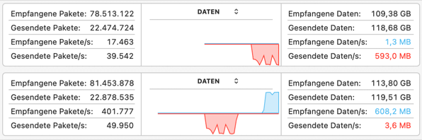

# Quick Preview of ROCK 5 ITX **(Work in progress)**

  
 **Click here for more pictures** 

  
  
  

  

  

  

    

  

  

**Warning:** this (p)review will focus on general hardware/software topics with server/NAS use cases only in mind. So if you're after 'Linux desktop experience', gaming, Android or similar stuff you can stop reading right now :)

   * [Overview](#overview)
   * [Quick performance assessment](#quick-performance-assessment)
   * [I/O capabilities](#io-capabilities)
   * [Display capabilities](#display-capabilities)
   * [Video input capabilities](#video-input-capabilities)
   * [TF card slot and eMMC](#tf-card-slot-and-emmc)
   * [USB-C port](#usb-c-port)
   * [PoE via optional PoE module](#poe-via-optional-poe-module)
   * [SATA power ports](#sata-power-ports)
   * [SATA performance](#sata-performance)
   * [Power button](#power-button)
   * [Network testing](#network-testing)
      + [LanTest with different settings](#lantest-with-different-settings)
      + [`iperf3` testing](#iperf3-testing)
   * [Utilizing Armbian's build framework](#utilizing-armbians-build-framework)
   * [SMB Multichannel](#smb-multichannel)
   * [Analyzing different tunables in NAS setups](#analyzing-different-tunables-in-nas-setups)
      + [Basics](#basics)
      + [cpufreq governor `schedutil`, DMC governor set to `dmc_ondemand` (Armbian defaults with RK3588 today):](#cpufreq-governor-schedutil-dmc-governor-set-to-dmc_ondemand-armbian-defaults-with-rk3588-today)
      + [cpufreq governor `schedutil`, DMC governor set to `performance`:](#cpufreq-governor-schedutil-dmc-governor-set-to-performance)
      + [cpufreq governor `ondemand` with tweaks, DMC governor set to `dmc_ondemand`:](#cpufreq-governor-ondemand-with-tweaks-dmc-governor-set-to-dmc_ondemand)
      + [cpufreq governor `ondemand` with tweaks, DMC governor set to `performance`:](#cpufreq-governor-ondemand-with-tweaks-dmc-governor-set-to-performance)
      + [cpufreq governor and DMC governor set both to `performance` (bad for idle consumption):](#cpufreq-governor-and-dmc-governor-set-both-to-performance-bad-for-idle-consumption)
   * [Open questions](#open-questions)
   * [TODO TK](#todo-tk)

<!-- TOC -->
## Overview

April 2024 Radxa started to send out developer samples of their RK3588 based [Mini-ITX](https://en.wikipedia.org/wiki/Mini-ITX) v1.11 board (for RK3588 basics and some notes about software support status see [Rock 5B](Quick_Preview_of_ROCK_5B.md)). Official documentation will once appear [here](https://docs.radxa.com/en/rock5/rock5itx) and for now you can see a block diagram [there](https://docs.radxa.com/en/assets/images/rock5itx-interface-overview-1266d3c0b4e745372a48a473d78c3cdc.webp).

Pricing has been announced recently and differs only by amount of RAM:

  * 4GB LPDDR5: $99
  * 8GB LPDDR5: $119
  * 16GB LPDDR5: $159
  * 32GB LPDDR5: $239

In the meantime the device is also listed as available at both [Allnet and Arace](https://radxa.com/products/rock5/5itx/#buy)

The board measures 170x170mm in size as it follows the Mini-ITX standard with externally accessible connectors all on the 'back side' accompanied by an appropriate I/O shield. From left to right there's

  * 5.5/2.1 mm centre positive DC-IN: wide input range (voltage range not tested/confirmed yet) but [**important** to use 12V when powering 5.25" HDDs by the board](#sata-power-ports)
  * USB-C with OTG (USB 3.0 / FullSpeed / 5Gbps) and DisplayPort, no powering through this port
  * HDMI IN
  * RJ45 / 2.5GbE provided by RTL8125BG + USB 2.0 behind 4-port Terminus Inc. USB2 hub
  * another RJ45 / 2.5GbE provided by RTL8125BG + USB 2.0 behind same USB2 hub
  * 2 x USB3 5Gbps behind [Genesys Logic GL3523 USB3 hub](https://linux-hardware.org/?id=usb:05e3-0620) and HDMI out (8K capable)
  * 2 x USB3 5Gbps also behind the same GL3523 hub and HDMI out (4K capable, behind a Rockchip RK620-1 / Radxa RA620-1 DisplayPort-to-HDMI converter chip)
  * headphone/mic (via I2S attached [ES8316](http://everest-semi.com/pdf/ES8316%20PB.pdf))
  * [S/PDIF](https://en.wikipedia.org/wiki/S/PDIF)

On the next board side we find the following internal connectors:

  * front panel header (HDD LED, power LED, reset and power button)
  * audio header
  * USB2 header for front panel USB receptacles (two ports also behind same USB2 hub)
  * M.2 key E with PCIe Gen2 x1 or native SATA (switchable via device tree overlay)
  * 3-pin UART header
  * 2-pin recovery button header
  * TF card slot (SDR104 / UHS-I)
  * 2 x MIPI CSI (camera), 1 x MIPI DSI (LCD display)
  * TP (touch panel)
  * eDP (LCD display)
  * M.2 key M slot carrying PCIe Gen3 x2, able to fit 2230, 2242, 2260 and 2280 cards

On the remaining two board sides we find other internal connectors:

  * 4 power ports with 5V/12V for SATA devices
  * 4 x SATA 6Gbps ports (all behind an [ASMedia ASM1164](https://www.asmedia.com.tw/product/17fYQ85SPeqG8MT8/58dYQ8bxZ4UR9wG5) attached to RK3588 via PCIe Gen3 x2)
  * ATX power
  * header for an optional PoE module (already populated on my board)
  * 12V PWN enabled fan header

Other notable onboard components on *my* board include:

  * soldered 32GB "Samsung BJTD4R" HS400 eMMC module (on production boards it will be 8GB instead, not user-accessible and will be hosting [ROOBI OS](https://docs.radxa.com/en/x/roobi) for initial flashing of the real OS)
  * 2 x 32Gb SK Hynix H58G56AK6B LPDDR5 modules for a total of 8GB DRAM
  * Rockchip RK806-1 PMIC
  * 128 Mb Winbond W25X20CL SPI NOR flash
  * a small I2C accessible HYM RTC chip
  * RTC battery holder
  * Maskrom button

<!-- TOC -->
## Quick performance assessment

Rock 5 ITX is one of the first RK3588 devices to be equipped with LPDDR5 modules and since Rockchip's DRAM initialization BLOB clocks LPDDR5 higher than LPDDR4X (5472 MT/s vs. 4224 MT/s) many (me included) thought we see workloads/benchmarks that depend on memory access becoming faster.

<del>Though *at this point in time* at least using [official OS images (b1 build from 2024/04/17 included)](https://github.com/radxa-build/rock-5-itx/releases/) that's not true. Since `sbc-bench` benchmarks DRAM bandwith and latency individually we see that bandwidth has not improved and latency got worse</del>

Rockchip/Radxa [in the meantime confirmed that while bandwidth got partially better latency is worse with LPDDR5 vs. LPDDR4X](https://forum.radxa.com/t/rock-5-in-itx-form-factor/20005/50?u=tkaiser). Let's hope Rockchip can improve settings a bit but for now the advertised performance gain due to LPDDR5 over LPDDR4X seems to be none.

For people trusting into Geekbench (me not) I let an `sbc-bench -G` measure performance (`sbc-bench` taking care of relevant governors set to `performance` and also measuring different CPU clusters individually on hybrid designs):

  * A55 cluster: https://browser.geekbench.com/v6/cpu/compare/5424883?baseline=5768888
  * A76 cluster: https://browser.geekbench.com/v6/cpu/compare/5424972?baseline=5768992

Overall similar performance between (significantly lower clocked) LPDDR4X and LPDDR5 and the same is true with other benchmarks, compare [Radxa-Rock-5B.md](https://github.com/ThomasKaiser/sbc-bench/blob/master/results/reviews/Radxa-Rock-5B.md) with [Radxa-Rock-5-ITX.md](https://github.com/ThomasKaiser/sbc-bench/blob/master/results/reviews/Radxa-Rock-5-ITX.md) for example.

<!-- TOC -->
## I/O capabilities

Many RK3588 I/O options are pinmuxed so the board designer has to decide between PCIe, USB3 and SATA in some cases. For a pinmuxing overview [see here](https://www.cnx-software.com/2021/12/16/rockchip-rk3588-datasheet-sbc-coming-soon/) and for a general RK3588 PCIe overview [see there](https://github.com/ThomasKaiser/Knowledge/blob/master/articles/Quick_Preview_of_ROCK_5B.md#pcie). On this board the seven available PCIe lanes are used as follows:

  * two of the Gen3 lanes are routed to the M.2 key M slot to be used with a SSD or M.2 storage/network adapters
  * the other two Gen3 lanes connect to the [ASM1164 SATA host controller](https://www.asmedia.com.tw/product/17fYQ85SPeqG8MT8/58dYQ8bxZ4UR9wG5) that provides the 4 SATA 6Gbps ports on the board. Talking about bandwidth PCIe Gen3 x2 and 4 x SATA at 6.0 Gbit/s with 8b/10b coding are a pretty close match as such not only four pieces of spinning rust but also fast SATA SSDs should be able to be accessed at full speed in parallel
  * two Gen2 lanes are used to attach the RTL8125BG Ethernet controllers
  * the last Gen2 lane is routed to the M.2 key E slot to be used with PCIe peripherals like a Wi-Fi card or when switched to SATA mode as another (and this time SoC native) SATA port. Making use of SATA requires a passive adapter like Radxa's 'M.2 E Key to SATA Adapter' that unfortunately seems to be sold out everywhere
  * all four USB3 receptacles are behind a GL3523 USB3 hub and as such have to share bandwidth
  * the same goes for the four USB2 ports (two receptables and two on headers) that are behind an USB2 hub
  * The USB-C receptacle defaults to USB3 host mode (bandwidth *not* shared with the other USB3 ports) but can also be switched into OTG mode via a device-tree overlay to access the device via ADB or as an USB gadget.
  * the TF card slot is UHS-I/SDR104 capable
  * the eMMC interface utilizes HS400 mode

  
lspci -vv

    root@rock-5-itx:~# lspci -vv
    0001:10:00.0 PCI bridge: Fuzhou Rockchip Electronics Co., Ltd RK3588 (rev 01) (prog-if 00 [Normal decode])
    	Control: I/O+ Mem+ BusMaster+ SpecCycle- MemWINV- VGASnoop- ParErr- Stepping- SERR+ FastB2B- DisINTx+
    	Status: Cap+ 66MHz- UDF- FastB2B- ParErr- DEVSEL=fast >TAbort- <TAbort- <MAbort- >SERR- <PERR- INTx-
    	Latency: 0
    	Interrupt: pin A routed to IRQ 152
    	Bus: primary=10, secondary=11, subordinate=11, sec-latency=0
    	I/O behind bridge: [disabled]
    	Memory behind bridge: f1200000-f12fffff [size=1M]
    	Prefetchable memory behind bridge: [disabled]
    	Secondary status: 66MHz- FastB2B- ParErr- DEVSEL=fast >TAbort- <TAbort- <MAbort- <SERR- <PERR-
    	Expansion ROM at f1300000 [virtual] [disabled] [size=64K]
    	BridgeCtl: Parity- SERR+ NoISA- VGA- VGA16- MAbort- >Reset- FastB2B-
    		PriDiscTmr- SecDiscTmr- DiscTmrStat- DiscTmrSERREn-
    	Capabilities: [40] Power Management version 3
    		Flags: PMEClk- DSI- D1+ D2+ AuxCurrent=375mA PME(D0+,D1+,D2-,D3hot+,D3cold-)
    		Status: D0 NoSoftRst+ PME-Enable- DSel=0 DScale=0 PME-
    	Capabilities: [50] MSI: Enable+ Count=16/32 Maskable- 64bit+
    		Address: 00000000fe670040  Data: 0000
    	Capabilities: [70] Express (v2) Root Port (Slot-), MSI 08
    		DevCap:	MaxPayload 256 bytes, PhantFunc 0
    			ExtTag- RBE+
    		DevCtl:	CorrErr- NonFatalErr- FatalErr- UnsupReq-
    			RlxdOrd+ ExtTag- PhantFunc- AuxPwr- NoSnoop-
    			MaxPayload 128 bytes, MaxReadReq 512 bytes
    		DevSta:	CorrErr+ NonFatalErr- FatalErr- UnsupReq- AuxPwr- TransPend-
    		LnkCap:	Port #0, Speed 8GT/s, Width x2, ASPM L1, Exit Latency L1 <16us
    			ClockPM- Surprise- LLActRep+ BwNot+ ASPMOptComp+
    		LnkCtl:	ASPM Disabled; RCB 64 bytes, Disabled- CommClk+
    			ExtSynch- ClockPM- AutWidDis- BWInt- AutBWInt-
    		LnkSta:	Speed 8GT/s (ok), Width x2 (ok)
    			TrErr- Train- SlotClk+ DLActive+ BWMgmt+ ABWMgmt+
    		RootCap: CRSVisible+
    		RootCtl: ErrCorrectable- ErrNon-Fatal- ErrFatal- PMEIntEna+ CRSVisible+
    		RootSta: PME ReqID 0000, PMEStatus- PMEPending-
    		DevCap2: Completion Timeout: Not Supported, TimeoutDis+ NROPrPrP+ LTR+
    			 10BitTagComp- 10BitTagReq- OBFF Via message/WAKE#, ExtFmt+ EETLPPrefix+, MaxEETLPPrefixes 1
    			 EmergencyPowerReduction Not Supported, EmergencyPowerReductionInit-
    			 FRS- LN System CLS Not Supported, TPHComp- ExtTPHComp- ARIFwd+
    			 AtomicOpsCap: Routing- 32bit- 64bit- 128bitCAS-
    		DevCtl2: Completion Timeout: 50us to 50ms, TimeoutDis- LTR+ OBFF Disabled, ARIFwd-
    			 AtomicOpsCtl: ReqEn- EgressBlck-
    		LnkCap2: Supported Link Speeds: 2.5-8GT/s, Crosslink- Retimer- 2Retimers- DRS-
    		LnkCtl2: Target Link Speed: 8GT/s, EnterCompliance- SpeedDis-
    			 Transmit Margin: Normal Operating Range, EnterModifiedCompliance- ComplianceSOS-
    			 Compliance De-emphasis: -6dB
    		LnkSta2: Current De-emphasis Level: -6dB, EqualizationComplete+ EqualizationPhase1+
    			 EqualizationPhase2+ EqualizationPhase3+ LinkEqualizationRequest-
    			 Retimer- 2Retimers- CrosslinkRes: unsupported
    	Capabilities: [b0] MSI-X: Enable- Count=128 Masked-
    		Vector table: BAR=4 offset=00020000
    		PBA: BAR=4 offset=00028000
    	Capabilities: [100 v2] Advanced Error Reporting
    		UESta:	DLP- SDES- TLP- FCP- CmpltTO- CmpltAbrt- UnxCmplt- RxOF- MalfTLP- ECRC- UnsupReq- ACSViol-
    		UEMsk:	DLP- SDES- TLP- FCP- CmpltTO- CmpltAbrt- UnxCmplt- RxOF- MalfTLP- ECRC- UnsupReq- ACSViol-
    		UESvrt:	DLP+ SDES+ TLP- FCP+ CmpltTO- CmpltAbrt- UnxCmplt- RxOF+ MalfTLP+ ECRC- UnsupReq- ACSViol-
    		CESta:	RxErr+ BadTLP- BadDLLP+ Rollover- Timeout+ AdvNonFatalErr-
    		CEMsk:	RxErr- BadTLP- BadDLLP- Rollover- Timeout- AdvNonFatalErr+
    		AERCap:	First Error Pointer: 00, ECRCGenCap+ ECRCGenEn- ECRCChkCap+ ECRCChkEn-
    			MultHdrRecCap- MultHdrRecEn- TLPPfxPres- HdrLogCap-
    		HeaderLog: 00000000 00000000 00000000 00000000
    		RootCmd: CERptEn- NFERptEn- FERptEn-
    		RootSta: CERcvd- MultCERcvd- UERcvd- MultUERcvd-
    			 FirstFatal- NonFatalMsg- FatalMsg- IntMsg 9
    		ErrorSrc: ERR_COR: 0000 ERR_FATAL/NONFATAL: 0000
    	Capabilities: [148 v1] Secondary PCI Express
    		LnkCtl3: LnkEquIntrruptEn- PerformEqu-
    		LaneErrStat: LaneErr at lane: 1
    	Capabilities: [180 v1] L1 PM Substates
    		L1SubCap: PCI-PM_L1.2+ PCI-PM_L1.1+ ASPM_L1.2- ASPM_L1.1- L1_PM_Substates+
    			  PortCommonModeRestoreTime=10us PortTPowerOnTime=10us
    		L1SubCtl1: PCI-PM_L1.2- PCI-PM_L1.1- ASPM_L1.2- ASPM_L1.1-
    			   T_CommonMode=10us
    		L1SubCtl2: T_PwrOn=10us
    	Capabilities: [190 v1] Vendor Specific Information: ID=0002 Rev=4 Len=100 <?>
    	Kernel driver in use: pcieport
    
    0001:11:00.0 SATA controller: ASMedia Technology Inc. ASM1164 Serial ATA AHCI Controller (rev 02) (prog-if 01 [AHCI 1.0])
    	Subsystem: ASMedia Technology Inc. Device 2116
    	Control: I/O- Mem+ BusMaster+ SpecCycle- MemWINV- VGASnoop- ParErr- Stepping- SERR- FastB2B- DisINTx+
    	Status: Cap+ 66MHz- UDF- FastB2B- ParErr- DEVSEL=fast >TAbort- <TAbort- <MAbort- >SERR- <PERR- INTx-
    	Latency: 0
    	Interrupt: pin A routed to IRQ 161
    	Region 0: Memory at f1280000 (32-bit, non-prefetchable) [size=8K]
    	Region 5: Memory at f1282000 (32-bit, non-prefetchable) [size=8K]
    	Expansion ROM at f1200000 [virtual] [disabled] [size=512K]
    	Capabilities: [40] Power Management version 3
    		Flags: PMEClk- DSI+ D1- D2- AuxCurrent=0mA PME(D0+,D1-,D2-,D3hot+,D3cold+)
    		Status: D0 NoSoftRst- PME-Enable- DSel=0 DScale=0 PME-
    	Capabilities: [50] MSI: Enable+ Count=1/1 Maskable- 64bit+
    		Address: 00000000fe670040  Data: 0000
    	Capabilities: [80] Express (v2) Endpoint, MSI 00
    		DevCap:	MaxPayload 256 bytes, PhantFunc 0, Latency L0s unlimited, L1 unlimited
    			ExtTag+ AttnBtn- AttnInd- PwrInd- RBE+ FLReset- SlotPowerLimit 0.000W
    		DevCtl:	CorrErr- NonFatalErr- FatalErr- UnsupReq-
    			RlxdOrd+ ExtTag+ PhantFunc- AuxPwr- NoSnoop+
    			MaxPayload 128 bytes, MaxReadReq 256 bytes
    		DevSta:	CorrErr- NonFatalErr- FatalErr- UnsupReq- AuxPwr- TransPend-
    		LnkCap:	Port #0, Speed 8GT/s, Width x2, ASPM L1, Exit Latency L1 <64us
    			ClockPM+ Surprise- LLActRep- BwNot- ASPMOptComp+
    		LnkCtl:	ASPM Disabled; RCB 64 bytes, Disabled- CommClk+
    			ExtSynch- ClockPM- AutWidDis- BWInt- AutBWInt-
    		LnkSta:	Speed 8GT/s (ok), Width x2 (ok)
    			TrErr- Train- SlotClk+ DLActive- BWMgmt- ABWMgmt-
    		DevCap2: Completion Timeout: Not Supported, TimeoutDis- NROPrPrP- LTR-
    			 10BitTagComp- 10BitTagReq- OBFF Not Supported, ExtFmt- EETLPPrefix-
    			 EmergencyPowerReduction Not Supported, EmergencyPowerReductionInit-
    			 FRS- TPHComp- ExtTPHComp-
    			 AtomicOpsCap: 32bit- 64bit- 128bitCAS-
    		DevCtl2: Completion Timeout: 50us to 50ms, TimeoutDis- LTR- OBFF Disabled,
    			 AtomicOpsCtl: ReqEn-
    		LnkCap2: Supported Link Speeds: 2.5-8GT/s, Crosslink- Retimer- 2Retimers- DRS-
    		LnkCtl2: Target Link Speed: 8GT/s, EnterCompliance- SpeedDis+
    			 Transmit Margin: Normal Operating Range, EnterModifiedCompliance- ComplianceSOS-
    			 Compliance De-emphasis: -6dB
    		LnkSta2: Current De-emphasis Level: -6dB, EqualizationComplete+ EqualizationPhase1+
    			 EqualizationPhase2+ EqualizationPhase3+ LinkEqualizationRequest-
    			 Retimer- 2Retimers- CrosslinkRes: unsupported
    	Capabilities: [100 v1] Advanced Error Reporting
    		UESta:	DLP- SDES- TLP- FCP- CmpltTO- CmpltAbrt- UnxCmplt- RxOF- MalfTLP- ECRC- UnsupReq- ACSViol-
    		UEMsk:	DLP- SDES- TLP- FCP- CmpltTO- CmpltAbrt- UnxCmplt- RxOF- MalfTLP- ECRC- UnsupReq- ACSViol-
    		UESvrt:	DLP+ SDES+ TLP- FCP+ CmpltTO- CmpltAbrt- UnxCmplt- RxOF+ MalfTLP+ ECRC- UnsupReq- ACSViol-
    		CESta:	RxErr- BadTLP- BadDLLP- Rollover- Timeout- AdvNonFatalErr-
    		CEMsk:	RxErr- BadTLP- BadDLLP- Rollover- Timeout- AdvNonFatalErr+
    		AERCap:	First Error Pointer: 00, ECRCGenCap- ECRCGenEn- ECRCChkCap- ECRCChkEn-
    			MultHdrRecCap- MultHdrRecEn- TLPPfxPres- HdrLogCap-
    		HeaderLog: 00000000 00000000 00000000 00000000
    	Capabilities: [130 v1] Secondary PCI Express
    		LnkCtl3: LnkEquIntrruptEn- PerformEqu-
    		LaneErrStat: 0
    	Kernel driver in use: ahci
    
    0003:30:00.0 PCI bridge: Fuzhou Rockchip Electronics Co., Ltd RK3588 (rev 01) (prog-if 00 [Normal decode])
    	Control: I/O+ Mem+ BusMaster+ SpecCycle- MemWINV- VGASnoop- ParErr- Stepping- SERR+ FastB2B- DisINTx+
    	Status: Cap+ 66MHz- UDF- FastB2B- ParErr- DEVSEL=fast >TAbort- <TAbort- <MAbort- >SERR- <PERR- INTx-
    	Latency: 0
    	Interrupt: pin A routed to IRQ 140
    	Bus: primary=30, secondary=31, subordinate=31, sec-latency=0
    	I/O behind bridge: 00001000-00001fff [size=4K]
    	Memory behind bridge: f3200000-f32fffff [size=1M]
    	Prefetchable memory behind bridge: [disabled]
    	Secondary status: 66MHz- FastB2B- ParErr- DEVSEL=fast >TAbort- <TAbort- <MAbort- <SERR- <PERR-
    	Expansion ROM at f3300000 [virtual] [disabled] [size=64K]
    	BridgeCtl: Parity- SERR+ NoISA- VGA- VGA16- MAbort- >Reset- FastB2B-
    		PriDiscTmr- SecDiscTmr- DiscTmrStat- DiscTmrSERREn-
    	Capabilities: [40] Power Management version 3
    		Flags: PMEClk- DSI- D1+ D2+ AuxCurrent=375mA PME(D0+,D1+,D2-,D3hot+,D3cold-)
    		Status: D0 NoSoftRst+ PME-Enable- DSel=0 DScale=0 PME-
    	Capabilities: [50] MSI: Enable+ Count=16/32 Maskable- 64bit+
    		Address: 00000000fe650040  Data: 0000
    	Capabilities: [70] Express (v2) Root Port (Slot-), MSI 08
    		DevCap:	MaxPayload 256 bytes, PhantFunc 0
    			ExtTag- RBE+
    		DevCtl:	CorrErr- NonFatalErr- FatalErr- UnsupReq-
    			RlxdOrd+ ExtTag- PhantFunc- AuxPwr- NoSnoop-
    			MaxPayload 128 bytes, MaxReadReq 512 bytes
    		DevSta:	CorrErr- NonFatalErr- FatalErr- UnsupReq- AuxPwr- TransPend-
    		LnkCap:	Port #0, Speed 5GT/s, Width x1, ASPM L1, Exit Latency L1 <16us
    			ClockPM- Surprise- LLActRep+ BwNot+ ASPMOptComp+
    		LnkCtl:	ASPM Disabled; RCB 64 bytes, Disabled- CommClk+
    			ExtSynch- ClockPM- AutWidDis- BWInt- AutBWInt-
    		LnkSta:	Speed 5GT/s (ok), Width x1 (ok)
    			TrErr- Train- SlotClk+ DLActive+ BWMgmt+ ABWMgmt+
    		RootCap: CRSVisible+
    		RootCtl: ErrCorrectable- ErrNon-Fatal- ErrFatal- PMEIntEna+ CRSVisible+
    		RootSta: PME ReqID 0000, PMEStatus- PMEPending-
    		DevCap2: Completion Timeout: Not Supported, TimeoutDis+ NROPrPrP+ LTR+
    			 10BitTagComp- 10BitTagReq- OBFF Via message/WAKE#, ExtFmt+ EETLPPrefix+, MaxEETLPPrefixes 1
    			 EmergencyPowerReduction Not Supported, EmergencyPowerReductionInit-
    			 FRS- LN System CLS Not Supported, TPHComp- ExtTPHComp- ARIFwd+
    			 AtomicOpsCap: Routing- 32bit- 64bit- 128bitCAS-
    		DevCtl2: Completion Timeout: 50us to 50ms, TimeoutDis- LTR+ OBFF Disabled, ARIFwd-
    			 AtomicOpsCtl: ReqEn- EgressBlck-
    		LnkCap2: Supported Link Speeds: 2.5-5GT/s, Crosslink- Retimer- 2Retimers- DRS-
    		LnkCtl2: Target Link Speed: 5GT/s, EnterCompliance- SpeedDis-
    			 Transmit Margin: Normal Operating Range, EnterModifiedCompliance- ComplianceSOS-
    			 Compliance De-emphasis: -6dB
    		LnkSta2: Current De-emphasis Level: -6dB, EqualizationComplete- EqualizationPhase1-
    			 EqualizationPhase2- EqualizationPhase3- LinkEqualizationRequest-
    			 Retimer- 2Retimers- CrosslinkRes: unsupported
    	Capabilities: [b0] MSI-X: Enable- Count=128 Masked-
    		Vector table: BAR=4 offset=00020000
    		PBA: BAR=4 offset=00028000
    	Capabilities: [100 v2] Advanced Error Reporting
    		UESta:	DLP- SDES- TLP- FCP- CmpltTO- CmpltAbrt- UnxCmplt- RxOF- MalfTLP- ECRC- UnsupReq- ACSViol-
    		UEMsk:	DLP- SDES- TLP- FCP- CmpltTO- CmpltAbrt- UnxCmplt- RxOF- MalfTLP- ECRC- UnsupReq- ACSViol-
    		UESvrt:	DLP+ SDES+ TLP- FCP+ CmpltTO- CmpltAbrt- UnxCmplt- RxOF+ MalfTLP+ ECRC- UnsupReq- ACSViol-
    		CESta:	RxErr- BadTLP- BadDLLP- Rollover- Timeout- AdvNonFatalErr-
    		CEMsk:	RxErr- BadTLP- BadDLLP- Rollover- Timeout- AdvNonFatalErr+
    		AERCap:	First Error Pointer: 00, ECRCGenCap+ ECRCGenEn- ECRCChkCap+ ECRCChkEn-
    			MultHdrRecCap- MultHdrRecEn- TLPPfxPres- HdrLogCap-
    		HeaderLog: 00000000 00000000 00000000 00000000
    		RootCmd: CERptEn- NFERptEn- FERptEn-
    		RootSta: CERcvd- MultCERcvd- UERcvd- MultUERcvd-
    			 FirstFatal- NonFatalMsg- FatalMsg- IntMsg 9
    		ErrorSrc: ERR_COR: 0000 ERR_FATAL/NONFATAL: 0000
    	Capabilities: [148 v1] Secondary PCI Express
    		LnkCtl3: LnkEquIntrruptEn- PerformEqu-
    		LaneErrStat: 0
    	Capabilities: [180 v1] L1 PM Substates
    		L1SubCap: PCI-PM_L1.2+ PCI-PM_L1.1+ ASPM_L1.2- ASPM_L1.1- L1_PM_Substates+
    			  PortCommonModeRestoreTime=10us PortTPowerOnTime=10us
    		L1SubCtl1: PCI-PM_L1.2- PCI-PM_L1.1- ASPM_L1.2- ASPM_L1.1-
    			   T_CommonMode=10us
    		L1SubCtl2: T_PwrOn=10us
    	Capabilities: [190 v1] Vendor Specific Information: ID=0002 Rev=4 Len=100 <?>
    	Kernel driver in use: pcieport
    
    0003:31:00.0 Ethernet controller: Realtek Semiconductor Co., Ltd. RTL8125 2.5GbE Controller (rev 05)
    	Subsystem: Realtek Semiconductor Co., Ltd. RTL8125 2.5GbE Controller
    	Control: I/O+ Mem+ BusMaster+ SpecCycle- MemWINV- VGASnoop- ParErr- Stepping- SERR- FastB2B- DisINTx+
    	Status: Cap+ 66MHz- UDF- FastB2B- ParErr- DEVSEL=fast >TAbort- <TAbort- <MAbort- >SERR- <PERR- INTx-
    	Latency: 0, Cache Line Size: 64 bytes
    	Interrupt: pin A routed to IRQ 139
    	Region 0: I/O ports at 1000 [size=256]
    	Region 2: Memory at f3200000 (64-bit, non-prefetchable) [size=64K]
    	Region 4: Memory at f3210000 (64-bit, non-prefetchable) [size=16K]
    	Capabilities: [40] Power Management version 3
    		Flags: PMEClk- DSI- D1+ D2+ AuxCurrent=375mA PME(D0+,D1+,D2+,D3hot+,D3cold+)
    		Status: D0 NoSoftRst+ PME-Enable- DSel=0 DScale=0 PME-
    	Capabilities: [50] MSI: Enable- Count=1/1 Maskable+ 64bit+
    		Address: 0000000000000000  Data: 0000
    		Masking: 00000000  Pending: 00000000
    	Capabilities: [70] Express (v2) Endpoint, MSI 01
    		DevCap:	MaxPayload 256 bytes, PhantFunc 0, Latency L0s <512ns, L1 <64us
    			ExtTag- AttnBtn- AttnInd- PwrInd- RBE+ FLReset- SlotPowerLimit 0.000W
    		DevCtl:	CorrErr- NonFatalErr- FatalErr- UnsupReq-
    			RlxdOrd+ ExtTag- PhantFunc- AuxPwr- NoSnoop-
    			MaxPayload 128 bytes, MaxReadReq 4096 bytes
    		DevSta:	CorrErr- NonFatalErr- FatalErr- UnsupReq- AuxPwr+ TransPend-
    		LnkCap:	Port #0, Speed 5GT/s, Width x1, ASPM L0s L1, Exit Latency L0s unlimited, L1 <64us
    			ClockPM+ Surprise- LLActRep- BwNot- ASPMOptComp+
    		LnkCtl:	ASPM Disabled; RCB 64 bytes, Disabled- CommClk+
    			ExtSynch- ClockPM- AutWidDis- BWInt- AutBWInt-
    		LnkSta:	Speed 5GT/s (ok), Width x1 (ok)
    			TrErr- Train- SlotClk+ DLActive- BWMgmt- ABWMgmt-
    		DevCap2: Completion Timeout: Range ABCD, TimeoutDis+ NROPrPrP- LTR+
    			 10BitTagComp- 10BitTagReq- OBFF Via message/WAKE#, ExtFmt- EETLPPrefix-
    			 EmergencyPowerReduction Not Supported, EmergencyPowerReductionInit-
    			 FRS- TPHComp+ ExtTPHComp-
    			 AtomicOpsCap: 32bit- 64bit- 128bitCAS-
    		DevCtl2: Completion Timeout: 50us to 50ms, TimeoutDis- LTR+ OBFF Disabled,
    			 AtomicOpsCtl: ReqEn-
    		LnkCap2: Supported Link Speeds: 2.5-5GT/s, Crosslink- Retimer- 2Retimers- DRS-
    		LnkCtl2: Target Link Speed: 5GT/s, EnterCompliance- SpeedDis-
    			 Transmit Margin: Normal Operating Range, EnterModifiedCompliance- ComplianceSOS-
    			 Compliance De-emphasis: -6dB
    		LnkSta2: Current De-emphasis Level: -6dB, EqualizationComplete- EqualizationPhase1-
    			 EqualizationPhase2- EqualizationPhase3- LinkEqualizationRequest-
    			 Retimer- 2Retimers- CrosslinkRes: unsupported
    	Capabilities: [b0] MSI-X: Enable+ Count=32 Masked-
    		Vector table: BAR=4 offset=00000000
    		PBA: BAR=4 offset=00000800
    	Capabilities: [d0] Vital Product Data
    pcilib: sysfs_read_vpd: read failed: Input/output error
    		Not readable
    	Capabilities: [100 v2] Advanced Error Reporting
    		UESta:	DLP- SDES- TLP- FCP- CmpltTO- CmpltAbrt- UnxCmplt- RxOF- MalfTLP- ECRC- UnsupReq- ACSViol-
    		UEMsk:	DLP- SDES- TLP- FCP- CmpltTO- CmpltAbrt- UnxCmplt- RxOF- MalfTLP- ECRC- UnsupReq+ ACSViol-
    		UESvrt:	DLP+ SDES+ TLP- FCP+ CmpltTO- CmpltAbrt- UnxCmplt- RxOF+ MalfTLP+ ECRC- UnsupReq- ACSViol-
    		CESta:	RxErr- BadTLP- BadDLLP- Rollover- Timeout- AdvNonFatalErr-
    		CEMsk:	RxErr- BadTLP- BadDLLP- Rollover- Timeout- AdvNonFatalErr+
    		AERCap:	First Error Pointer: 00, ECRCGenCap+ ECRCGenEn- ECRCChkCap+ ECRCChkEn-
    			MultHdrRecCap- MultHdrRecEn- TLPPfxPres- HdrLogCap-
    		HeaderLog: 00000000 00000000 00000000 00000000
    	Capabilities: [148 v1] Virtual Channel
    		Caps:	LPEVC=0 RefClk=100ns PATEntryBits=1
    		Arb:	Fixed- WRR32- WRR64- WRR128-
    		Ctrl:	ArbSelect=Fixed
    		Status:	InProgress-
    		VC0:	Caps:	PATOffset=00 MaxTimeSlots=1 RejSnoopTrans-
    			Arb:	Fixed- WRR32- WRR64- WRR128- TWRR128- WRR256-
    			Ctrl:	Enable+ ID=0 ArbSelect=Fixed TC/VC=ff
    			Status:	NegoPending- InProgress-
    	Capabilities: [168 v1] Device Serial Number 02-00-00-00-68-4c-e0-00
    	Capabilities: [178 v1] Transaction Processing Hints
    		No steering table available
    	Capabilities: [204 v1] Latency Tolerance Reporting
    		Max snoop latency: 0ns
    		Max no snoop latency: 0ns
    	Capabilities: [20c v1] L1 PM Substates
    		L1SubCap: PCI-PM_L1.2+ PCI-PM_L1.1+ ASPM_L1.2+ ASPM_L1.1+ L1_PM_Substates+
    			  PortCommonModeRestoreTime=150us PortTPowerOnTime=150us
    		L1SubCtl1: PCI-PM_L1.2- PCI-PM_L1.1- ASPM_L1.2- ASPM_L1.1-
    			   T_CommonMode=0us LTR1.2_Threshold=0ns
    		L1SubCtl2: T_PwrOn=10us
    	Capabilities: [21c v1] Vendor Specific Information: ID=0002 Rev=4 Len=100 <?>
    	Kernel driver in use: r8125
    	Kernel modules: r8125
    
    0004:40:00.0 PCI bridge: Fuzhou Rockchip Electronics Co., Ltd RK3588 (rev 01) (prog-if 00 [Normal decode])
    	Control: I/O+ Mem+ BusMaster+ SpecCycle- MemWINV- VGASnoop- ParErr- Stepping- SERR+ FastB2B- DisINTx+
    	Status: Cap+ 66MHz- UDF- FastB2B- ParErr- DEVSEL=fast >TAbort- <TAbort- <MAbort- >SERR- <PERR- INTx-
    	Latency: 0
    	Interrupt: pin A routed to IRQ 163
    	Bus: primary=40, secondary=41, subordinate=41, sec-latency=0
    	I/O behind bridge: 00000000-00000fff [size=4K]
    	Memory behind bridge: f4200000-f42fffff [size=1M]
    	Prefetchable memory behind bridge: [disabled]
    	Secondary status: 66MHz- FastB2B- ParErr- DEVSEL=fast >TAbort- <TAbort- <MAbort- <SERR- <PERR-
    	Expansion ROM at f4300000 [virtual] [disabled] [size=64K]
    	BridgeCtl: Parity- SERR+ NoISA- VGA- VGA16- MAbort- >Reset- FastB2B-
    		PriDiscTmr- SecDiscTmr- DiscTmrStat- DiscTmrSERREn-
    	Capabilities: [40] Power Management version 3
    		Flags: PMEClk- DSI- D1+ D2+ AuxCurrent=375mA PME(D0+,D1+,D2-,D3hot+,D3cold-)
    		Status: D0 NoSoftRst+ PME-Enable- DSel=0 DScale=0 PME-
    	Capabilities: [50] MSI: Enable+ Count=16/32 Maskable- 64bit+
    		Address: 00000000fe650040  Data: 0000
    	Capabilities: [70] Express (v2) Root Port (Slot-), MSI 08
    		DevCap:	MaxPayload 256 bytes, PhantFunc 0
    			ExtTag- RBE+
    		DevCtl:	CorrErr- NonFatalErr- FatalErr- UnsupReq-
    			RlxdOrd+ ExtTag- PhantFunc- AuxPwr- NoSnoop-
    			MaxPayload 128 bytes, MaxReadReq 512 bytes
    		DevSta:	CorrErr- NonFatalErr- FatalErr- UnsupReq- AuxPwr- TransPend-
    		LnkCap:	Port #0, Speed 5GT/s, Width x1, ASPM L1, Exit Latency L1 <16us
    			ClockPM- Surprise- LLActRep+ BwNot+ ASPMOptComp+
    		LnkCtl:	ASPM Disabled; RCB 64 bytes, Disabled- CommClk+
    			ExtSynch- ClockPM- AutWidDis- BWInt- AutBWInt-
    		LnkSta:	Speed 5GT/s (ok), Width x1 (ok)
    			TrErr- Train- SlotClk+ DLActive+ BWMgmt+ ABWMgmt+
    		RootCap: CRSVisible+
    		RootCtl: ErrCorrectable- ErrNon-Fatal- ErrFatal- PMEIntEna+ CRSVisible+
    		RootSta: PME ReqID 0000, PMEStatus- PMEPending-
    		DevCap2: Completion Timeout: Not Supported, TimeoutDis+ NROPrPrP+ LTR+
    			 10BitTagComp- 10BitTagReq- OBFF Via message/WAKE#, ExtFmt+ EETLPPrefix+, MaxEETLPPrefixes 1
    			 EmergencyPowerReduction Not Supported, EmergencyPowerReductionInit-
    			 FRS- LN System CLS Not Supported, TPHComp- ExtTPHComp- ARIFwd+
    			 AtomicOpsCap: Routing- 32bit- 64bit- 128bitCAS-
    		DevCtl2: Completion Timeout: 50us to 50ms, TimeoutDis- LTR+ OBFF Disabled, ARIFwd-
    			 AtomicOpsCtl: ReqEn- EgressBlck-
    		LnkCap2: Supported Link Speeds: 2.5-5GT/s, Crosslink- Retimer- 2Retimers- DRS-
    		LnkCtl2: Target Link Speed: 5GT/s, EnterCompliance- SpeedDis-
    			 Transmit Margin: Normal Operating Range, EnterModifiedCompliance- ComplianceSOS-
    			 Compliance De-emphasis: -6dB
    		LnkSta2: Current De-emphasis Level: -6dB, EqualizationComplete- EqualizationPhase1-
    			 EqualizationPhase2- EqualizationPhase3- LinkEqualizationRequest-
    			 Retimer- 2Retimers- CrosslinkRes: unsupported
    	Capabilities: [b0] MSI-X: Enable- Count=128 Masked-
    		Vector table: BAR=4 offset=00020000
    		PBA: BAR=4 offset=00028000
    	Capabilities: [100 v2] Advanced Error Reporting
    		UESta:	DLP- SDES- TLP- FCP- CmpltTO- CmpltAbrt- UnxCmplt- RxOF- MalfTLP- ECRC- UnsupReq- ACSViol-
    		UEMsk:	DLP- SDES- TLP- FCP- CmpltTO- CmpltAbrt- UnxCmplt- RxOF- MalfTLP- ECRC- UnsupReq- ACSViol-
    		UESvrt:	DLP+ SDES+ TLP- FCP+ CmpltTO- CmpltAbrt- UnxCmplt- RxOF+ MalfTLP+ ECRC- UnsupReq- ACSViol-
    		CESta:	RxErr- BadTLP- BadDLLP- Rollover- Timeout- AdvNonFatalErr-
    		CEMsk:	RxErr- BadTLP- BadDLLP- Rollover- Timeout- AdvNonFatalErr+
    		AERCap:	First Error Pointer: 00, ECRCGenCap+ ECRCGenEn- ECRCChkCap+ ECRCChkEn-
    			MultHdrRecCap- MultHdrRecEn- TLPPfxPres- HdrLogCap-
    		HeaderLog: 00000000 00000000 00000000 00000000
    		RootCmd: CERptEn- NFERptEn- FERptEn-
    		RootSta: CERcvd- MultCERcvd- UERcvd- MultUERcvd-
    			 FirstFatal- NonFatalMsg- FatalMsg- IntMsg 9
    		ErrorSrc: ERR_COR: 0000 ERR_FATAL/NONFATAL: 0000
    	Capabilities: [148 v1] Secondary PCI Express
    		LnkCtl3: LnkEquIntrruptEn- PerformEqu-
    		LaneErrStat: 0
    	Capabilities: [180 v1] L1 PM Substates
    		L1SubCap: PCI-PM_L1.2+ PCI-PM_L1.1+ ASPM_L1.2- ASPM_L1.1- L1_PM_Substates+
    			  PortCommonModeRestoreTime=10us PortTPowerOnTime=10us
    		L1SubCtl1: PCI-PM_L1.2- PCI-PM_L1.1- ASPM_L1.2- ASPM_L1.1-
    			   T_CommonMode=10us
    		L1SubCtl2: T_PwrOn=10us
    	Capabilities: [190 v1] Vendor Specific Information: ID=0002 Rev=4 Len=100 <?>
    	Kernel driver in use: pcieport
    
    0004:41:00.0 Ethernet controller: Realtek Semiconductor Co., Ltd. RTL8125 2.5GbE Controller (rev 05)
    	Subsystem: Realtek Semiconductor Co., Ltd. RTL8125 2.5GbE Controller
    	Control: I/O+ Mem+ BusMaster+ SpecCycle- MemWINV- VGASnoop- ParErr- Stepping- SERR- FastB2B- DisINTx+
    	Status: Cap+ 66MHz- UDF- FastB2B- ParErr- DEVSEL=fast >TAbort- <TAbort- <MAbort- >SERR- <PERR- INTx-
    	Latency: 0, Cache Line Size: 64 bytes
    	Interrupt: pin A routed to IRQ 162
    	Region 0: I/O ports at 400000 [size=256]
    	Region 2: Memory at f4200000 (64-bit, non-prefetchable) [size=64K]
    	Region 4: Memory at f4210000 (64-bit, non-prefetchable) [size=16K]
    	Capabilities: [40] Power Management version 3
    		Flags: PMEClk- DSI- D1+ D2+ AuxCurrent=375mA PME(D0+,D1+,D2+,D3hot+,D3cold+)
    		Status: D0 NoSoftRst+ PME-Enable- DSel=0 DScale=0 PME-
    	Capabilities: [50] MSI: Enable- Count=1/1 Maskable+ 64bit+
    		Address: 0000000000000000  Data: 0000
    		Masking: 00000000  Pending: 00000000
    	Capabilities: [70] Express (v2) Endpoint, MSI 01
    		DevCap:	MaxPayload 256 bytes, PhantFunc 0, Latency L0s <512ns, L1 <64us
    			ExtTag- AttnBtn- AttnInd- PwrInd- RBE+ FLReset- SlotPowerLimit 0.000W
    		DevCtl:	CorrErr- NonFatalErr- FatalErr- UnsupReq-
    			RlxdOrd+ ExtTag- PhantFunc- AuxPwr- NoSnoop-
    			MaxPayload 128 bytes, MaxReadReq 4096 bytes
    		DevSta:	CorrErr- NonFatalErr- FatalErr- UnsupReq- AuxPwr+ TransPend-
    		LnkCap:	Port #0, Speed 5GT/s, Width x1, ASPM L0s L1, Exit Latency L0s unlimited, L1 <64us
    			ClockPM+ Surprise- LLActRep- BwNot- ASPMOptComp+
    		LnkCtl:	ASPM Disabled; RCB 64 bytes, Disabled- CommClk+
    			ExtSynch- ClockPM- AutWidDis- BWInt- AutBWInt-
    		LnkSta:	Speed 5GT/s (ok), Width x1 (ok)
    			TrErr- Train- SlotClk+ DLActive- BWMgmt- ABWMgmt-
    		DevCap2: Completion Timeout: Range ABCD, TimeoutDis+ NROPrPrP- LTR+
    			 10BitTagComp- 10BitTagReq- OBFF Via message/WAKE#, ExtFmt- EETLPPrefix-
    			 EmergencyPowerReduction Not Supported, EmergencyPowerReductionInit-
    			 FRS- TPHComp+ ExtTPHComp-
    			 AtomicOpsCap: 32bit- 64bit- 128bitCAS-
    		DevCtl2: Completion Timeout: 50us to 50ms, TimeoutDis- LTR+ OBFF Disabled,
    			 AtomicOpsCtl: ReqEn-
    		LnkCap2: Supported Link Speeds: 2.5-5GT/s, Crosslink- Retimer- 2Retimers- DRS-
    		LnkCtl2: Target Link Speed: 5GT/s, EnterCompliance- SpeedDis-
    			 Transmit Margin: Normal Operating Range, EnterModifiedCompliance- ComplianceSOS-
    			 Compliance De-emphasis: -6dB
    		LnkSta2: Current De-emphasis Level: -6dB, EqualizationComplete- EqualizationPhase1-
    			 EqualizationPhase2- EqualizationPhase3- LinkEqualizationRequest-
    			 Retimer- 2Retimers- CrosslinkRes: unsupported
    	Capabilities: [b0] MSI-X: Enable+ Count=32 Masked-
    		Vector table: BAR=4 offset=00000000
    		PBA: BAR=4 offset=00000800
    	Capabilities: [d0] Vital Product Data
    pcilib: sysfs_read_vpd: read failed: Input/output error
    		Not readable
    	Capabilities: [100 v2] Advanced Error Reporting
    		UESta:	DLP- SDES- TLP- FCP- CmpltTO- CmpltAbrt- UnxCmplt- RxOF- MalfTLP- ECRC- UnsupReq- ACSViol-
    		UEMsk:	DLP- SDES- TLP- FCP- CmpltTO- CmpltAbrt- UnxCmplt- RxOF- MalfTLP- ECRC- UnsupReq+ ACSViol-
    		UESvrt:	DLP+ SDES+ TLP- FCP+ CmpltTO- CmpltAbrt- UnxCmplt- RxOF+ MalfTLP+ ECRC- UnsupReq- ACSViol-
    		CESta:	RxErr- BadTLP- BadDLLP- Rollover- Timeout- AdvNonFatalErr-
    		CEMsk:	RxErr- BadTLP- BadDLLP- Rollover- Timeout- AdvNonFatalErr+
    		AERCap:	First Error Pointer: 00, ECRCGenCap+ ECRCGenEn- ECRCChkCap+ ECRCChkEn-
    			MultHdrRecCap- MultHdrRecEn- TLPPfxPres- HdrLogCap-
    		HeaderLog: 00000000 00000000 00000000 00000000
    	Capabilities: [148 v1] Virtual Channel
    		Caps:	LPEVC=0 RefClk=100ns PATEntryBits=1
    		Arb:	Fixed- WRR32- WRR64- WRR128-
    		Ctrl:	ArbSelect=Fixed
    		Status:	InProgress-
    		VC0:	Caps:	PATOffset=00 MaxTimeSlots=1 RejSnoopTrans-
    			Arb:	Fixed- WRR32- WRR64- WRR128- TWRR128- WRR256-
    			Ctrl:	Enable+ ID=0 ArbSelect=Fixed TC/VC=ff
    			Status:	NegoPending- InProgress-
    	Capabilities: [168 v1] Device Serial Number 02-00-00-00-68-4c-e0-00
    	Capabilities: [178 v1] Transaction Processing Hints
    		No steering table available
    	Capabilities: [204 v1] Latency Tolerance Reporting
    		Max snoop latency: 0ns
    		Max no snoop latency: 0ns
    	Capabilities: [20c v1] L1 PM Substates
    		L1SubCap: PCI-PM_L1.2+ PCI-PM_L1.1+ ASPM_L1.2+ ASPM_L1.1+ L1_PM_Substates+
    			  PortCommonModeRestoreTime=150us PortTPowerOnTime=150us
    		L1SubCtl1: PCI-PM_L1.2- PCI-PM_L1.1- ASPM_L1.2- ASPM_L1.1-
    			   T_CommonMode=0us LTR1.2_Threshold=0ns
    		L1SubCtl2: T_PwrOn=10us
    	Capabilities: [21c v1] Vendor Specific Information: ID=0002 Rev=4 Len=100 <?>
    	Kernel driver in use: r8125
    	Kernel modules: r8125

  
lsusb with all seven USB receptacles occupied by storage devices

    root@rock-5-itx:~# lsusb
    Bus 008 Device 002: ID 2109:0715 VIA Labs, Inc. VL817 SATA Adaptor
    Bus 008 Device 001: ID 1d6b:0003 Linux Foundation 3.0 root hub
    Bus 006 Device 003: ID 174c:55aa ASMedia Technology Inc. ASM1051E SATA 6Gb/s bridge, ASM1053E SATA 6Gb/s bridge, ASM1153 SATA 3Gb/s bridge, ASM1153E SATA 6Gb/s bridge
    Bus 006 Device 007: ID 174c:55aa ASMedia Technology Inc. ASM1051E SATA 6Gb/s bridge, ASM1053E SATA 6Gb/s bridge, ASM1153 SATA 3Gb/s bridge, ASM1153E SATA 6Gb/s bridge
    Bus 006 Device 006: ID 152d:3562 JMicron Technology Corp. / JMicron USA Technology Corp. JMS567 SATA 6Gb/s bridge
    Bus 006 Device 005: ID 0781:5583 SanDisk Corp. Ultra Fit
    Bus 006 Device 002: ID 05e3:0620 Genesys Logic, Inc. USB3.2 Hub
    Bus 006 Device 001: ID 1d6b:0003 Linux Foundation 3.0 root hub
    Bus 005 Device 002: ID 05e3:0610 Genesys Logic, Inc. Hub
    Bus 005 Device 001: ID 1d6b:0002 Linux Foundation 2.0 root hub
    Bus 004 Device 001: ID 1d6b:0001 Linux Foundation 1.1 root hub
    Bus 002 Device 002: ID 0781:5590 SanDisk Corp. Ultra Dual
    Bus 002 Device 001: ID 1d6b:0002 Linux Foundation 2.0 root hub
    Bus 003 Device 001: ID 1d6b:0001 Linux Foundation 1.1 root hub
    Bus 001 Device 005: ID 0781:5566 SanDisk Corp. Cruzer Slice
    Bus 001 Device 002: ID 1a40:0101 Terminus Technology Inc. Hub
    Bus 001 Device 001: ID 1d6b:0002 Linux Foundation 2.0 root hub
    
    root@rock-5-itx:~# lsusb -t
    /:  Bus 08.Port 1: Dev 1, Class=root_hub, Driver=xhci-hcd/1p, 5000M
    |__ Port 1: Dev 2, If 0, Class=Mass Storage, Driver=uas, 5000M
    /:  Bus 06.Port 1: Dev 1, Class=root_hub, Driver=xhci-hcd/1p, 5000M
        |__ Port 1: Dev 2, If 0, Class=Hub, Driver=hub/4p, 5000M
            |__ Port 1: Dev 5, If 0, Class=Mass Storage, Driver=usb-storage, 5000M
            |__ Port 2: Dev 6, If 0, Class=Mass Storage, Driver=uas, 5000M
            |__ Port 3: Dev 7, If 0, Class=Mass Storage, Driver=usb-storage, 5000M
            |__ Port 4: Dev 3, If 0, Class=Mass Storage, Driver=uas, 5000M
    /:  Bus 05.Port 1: Dev 1, Class=root_hub, Driver=xhci-hcd/1p, 480M
        |__ Port 1: Dev 2, If 0, Class=Hub, Driver=hub/4p, 480M
    /:  Bus 04.Port 1: Dev 1, Class=root_hub, Driver=ohci-platform/1p, 12M
    /:  Bus 03.Port 1: Dev 1, Class=root_hub, Driver=ohci-platform/1p, 12M
    /:  Bus 02.Port 1: Dev 1, Class=root_hub, Driver=ehci-platform/1p, 480M
        |__ Port 1: Dev 2, If 0, Class=Mass Storage, Driver=usb-storage, 480M
    /:  Bus 01.Port 1: Dev 1, Class=root_hub, Driver=ehci-platform/1p, 480M
        |__ Port 1: Dev 2, If 0, Class=Hub, Driver=hub/4p, 480M
            |__ Port 4: Dev 5, If 0, Class=Mass Storage, Driver=usb-storage, 480M
    
    root@rock-5-itx:~# sbc-bench.sh -S
      * 111.8GB "Samsung SSD 750 EVO 120GB" SSD as /dev/sda [SATA 3.1, 6.0 Gb/s (current: 6.0 Gb/s)]: behind ASMedia SATA 6Gb/s bridge (174c:55aa), 3% worn out, Driver=uas, 5Gbps (capable of 12Mbps, 480Mbps, 5Gbps), drive temp: 26°C
      * 111.8GB "Samsung SSD 840 EVO 120GB" SSD as /dev/sdb [SATA 3.1, 6.0 Gb/s (current: 6.0 Gb/s)]: behind JMicron JMS567 SATA 6Gb/s bridge (152d:3562), 3% worn out, Driver=uas, 5Gbps (capable of 12Mbps, 480Mbps, 5Gbps), drive temp: 25°C
      * 115.7GB "SanDisk Corp. Ultra Fit" as /dev/sdc: USB, Driver=usb-storage, 5Gbps (capable of 12Mbps, 480Mbps, 5Gbps)
      * 7.3TB "TOSHIBA HDWF180" HDD as /dev/sdd [SATA 3.3, 6.0 Gb/s (current: 6.0 Gb/s)]: behind ASMedia SATA 6Gb/s bridge (174c:55aa), Driver=usb-storage, 5Gbps (capable of 12Mbps, 480Mbps, 5Gbps), drive temp: 21°C
      * 115.7GB "SanDisk Corp. Ultra Dual" as /dev/sde: USB, Driver=usb-storage, 480Mbps (capable of 12Mbps, 480Mbps, 5Gbps)
      * 7.5GB "SanDisk Corp. Cruzer Slice" as /dev/sdf: USB, Driver=usb-storage, 480Mbps
      * 111.8GB "Samsung SSD 840 EVO 120GB" SSD as /dev/sdg [SATA 3.1, 6.0 Gb/s (current: 6.0 Gb/s)]: behind VIA Labs VL715/VL716 SATA 6Gb/s bridge (2109:0715), 5% worn out, Driver=uas, 5Gbps (capable of 12Mbps, 480Mbps, 5Gbps, 10Gb/s Symmetric RX SuperSpeedPlus, 10Gb/s Symmetric TX SuperSpeedPlus), drive temp: 23°C

<!-- TOC -->
## Display capabilities

Disclaimer: not my area since I usually operate SBC headless as such just a quick list copy&pasted from Radxa:

  * DisplayPort Alt mode available at the USB-C port (4Kp60)
  * HDMI 8Kp60 available native by the SoC
  * HDMI 4K available via Radxa RA620-1 DisplayPort-to-HDMI converter 
  * eDP FPC connector for 4Kp60 LCD panel
  * up to 2 x four-lane MIPI DSI connectors

Six displays in total but according to Radxa only four can be used concurrently.

<!-- TOC -->
## Video input capabilities

  * HDMI up to 4Kp60
  * up to 2 x four-lane MIPI CSI connectors (switching between CSI and DSI can be done by a device-tree overlay)

<!-- TOC -->
## TF card slot and eMMC

`sbc-bench -S` reports the two SDIO attached MMC storage types as follows:

  * 238.8GB "Samsung EE4S5" UHS SDR104 SDXC card as /dev/mmcblk1: date 05/2023, manfid/oemid: 0x00001b/0x534d, hw/fw rev: 0x3/0x0
  * 29.1GB "Samsung BJTD4R" HS400 Enhanced strobe eMMC card as /dev/mmcblk0: date 09/2023, manfid/oemid: 0x000015/0x0100, hw/fw rev: 0x0/0x0300000000000000

The TF card implementation is SDR104 / UHS-I capable so let's benchmark my 256GB Samsung EVO Plus A2 card in the slot using `iozone -e -I -a -s 100M -r 4k -r 16384k -i 0 -i 1 -i 2`:

                                                              random    random
              kB  reclen    write  rewrite    read    reread    read     write
          102400       4     2738     2762    12852    12789    10197     2776
          102400   16384    65483    65060    88313    88555    88551    64214

Results confirm SDR104 / UHS-I with 65/88 MB/s write/read since most probably the TF card is the bottleneck here so the theoretical 104 MB/s can't be reached but the 50MB/s SDR50 mode would provide are clearly exceeded.

The 32GB eMMC on the dev sample is empty but according to Radxa's cardboard box that will change when Rock 5 ITX can be bought since 'On board eMMC for ROOBI OS' is printed on the retail package. As such the board will boot up from the prepopulated eMMC and provide a way for an OS to be installed from the Internet.

For now let's check the perforance of the eMMC module again with `iozone -e -I -a -s 100M -r 4k -r 16384k -i 0 -i 1 -i 2` on an ext4 partition:

                                                              random    random
              kB  reclen    write  rewrite    read    reread    read     write
          102400       4    26175    35219    25977    25981    25705    34631
          102400   16384   108049   108512   294709   295442   295918   108310

Great random IOPS at 4K and 100/300 MB/s at sequential transfer speeds. Both nice and irrelevant since production boards ship with an 8GB module that is not user-accessible by default and will only be used to boot into ROOBI OS.

<!-- TOC -->
## USB-C port

This connector is not meant for powering but provides only DisplayPort and USB3 OTG or host. The latter is the default with Radxa's OS images as such I connected a Samsung EVO 840 in an USB3 disk enclosure and measured via `iozone -e -I -a -s 500M -r 4k -r 16384k -i 0 -i 1 -i 2`:

                                                              random    random
              kB  reclen    write  rewrite    read    reread    read     write
          512000       4    21340    28102    22988    22459    13014    22292
          512000   16384   385996   365681   386597   386635   386580   385638

385 MB/s at 16M blocksize are OK since this benchmark was on a btrfs filesystem (with a bit more overhead due to copy-on-write).

To confirm the USB-C port *not* having to share bandwidth with the four USB3-A receptacles I set up an `/dev/md0` as raid0 with another EVO 750, formatted it with ext4 and let again an `iozone -e -I -a -s 500M -r 4k -r 16384k -i 0 -i 1 -i 2` run:

                                                              random    random
              kB  reclen    write  rewrite    read    reread    read     write
          512000       4    23749    31631    32728    32618    16693    31494
          512000   16384   747561   747706   735573   739497   728055   745962

Results as expected (sequential bandwidth almost doubled, 4K random IOPS also improved)

  
lsusb / sbc-bench -S / mdadm --detail

    root@rock-5-itx:/home/radxa# lsusb
    Bus 006 Device 003: ID 174c:55aa ASMedia Technology Inc. ASM1051E SATA 6Gb/s bridge, ASM1053E SATA 6Gb/s bridge, ASM1153 SATA 3Gb/s bridge, ASM1153E SATA 6Gb/s bridge
    Bus 006 Device 002: ID 05e3:0620 Genesys Logic, Inc. USB3.2 Hub
    Bus 006 Device 001: ID 1d6b:0003 Linux Foundation 3.0 root hub
    Bus 005 Device 002: ID 05e3:0610 Genesys Logic, Inc. Hub
    Bus 005 Device 001: ID 1d6b:0002 Linux Foundation 2.0 root hub
    Bus 008 Device 002: ID 2109:0715 VIA Labs, Inc. VL817 SATA Adaptor
    Bus 008 Device 001: ID 1d6b:0003 Linux Foundation 3.0 root hub
    Bus 007 Device 001: ID 1d6b:0002 Linux Foundation 2.0 root hub
    Bus 004 Device 001: ID 1d6b:0001 Linux Foundation 1.1 root hub
    Bus 002 Device 001: ID 1d6b:0002 Linux Foundation 2.0 root hub
    Bus 003 Device 001: ID 1d6b:0001 Linux Foundation 1.1 root hub
    Bus 001 Device 002: ID 1a40:0101 Terminus Technology Inc. Hub
    Bus 001 Device 001: ID 1d6b:0002 Linux Foundation 2.0 root hub
    
    root@rock-5-itx:/home/radxa# lsusb -t
    /:  Bus 08.Port 1: Dev 1, Class=root_hub, Driver=xhci-hcd/1p, 5000M
        |__ Port 1: Dev 2, If 0, Class=Mass Storage, Driver=uas, 5000M
    /:  Bus 07.Port 1: Dev 1, Class=root_hub, Driver=xhci-hcd/1p, 480M
    /:  Bus 06.Port 1: Dev 1, Class=root_hub, Driver=xhci-hcd/1p, 5000M
        |__ Port 1: Dev 2, If 0, Class=Hub, Driver=hub/4p, 5000M
            |__ Port 3: Dev 3, If 0, Class=Mass Storage, Driver=uas, 5000M
    /:  Bus 05.Port 1: Dev 1, Class=root_hub, Driver=xhci-hcd/1p, 480M
        |__ Port 1: Dev 2, If 0, Class=Hub, Driver=hub/4p, 480M
    /:  Bus 04.Port 1: Dev 1, Class=root_hub, Driver=ohci-platform/1p, 12M
    /:  Bus 03.Port 1: Dev 1, Class=root_hub, Driver=ohci-platform/1p, 12M
    /:  Bus 02.Port 1: Dev 1, Class=root_hub, Driver=ehci-platform/1p, 480M
    /:  Bus 01.Port 1: Dev 1, Class=root_hub, Driver=ehci-platform/1p, 480M
        |__ Port 1: Dev 2, If 0, Class=Hub, Driver=hub/4p, 480M
    
    root@rock-5-itx:/home/radxa# sbc-bench.sh -S
      * 111.8GB "Samsung SSD 750 EVO 120GB" SSD as /dev/sda [SATA 3.1, 6.0 Gb/s (current: 6.0 Gb/s)]: behind ASMedia SATA 6Gb/s bridge (174c:55aa), 3% worn out, Driver=uas, 5Gbps (capable of 12Mbps, 480Mbps, 5Gbps), drive temp: 32°C
      * 111.8GB "Samsung SSD 840 EVO 120GB" SSD as /dev/sdb [SATA 3.1, 6.0 Gb/s (current: 6.0 Gb/s)]: behind VIA Labs VL715/VL716 SATA 6Gb/s bridge (2109:0715), 3% worn out, Driver=uas, 5Gbps (capable of 12Mbps, 480Mbps, 5Gbps, 10Gb/s Symmetric RX SuperSpeedPlus, 10Gb/s Symmetric TX SuperSpeedPlus), drive temp: 31°C
    
    root@rock-5-itx:/home/radxa# mdadm --detail /dev/md0
    /dev/md0:
               Version : 1.2
         Creation Time : Mon Apr 15 18:20:48 2024
            Raid Level : raid0
            Array Size : 234305536 (223.45 GiB 239.93 GB)
          Raid Devices : 2
         Total Devices : 2
           Persistence : Superblock is persistent
    
           Update Time : Mon Apr 15 18:20:48 2024
                 State : clean 
        Active Devices : 2
       Working Devices : 2
        Failed Devices : 0
         Spare Devices : 0
    
                Layout : -unknown-
            Chunk Size : 512K
    
    Consistency Policy : none
    
                  Name : rock-5-itx:0  (local to host rock-5-itx)
                  UUID : 8b6e75db:054fa470:02437d6c:3a269f87
                Events : 0
    
        Number   Major   Minor   RaidDevice State
           0       8       17        0      active sync   /dev/sdb1
           1       8        1        1      active sync   /dev/sda1

And since we're at it by moving the EVO840 from the USB-C port to one of the other USB3-A receptacles we can quickly confirm with very same `/dev/md0` that all the USB3-A ports behind the onboard USB3 hub have to share bandwidth:

                                                              random    random
              kB  reclen    write  rewrite    read    reread    read     write
          512000       4    19329    26530    27105    27171    16212    23857
          512000   16384   405432   400813   374786   375842   374552   402061

  
lsusb / sbc-bench -S

    root@rock-5-itx:/home/radxa# lsusb
    Bus 006 Device 004: ID 174c:55aa ASMedia Technology Inc. ASM1051E SATA 6Gb/s bridge, ASM1053E SATA 6Gb/s bridge, ASM1153 SATA 3Gb/s bridge, ASM1153E SATA 6Gb/s bridge
    Bus 006 Device 003: ID 152d:3562 JMicron Technology Corp. / JMicron USA Technology Corp. JMS567 SATA 6Gb/s bridge
    Bus 006 Device 002: ID 05e3:0620 Genesys Logic, Inc. USB3.2 Hub
    Bus 006 Device 001: ID 1d6b:0003 Linux Foundation 3.0 root hub
    Bus 005 Device 002: ID 05e3:0610 Genesys Logic, Inc. Hub
    Bus 005 Device 001: ID 1d6b:0002 Linux Foundation 2.0 root hub
    Bus 004 Device 001: ID 1d6b:0001 Linux Foundation 1.1 root hub
    Bus 002 Device 001: ID 1d6b:0002 Linux Foundation 2.0 root hub
    Bus 003 Device 001: ID 1d6b:0001 Linux Foundation 1.1 root hub
    Bus 001 Device 002: ID 1a40:0101 Terminus Technology Inc. Hub
    Bus 001 Device 001: ID 1d6b:0002 Linux Foundation 2.0 root hub
    
    root@rock-5-itx:/home/radxa# lsusb -t
    /:  Bus 06.Port 1: Dev 1, Class=root_hub, Driver=xhci-hcd/1p, 5000M
        |__ Port 1: Dev 2, If 0, Class=Hub, Driver=hub/4p, 5000M
            |__ Port 2: Dev 3, If 0, Class=Mass Storage, Driver=uas, 5000M
            |__ Port 3: Dev 4, If 0, Class=Mass Storage, Driver=uas, 5000M
    /:  Bus 05.Port 1: Dev 1, Class=root_hub, Driver=xhci-hcd/1p, 480M
        |__ Port 1: Dev 2, If 0, Class=Hub, Driver=hub/4p, 480M
    /:  Bus 04.Port 1: Dev 1, Class=root_hub, Driver=ohci-platform/1p, 12M
    /:  Bus 03.Port 1: Dev 1, Class=root_hub, Driver=ohci-platform/1p, 12M
    /:  Bus 02.Port 1: Dev 1, Class=root_hub, Driver=ehci-platform/1p, 480M
    /:  Bus 01.Port 1: Dev 1, Class=root_hub, Driver=ehci-platform/1p, 480M
        |__ Port 1: Dev 2, If 0, Class=Hub, Driver=hub/4p, 480M
        
    root@rock-5-itx:/home/radxa# sbc-bench.sh -S
      * 111.8GB "Samsung SSD 840 EVO 120GB" SSD as /dev/sda [SATA 3.1, 6.0 Gb/s (current: 6.0 Gb/s)]: behind JMicron JMS567 SATA 6Gb/s bridge (152d:3562), 5% worn out, Driver=uas, 5Gbps (capable of 12Mbps, 480Mbps, 5Gbps), drive temp: 32°C
      * 111.8GB "Samsung SSD 750 EVO 120GB" SSD as /dev/sdb [SATA 3.1, 6.0 Gb/s (current: 6.0 Gb/s)]: behind ASMedia SATA 6Gb/s bridge (174c:55aa), 5% worn out, Driver=uas, 5Gbps (capable of 12Mbps, 480Mbps, 5Gbps), drive temp: 33°C
    

Now trying to use the USB-C port as an el cheapo network device just as [I managed with RPi 5B recently](https://github.com/raspberrypi/linux/issues/5737#issuecomment-1943440662). First step is executing `rsetup` and choosing the right device-tree overlay 'Set OTG port 0 to Peripheral mode' and then enabling the Ethernet USB gadget:

After installing `avahi-autoipd` and creating `/etc/network/interfaces.d/usb0` with appropriate contents an `usb0` device with link local addresses appeared and `ip a` shows:

    4: usb0: <NO-CARRIER,BROADCAST,MULTICAST,UP> mtu 1500 qdisc pfifo_fast state DOWN group default qlen 1000
        link/ether de:3c:fc:30:d3:0c brd ff:ff:ff:ff:ff:ff
        inet 169.254.10.114/16 brd 169.254.255.255 scope link usb0:avahi
           valid_lft forever preferred_lft forever

But nothing on the other end of the USB-C cable to be seen so am going to revisit this soon with a more mature OS image from Radxa.

<!-- TOC -->
## PoE via optional PoE module

Both RJ45 jacks are PoE enabled but for 'Power over Ethernet' to be really working Radxa's PoE module must be seated between ATX power connector and RJ45 jacks. When connected to a PoE switch a short press on the power button is needed for the board to boot.

Measuring the 12V rail on the SATA power ports gives 11.64V and when checking the DC voltage generated by the PoE module via SARADC a 11.7V value confirms the voltage being a bit on the low side for HDDs. Radxa chose to [keep Rock 5 ITX compatible to 5B wrt DC-IN voltage measurement](https://forum.radxa.com/t/realtime-power-usage/15027/11?u=tkaiser):

`awk '{printf ("%0.2f",$1/173.5); }' </sys/devices/iio_sysfs_trigger/subsystem/devices/iio\:device0/in_voltage6_raw`.

<!-- TOC -->
## SATA power ports

For each of the four SATA connectors there's also a power connector carrying 12V, GND, GND and 5V ([Floppy connector](https://en.wikipedia.org/wiki/Berg_connector)). Powering the board via DC-IN from my ODROID SmartPower 3 I chose 12.4V and 11.6V to compare with SARADC values and Multimeter readings.

At the 12.4V setting both SmartPower and SARADC report 12.37V and the Multimeter measures 12.29V at the 12V rail of all four power ports.

At the 11.6V setting SmartPower/SARADC report 11.57V while the Multimeter reads 11.56V on all four power ports. That means the 12V power rail is directly connected to DC-IN be it the PoE module, ATX or the DC-IN jack.

The 5V rail in both settings shows 5.16V - 5.17V since behind DC-DC circuitry.

So in case you want to power 5.25" HDDs (or those old 3.5" WD Velociraptor 10.000rpm HDDs that also need juice on both 5V and 12V rail) you need to be careful about your 12V power source and may run into problems with 5.25" HDDs with PoE. But I guess most people combining the board with spinning rust will use an ATX PSU anyway and the PSU's SATA power connectors.

<!-- TOC -->
## SATA performance

Spoiler alert: Not able to test for maximum performance since one of my old/crappy SATA SSDs just died and from the three remaining two are not able to saturate SATA 6Gpbs anyway. As such this is just preparation for an upcoming SMB multichannel test with 2 x 2.5GbE.

Three 120/128 GB Samsung SSDs are connected to the SATA ports all externally powered:

    root@rock-5-itx:/home/radxa# sbc-bench.sh -S
      * 111.8GB "Samsung SSD 750 EVO 120GB" SSD as /dev/sda: SATA 3.1, 6.0 Gb/s (current: 6.0 Gb/s), 3% worn out, drive temp: 26°C
      * 111.8GB "Samsung SSD 840 EVO 120GB" SSD as /dev/sdb: SATA 3.1, 6.0 Gb/s (current: 6.0 Gb/s), 3% worn out, drive temp: 26°C
      * 119.2GB "SAMSUNG MZ7TE128HMGR-00004" SSD as /dev/sdc: SATA 3.1, 6.0 Gb/s (current: 6.0 Gb/s), 3% worn out, drive temp: 27°C

  
Creating an mdadm raid0 out of them and formatting the array with ext4

    root@rock-5-itx:/home/radxa# wipefs --all --force /dev/sda?; wipefs --all --force /dev/sda
    /dev/sda1: 4 bytes were erased at offset 0x00001000 (linux_raid_member): fc 4e 2b a9
    /dev/sda: 8 bytes were erased at offset 0x00010040 (btrfs): 5f 42 48 52 66 53 5f 4d
    /dev/sda: 8 bytes were erased at offset 0x00000200 (gpt): 45 46 49 20 50 41 52 54
    /dev/sda: 8 bytes were erased at offset 0x1bf2975e00 (gpt): 45 46 49 20 50 41 52 54
    /dev/sda: 2 bytes were erased at offset 0x000001fe (PMBR): 55 aa
    
    root@rock-5-itx:/home/radxa# wipefs --all --force /dev/sdb?; wipefs --all --force /dev/sdb
    /dev/sdb1: 4 bytes were erased at offset 0x00001000 (linux_raid_member): fc 4e 2b a9
    /dev/sdb: 8 bytes were erased at offset 0x00010040 (btrfs): 5f 42 48 52 66 53 5f 4d
    /dev/sdb: 8 bytes were erased at offset 0x00000200 (gpt): 45 46 49 20 50 41 52 54
    /dev/sdb: 8 bytes were erased at offset 0x1bf2975e00 (gpt): 45 46 49 20 50 41 52 54
    /dev/sdb: 2 bytes were erased at offset 0x000001fe (PMBR): 55 aa
    
    root@rock-5-itx:/home/radxa# wipefs --all --force /dev/sdc?; wipefs --all --force /dev/sdc
    /dev/sdc1: 2 bytes were erased at offset 0x00000438 (ext4): 53 ef
    /dev/sdc: 8 bytes were erased at offset 0x00010040 (btrfs): 5f 42 48 52 66 53 5f 4d
    /dev/sdc: 8 bytes were erased at offset 0x00000200 (gpt): 45 46 49 20 50 41 52 54
    /dev/sdc: 8 bytes were erased at offset 0x1dcf855e00 (gpt): 45 46 49 20 50 41 52 54
    /dev/sdc: 2 bytes were erased at offset 0x000001fe (PMBR): 55 aa
    
    root@rock-5-itx:/home/radxa# for i in a b c ; do sgdisk -n 1:0:0 /dev/sd${i} ; done
    Creating new GPT entries in memory.
    Warning: The kernel is still using the old partition table.
    The new table will be used at the next reboot or after you
    run partprobe(8) or kpartx(8)
    The operation has completed successfully.
    Creating new GPT entries in memory.
    Warning: The kernel is still using the old partition table.
    The new table will be used at the next reboot or after you
    run partprobe(8) or kpartx(8)
    The operation has completed successfully.
    Creating new GPT entries in memory.
    The operation has completed successfully.
    
    root@rock-5-itx:/home/radxa# mdadm --create --verbose /dev/md0 --level=0 --raid-devices=3 /dev/sd[a-c]1
    mdadm: chunk size defaults to 512K
    mdadm: Defaulting to version 1.2 metadata
    mdadm: array /dev/md0 started.
    
    root@rock-5-itx:/home/radxa# mkfs.ext4 /dev/md0
    mke2fs 1.46.2 (28-Feb-2021)
    /dev/md0 contains a ext4 file system
    	last mounted on /mnt on Mon Apr 15 18:35:12 2024
    Proceed anyway? (y,N) Y
    Discarding device blocks: done                            
    Creating filesystem with 89818112 4k blocks and 22462464 inodes
    Filesystem UUID: 93368439-82ee-4f72-823f-2150ff555756
    Superblock backups stored on blocks: 
    	32768, 98304, 163840, 229376, 294912, 819200, 884736, 1605632, 2654208, 
    	4096000, 7962624, 11239424, 20480000, 23887872, 71663616, 78675968
    
    Allocating group tables: done                            
    Writing inode tables: done                            
    Creating journal (262144 blocks): done
    Writing superblocks and filesystem accounting information: done     

This results in these performance numbers again measured with `iozone -e -I -a -s 500M -r 4k -r 16384k -i 0 -i 1 -i 2` (BS scores of course since ext4 works in the background due to delayed allocation and my SSDs partially being crap anyway):

                                                              random    random
              kB  reclen    write  rewrite    read    reread    read     write
          512000       4    29635    58841    60085    60425    18696    55617
          512000   16384   393731   395017  1041987  1055413  1037428   394694

Well, regardless of SSD crappiness this sucks since sequential write performance is far away from what it should be. Testing again only 16M blocksize after setting every governor and ASPM to `performance` and adjusting IRQ affinity of `ITS-MSI 143130624 Edge ahci[0001:11:00.0]` to an A76 core write 'performance' still sucks:

                                                              random    random
              kB  reclen    write  rewrite    read    reread    read     write
          512000   16384   403808   404209  1104210  1107276  1102140   403876

We're facing a serious problem here for people wanting to combine several SATA SSDs with Rock 5 ITX. Situation unchanged with [latest `b1` build from 2024/04/17](https://github.com/radxa-build/rock-5-itx/releases/tag/b1)

<!-- TOC -->
## Power button

When the board is powered via PoE it does not automatically boot when power is present on one of the RJ45 ports but it needs a short press of the power button (to be wired from the front-panel header). In contrast to that when powering through the DC-IN jack the board immediately boots when power is available.

A different situation is the board being shut down before. In this mode (powered off but still connected to power source) it consumes around 0.25W - 0.3W and awaits a press on the power button to boot again.

When the power button is pressed for a longer amount of time (~4 seconds?) the board immediately powers off.

<!-- TOC -->
## Network testing

To test networking I use a MacBook with a 2.5GbE USB Ethernet dongle connected (RTL8156 based). For the NAS tests I equipped the M.2 key M slot with an older NVMe SSD (performance numbers not worth a look since the SSD is clearly the bottleneck and not RK3588's PCIe/NVMe implementation) that should be at least fast enough for tests with 2 x 2.5GbE later (though turned out it was not and had to be extended to a RAID-0 later).

I let OpenMediaVault 6 (OMV6) being installed by [the install script](https://github.com/OpenMediaVault-Plugin-Developers/installScript) that is derived from my initial Armbian OMV installation routine. And on the client side I rely on [Helios LanTest](https://www.helios.de/web/EN/products/LanTest.html) with 10GbE settings for [these reasons](https://www.helios.de/web/EN/support/TI/157.html).

<!-- TOC -->
### LanTest with different settings

1st test is with Radxa's OS defaults. For 2.5GbE the results are terrible, especially sequential writes since not even half of what should be achievable with just Gigabit Ethernet. But this is due to server tasks running on the little A55 cores and all cores suffering from clockspeeds not ramping up quickly enough:

2nd test with all cpufreq governors set to `performance` to ensure the A55 clock at 1.8 GHz and the A76 above 2.3 GHz shows nice improvements, especially sequential write performance more than tripled from 51 MB/s to 168 MB/s

3rd test with the relevant daemons pinned to the big A76 cores and with better ioniceness by an ugly cronjob that was part of [my initial OMV installation routine](https://github.com/armbian/build/blob/62884059870855f7f4603df45d8a30cb77992ff0/scripts/customize-image.sh.template#L159-L161) but is lost now in OMV installation script.

Sequential performance is now 200/250 MB/s compared to 50/200 with OS defaults, the other tests also improved a lot:

But that's still not expected performance (especially sequential writes) so let's try to have a look what's going on:

<!-- TOC -->
### `iperf3` testing

First test should be 'worst case' since searching for bottlenecks: all cpufreq governors and DMC are set to `powersave` to ensure all CPU cores clock only at 408 MHz. The `iperf3` server task will be pinned to a little core: `taskset -c 3 iperf3 -s`

  
1.57/2.35 Gbits/sec, 0 retries in both directions

    macbookpro-tk:~ tk$ iperf3 -c 192.168.81.1 ; iperf3 -c 192.168.81.1 -R
    Connecting to host 192.168.81.1, port 5201
    [  5] local 192.168.81.2 port 55603 connected to 192.168.81.1 port 5201
    [ ID] Interval           Transfer     Bandwidth
    [  5]   0.00-1.00   sec   190 MBytes  1.60 Gbits/sec                  
    [  5]   1.00-2.00   sec   187 MBytes  1.57 Gbits/sec                  
    [  5]   2.00-3.00   sec   188 MBytes  1.57 Gbits/sec                  
    [  5]   3.00-4.00   sec   188 MBytes  1.58 Gbits/sec                  
    [  5]   4.00-5.00   sec   186 MBytes  1.56 Gbits/sec                  
    [  5]   5.00-6.00   sec   187 MBytes  1.57 Gbits/sec                  
    [  5]   6.00-7.00   sec   188 MBytes  1.57 Gbits/sec                  
    [  5]   7.00-8.00   sec   187 MBytes  1.57 Gbits/sec                  
    [  5]   8.00-9.00   sec   187 MBytes  1.57 Gbits/sec                  
    [  5]   9.00-10.00  sec   187 MBytes  1.57 Gbits/sec                  
    - - - - - - - - - - - - - - - - - - - - - - - - -
    [ ID] Interval           Transfer     Bandwidth
    [  5]   0.00-10.00  sec  1.83 GBytes  1.57 Gbits/sec                  sender
    [  5]   0.00-10.00  sec  1.83 GBytes  1.57 Gbits/sec                  receiver
    
    iperf Done.
    Connecting to host 192.168.81.1, port 5201
    Reverse mode, remote host 192.168.81.1 is sending
    [  5] local 192.168.81.2 port 55605 connected to 192.168.81.1 port 5201
    [ ID] Interval           Transfer     Bandwidth
    [  5]   0.00-1.00   sec   279 MBytes  2.34 Gbits/sec                  
    [  5]   1.00-2.00   sec   281 MBytes  2.35 Gbits/sec                  
    [  5]   2.00-3.00   sec   281 MBytes  2.35 Gbits/sec                  
    [  5]   3.00-4.00   sec   280 MBytes  2.35 Gbits/sec                  
    [  5]   4.00-5.00   sec   281 MBytes  2.35 Gbits/sec                  
    [  5]   5.00-6.00   sec   281 MBytes  2.35 Gbits/sec                  
    [  5]   6.00-7.00   sec   281 MBytes  2.35 Gbits/sec                  
    [  5]   7.00-8.00   sec   281 MBytes  2.35 Gbits/sec                  
    [  5]   8.00-9.00   sec   281 MBytes  2.35 Gbits/sec                  
    [  5]   9.00-10.00  sec   281 MBytes  2.35 Gbits/sec                  
    - - - - - - - - - - - - - - - - - - - - - - - - -
    [ ID] Interval           Transfer     Bandwidth       Retr
    [  5]   0.00-10.00  sec  2.74 GBytes  2.35 Gbits/sec    0             sender
    [  5]   0.00-10.00  sec  2.74 GBytes  2.35 Gbits/sec                  receiver
    
    iperf Done.

TX with 2.35 Gbits/sec is the maximum and as such no problem, in RX direction only 1.57 Gbits/sec hint at a bottleneck. When checking for CPU core utilization not only `cpu3` was busy but also `cpu0` (another little core) and `cpu6` (an A76) which handle the IRQs for the NIC in question.

Before:

    root@rock-5-itx:/home/radxa# grep -E "CPU0|^224|^240|^242" /proc/interrupts 
               CPU0       CPU1       CPU2       CPU3       CPU4       CPU5       CPU6       CPU7       
    224:          0          0          0          0          0          0        597          0   ITS-MSI 570949632 Edge      enP4p65s0-0
    240:          0          0          0          0          0          0         46          0   ITS-MSI 570949648 Edge      enP4p65s0-16
    242:        335          0          0          0          0          0          0          0   ITS-MSI 570949650 Edge      enP4p65s0-18

After:

    root@rock-5-itx:/home/radxa# grep -E "CPU0|^224|^240|^242" /proc/interrupts 
               CPU0       CPU1       CPU2       CPU3       CPU4       CPU5       CPU6       CPU7       
    224:          0          0          0          0          0          0      85905          0   ITS-MSI 570949632 Edge      enP4p65s0-0
    240:          0          0          0          0          0          0      51853          0   ITS-MSI 570949648 Edge      enP4p65s0-16
    242:     112560          0          0          0          0          0          0          0   ITS-MSI 570949650 Edge      enP4p65s0-18

Next test is pinning the server task to `cpu6`: `taskset -c 6 iperf3 -s`

  
1.30/2.35 Gbits/sec, 124 retries

    macbookpro-tk:~ tk$ iperf3 -c 192.168.81.1 ; iperf3 -c 192.168.81.1 -R
    Connecting to host 192.168.81.1, port 5201
    [  5] local 192.168.81.2 port 55607 connected to 192.168.81.1 port 5201
    [ ID] Interval           Transfer     Bandwidth
    [  5]   0.00-1.00   sec   157 MBytes  1.32 Gbits/sec                  
    [  5]   1.00-2.00   sec   159 MBytes  1.33 Gbits/sec                  
    [  5]   2.00-3.00   sec   155 MBytes  1.30 Gbits/sec                  
    [  5]   3.00-4.00   sec   154 MBytes  1.29 Gbits/sec                  
    [  5]   4.00-5.00   sec   156 MBytes  1.31 Gbits/sec                  
    [  5]   5.00-6.00   sec   156 MBytes  1.31 Gbits/sec                  
    [  5]   6.00-7.00   sec   157 MBytes  1.32 Gbits/sec                  
    [  5]   7.00-8.00   sec   154 MBytes  1.29 Gbits/sec                  
    [  5]   8.00-9.00   sec   157 MBytes  1.32 Gbits/sec                  
    [  5]   9.00-10.00  sec   153 MBytes  1.28 Gbits/sec                  
    - - - - - - - - - - - - - - - - - - - - - - - - -
    [ ID] Interval           Transfer     Bandwidth
    [  5]   0.00-10.00  sec  1.52 GBytes  1.31 Gbits/sec                  sender
    [  5]   0.00-10.00  sec  1.52 GBytes  1.30 Gbits/sec                  receiver
    
    iperf Done.
    Connecting to host 192.168.81.1, port 5201
    Reverse mode, remote host 192.168.81.1 is sending
    [  5] local 192.168.81.2 port 55609 connected to 192.168.81.1 port 5201
    [ ID] Interval           Transfer     Bandwidth
    [  5]   0.00-1.00   sec   268 MBytes  2.25 Gbits/sec                  
    [  5]   1.00-2.00   sec   281 MBytes  2.35 Gbits/sec                  
    [  5]   2.00-3.00   sec   279 MBytes  2.34 Gbits/sec                  
    [  5]   3.00-4.00   sec   276 MBytes  2.32 Gbits/sec                  
    [  5]   4.00-5.00   sec   281 MBytes  2.35 Gbits/sec                  
    [  5]   5.00-6.00   sec   276 MBytes  2.32 Gbits/sec                  
    [  5]   6.00-7.00   sec   276 MBytes  2.32 Gbits/sec                  
    [  5]   7.00-8.00   sec   281 MBytes  2.35 Gbits/sec                  
    [  5]   8.00-9.00   sec   277 MBytes  2.32 Gbits/sec                  
    [  5]   9.00-10.00  sec   281 MBytes  2.35 Gbits/sec                  
    - - - - - - - - - - - - - - - - - - - - - - - - -
    [ ID] Interval           Transfer     Bandwidth       Retr
    [  5]   0.00-10.00  sec  2.71 GBytes  2.33 Gbits/sec  124             sender
    [  5]   0.00-10.00  sec  2.71 GBytes  2.33 Gbits/sec                  receiver
    
    iperf Done.

When watching core utilization `cpu6` was fully utilized at 100% with the RX test and became the bottleneck which explains why throughput at 1.30 Gbits/sec is lower than the previous test with the `iperf3` task running on a little core.

Next test is therefore pinning the server task to another A76 core as `cpu6` to avoid the artificial bottleneck from test before: `taskset -c 5 iperf3 -s`

  
1.52/2.35 Gbits/sec, 15 retries

    macbookpro-tk:~ tk$ iperf3 -c 192.168.81.1 ; iperf3 -c 192.168.81.1 -R
    Connecting to host 192.168.81.1, port 5201
    [  5] local 192.168.81.2 port 55611 connected to 192.168.81.1 port 5201
    [ ID] Interval           Transfer     Bandwidth
    [  5]   0.00-1.00   sec   184 MBytes  1.55 Gbits/sec                  
    [  5]   1.00-2.00   sec   181 MBytes  1.52 Gbits/sec                  
    [  5]   2.00-3.00   sec   182 MBytes  1.53 Gbits/sec                  
    [  5]   3.00-4.00   sec   179 MBytes  1.50 Gbits/sec                  
    [  5]   4.00-5.00   sec   181 MBytes  1.52 Gbits/sec                  
    [  5]   5.00-6.00   sec   182 MBytes  1.52 Gbits/sec                  
    [  5]   6.00-7.00   sec   182 MBytes  1.53 Gbits/sec                  
    [  5]   7.00-8.00   sec   182 MBytes  1.52 Gbits/sec                  
    [  5]   8.00-9.00   sec   179 MBytes  1.50 Gbits/sec                  
    [  5]   9.00-10.00  sec   182 MBytes  1.53 Gbits/sec                  
    - - - - - - - - - - - - - - - - - - - - - - - - -
    [ ID] Interval           Transfer     Bandwidth
    [  5]   0.00-10.00  sec  1.77 GBytes  1.52 Gbits/sec                  sender
    [  5]   0.00-10.00  sec  1.77 GBytes  1.52 Gbits/sec                  receiver
    
    iperf Done.
    Connecting to host 192.168.81.1, port 5201
    Reverse mode, remote host 192.168.81.1 is sending
    [  5] local 192.168.81.2 port 55613 connected to 192.168.81.1 port 5201
    [ ID] Interval           Transfer     Bandwidth
    [  5]   0.00-1.00   sec   279 MBytes  2.34 Gbits/sec                  
    [  5]   1.00-2.00   sec   281 MBytes  2.35 Gbits/sec                  
    [  5]   2.00-3.00   sec   281 MBytes  2.35 Gbits/sec                  
    [  5]   3.00-4.00   sec   281 MBytes  2.35 Gbits/sec                  
    [  5]   4.00-5.00   sec   280 MBytes  2.35 Gbits/sec                  
    [  5]   5.00-6.00   sec   281 MBytes  2.35 Gbits/sec                  
    [  5]   6.00-7.00   sec   281 MBytes  2.35 Gbits/sec                  
    [  5]   7.00-8.00   sec   281 MBytes  2.35 Gbits/sec                  
    [  5]   8.00-9.00   sec   281 MBytes  2.35 Gbits/sec                  
    [  5]   9.00-10.00  sec   281 MBytes  2.35 Gbits/sec                  
    - - - - - - - - - - - - - - - - - - - - - - - - -
    [ ID] Interval           Transfer     Bandwidth       Retr
    [  5]   0.00-10.00  sec  2.74 GBytes  2.35 Gbits/sec   15             sender
    [  5]   0.00-10.00  sec  2.74 GBytes  2.35 Gbits/sec                  receiver
    
    iperf Done.

While 1.52 Gbits/sec is better than before this is still lower than the 1.57 Gbits/sec with `iperf3` pinned to a little core.

Now let's switch all CPU cores to their maximum by setting all governors to `performance`. Again testing with server task pinned to `cpu5`:

  
1.30/2.35 Gbits/sec, 20 retries

    macbookpro-tk:~ tk$ iperf3 -c 192.168.81.1 ; iperf3 -c 192.168.81.1 -R
    Connecting to host 192.168.81.1, port 5201
    [  5] local 192.168.81.2 port 55623 connected to 192.168.81.1 port 5201
    [ ID] Interval           Transfer     Bandwidth
    [  5]   0.00-1.00   sec   158 MBytes  1.33 Gbits/sec                  
    [  5]   1.00-2.00   sec   156 MBytes  1.31 Gbits/sec                  
    [  5]   2.00-3.00   sec   153 MBytes  1.28 Gbits/sec                  
    [  5]   3.00-4.00   sec   155 MBytes  1.30 Gbits/sec                  
    [  5]   4.00-5.00   sec   158 MBytes  1.32 Gbits/sec                  
    [  5]   5.00-6.00   sec   150 MBytes  1.26 Gbits/sec                  
    [  5]   6.00-7.00   sec   155 MBytes  1.30 Gbits/sec                  
    [  5]   7.00-8.00   sec   158 MBytes  1.32 Gbits/sec                  
    [  5]   8.00-9.00   sec   158 MBytes  1.32 Gbits/sec                  
    [  5]   9.00-10.00  sec   156 MBytes  1.31 Gbits/sec                  
    - - - - - - - - - - - - - - - - - - - - - - - - -
    [ ID] Interval           Transfer     Bandwidth
    [  5]   0.00-10.00  sec  1.52 GBytes  1.31 Gbits/sec                  sender
    [  5]   0.00-10.00  sec  1.52 GBytes  1.30 Gbits/sec                  receiver
    
    iperf Done.
    Connecting to host 192.168.81.1, port 5201
    Reverse mode, remote host 192.168.81.1 is sending
    [  5] local 192.168.81.2 port 55625 connected to 192.168.81.1 port 5201
    [ ID] Interval           Transfer     Bandwidth
    [  5]   0.00-1.00   sec   280 MBytes  2.35 Gbits/sec                  
    [  5]   1.00-2.00   sec   281 MBytes  2.35 Gbits/sec                  
    [  5]   2.00-3.00   sec   280 MBytes  2.35 Gbits/sec                  
    [  5]   3.00-4.00   sec   281 MBytes  2.35 Gbits/sec                  
    [  5]   4.00-5.00   sec   281 MBytes  2.35 Gbits/sec                  
    [  5]   5.00-6.00   sec   281 MBytes  2.35 Gbits/sec                  
    [  5]   6.00-7.00   sec   281 MBytes  2.35 Gbits/sec                  
    [  5]   7.00-8.00   sec   281 MBytes  2.35 Gbits/sec                  
    [  5]   8.00-9.00   sec   281 MBytes  2.35 Gbits/sec                  
    [  5]   9.00-10.00  sec   281 MBytes  2.35 Gbits/sec                  
    - - - - - - - - - - - - - - - - - - - - - - - - -
    [ ID] Interval           Transfer     Bandwidth       Retr
    [  5]   0.00-10.00  sec  2.74 GBytes  2.36 Gbits/sec   20             sender
    [  5]   0.00-10.00  sec  2.74 GBytes  2.35 Gbits/sec                  receiver
    
    iperf Done.

In TX direction we're back at 1.30 Gbits/sec as such lower compared to the previous test with all CPU cores at 408 MHz. Watching core utilization there was no bottleneck whatsoever, the highest utilization that could be seen on `cpu6` during the RX test was shortly 10%

Now pinning the `iperf3` task again to little core `cpu3`:

  
1.31/2.35 Gbits/sec, 13 retries

    macbookpro-tk:~ tk$ iperf3 -c 192.168.81.1 ; iperf3 -c 192.168.81.1 -R
    Connecting to host 192.168.81.1, port 5201
    [  5] local 192.168.81.2 port 55627 connected to 192.168.81.1 port 5201
    [ ID] Interval           Transfer     Bandwidth
    [  5]   0.00-1.00   sec   161 MBytes  1.35 Gbits/sec                  
    [  5]   1.00-2.00   sec   152 MBytes  1.28 Gbits/sec                  
    [  5]   2.00-3.00   sec   144 MBytes  1.21 Gbits/sec                  
    [  5]   3.00-4.00   sec   149 MBytes  1.25 Gbits/sec                  
    [  5]   4.00-5.00   sec   159 MBytes  1.34 Gbits/sec                  
    [  5]   5.00-6.00   sec   160 MBytes  1.34 Gbits/sec                  
    [  5]   6.00-7.00   sec   159 MBytes  1.34 Gbits/sec                  
    [  5]   7.00-8.00   sec   158 MBytes  1.33 Gbits/sec                  
    [  5]   8.00-9.00   sec   158 MBytes  1.32 Gbits/sec                  
    [  5]   9.00-10.00  sec   158 MBytes  1.33 Gbits/sec                  
    - - - - - - - - - - - - - - - - - - - - - - - - -
    [ ID] Interval           Transfer     Bandwidth
    [  5]   0.00-10.00  sec  1.52 GBytes  1.31 Gbits/sec                  sender
    [  5]   0.00-10.00  sec  1.52 GBytes  1.31 Gbits/sec                  receiver
    
    iperf Done.
    Connecting to host 192.168.81.1, port 5201
    Reverse mode, remote host 192.168.81.1 is sending
    [  5] local 192.168.81.2 port 55629 connected to 192.168.81.1 port 5201
    [ ID] Interval           Transfer     Bandwidth
    [  5]   0.00-1.00   sec   280 MBytes  2.35 Gbits/sec                  
    [  5]   1.00-2.00   sec   281 MBytes  2.35 Gbits/sec                  
    [  5]   2.00-3.00   sec   281 MBytes  2.35 Gbits/sec                  
    [  5]   3.00-4.00   sec   281 MBytes  2.35 Gbits/sec                  
    [  5]   4.00-5.00   sec   281 MBytes  2.35 Gbits/sec                  
    [  5]   5.00-6.00   sec   281 MBytes  2.35 Gbits/sec                  
    [  5]   6.00-7.00   sec   281 MBytes  2.35 Gbits/sec                  
    [  5]   7.00-8.00   sec   280 MBytes  2.35 Gbits/sec                  
    [  5]   8.00-9.00   sec   281 MBytes  2.35 Gbits/sec                  
    [  5]   9.00-10.00  sec   281 MBytes  2.35 Gbits/sec                  
    - - - - - - - - - - - - - - - - - - - - - - - - -
    [ ID] Interval           Transfer     Bandwidth       Retr
    [  5]   0.00-10.00  sec  2.74 GBytes  2.36 Gbits/sec   13             sender
    [  5]   0.00-10.00  sec  2.74 GBytes  2.35 Gbits/sec                  receiver
    
    iperf Done.

No CPU utilization bottleneck whatsoever but RX scores still suck. Final test with all governors back to `powersave` and testing with `iperf3` pinned to little `cpu3` we're slightly faster:

  
1.42/2.35 Gbits/sec, 1 retry

    macbookpro-tk:~ tk$ iperf3 -c 192.168.81.1 ; iperf3 -c 192.168.81.1 -R
    Connecting to host 192.168.81.1, port 5201
    [  5] local 192.168.81.2 port 55631 connected to 192.168.81.1 port 5201
    [ ID] Interval           Transfer     Bandwidth
    [  5]   0.00-1.00   sec   164 MBytes  1.38 Gbits/sec                  
    [  5]   1.00-2.00   sec   165 MBytes  1.39 Gbits/sec                  
    [  5]   2.00-3.00   sec   162 MBytes  1.36 Gbits/sec                  
    [  5]   3.00-4.00   sec   161 MBytes  1.35 Gbits/sec                  
    [  5]   4.00-5.00   sec   162 MBytes  1.36 Gbits/sec                  
    [  5]   5.00-6.00   sec   171 MBytes  1.44 Gbits/sec                  
    [  5]   6.00-7.00   sec   177 MBytes  1.48 Gbits/sec                  
    [  5]   7.00-8.00   sec   176 MBytes  1.47 Gbits/sec                  
    [  5]   8.00-9.00   sec   176 MBytes  1.48 Gbits/sec                  
    [  5]   9.00-10.00  sec   177 MBytes  1.49 Gbits/sec                  
    - - - - - - - - - - - - - - - - - - - - - - - - -
    [ ID] Interval           Transfer     Bandwidth
    [  5]   0.00-10.00  sec  1.65 GBytes  1.42 Gbits/sec                  sender
    [  5]   0.00-10.00  sec  1.65 GBytes  1.42 Gbits/sec                  receiver
    
    iperf Done.
    Connecting to host 192.168.81.1, port 5201
    Reverse mode, remote host 192.168.81.1 is sending
    [  5] local 192.168.81.2 port 55633 connected to 192.168.81.1 port 5201
    [ ID] Interval           Transfer     Bandwidth
    [  5]   0.00-1.00   sec   279 MBytes  2.34 Gbits/sec                  
    [  5]   1.00-2.00   sec   281 MBytes  2.35 Gbits/sec                  
    [  5]   2.00-3.00   sec   281 MBytes  2.35 Gbits/sec                  
    [  5]   3.00-4.00   sec   281 MBytes  2.35 Gbits/sec                  
    [  5]   4.00-5.00   sec   281 MBytes  2.35 Gbits/sec                  
    [  5]   5.00-6.00   sec   281 MBytes  2.35 Gbits/sec                  
    [  5]   6.00-7.00   sec   281 MBytes  2.35 Gbits/sec                  
    [  5]   7.00-8.00   sec   281 MBytes  2.35 Gbits/sec                  
    [  5]   8.00-9.00   sec   281 MBytes  2.35 Gbits/sec                  
    [  5]   9.00-10.00  sec   281 MBytes  2.35 Gbits/sec                  
    - - - - - - - - - - - - - - - - - - - - - - - - -
    [ ID] Interval           Transfer     Bandwidth       Retr
    [  5]   0.00-10.00  sec  2.74 GBytes  2.36 Gbits/sec    1             sender
    [  5]   0.00-10.00  sec  2.74 GBytes  2.35 Gbits/sec                  receiver
    
    iperf Done.

Confused as where to look next...

<!-- TOC -->
## Utilizing Armbian's build framework

After quickly checking Radxa's [latest `b1` build from 2024/04/17](https://github.com/radxa-build/rock-5-itx/releases/tag/b1) that showed still the DRAM and SATA write issues I [switched to Armbian](https://github.com/ThomasKaiser/build).

1st build ended up [with low memory performance](https://sprunge.us/MBndJU) and by checking settings the DRAM initialization defaulted to 2 years old v1.08 BLOB. As such let's try latest BLOBs and retest again:

    DDR_BLOB='rk35/rk3588_ddr_lp4_2112MHz_lp5_2736MHz_v1.15.bin'
    BL31_BLOB='rk35/rk3588_bl31_v1.45.elf'

[Little bit faster](https://sprunge.us/zAQ5kF) but still at 2736 MHz slower than LPDDR4X at 2112 MHz except for `memcpy`. Since there's also a `rk3588_ddr_lp4_2112MHz_lp5_2400MHz_v1.16.bin` lying around ([release info](https://github.com/rockchip-linux/rkbin/blob/master/doc/release/RK3588_EN.md)) I also tried that one just to realize that according to `/sys/kernel/debug/clk/clk_summary` and scores this BLOB also clocks LPDDR5 at 2736 MHz (or something went wrong when generating or installing `u-boot` package)

  
memory bandwidth/latency comparison based on BLOB version

  * Rock 5B with LPDDR4X at 2112 MHz (v1.08):
      + cpu6 (Cortex-A76): memcpy: 10465.7 MB/s, memset: 29000.5 MB/s
      + cpu6 (Cortex-A76) 16M latency: 128.6 114.1 119.0 110.4 118.3 106.1 104.0 107.7 
      + cpu6 (Cortex-A76) 128M latency: 137.9 138.2 138.0 138.3 137.2 132.3 130.5 134.8 
  * Rock 5 ITX with LPDDR5 at 2736 MHz (v1.15):
      + cpu6 (Cortex-A76): memcpy: 13106.8 MB/s, memset: 28576.3 MB/s
      + cpu6 (Cortex-A76) 16M latency: 131.9 120.7 130.3 119.3 130.4 121.9 120.9 121.2 
      + cpu6 (Cortex-A76) 128M latency: 147.8 146.3 148.4 146.4 148.3 146.0 146.4 149.7 
  * Rock 5 ITX with LPDDR5 at 2736 MHz (v1.16):
      + cpu6 (Cortex-A76): memcpy: 13084.2 MB/s, memset: 29338.8 MB/s
      + cpu6 (Cortex-A76) 16M latency: 131.2 119.9 130.5 119.0 129.9 123.8 121.3 121.3 
      + cpu6 (Cortex-A76) 128M latency: 148.6 147.4 148.6 147.4 148.5 146.6 146.6 148.9 

Now repeating the SATA performance test with three SSDs as `mdraid-0` ends up with same numbers as with Radxa's `rbuild` images and the iperf weirdness is (not so) surprisingly also present. But since I generated a Bookworm image I can now continue with OpenMediaVault 7 (OMV version always correlates with Debian version).

The install script did its job and I created a new `mdraid-0` out of the three SATA SSDs, an USB3 attached SATA SSD and a NVMe SSD to ensure I have a storage device still fast enough for 2 x 2.5GbE SMB Multichannel.

  
FrankenRAID details

    for i in a b c d ; do wipefs --all --force /dev/sd${i}?; wipefs --all --force /dev/sd${i}; sgdisk -n 1:0:0 /dev/sd${i}; done
    wipefs --all --force /dev/nvme0n1p?
    wipefs --all --force /dev/nvme0n1
    sgdisk -n 1:0:0 /dev/nvme0n1
    mdadm --create --verbose /dev/md127 --level=0 --raid-devices=5 /dev/sd[a-d]1 /dev/nvme0n1p1
    
    root@rock-5-itx:~# mdadm --detail /dev/md127
    /dev/md127:
               Version : 1.2
         Creation Time : Wed Apr 17 18:12:04 2024
            Raid Level : raid0
            Array Size : 726416384 (692.76 GiB 743.85 GB)
          Raid Devices : 5
         Total Devices : 5
           Persistence : Superblock is persistent
    
           Update Time : Wed Apr 17 18:12:04 2024
                 State : clean 
        Active Devices : 5
       Working Devices : 5
        Failed Devices : 0
         Spare Devices : 0
    
                Layout : original
            Chunk Size : 512K
    
    Consistency Policy : none
    
                  Name : rock-5-itx:0  (local to host rock-5-itx)
                  UUID : cc75ca88:241730ad:ff6eb643:a4e8bead
                Events : 0
    
        Number   Major   Minor   RaidDevice State
           0       8        1        0      active sync   /dev/sda1
           1       8       17        1      active sync   /dev/sdb1
           2       8       33        2      active sync   /dev/sdc1
           3       8       49        3      active sync   /dev/sdd1
           4     259        1        4      active sync   /dev/nvme0n1p1
    
    root@rock-5-itx:~# sbc-bench.sh -S
      * 238.5GB "KXG50ZNV256G NVMe TOSHIBA 256GB" SSD as /dev/nvme0: Speed 8GT/s, Width x2 (downgraded), 13% worn out, drive temp: 42°C
      * 111.8GB "Transcend TS120GMTS420" SSD as /dev/sda [SATA 3.1, 6.0 Gb/s (current: 6.0 Gb/s)]: behind JMicron JMS578 SATA 6Gb/s bridge (152d:0578), 1% worn out, Driver=uas, 5Gbps (capable of 12Mbps, 480Mbps, 5Gbps), drive temp: 55°C
      * 111.8GB "Samsung SSD 750 EVO 120GB" SSD as /dev/sdb: SATA 3.1, 6.0 Gb/s (current: 6.0 Gb/s), 3% worn out, drive temp: 26°C
      * 111.8GB "Samsung SSD 840 EVO 120GB" SSD as /dev/sdc: SATA 3.1, 6.0 Gb/s (current: 6.0 Gb/s), 3% worn out, drive temp: 24°C
      * 119.2GB "SAMSUNG MZ7TE128HMGR-00004" SSD as /dev/sdd: SATA 3.1, 6.0 Gb/s (current: 6.0 Gb/s), 3% worn out, drive temp: 24°C
    
    root@rock-5-itx:~# iozone -e -I -a -s 500M -r 16384k -i 0 -i 1 -i 2 -f /srv/dev-disk-by-uuid-4982ea7d-30e1-448b-8bce-839062d85476/iozone
    	Iozone: Performance Test of File I/O
    	        Version $Revision: 3.489 $
    		Compiled for 64 bit mode.
    		Build: linux 
    
    	Contributors:William Norcott, Don Capps, Isom Crawford, Kirby Collins
    	             Al Slater, Scott Rhine, Mike Wisner, Ken Goss
    	             Steve Landherr, Brad Smith, Mark Kelly, Dr. Alain CYR,
    	             Randy Dunlap, Mark Montague, Dan Million, Gavin Brebner,
    	             Jean-Marc Zucconi, Jeff Blomberg, Benny Halevy, Dave Boone,
    	             Erik Habbinga, Kris Strecker, Walter Wong, Joshua Root,
    	             Fabrice Bacchella, Zhenghua Xue, Qin Li, Darren Sawyer,
    	             Vangel Bojaxhi, Ben England, Vikentsi Lapa,
    	             Alexey Skidanov, Sudhir Kumar.
    
    	Run began: Wed Apr 17 20:03:30 2024
    
    	Include fsync in write timing
    	O_DIRECT feature enabled
    	Auto Mode
    	File size set to 512000 kB
    	Record Size 16384 kB
    	Command line used: iozone -e -I -a -s 500M -r 16384k -i 0 -i 1 -i 2 -f /srv/dev-disk-by-uuid-4982ea7d-30e1-448b-8bce-839062d85476/iozone
    	Output is in kBytes/sec
    	Time Resolution = 0.000001 seconds.
    	Processor cache size set to 1024 kBytes.
    	Processor cache line size set to 32 bytes.
    	File stride size set to 17 * record size.
                                                                  random    random     bkwd    record    stride                                    
                  kB  reclen    write  rewrite    read    reread    read     write     read   rewrite      read   fwrite frewrite    fread  freread
              512000   16384   655228   658457  1141072  1282401  1247449   661628                                                                
    
    iozone test complete.

So let's test with a 2.5GbE Ethernet dongle from same MacBook as before:

1st test is with Armbian's and OMV's defaults. Not as terrible as Radxa defaults but far away from what's possible with this hardware. Turns out someone at Armbian chose `schedutil` as default cpufreq governor which nicely ruins every attempt made in the past to improve performance (EDIT: [they did this on purpose w/o sufficient testing](https://github.com/armbian/build/pull/6120)):

2nd test with `schedutil` exchanged with `ondemand` and `io_is_busy` set to `1` doubles almost every score except sequential read that wasn't that terrible already.

3rd test with all the other tunables set correctly (see `tk-optimize-rk3588.conf` [here](https://github.com/ThomasKaiser/Knowledge/blob/master/articles/Quick_Preview_of_ROCK_5B.md#important-insights-and-suggested-optimisations)) and performance slightly improves even more:

<!-- TOC -->
## SMB Multichannel

Since Rock 5 ITX has two 2.5GbE interfaces let's combine that with 2.5GbE interfaces on the client machine: *two* RTL8156 dongles. Most consumers and SBC enthusiasts unfortunately believe 'bonding' two NICs would result in doubled throughput (wrong, bonding only helps with plenty of clients distributing their traffic over several NICs while not able to increase individual link speed) but since over a decade we can make use of SMB Multichannel that is designed to multiply bandwidth by count of NICs (but ofc can't help with latency).

I configured the two RTL8125BG on Rock 5 ITX in separate subnets and did the same on my MacBook with the two RTL8156. After mounting an SMB share over one of the interfaces we can check for Multichannel working correctly:

  
smbutil multichannel -a

    macbookpro-tk:~ tk$ smbutil multichannel -a
    Session: /Volumes/FrankenRAID
    Info: Setup Time: 2024-04-17 21:59:14, Multichannel ON: yes, Reconnect Count: 1Reconnect Time 2024-04-17 22:01:13
    	Total RX Bytes: 18933754093, Total TX Bytes: 18992267745
           id         client IF             server IF   state                     server ip                 port   speed
    ========================================================================================================================
    M     177  en0    (wifi    )   8         5          [session inactive     ]   192.168.83.252            445    261.6 Mb
    ALT   184  en6    (Ethernet)   6         2          [session active       ]   192.168.81.1              445    2.5 Gb
    ALT   188  en15   (Ethernet)   5         3          [session active       ]   192.168.80.1              445    2.5 Gb
    Server NIC:
    	name: NA, idx: 3, type:    NA, speed 2.5 Gb, state connected
    		ip_addr: 192.168.80.1
    Server NIC:
    	name: NA, idx: 2, type:    NA, speed 2.5 Gb, state connected
    		ip_addr: 192.168.81.1
    Server NIC:
    	name: NA, idx: 5, type:    NA, speed 1.0 Gb, state connected
    		ip_addr: 192.168.83.252
    Client NIC:
    	name: en15, idx: 5, type: wired, speed 2.5 Gb, state connected
    		ip_addr: 192.168.80.2
    		ip_addr: fe80:0000:0000:0000:042b:c86e:b32e:f53c
    Client NIC:
    	name: en6, idx: 6, type: wired, speed 2.5 Gb, state connected
    		ip_addr: 192.168.81.2
    		ip_addr: fe80:0000:0000:0000:1c58:0446:21af:795e
    Client NIC:
    	name: en0, idx: 8, type: wireless, speed 261.6 Mb, state connected
    		ip_addr: fd00:0000:0000:0000:006a:6b4e:3ddf:7c4c
    		ip_addr: 2001:0a61:27cb:1801:6c01:48b7:d71c:be78
    		ip_addr: 2001:0a61:27cb:1801:04ea:0046:10d5:8414
    		ip_addr: 192.168.83.42
    		ip_addr: fe80:0000:0000:0000:0821:6e40:db3c:add0
    Client NIC:
    	name: en12, idx: 4, type: wired, speed 100.0 Mb, state idle
    		ip_addr: fe80:0000:0000:0000:aede:48ff:fe00:1122

For the SMB share two paths are active: `192.168.80.1/24` and `192.168.81.1/24` and even with all the unresolved problems we get a nice improvement in benchmark scores with LanTest:

LanTest is a tool for testing/debugging (generating insights and not just 'best scores') but both [macOS Finder and Windows Explorer implement a few tweaks to boost LAN performance](https://www.helios.de/web/EN/support/TI/157.html). When copying three rather large files (2.3G each) to Rock 5 ITX and back with Multichannel enabled we're getting almost constant ~600 MB/s in both directions according to 'Activity Monitor.app':

Nice! And while not being a Windows user I would expect Explorer to get same transfer speeds or easily outperforming macOS Finder (an awful piece of software to be honest).

<!-- TOC -->
## Analyzing different tunables in NAS setups

<!-- TOC -->
### Basics

When balancing performance vs. consumption there are several strategies at play. For example for best performance you would simply design CPUs consisting of only 'big' cores like Cortex-A76/A78/X1/X2 or the Neoverse server variants that will also all the time run at their maximum clockspeeds like all the other 'engines' (like memory or PCIe controller) as well. 

While this approach will result in superiour performance also consumption figures will be high as well as efforts needed for heat dissipation. A SoC like RK3588 is designed for a balance of performance and low consumption: four big A76 cores complemented by four little A55, memory controller able to adjust DRAM clock, same for other SoC engines.

For the hardware to be able to balance between 'max performance when needed' and 'idle consumption as low as possible' further mechanisms like for example DVFS (dynamic voltage frequency scaling) are needed: when SoC engines are less busy or even idle, they are clocked lower and at the same time the supply voltage is reduced to save energy.

But these HW capabilities on their own are rather useless unless there's software support:

  * Scheduling: on hybrid designs (big.LITTLE/DynamIQ on ARM, on Intel [some SKUs starting with Lakefield](https://github.com/ThomasKaiser/sbc-bench/blob/07fdc0b99e0868d8d40425bdf8ba97d00aca4ad3/sbc-bench.sh#L2171-L2315)) an intelligent scheduler is needed to decide which tasks should be sent to efficiency and which to performance cores *in which situation*. To make things more complicated there exists the 'race to idle' concept: a performance core while needing (much) more energy can finish a certain task (much) faster than an efficiency core as such handling the task on performance cores can be more energy efficient in certain situations (especially when other 'engines' like I/O are involved that then need only to be woken up for a short period of time to be sent back to deep sleep immediately afterwards)
      + this scheduling is called 'SMP affinity' in general: which *process* should be executed where?
      + and then there's 'IRQ affinitiy': should interrupts for certain engines be processed on efficiency or performance cores *and in which situations* (though in the 'Android e-waste world' where all these SoCs on SBCs originate from usually all IRQs end up on `cpu0` which becomes easily a hard bottleneck maxing out at 100% especially with inappropriate cpufreq settings). To make things more complicated balancing interrupts evenly on all cores is not the best idea on hybrid systems and will actually worsen or even trash performance in certain scenarios ([for example networking](https://techdocs.broadcom.com/us/en/storage-and-ethernet-connectivity/ethernet-nic-controllers/bcm957xxx/adapters/Tuning/tcp-performance-tuning/nic-tuning_22/configure-irq-and-application-affinity.html))
  * To make use of DVFS cpufreq drivers are needed and the driver is responsible to decide when to ramp up clockspeeds (then due to higher supply voltages consuming much more energy) and when to lower them. For certain scenarios / use cases different so called 'governors' have been developed that follow different strategies (at least on ARM, on x86/x64 with `intel_pstate`/`amd-pstate` drivers a lot happens below at firmware level). Choosing the right one for the use case in question is important if you want the ideal balance: highest performance (when needed) and lowest power consumption (when possible/idle)
  * Same is true for other 'engines' like memory controller (DMC – dynamic memory controller – in Rockchip speak) or GPU and NPU cores

Since this review is about server/NAS use cases for now let's simply focus on cpufreq and memory and compare 5 different setups. The two `ondemand` results are with my tweaks applied since w/o them `ondemand` pretty much sucks as much as `schedutil` in storage/network situations.

This is still the SMB Multichannel setup with two 2.5GbE connections between a MacBook and Rock 5 ITX:

<!-- TOC -->
### cpufreq governor `schedutil`, DMC governor set to `dmc_ondemand` (Armbian defaults with RK3588 today):

Horribly low performance but understandable since the `schedutil` cpufreq governor keeps the clockspeeds low all the time. Only the little cores go up a little higher (many IRQs are pinned to `cpu0`) but never reach the upper 1800 MHz limit:

  
sbc-bench -m

    Time       cpu0/cpu4/cpu6    load %cpu %sys %usr %nice %io %irq   Temp   DC(V)
    11:30:35: 1416/ 408/ 408MHz  0.52   4%   2%   1%   0%   0%   0%  41.6°C   12.03 
    11:30:40: 1200/ 408/ 408MHz  0.48   0%   0%   0%   0%   0%   0%  40.7°C   12.03 
    11:30:45: 1200/ 408/ 408MHz  0.44   0%   0%   0%   0%   0%   0%  40.7°C   12.03 
    11:30:50: 1416/ 408/ 408MHz  0.41   0%   0%   0%   0%   0%   0%  40.7°C   12.05 
    11:30:55: 1200/ 408/ 408MHz  0.37   4%   1%   1%   0%   0%   0%  40.7°C   12.03 
    11:31:00: 1416/ 408/ 600MHz  0.42  11%   4%   4%   0%   2%   0%  40.7°C   12.03 
    11:31:05: 1200/ 408/ 408MHz  0.71  16%   9%   3%   0%   0%   3%  41.6°C   12.04 
    11:31:10: 1200/ 408/ 816MHz  0.81  23%  16%   1%   0%   0%   5%  42.5°C   12.02 
    11:31:15: 1200/ 408/ 408MHz  0.99  11%   8%   0%   0%   1%   1%  41.6°C   12.03 
    11:31:21: 1200/ 408/ 408MHz  0.91  13%   9%   0%   0%   0%   3%  41.6°C   12.03 
    11:31:26: 1416/ 408/ 408MHz  1.00  22%  16%   0%   0%   0%   3%  41.6°C   12.03 
    11:31:31: 1200/ 600/1008MHz  0.92  22%  17%   1%   0%   0%   3%  42.5°C   12.05 
    11:31:36: 1200/ 408/ 408MHz  0.92  19%  12%   1%   0%   1%   3%  42.5°C   12.03 
    11:31:41: 1200/ 408/ 408MHz  0.93  14%   7%   1%   0%   0%   5%  42.5°C   12.04 
    
    Time       cpu0/cpu4/cpu6    load %cpu %sys %usr %nice %io %irq   Temp   DC(V)
    11:31:46: 1200/ 408/ 408MHz  1.02  10%   5%   1%   0%   0%   3%  42.5°C   12.02 
    11:31:51: 1416/ 408/ 600MHz  1.02   8%   5%   0%   0%   0%   2%  42.5°C   12.04 
    11:31:56: 1416/ 408/ 408MHz  1.01   7%   2%   3%   0%   0%   1%  41.6°C   12.05 
    11:32:02: 1200/ 408/ 408MHz  1.01   7%   2%   3%   0%   0%   1%  42.5°C   12.03 
    11:32:07: 1200/ 408/ 408MHz  1.01   5%   2%   2%   0%   0%   0%  41.6°C   12.05 
    11:32:12: 1200/ 408/ 408MHz  0.93   6%   3%   3%   0%   0%   0%  41.6°C   12.02 
    11:32:17: 1200/ 600/1608MHz  0.94  10%   4%   4%   0%   1%   0%  41.6°C   12.06 
    11:32:22: 1416/ 600/ 408MHz  1.02  10%   5%   4%   0%   0%   0%  41.6°C   12.04 
    11:32:27: 1416/ 600/ 408MHz  1.18  11%   5%   4%   0%   0%   0%  41.6°C   12.03 
    11:32:32: 1200/1416/ 408MHz  1.17  10%   5%   4%   0%   0%   0%  41.6°C   12.03 
    11:32:37: 1416/ 408/ 600MHz  1.07  10%   4%   3%   0%   2%   0%  41.6°C   12.03 
    11:32:42: 1200/ 408/ 600MHz  1.07  11%   5%   4%   0%   0%   0%  42.5°C   12.05 
    11:32:48: 1200/ 408/ 408MHz  0.98  20%  12%   1%   0%   0%   6%  42.5°C   12.04 
    11:32:53: 1200/ 408/ 408MHz  0.90  21%  16%   0%   0%   1%   3%  42.5°C   12.02 
    11:32:58: 1416/ 408/ 408MHz  0.99  19%  13%   0%   0%   0%   5%  42.5°C   12.04 
    
    Time       cpu0/cpu4/cpu6    load %cpu %sys %usr %nice %io %irq   Temp   DC(V)
    11:33:03: 1416/ 408/ 408MHz  1.07  24%  16%   1%   0%   1%   5%  42.5°C   12.03 
    11:33:08: 1200/ 408/ 408MHz  1.07  23%  17%   0%   0%   1%   4%  43.5°C   12.02 
    11:33:13: 1200/ 408/ 408MHz  1.06  18%  11%   1%   0%   0%   4%  42.5°C   12.03 
    11:33:18: 1416/ 408/ 408MHz  1.06  18%  10%   2%   0%   0%   5%  42.5°C   12.05 
    11:33:23: 1200/ 408/ 408MHz  1.05  16%  10%   1%   0%   0%   4%  42.5°C   12.04 
    11:33:29: 1200/ 408/ 408MHz  0.97   6%   2%   3%   0%   0%   0%  42.5°C   12.03 
    11:33:34: 1416/ 408/ 408MHz  0.89   5%   2%   2%   0%   0%   0%  42.5°C   12.03 
    11:33:39: 1200/ 408/ 408MHz  0.82   5%   2%   2%   0%   0%   0%  42.5°C   12.04 
    11:33:44: 1200/ 600/ 408MHz  0.83   6%   2%   2%   0%   0%   0%  42.5°C   12.03 
    11:33:49: 1416/ 408/ 408MHz  0.77  11%   4%   3%   0%   2%   0%  42.5°C   12.03 
    11:33:54: 1200/ 408/ 408MHz  0.78  11%   4%   4%   0%   1%   0%  42.5°C   12.03 
    11:33:59: 1416/ 408/ 816MHz  0.80  11%   4%   4%   0%   1%   0%  42.5°C   12.03 
    11:34:04: 1200/1008/ 408MHz  0.82  10%   4%   5%   0%   0%   0%  42.5°C   12.03 
    11:34:09: 1416/ 408/ 600MHz  1.29  10%   4%   3%   0%   1%   0%  42.5°C   12.02 
    11:34:15: 1416/ 408/ 408MHz  1.42  12%   6%   4%   0%   0%   1%  42.5°C   12.02 
    
    Time       cpu0/cpu4/cpu6    load %cpu %sys %usr %nice %io %irq   Temp   DC(V)
    11:34:20: 1416/ 408/ 408MHz  1.63  22%  16%   1%   0%   0%   4%  42.5°C   12.03 
    11:34:25: 1200/ 600/ 408MHz  1.66  18%  13%   0%   0%   1%   2%  42.5°C   12.05 
    11:34:30: 1200/ 408/ 408MHz  1.53  21%  15%   0%   0%   0%   3%  42.5°C   12.02 
    11:34:35: 1200/ 408/ 816MHz  1.49  23%  16%   1%   0%   0%   5%  43.5°C   12.03 
    11:34:40: 1416/ 408/ 408MHz  1.37  14%  10%   0%   0%   1%   2%  42.5°C   12.04 
    11:34:45: 1200/ 408/ 408MHz  1.58   9%   6%   0%   0%   0%   2%  42.5°C   12.03 
    11:34:50: 1416/ 408/ 408MHz  1.53  11%   6%   0%   0%   0%   4%  42.5°C   12.04 
    11:34:56: 1200/ 408/ 408MHz  1.65   8%   4%   2%   0%   0%   1%  42.5°C   12.03 
    11:35:01: 1200/ 408/ 408MHz  1.60   6%   2%   3%   0%   0%   0%  42.5°C   12.05 
    11:35:06: 1416/ 408/ 408MHz  1.79   8%   3%   3%   0%   0%   1%  42.5°C   12.04 
    11:35:11: 1200/ 408/ 408MHz  1.65   7%   2%   3%   0%   0%   1%  41.6°C   12.03 
    11:35:16: 1416/ 408/ 408MHz  1.75  10%   4%   3%   0%   1%   0%  41.6°C   12.03 
    11:35:21: 1200/ 600/ 408MHz  1.77  11%   4%   4%   0%   1%   0%  42.5°C   12.03 
    11:35:26: 1200/ 600/ 408MHz  1.79  11%   4%   4%   0%   1%   0%  41.6°C   12.05 
    11:35:31: 1416/ 408/1800MHz  1.73  11%   5%   4%   0%   1%   0%  42.5°C   12.03 
    
    Time       cpu0/cpu4/cpu6    load %cpu %sys %usr %nice %io %irq   Temp   DC(V)
    11:35:36: 1200/ 408/ 408MHz  1.59   6%   2%   2%   0%   0%   0%  42.5°C   12.04 
    11:35:42: 1200/ 408/ 408MHz  1.46   0%   0%   0%   0%   0%   0%  41.6°C   12.05 

<!-- TOC -->
### cpufreq governor `schedutil`, DMC governor set to `performance`:

Switching DMC governor from `dmc_ondemand` (dynamically switching between 528 and 2736 MHz) to `performance` (clocking the LPDDR5 all the time at 2736 MHz) doesn't change much. Still terrible as nothing has changed wrt CPU clockspeeds that remain low all the time:

  
sbc-bench -m

    Time       cpu0/cpu4/cpu6    load %cpu %sys %usr %nice %io %irq   Temp   DC(V)
    11:48:54: 1200/ 408/ 408MHz  0.06   5%   2%   1%   0%   0%   0%  44.4°C   12.06 
    11:48:59: 1416/ 408/ 408MHz  0.05   7%   2%   2%   0%   1%   0%  44.4°C   12.02 
    11:49:04: 1200/1200/1008MHz  0.21  11%   4%   4%   0%   1%   0%  45.3°C   12.04 
    11:49:09: 1416/ 408/ 408MHz  0.19  18%  14%   1%   0%   0%   3%  45.3°C   12.02 
    11:49:14: 1416/ 408/ 408MHz  0.42  24%  17%   1%   0%   1%   4%  45.3°C   12.05 
    11:49:19: 1608/ 408/ 600MHz  0.70  21%  16%   0%   0%   0%   2%  46.2°C   12.04 
    11:49:24: 1416/ 408/ 408MHz  0.81  18%  13%   0%   0%   0%   3%  45.3°C   12.03 
    11:49:29: 1200/ 408/ 408MHz  0.98  20%  15%   0%   0%   1%   3%  46.2°C   12.03 
    11:49:34: 1200/ 408/ 408MHz  0.98  10%   6%   1%   0%   0%   2%  45.3°C   12.04 
    11:49:40: 1416/ 408/ 408MHz  0.90  17%  10%   2%   0%   0%   3%  46.2°C   12.03 
    11:49:45: 1416/ 408/ 408MHz  0.83  14%   8%   1%   0%   0%   3%  46.2°C   12.05 
    11:49:50: 1200/ 408/ 408MHz  0.85   5%   2%   2%   0%   0%   0%  46.2°C   12.03 
    11:49:55: 1200/ 408/ 408MHz  0.86   6%   2%   2%   0%   0%   0%  45.3°C   12.05 
    11:50:00: 1200/ 408/ 408MHz  0.79   5%   2%   3%   0%   0%   0%  45.3°C   12.03 
    
    Time       cpu0/cpu4/cpu6    load %cpu %sys %usr %nice %io %irq   Temp   DC(V)
    11:50:05: 1200/ 408/ 408MHz  0.90   9%   3%   3%   0%   0%   1%  45.3°C   12.05 
    11:50:10: 1416/ 408/ 816MHz  1.14  11%   4%   4%   0%   1%   0%  45.3°C   12.03 
    11:50:15: 1200/ 600/ 408MHz  1.21  10%   5%   4%   0%   0%   0%  45.3°C   12.03 
    11:50:20: 1200/ 600/ 408MHz  1.20  10%   4%   4%   0%   0%   0%  45.3°C   12.04 
    11:50:25: 1200/ 408/ 408MHz  1.10  10%   4%   5%   0%   0%   0%  45.3°C   12.05 
    11:50:31: 1416/ 408/ 816MHz  1.09  11%   4%   3%   0%   3%   0%  45.3°C   12.03 
    11:50:36: 1200/ 408/ 408MHz  1.00  18%  12%   2%   0%   0%   3%  45.3°C   12.05 
    11:50:41: 1416/ 408/ 408MHz  1.16  23%  17%   0%   0%   1%   3%  46.2°C   12.02 
    11:50:46: 1200/ 408/ 408MHz  1.15  20%  15%   1%   0%   0%   3%  46.2°C   12.04 
    11:50:51: 1200/ 408/ 408MHz  1.22  26%  20%   1%   0%   0%   4%  46.2°C   12.01 
    11:50:56: 1200/ 408/ 600MHz  1.28  24%  17%   0%   0%   1%   4%  46.2°C   12.03 
    11:51:01: 1200/ 408/ 408MHz  1.26  16%  10%   2%   0%   0%   3%  46.2°C   12.05 
    11:51:06: 1200/ 408/ 408MHz  1.40  16%   9%   2%   0%   0%   5%  46.2°C   12.04 
    11:51:11: 1416/ 408/ 408MHz  1.37  12%   7%   2%   0%   0%   3%  46.2°C   12.03 
    11:51:17: 1200/ 408/ 408MHz  1.26   6%   2%   3%   0%   0%   0%  46.2°C   12.03 
    
    Time       cpu0/cpu4/cpu6    load %cpu %sys %usr %nice %io %irq   Temp   DC(V)
    11:51:22: 1200/ 408/ 408MHz  1.24   5%   2%   2%   0%   0%   0%  45.3°C   12.03 
    11:51:27: 1200/ 408/ 408MHz  1.22   7%   2%   3%   0%   0%   1%  45.3°C   12.02 
    11:51:32: 1416/ 408/ 408MHz  1.20  10%   3%   3%   0%   2%   1%  45.3°C   12.05 
    11:51:37: 1200/ 408/ 816MHz  1.10  11%   4%   3%   0%   2%   0%  45.3°C   12.04 
    11:51:42: 1416/1800/ 408MHz  1.09  11%   4%   4%   0%   1%   0%  46.2°C   12.03 
    11:51:47: 1416/ 408/ 408MHz  1.09  10%   4%   4%   0%   0%   0%  45.3°C   12.03 
    11:51:52: 1200/ 408/ 816MHz  1.16  11%   4%   4%   0%   2%   0%  45.3°C   12.03 
    11:51:57: 1416/ 408/ 408MHz  1.31  20%  14%   2%   0%   0%   3%  46.2°C   12.01 
    11:52:02: 1416/ 408/ 408MHz  1.28  20%  15%   0%   0%   0%   3%  46.2°C   12.03 
    11:52:08: 1200/ 408/ 408MHz  1.42  15%  12%   0%   0%   0%   2%  46.2°C   12.03 
    11:52:13: 1416/ 408/ 408MHz  1.39  17%  13%   0%   0%   0%   2%  46.2°C   12.04 
    11:52:18: 1200/ 816/ 408MHz  1.36  19%  14%   0%   0%   0%   3%  47.2°C   12.03 
    11:52:23: 1416/ 408/ 408MHz  1.25   9%   6%   0%   0%   0%   1%  46.2°C   12.02 
    11:52:28: 1416/ 408/ 408MHz  1.23  17%   9%   2%   0%   0%   5%  46.2°C   12.03 
    11:52:33: 1416/ 408/ 600MHz  1.45  15%   8%   1%   0%   0%   5%  46.2°C   12.03 
    
    Time       cpu0/cpu4/cpu6    load %cpu %sys %usr %nice %io %irq   Temp   DC(V)
    11:52:38: 1200/ 408/ 408MHz  1.41  10%   6%   2%   0%   0%   2%  46.2°C   12.05 
    11:52:43: 1200/ 408/ 408MHz  1.30   7%   2%   3%   0%   0%   1%  46.2°C   12.03 
    11:52:48: 1200/ 408/ 408MHz  1.27   7%   2%   3%   0%   0%   1%  45.3°C   12.03 
    11:52:53: 1200/ 408/ 408MHz  1.17   7%   2%   2%   0%   0%   1%  45.3°C   12.03 
    11:52:59: 1200/ 408/ 816MHz  1.16  10%   3%   3%   0%   3%   0%  46.2°C   12.02 
    11:53:04: 1416/ 408/ 816MHz  1.23  11%   4%   4%   0%   1%   0%  45.3°C   12.04 
    11:53:09: 1416/1608/ 408MHz  1.21  10%   4%   4%   0%   1%   0%  46.2°C   12.03 
    11:53:14: 1200/ 408/ 408MHz  1.19   4%   2%   2%   0%   0%   0%  45.3°C   12.05 
    11:53:19: 1200/ 408/ 408MHz  1.09   0%   0%   0%   0%   0%   0%  45.3°C   12.03 

<!-- TOC -->
### cpufreq governor `ondemand` with tweaks, DMC governor set to `dmc_ondemand`:

These were the Armbian settings from last year: everything except sequential reads at least twice as fast. When monitoring clockspeeds we see the cores ramping up to their max clockspeeds though not all the time:

  
sbc-bench -m

    Time       cpu0/cpu4/cpu6    load %cpu %sys %usr %nice %io %irq   Temp   DC(V)
    11:25:51:  600/ 408/ 408MHz  0.46   0%   0%   0%   0%   0%   0%  38.8°C   12.05 
    11:25:56: 1800/2352/2352MHz  0.42   5%   1%   1%   0%   1%   0%  40.7°C   12.04 
    11:26:01: 1800/2352/2352MHz  0.39  14%   8%   1%   0%   0%   3%  43.5°C   12.02 
    11:26:06: 1800/2352/2352MHz  0.35  21%  11%   0%   0%   4%   4%  45.3°C   12.02 
    11:26:11: 1800/2352/ 816MHz  0.65  11%   6%   0%   0%   2%   2%  44.4°C   12.03 
    11:26:16: 1800/ 408/2352MHz  0.59   7%   3%   0%   0%   0%   3%  43.5°C   12.03 
    11:26:21: 1800/ 408/2352MHz  0.63   5%   3%   0%   0%   0%   0%  43.5°C   12.03 
    11:26:27: 1800/ 600/2352MHz  0.66   4%   1%   1%   0%   0%   0%  43.5°C   12.03 
    11:26:32: 1800/2352/2352MHz  0.77   8%   3%   2%   0%   1%   0%  43.5°C   12.03 
    11:26:37: 1800/2352/2352MHz  0.70   8%   3%   3%   0%   0%   0%  43.5°C   12.03 
    11:26:42: 1800/2352/2352MHz  0.73  15%   7%   1%   0%   1%   3%  46.2°C   12.02 
    11:26:47: 1800/2352/2352MHz  0.67  19%   9%   0%   0%   5%   4%  47.2°C   12.01 
    11:26:52: 1800/ 408/2352MHz  0.70  12%   5%   0%   0%   2%   3%  46.2°C   12.03 
    11:26:57: 1800/ 600/2352MHz  0.64   6%   3%   0%   0%   0%   2%  45.3°C   12.03 
    11:27:02: 1800/2352/2352MHz  0.67   6%   3%   0%   0%   0%   1%  45.3°C   12.03 
    
    Time       cpu0/cpu4/cpu6    load %cpu %sys %usr %nice %io %irq   Temp   DC(V)
    11:27:07: 1800/ 600/2352MHz  0.62   5%   1%   1%   0%   1%   0%  44.4°C   12.04 
    11:27:12: 1800/ 408/2352MHz  0.65   9%   3%   2%   0%   1%   0%  45.3°C   12.02 
    11:27:17: 1800/ 600/ 816MHz  0.68   9%   3%   3%   0%   1%   0%  44.4°C   12.03 
    11:27:23: 1800/2352/2352MHz  0.62  16%   7%   1%   0%   0%   6%  47.2°C   12.02 
    11:27:28: 1800/2352/2352MHz  0.73  21%  10%   0%   0%   4%   5%  48.1°C   12.01 
    11:27:33: 1800/ 816/2352MHz  0.91  12%   6%   0%   0%   3%   2%  47.2°C   12.02 
    11:27:38: 1800/ 408/2352MHz  0.84   4%   2%   0%   0%   0%   1%  46.2°C   12.03 
    11:27:43: 1800/ 408/2352MHz  0.93   6%   4%   0%   0%   0%   1%  46.2°C   12.05 
    11:27:48: 1800/ 408/2352MHz  0.86   3%   1%   1%   0%   0%   0%  45.3°C   12.02 
    11:27:53: 1800/2352/2352MHz  0.95   7%   2%   2%   0%   1%   0%  45.3°C   12.03 
    11:27:58: 1800/2352/ 600MHz  1.11   9%   4%   3%   0%   1%   0%  45.3°C   12.04 
    11:28:03:  600/ 408/ 408MHz  1.11   2%   1%   0%   0%   0%   0%  43.5°C   12.03 
    11:28:09: 1800/ 408/ 408MHz  1.02   0%   0%   0%   0%   0%   0%  42.5°C   12.03 

<!-- TOC -->
### cpufreq governor `ondemand` with tweaks, DMC governor set to `performance`:

Minor improvements with DRAM all the time at 2736 MHz (the drop in sequential writes is due to one test run scoring lower – maybe there was a SMB reconnect on one of the connections happening in between). Clockspeed monitoring looks pretty much the same as before for obvious reasons:

  
sbc-bench -m

    Time       cpu0/cpu4/cpu6    load %cpu %sys %usr %nice %io %irq   Temp   DC(V)
    11:44:09: 1800/2352/ 600MHz  0.50   5%   3%   1%   0%   0%   0%  47.2°C   12.04 
    11:44:14: 1800/2352/2352MHz  0.46   7%   2%   1%   0%   3%   0%  48.1°C   12.05 
    11:44:19: 1800/2352/2352MHz  0.43  16%   8%   0%   0%   2%   4%  49.9°C   12.02 
    11:44:24: 1800/2352/2352MHz  0.39  14%   8%   0%   0%   2%   3%  49.9°C   12.01 
    11:44:30: 1800/ 408/2352MHz  0.44   8%   3%   0%   0%   2%   2%  49.0°C   12.03 
    11:44:35: 1800/ 600/2352MHz  0.40   6%   3%   0%   0%   0%   2%  49.9°C   12.02 
    11:44:40: 1800/2352/ 600MHz  0.45   5%   3%   0%   0%   0%   0%  49.0°C   12.03 
    11:44:45: 1800/ 600/2352MHz  0.62   4%   1%   1%   0%   1%   0%  48.1°C   12.03 
    11:44:50: 1800/2352/2352MHz  0.65  10%   2%   2%   0%   4%   0%  48.1°C   12.03 
    11:44:55: 1800/2352/2352MHz  0.68   9%   3%   3%   0%   2%   0%  49.0°C   12.02 
    11:45:00: 1800/2352/2352MHz  0.94  11%   6%   1%   0%   1%   2%  49.9°C   12.02 
    11:45:05: 1800/2352/2352MHz  1.03  26%  10%   7%   0%   3%   5%  51.8°C   12.03 
    11:45:10: 1800/ 600/2352MHz  0.94  11%   6%   0%   0%   3%   1%  50.8°C   12.03 
    11:45:15: 1800/2352/2352MHz  1.19   5%   3%   0%   0%   0%   1%  50.8°C   12.02 
    
    Time       cpu0/cpu4/cpu6    load %cpu %sys %usr %nice %io %irq   Temp   DC(V)
    11:45:20: 1800/ 408/2352MHz  1.17   5%   3%   0%   0%   0%   1%  49.9°C   12.03 
    11:45:25: 1800/ 408/2352MHz  1.08   3%   1%   1%   0%   0%   1%  49.9°C   12.04 
    11:45:31: 1800/2352/2352MHz  1.07  10%   2%   2%   0%   4%   0%  49.9°C   12.02 
    11:45:36: 1800/2352/2352MHz  1.07   9%   3%   3%   0%   2%   0%  49.9°C   12.03 
    11:45:41: 1800/2352/2352MHz  1.14  11%   4%   2%   0%   2%   2%  50.8°C   12.03 
    11:45:46: 1800/ 816/2352MHz  1.05  20%  10%   0%   0%   3%   5%  51.8°C   12.01 
    11:45:51: 1800/ 600/2352MHz  0.97  15%   7%   0%   0%   3%   3%  50.8°C   12.01 
    11:45:56: 1800/2352/2352MHz  0.89   6%   3%   0%   0%   0%   1%  50.8°C   12.01 
    11:46:01: 1800/ 408/2352MHz  0.82   5%   3%   1%   0%   0%   1%  49.9°C   12.03 
    11:46:06: 1800/2352/2352MHz  0.83   6%   1%   1%   0%   2%   0%  49.9°C   12.04 
    11:46:11: 1800/2352/2352MHz  0.85   7%   3%   2%   0%   1%   0%  49.0°C   12.03 
    11:46:16: 1800/ 408/2352MHz  0.78   4%   2%   2%   0%   0%   0%  49.0°C   12.05 
    11:46:22:  816/ 408/ 408MHz  0.72   0%   0%   0%   0%   0%   0%  47.2°C   12.03 

<!-- TOC -->
### cpufreq governor and DMC governor set both to `performance` (bad for idle consumption):

Best numbers possible but at the price of having a significantly higher idle consumption with all CPU cores and DRAM always at highest clock. And while benchmark scores like these show minor improvements in most real world scenarios it wouldn't make any difference. Cpufreq monitoring rather useless (since everything at top speed) but anyway:

  
sbc-bench -m

    Time       cpu0/cpu4/cpu6    load %cpu %sys %usr %nice %io %irq   Temp   DC(V)
    11:39:06: 1800/2352/2352MHz  0.32   5%   3%   1%   0%   0%   0%  43.5°C   12.03 
    11:39:11: 1800/2352/2352MHz  0.29   0%   0%   0%   0%   0%   0%  42.5°C   12.03 
    11:39:16: 1800/2352/2352MHz  0.43   6%   1%   1%   0%   3%   0%  44.4°C   12.03 
    11:39:21: 1800/2352/2352MHz  0.40  17%   8%   1%   0%   2%   4%  47.2°C   12.03 
    11:39:26: 1800/2352/2352MHz  0.60  19%  10%   0%   0%   3%   4%  48.1°C   12.05 
    11:39:31: 1800/2352/2352MHz  0.56   7%   3%   0%   0%   1%   2%  47.2°C   12.02 
    11:39:37: 1800/2352/2352MHz  0.51   6%   3%   0%   0%   0%   1%  47.2°C   12.05 
    11:39:42: 1800/2352/2352MHz  0.47   3%   1%   1%   0%   0%   0%  47.2°C   12.03 
    11:39:47: 1800/2352/2352MHz  0.59  10%   2%   2%   0%   4%   0%  47.2°C   12.03 
    11:39:52: 1800/2352/2352MHz  0.54  10%   3%   3%   0%   2%   0%  47.2°C   12.05 
    11:39:57: 1800/2352/2352MHz  0.50  14%   7%   1%   0%   1%   3%  49.9°C   12.02 
    11:40:02: 1800/2352/2352MHz  0.46  20%   9%   0%   0%   4%   5%  49.9°C   12.00 
    11:40:07: 1800/2352/2352MHz  0.42   8%   4%   0%   0%   1%   2%  49.0°C   12.03 
    11:40:12: 1800/2352/2352MHz  0.47   6%   3%   0%   0%   0%   2%  49.0°C   12.04 
    
    Time       cpu0/cpu4/cpu6    load %cpu %sys %usr %nice %io %irq   Temp   DC(V)
    11:40:17: 1800/2352/2352MHz  0.43   2%   1%   1%   0%   0%   0%  48.1°C   12.04 
    11:40:22: 1800/2352/2352MHz  0.56   8%   2%   2%   0%   3%   0%  48.1°C   12.05 
    11:40:27: 1800/2352/2352MHz  0.59   8%   3%   3%   0%   1%   0%  48.1°C   12.03 
    11:40:32: 1800/2352/2352MHz  0.63  10%   4%   1%   0%   0%   3%  49.0°C   12.03 
    11:40:38: 1800/2352/2352MHz  0.58  13%   6%   0%   0%   2%   3%  49.9°C   12.00 
    11:40:43: 1800/2352/2352MHz  0.61  14%   7%   0%   0%   4%   2%  49.0°C   12.05 
    11:40:48: 1800/2352/2352MHz  0.56   6%   2%   0%   0%   0%   3%  49.9°C   12.04 
    11:40:53: 1800/2352/2352MHz  0.52   5%   3%   0%   0%   0%   1%  49.0°C   12.05 
    11:40:58: 1800/2352/2352MHz  0.47   3%   1%   1%   0%   0%   0%  49.0°C   12.02 
    11:41:03: 1800/2352/2352MHz  0.44  10%   2%   2%   0%   4%   0%  49.0°C   12.05 
    11:41:08: 1800/2352/2352MHz  0.48   4%   2%   2%   0%   0%   0%  48.1°C   12.02 
    11:41:13: 1800/2352/2352MHz  0.44   0%   0%   0%   0%   0%   0%  46.2°C   12.03 

The above was *only* looking at clockspeeds / governors.

An entirely different and mostly unrelated area is SMP/IRQ affinity somebody would've to look into to squeeze maximum performance out of such a setup. The Armbian project brags about superiour settings they ship with but looking back behind it seems this was just Mikhail's and mine pet project (we both left Armbian in 2018) since none of today's Armbian devs cares any more about such stuff. Well, maybe related to Armbian having completely switched direction towards 'best Linux desktop' or just no clue whatsoever ([the 'benchmarking' done here mixing completely unrelated stuff like IRQ affinity and cpufreq to justify `schedutil` being the new default](https://github.com/armbian/build/pull/6120#issuecomment-1873380309) is just... nuts)

<!-- TOC -->
## Open questions

  * DC-IN voltage range? As far as I understood the 12V requirement is solely related to SATA power (12V rail only needed with 5.25" and some exotic 3.5" HDDs)
  * Why does SATA write performance sucks that much?
  * <del>LPDDR5 modules should be faster than the LPDDR4X on Rock 5B (4224 vs. 5472 MT/s) but with today's boot BLOBS memory bandwidth with LPDDR5 hasn't improved and latency got worse. Why?</del>
  * <del>'ROOBI OS' by default flashed to eMMC when device finally ships? Likely since [eMMC should be hidden from Linux later](https://github.com/radxa/kernel/commit/6846388e0270c994c190d4ae5f7573255e0cb2d0)</del>
  * What is the purpose of the 16M SPI NOR flash?

<!-- TOC -->
## TODO TK

  * <del>investigate LPDDR5 initialization</del>
  * consumption figures (disabling ASM1164, checking through governors/policies and Gen2 vs. Gen3)
  * educational measurement how wasteful ATX PSUs are
  * storage testing (only crappy NVMe SSD lying around, not enough SATA SSDs here)
  * network testing: iperf3, <del>investigating macOS Finder crappiness</del>
  * <del>to be continued</del>
