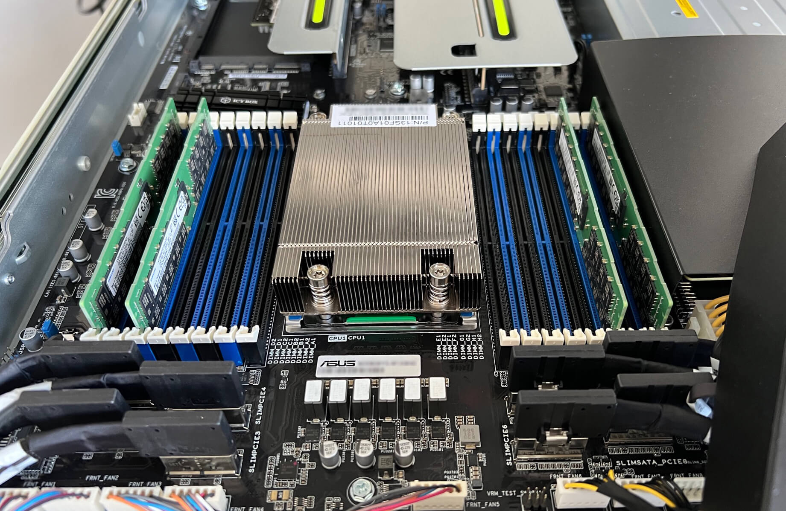

# Quick review of Asus RS500A-E11-RS12U server

This is about an AMD EPIC 7003 1U single-socket server supporting up to 16 DIMM, 12 U.2 NVMe drives, 3 PCIe Gen4 slots, 1 x OCP 3.0 NIC, 2 x M.2 SSDs (SATA or PCIe Gen4) and an AST2600 BMC ([link to data sheet and parts list](https://servers.asus.com/products/Servers/Rack-Servers/RS500A-E11-RS12U))

Since we were rather impressed by the energy efficiency of an [Asus PN41 Mini PC](https://www.cnx-software.com/2021/10/15/2-5gbe-mini-pc-asus-pn41/) now serving as a Check_MK server and central rsyslog host operating at ~6.5W and we needed new hypervisors why not give Asus servers a try?

We chose the specific model since taking only 1 rack unit, providing 12 hot-swappable U.2 2.5" bays (+ 4 optional internal 2.5" bays), 2 x M.2 slots for SATA or NVMe boot SSDs, 3 PCIe Gen4 slots, 2 x onboard GbE + 2 x SFP+ 10GbE NICs in OCP slot. Also it's single-socket so in case we ever need to run some commercial software that gets licensed per socket it gets cheaper.

## Mainboard / chassis

The server is based on an [Asus KRPA-U16 server/workstation mainboard](https://servers.asus.com/products/Servers/Server-Motherboards/KRPA-U16) equipped with an ASMB10-iKVM (based on an [ASpeed AST2600 BMC](https://www.aspeedtech.com/server_ast2600/)).

Three PCIe Gen4 slots are exposed via riser cards to the back of the machine. If the plastic cover to route airflow from fans 2-4 to the CPU is removed it looks like this:

## CPU

We ordered the servers with an EPYC 7232P 8-Core Processor (16 threads) running at 3200 MHz (in Linux cpufreq driver talks about 3100 MHz but single-threaded measured it's ~3190 MHz, see [sbc-bench results](http://ix.io/47Nv)).

Single-threaded performance is on par or slightly better (10%-15%) than our previous workhorse (Xeon Silver 4110 bursting at 3000 MHz) but multi-threaded it's a noticable +50% (55% with 7-zip, %70 Passmark score). Given both CPUs have same count of cores/threads this hints at the Intel chip not holding burst frequencies when all cores are fully loaded due to power constraints. 

Looking at [sbc-bench results for Xeon 4110](http://ix.io/2j6W) confirms this: cores end up at 2200 MHz (almost the 2.1 GHz base clock to which the 85W TDP rating applies) while the AMD Zen2 cores remain at 3100 MHz with sustained high loads. With very short peak loads the AMD cores seem to even slightly exceed 3200 MHz (checked with `cpuminer` benchmark that scores +170 kH/s on first run to drop to ~160 kH/s with next score when running continually).

## ASMB10-iKVM BMC

The firmware running on the ASpeed AST2600 BMC is a branded [AMI MegaRAC](https://www.ami.com/megarac/)

## PSUs

2 x 800W redundant [Acbel Polytech R1CA2801A PSUs](https://www.acbel.com/files/product/download/Specification/IPC_PDF/R1CA2301A-B_R1CA2401A-B_R1CA2551K_R1CA2801A-B_R1CA2122A_Specification_01.pdf)

## 

## NICs

  * 2 x onboard Intel I350 GbE interfaces (MAC address OUI: 04:42:1A -> Asus)
  * 2 x SFP+ BCM57840 NetXtreme II 10GbE in OCP 3.0 NIC slot (MAC address OUI: A0:36:BC -> Asus), negotiated link is Gen3 x8
  * virtualized USB Ethernet 

## Memory

4 x 32GB Samsung M393A4K40EB3-CWE 

Up to 4TB RAM

## Fans

7 replaceable fans

### Full Speed profile

The fans show up to 27000 rpm and idle consumption of the active PSU is at ~255 W

### Generic profile

Fans 1-5 spin at ~12500 rpm, fans 6-7 are at 10500 rpm, idle consumption of the active PSU is at ~99.5 W

### Custom profile

The active PSU measures ~84.5 W in idle