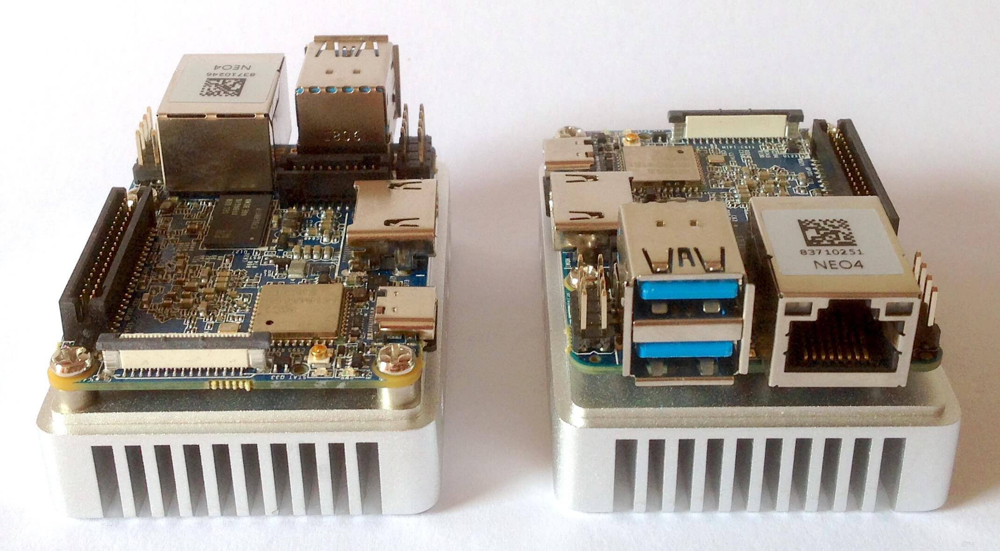

# Quick Review of NanoPi NEO4

NanoPi NEO4 is currently the smallest RK3399 board around. I got 2 pre-release samples provided by FriendlyELEC for tests, development and review. In the following I focus on things I'm interested in (that's headless server mode and nothing else)

## Basic specs

As usual [comprehensive information available in FriendlyELEC's wiki](http://wiki.friendlyarm.com/wiki/index.php/NanoPi_NEO4).

Quick summary:

* PCB size 60x45 mm (same form factor as NanoPi NEO Plus2 -- maybe [we see more boards with this form factor from FriendlyELEC in the future](https://forum.armbian.com/topic/7750-nanopi-neo4/?do=findComment&comment=62715))
* RK3399 ARM SoC capable of running the big cores at 2.0GHz and the little ones at 1.5 GHz (two challenges here: providing sufficient power and heat dissipation)
* 1 GB DRAM in dual-channel config (one 4Gb chip on each PCB side)
* Gigabit Ethernet using the usual RTL8211E PHY capable of 940 Mbits/sec in both directions
* Ampak AP6212 providing 2.4GHz wireless (single antenna/single band 802.11n Wi-Fi and BT 4.0)
* USB3 SuperSpeed available on the lower type A receptacle
* USB2 Hi-Speed available on 2.54mm pin header and the upper type A receptacle (my prototypes show both as blue but AFAIK this will be fixed with the final version)
* USB2 OTG on the USB-C port to enter Rockchip's Maskrom mode
* Powering via USB Type-C or Pin2&Pin4 of the 40-pin GPIO1 header (5V/3A recommendation by FriendlyELEC -- my personal recommendation is to always buy their 5V/4A PSU as well for reasons below)
* HDMI 2.0a, supports 4K@60Hz，HDCP 1.4/2.2 (only audio output asides the 8-pin I2S header)
* 1 x MIPI CSI input
* eMMC socket compatible to the other more recent FriendlyELEC boards
* 40 pin 1.27mm pitch SMD connector with PCIe Gen2 x2 and various GPIOs

## Compatibility

Unlike other board makers FriendlyELEC tries to address different use cases with different boards being as compatible to each other as possible. NanoPC-T4, NanoPi M4 and NanoPi NEO4 share majority of hardware details (see [rk3399-nanopi4-common.dtsi](https://github.com/friendlyarm/kernel-rockchip/blob/nanopi4-linux-v4.4.y/arch/arm64/boot/dts/rockchip/rk3399-nanopi4-common.dtsi)) and the differences can be spotted by comparing their individual device-tree (DT) files: 
* [NanoPC-T4](https://github.com/friendlyarm/kernel-rockchip/blob/nanopi4-linux-v4.4.y/arch/arm64/boot/dts/rockchip/rk3399-nanopi4-rev00.dts) only defining the `model` name,
* [NanoPi M4](https://github.com/friendlyarm/kernel-rockchip/blob/nanopi4-linux-v4.4.y/arch/arm64/boot/dts/rockchip/rk3399-nanopi4-rev01.dts) defining some eMMC and Audio stuff differently and 
* [NanoPi NEO4](https://github.com/friendlyarm/kernel-rockchip/blob/nanopi4-linux-v4.4.y/arch/arm64/boot/dts/rockchip/rk3399-nanopi4-rev04.dts) defining another Wi-Fi chip (please note that at the time of this writing a wrong chip is referenced there since in the meantime it's a AP6212 Wi-Fi/BT combo).

So asides the different physical dimensions all three RK3399 devices from FriendlyELEC can run basically with the same OS images and need only minor adjustments (exchanged DT bits). The other differences are how PCIe lanes are exposed (M.2 key M with all 4 lanes available on NanoPC-T4, only 2 lanes on pin headers on M4 and NEO4) and how powering looks like.

## Powering the board

While NanoPC-T4 utilizes a 5.5/2.1mm barrel plug to be fed with 12V both NanoPi M4 and NEO4 want to be powered with 5V via USB-C (or pin header).

Please be aware that the USB-C implementation is not USB PD compliant (USB PD --> USB power delivery specification) and is just a 'dumb' 5V DC input. This has both advantages and disadvantages.

**Pro:** No need for a true USB PD compliant USB-C charger (those that do not set your equipment on fire are [pretty expensive](https://www.makeuseof.com/tag/best-usb-c-chargers-whats-safe-whats-dangerous/))

**Cons:**

* you'll also need a 'dumb' 5V PSU since 'real' USB-C chargers won't negotiate a current high enough ([same problem with NanoPi M4](https://forum.armbian.com/topic/8097-nanopi-m4-performance-and-consumption-review/?do=findComment&comment=61782))
* Low voltages and high currents are not a great combination since cable and contact resistance become a problem leading to severe voltage drops ([same problem with NanoPi M4](https://forum.armbian.com/topic/7511-nanopi-m4/?do=findComment&comment=63340)). So if you plan on attaching USB consumers or run demanding workloads take care that the USB-C cable you use to power the board is short and of highest quality (low AWG rating to prevent voltage dropping)

My personal recommendation is to also aquire FriendlyELEC's 5V/4A PSU that ships with a very short USB-A to USB-C cable ([picture](http://kaiser-edv.de/tmp/qlZyuo/IMG_8025.JPG)) if you plan to connect board powered USB peripherals like SSDs or 2.5" HDD. In any case please ensure you take the voltage drop issue into account and always use a very short USB-C cable with thick power wires to provide power.

## Consumption

I did only a quick test with a powermeter connected to mains (Brennenstuhl Primera Line PM 231E bought after german c't magazine reviewed it as one of the more precise powermeters available). With FriendlyELEC's 5V/4A PSU my 231E reports 0.3W without any load connected. When feeding NEO4 it reports 2.7W in idle.

For further numbers please compare with [NanoPi M4 review in Armbian forum](https://forum.armbian.com/topic/8097-nanopi-m4-performance-and-consumption-review/) keeping in mind that there the watts reported are measured between board and PSU so absolute numbers aren't comparable (every PSU wastes some energy on its own). But relative consumption differences will be identical between both boards since it's RK3399 after all.

## CPU and memory performance

As expected the RK3399 here performs like any other RK3399 on this planet. The only interesting questions are how heat dissipation works here (RK3399 since somewhat beefy will overheat and needs to be throttled without sufficient heat dissipation) and how memory implementation looks like.

I added NEO4 performance numbers already to [sbc-bench results](https://github.com/ThomasKaiser/sbc-bench/blob/master/Results.md). For reasons unknown yet when running NEO4 with appropriate DT (`rk3399-nanopi4-rev04.dts`) memory bandwidth and especially latency is slightly worse compared to running with NanoPi M4 settings (but doesn't matter with almost all use cases)

So let's look at heat dissipation now:

FriendlyELEC provides a massive milled Aluminium heatsink for the board that ships with a 20x20x1.5 mm thermal pad to connect heatsink with RK3399. Unfortunately these thermal pads perform rather poorly wrt heat transfer (see [NanoPi Fire3](https://forum.armbian.com/topic/7260-quick-review-of-nanopi-fire3/?do=findComment&comment=61661), [NanoPi K1 Plus](https://forum.armbian.com/topic/8125-quick-review-of-nanopi-k1-plus/?do=findComment&comment=61417), [NanoPi M4](https://forum.armbian.com/topic/8097-nanopi-m4-performance-and-consumption-review/?tab=comments#comment-61786) and [RockPro64](https://forum.armbian.com/topic/7310-rockpro64/?do=findComment&comment=61811)) so my personal recommendation is to replace the vendor provided thermal pad with a 1.2mm copper shim and two thin films of thermal compound.

I had a detailed look at [heatsink efficiency here](Heatsink_Efficiency.md) but regardless whether you use the thermal pad or exchange it with something working better there are three simple rules:

* You **need** a heatsink unless NEO4 should idle all the time. Usually the PCB acts as an own heatsink but here PCB size is that tiny that you can't rely on.
* If your use case involves only short peak loads then FriendlyELEC's massive heatsink does the job (the huge Alu block can compensate easily for short SoC temperature increases)
* If you plan on continous full load you need an additional fan or at least some sorts of airflow through the heatsink fins. The thermal mass of FE's heatsink is quite large so after some time the heatsink itself will store the heat mostly and you end up with an overheated board

## Storage performance

We have 5 different types of storage capabilities here: SD card, eMMC, USB2 attached storage, USB3 attached storage and (potentially) PCIe attached storage.

Let's look at them individually:

### SD card

SDR104 mode and switching from 3.3V to 1.8V is supported so we get up to 68 MB/s sequential transfer speeds and nice high random IO performance with appropriate SD cards.

Quick check with an A1 rated SanDisk Extreme card (using my [standard `iozone` test](https://forum.armbian.com/topic/954-sd-card-performance/))

    SanDisk Extreme A1                                   random    random
         kB  reclen    write  rewrite    read    reread    read     write
     102400       4     3672     3640    12849    12881     9463     3175
     102400      16    10923    11322    28427    26624    27124     7938
     102400     512    55800    60169    63952    64218    64191    58994
     102400    1024    62335    62258    66023    65997    65962    60514
     102400   16384    63758    63970    67797    67798    67744    63299

### eMMC

With RK3399 up to 300 MB/s sequential transfer speeds are possible but actual storage performance of course depends on the eMMC module used. See my [ODROID-N1 review](https://forum.armbian.com/topic/6496-odroid-n1-not-a-review-yet/?do=findComment&comment=49404) and there especially [Hardkernel's Samsung eMMC 5.1 numbers with varying capacity](https://pastebin.com/ePUCXyg6). Numbers for FriendlyELEC's 8GB SanDisk eMMC module [made with M4](https://forum.armbian.com/topic/8097-nanopi-m4-performance-and-consumption-review/?do=findComment&comment=61898) (will be the same on NEO4 since RK3399 is RK3399):

    8GB FriendlyELEC SanDisk eMMC                        random    random
         kB  reclen    write  rewrite    read    reread    read     write
     102400       4     8565     8793    24853    24808    19463     8523
     102400      16    25604    25986    66627    66701    56571    24459
     102400     512    42217    42326   125788   126508   125959    40394
     102400    1024    42762    43178   129692   129726   130452    42636
     102400   16384    43914    42877   132828   133254   133417    43012

### USB2

RK3399's USB2 implementation supports the modern [USB Attached SCSI (UAS) protocol](https://linux-sunxi.org/USB/UAS) but for whatever reasons sequential transfer speeds are limited to 35 MB/s. Test with my usual EVO840 test SSD in my usual JMS567 disk enclosure (to keep [numbers comparable](https://forum.armbian.com/topic/1925-some-storage-benchmarks-on-sbcs/?do=findComment&comment=51350))

    Samsung EVO840 USB2                                  random    random
         kB  reclen    write  rewrite    read    reread    read     write
     102400       4     8251    10611     8310     8386     8315    10549
     102400      16    20995    21068    21609    21695    21775    21180
     102400     512    32767    32832    33033    33251    33124    32914
     102400    1024    33508    33498    34003    34115    34148    33558
     102400   16384    34162    34106    34994    35057    35137    34181

### USB3

The USB3 port is also UAS capable and the storage performance is excellent exceeding 400 MB/s (additional numbers for the same SSD provided with a VIA VL716/VL715 bridge since interestingly while sequential top speeds are lower especially random IO performance with small block sizes is way better -- and that's important with fast SSDs and not sequential performance):

    Samsung EVO840 USB3 / JMS567                         random    random
         kB  reclen    write  rewrite    read    reread    read     write
     102400       4    28357    31510    25159    25175    25144    31057
     102400      16    92856   100504    86410    86688    86502    98909
     102400     512   326427   333811   302924   305825   305952   328410
     102400    1024   356554   365881   340886   342295   344505   360279
     102400   16384   383442   387693   390023   394239   393870   378899
    2048000   16384   402752   405067   395700   396042   396023   404387

    Samsung EVO840 USB3 / VL716                          random    random
         kB  reclen    write  rewrite    read    reread    read     write
     102400       4    35816    40837    26554    26585    26502    40387
     102400      16   107127   119194    89773    90055    90052   115743
     102400     512   300228   307147   292255   296349   296201   302348
     102400    1024   324002   338868   327037   330841   331600   327289
     102400   16384   370782   370772   376650   380148   380017   372915
    2048000   16384   380944   382969   380036   380358   380308   383308

### PCIe

Not able to test now since PCIe on NEO4 is only available on the 40 pin 1.27mm pitch SMD connector. I really hope FriendlyELEC or 3rd parties provide an ASM1062 'SATA HAT' for this connector as [already suggested](https://forum.armbian.com/topic/8097-nanopi-m4-performance-and-consumption-review/?do=findComment&comment=62490). This would allow to power NEO4 and up to two 3.5" HDDs reliably with 12V while providing 2 SATA 3.0 ports that are even fine with 2 SSDs behind (ASM1062 would utilize both PCIe lanes)

## Network performance

Gigabit Ethernet as usual with RK3399 is saturating the link (940 Mbits/sec in both directions) and since Wi-Fi is 2.4 GHz only and AP6212 numbers have already been generated it's not worth the efforts to measure ([reasons why](https://forum.armbian.com/topic/3739-wi-fi-performance-and-known-issues-on-sbc/)). Please keep in mind that with current software support situation neither Wi-Fi nor BT will work right now. DT modifications, driver activation and further tweaks are needed.

## Expansion possibilities

There's 1 x USB3, 2 x USB2 (one time on a pin header), the USB OTG port is routed to the USB-C connector (not using the SuperSpeed data lines so you're limited to USB2/Hi-Speed here). 

Two PCIe Gen2 lanes are routed to the 40-pin header but since this connector is proprietary it needs specially designed 'HATs' or PCIe expanders to make use of them (and I really hope we'll see some of them since this is still an amazing feature for such a tiny board to expose this universal high speed bus in that way!)

On the 40-pin header a few more protocols are exposed (please check [FriendlyELEC's wiki](http://wiki.friendlyarm.com/wiki/index.php/NanoPi_NEO4) for details)

## Conclusion

None yet except this thing being the perfect pocket server once an enclosure ready for the massive heatsink is available (I could imagine something 3D printed with the heatsink completetly being outside of the enclosure)