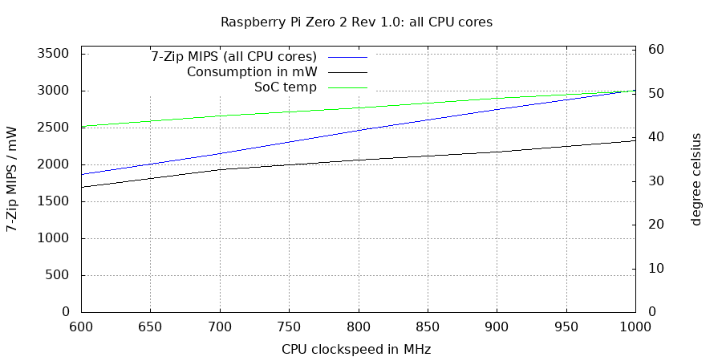
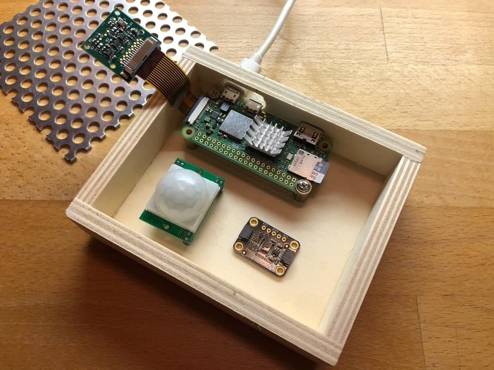

# A quick look at RPi Zero 2 W

This small board [combines 512MB LPDDR2 RAM with the BCM2837 die known from RPi 3B](https://github.com/raspberrypi/documentation/blob/develop/documentation/asciidoc/computers/processors/rp3a0.adoc) as SiP (system-in-package). It is the much more powerful successor to RPi Zero W and replaces a single ARM11 core with a quad core Cortex-A53 clocking by default between 600 MHz and 1000 MHz. Wireless capabilities remain almost the same compared to Zero W (minor BT revision update) and the chip is from the same family as before (Broadcom, then Cypress, now Synaptics) which is good news since RPi Trading Ltd. unlike almost all the other SBC makers out there [fix wireless security flaws by pushing new firmware BLOBs to their distribution](https://github.com/armbian/build/issues/1812#issuecomment-607643584).

Board dimensions and connector placement is the same except location of most pogo pins on the backside. For pictures visit [Jeff Geerling](https://www.jeffgeerling.com/blog/2021/look-inside-raspberry-pi-zero-2-w-and-rp3a0-au) (but please ignore benchmark numbers, procedures and recommendations there). For a good comparison between both boards see [CNX-Software](https://www.cnx-software.com/2021/10/28/raspberry-pi-zero-2-w-and-zero-w-features-comparison/) (but please ignore the "2.5A power requirement" there).

## Basics

Why looking at this little SBC thrown out recently by RPi Trading Ltd.? Since it's one of the few SBC that have a [lower idle consumption than my laptop](https://github.com/ThomasKaiser/Knowledge/blob/master/articles/Exploring_Apple_Silicon_on_MacBookPro18_1.md).

Setting up this thing is [straightforward as always](https://gist.github.com/gbaman/975e2db164b3ca2b51ae11e45e8fd40a). You flash latest Raspberry Pi OS (at the time of this writing that's the Bullseye release) to a quality A1 rated SD card, afterwards eject/re-insert the card to ensure the FAT partition will be mounted. In my example as `/Volumes/boot/`. It's then as easy as

    touch /Volumes/boot/ssh
    echo -e "\ndtoverlay=dwc2" >>/Volumes/boot/config.txt
    nano /Volumes/boot/cmdline.txt

There you carefully edit the single line and insert ` modules-load=dwc2,g_ether ` after `rootwait`. Then you insert the SD card into the board and use an USB cable/adapter to connect the board's OTG port (not the power port at the edge!) to one of your computer's USB3 ports (USB3 since providing 900mA instead of 500mA):

The above procedure results in the Zero using USB Gadget mode to appear as a network adapter on the USB port:

    RNDIS/Ethernet Gadget:
    
      Product ID: 0xa4a2
      Vendor ID: 0x0525  (PLX Technology, Inc.)
      Version: 5.10
      Speed: Up to 480 Mb/s
      Manufacturer: Linux 5.10.63-v7+ with 3f980000.usb
      Location ID: 0x14100000 / 2
      Current Available (mA): 500
      Current Required (mA): 2
      Extra Operating Current (mA): 0

In case your computer's OS is not crappy you can now simply access the Zero as `raspberrypi.local` (no need for stupid assigning of static IP addresses or BS like that):

    bash-3.2$ ping raspberrypi.local
    PING raspberrypi.local (169.254.188.97): 56 data bytes
    Request timeout for icmp_seq 0
    64 bytes from 169.254.188.97: icmp_seq=1 ttl=64 time=0.471 ms
    64 bytes from 169.254.188.97: icmp_seq=2 ttl=64 time=0.509 ms
    64 bytes from 169.254.188.97: icmp_seq=3 ttl=64 time=0.647 ms
    ^C
    --- raspberrypi.local ping statistics ---
    4 packets transmitted, 3 packets received, 25.0% packet loss
    round-trip min/avg/max/stddev = 0.471/0.542/0.647/0.076 ms

    bash-3.2$ ssh pi@raspberrypi.local
    The authenticity of host 'raspberrypi.local (fe80::6154:7798:c601:106d%en10)' can't be established.
    ECDSA key fingerprint is SHA256:nDJzER2skvqSeWydqBH2FwvFYUfj3Wn3uVYFR49JjQk.
    Are you sure you want to continue connecting (yes/no/[fingerprint])? yes
    Warning: Permanently added 'raspberrypi.local,fe80::6154:7798:c601:106d%en10' (ECDSA) to the list of known hosts.
    pi@raspberrypi.local's password: 
    Linux raspberrypi 5.10.63-v7+ #1459 SMP Wed Oct 6 16:41:10 BST 2021 armv7l
    
    The programs included with the Debian GNU/Linux system are free software;
    the exact distribution terms for each program are described in the
    individual files in /usr/share/doc/*/copyright.
    
    Debian GNU/Linux comes with ABSOLUTELY NO WARRANTY, to the extent
    permitted by applicable law.
    Last login: Fri Nov  5 14:10:41 2021 from 2001:a61:3a9f:1e01:8c09:8987:d565:9c4b
    
    SSH is enabled and the default password for the 'pi' user has not been changed.
    This is a security risk - please login as the 'pi' user and type 'passwd' to set a new password.
    
    
    Wi-Fi is currently blocked by rfkill.
    Use raspi-config to set the country before use.
    
    pi@raspberrypi:~ $ 

All you need to do now is the following

    passwd # set a secure password
    sudo nano /etc/hostname # assign a unique name to the board, e.g. 'zero2'
    sudo raspi-config # set country code and Wi-Fi details
    sudo apt install zram-tools # avoid silly swapping to SD card
    sudo shutdown -h now

You might revoke the changes to `/boot/config.txt` and `/boot/cmdline.txt` (might save you 20mW) but then you'd need to redo this again to flawlessly SSH into your board via the USB port. Otherwise just attach the Zero 2 now to a normal power source using the power Micro USB port and login through Wi-Fi via `ssh pi@zero2` (given you assigned this hostname in the step before and you run a non-crappy DNS/DHCP server combo at home / in your lab).

BTW: A better aproach than installing `zram-tools` will be [discussed at the end of this article](https://github.com/ThomasKaiser/Knowledge/blob/master/articles/Quick_Review_of_RPi_Zero_2_W.md#sd-card-endurance).

## Performance and consumption

The Zero2 is way more performant than its predecessor but also needs a little more juice. The official power requirement of 5V@2.5A (12.5W) is BS or most probably RPi Trading Ltd. trying to sell old Micro USB wall warts they've still in stock for RPi 3B/3B+. When CPU cores are fully utilized the consumption does not exceed 2.5W (or 500mA) so even when you also utilize the VideoCore (e.g. to encode a video stream coming from the CSI camera or decoding video to be displayed) and have an USB consumer you'll have a hard time to exceed 5W (1000mA).

Asides that ordering a Micro USB PSU from RPi Trading Ltd. is a good idea if you want to attach USB consumers to Zero 2. Not due to the high amperage rating but since this PSU with a fixed and thick cable really provides stable +5V to the board in contrast to majority of USB charging variants where huge voltage drops under load happen (and this – *undervoltage* – is the real issue in a 5V powered world).

Zero 2's single threaded performance is higher than the original Zero's even when comparing Zero 2 at 600 MHz with Zero at 1000 MHz. The latter shows a 7-ZIP MIPS score of 450 @ 1000 MHz while with Zero 2 it's as follows iterating through 600-1000 MHz with one CPU core fully utilized:

    Sysfs/ThreadX/Tested:  MIPS / Temp /  Watt
     600 /   600 /   600:   511  37.4°C  1280mW
     700 /   700 /   680:   593  39.5°C  1390mW
     800 /   800 /   800:   676  39.9°C  1510mW
     900 /   900 /   900:   755  40.2°C  1570mW
    1000 /  1000 /   970:   835  40.6°C  1610mW

When utilizing all 4 cores it looks like this (a fan blowing over the SiP's surface which explains the low temperatures – for temps with 'convection only' see below):

    Sysfs/ThreadX/Tested:  MIPS / Temp /  Watt
     600 /   600 /   600:  1870  42.7°C  1700mW
     700 /   700 /   700:  2152  45.1°C  1940mW
     800 /   800 /   800:  2465  46.9°C  2060mW
     900 /   900 /   880:  2750  49.0°C  2170mW
    1000 /  1000 /  1000:  3009  50.8°C  2330mW

So if you're concerned about max consumption of this thing and don't need highest single-threaded performance a good idea is to lock down CPU cores to 600 MHz: still same or better single-threaded performance than original Zero but multi-threaded almost 4 times faster.

BTW: Why 7-Zip's internal benchmark? Since being a good represenation of 'server workloads' and not that much a compiler benchmark like majority of other kitchen-sink benchmarks that produce different numbers with every major OS/GCC release ([full explanation](https://github.com/ThomasKaiser/sbc-bench#7-zip)).

Back to clockspeeds and consumption: if you're running with the older Buster image there's another benefit of staying at 600 MHz. At this clockspeed a lower VCore voltage is used to feed the ARM cores:

    Cpufreq OPP: 1000  ThreadX: 1000  Measured: 1000 @ 1.2375V
    Cpufreq OPP:  900  ThreadX:  900  Measured:  870 @ 1.2375V
    Cpufreq OPP:  800  ThreadX:  800  Measured:  800 @ 1.2375V
    Cpufreq OPP:  700  ThreadX:  700  Measured:  660 @ 1.2375V
    Cpufreq OPP:  600  ThreadX:  600  Measured:  580 @ 1.2V

In idle that's below 39°C SoC temp (w/o heatsink/fan and at an ambient temp of 23°C) and less than 800mW idle consumption:

Different picture with the newly released Bullseye image: SoC temp +5°C and consumption almost 200mW higher:

    Cpufreq OPP: 1000  ThreadX: 1000  Measured: 1000 @ 1.2438V
    Cpufreq OPP:  900  ThreadX:  900  Measured:  900 @ 1.2438V
    Cpufreq OPP:  800  ThreadX:  800  Measured:  785 @ 1.2438V
    Cpufreq OPP:  700  ThreadX:  700  Measured:  700 @ 1.2438V
    Cpufreq OPP:  600  ThreadX:  600  Measured:  535 @ 1.2438V

With the Bullseye image the ARM cores are always fed with a higher voltage even when idle and at 600 MHz. But less than 50mV difference are IMO not enough to explain almost 200mW higher idle consumption. Needs more research.

BTW: If you want to use the old Buster image be prepared for 'hacks' (manually adding and renaming the device-tree files with `bcm2710-rpi-zero-2` in their name from [here](https://github.com/raspberrypi/firmware/tree/master/boot)) or you need an older RPi model to once boot and perform all updates there and only then the necessary support files for Zero 2 become part of the installation on this SD card. Otherwise the board simply won't boot.

## Overclocking

While not the best idea when you want low consumption (why buying a Zero?) it's possible but at the cost of stability or power efficiency. For higher clockspeeds to work stably the main OS needs to be told to increase Vcore voltage for the ARM cores via the `over_voltage` parameter in `config.txt` (this is the major config file for ThreadX running on the VideoCore and fully controlling the ARM domain – [details](https://ownyourbits.com/2019/02/02/whats-wrong-with-the-raspberry-pi/)).

For e.g. 1200 MHz to work stably you might need to define `over_voltage=2` which increases Vcore voltage the ARM cores are fed with. A quick test through 7 different settings ends up with these voltage values (they differ slightly between reboots for reasons unknown to me):

  * no adjustment: 1.2375V - 1.2500V
  * `over_voltage=1`: 1.2688V
  * `over_voltage=2`: 1.2938V
  * `over_voltage=3`: 1.3188V
  * `over_voltage=4`: 1.3438V
  * `over_voltage=5`: 1.3625V
  * `over_voltage=6`: 1.3875V - 1.3938V

With the Buster image this only affects situations where the CPU is rather utilised and clockspeeds have been ramped up by the cpufreq driver while idle mode remains unaffected (1.2V at 600 MHz). But with the Bullseye image + overvolting the ARM cores are fried all the time and even when idling at 600 MHz:

Anyway: with a slight overclock to 1.2 GHz the Zero 2 performs almost at the same level than the unfortunate RPi 3B+ at 1.4 GHz. Partially related to memory performance that improved with Zero 2 (or maybe with all RPi models due to firmware/ThreadX optimisations within the last years? It's always somewhat stupid to compare benchmark results made in different years):

RPi 3B+ (old measurements with firmware/ThreadX version from 'Jun  7 2018'):

     standard memcpy                                      :   1050.1 MB/s
     standard memset                                      :   1505.7 MB/s (0.2%)
     
    block size : single random read / dual random read
          1024 :    0.0 ns          /     0.0 ns 
          2048 :    0.0 ns          /     0.0 ns 
          4096 :    0.0 ns          /     0.0 ns 
          8192 :    0.0 ns          /     0.0 ns 
         16384 :    0.0 ns          /     0.0 ns 
         32768 :    0.0 ns          /     0.0 ns 
         65536 :    5.4 ns          /     9.2 ns 
        131072 :    8.2 ns          /    13.1 ns 
        262144 :    9.7 ns          /    14.8 ns 
        524288 :   16.6 ns          /    26.3 ns 
       1048576 :   91.3 ns          /   142.7 ns 
       2097152 :  131.6 ns          /   183.6 ns 
       4194304 :  158.0 ns          /   204.8 ns 
       8388608 :  171.7 ns          /   214.3 ns 
      16777216 :  180.3 ns          /   220.5 ns 
      33554432 :  185.5 ns          /   224.7 ns 
      67108864 :  188.5 ns          /   227.2 ns

Compared to Zero 2 W with recent software: lower latency and much better memcopy score.
    
     standard memcpy                                      :   1295.5 MB/s (2.6%)
     standard memset                                      :   1570.9 MB/s (0.9%)
    
    block size : single random read / dual random read
          1024 :    0.0 ns          /     0.0 ns 
          2048 :    0.0 ns          /     0.0 ns 
          4096 :    0.0 ns          /     0.0 ns 
          8192 :    0.0 ns          /     0.0 ns 
         16384 :    0.0 ns          /     0.0 ns 
         32768 :    0.0 ns          /     0.0 ns 
         65536 :    6.4 ns          /    11.0 ns 
        131072 :    9.9 ns          /    15.7 ns 
        262144 :   11.6 ns          /    17.7 ns 
        524288 :   12.9 ns          /    19.5 ns 
       1048576 :   81.1 ns          /   125.8 ns 
       2097152 :  121.8 ns          /   165.4 ns 
       4194304 :  145.0 ns          /   185.8 ns 
       8388608 :  157.4 ns          /   195.6 ns 
      16777216 :  165.6 ns          /   201.2 ns 
      33554432 :  171.2 ns          /   206.2 ns 
      67108864 :  175.3 ns          /   209.3 ns 

BTW: All power measurements above made with a [Netio PowerBOX 4K](https://www.netio-products.com/en/device/powerbox-4kx) which means 'wall wart included' and also all losses in the Micro USB cable. That's in contrast to most other consumption numbers on the net that are made with USB powermeters attached directly to the board. Jeff Geerling measured 620 mW idle consumption, my number is ~750 mW with active Wi-Fi connection but disabled HDMI (~770 mW with USB gadget mode and network on USB OTG port). In my numbers included are a 7 years old USB charger and an AWG20 rated 1.8m Micro USB cable.

## 32-bit or 64-bit?

The ARM cores in the RP3A0-AU SiP are Cortex-A53 (64-bit capable ARMv8 designs) while 'Raspberry Pi OS' is still built for 1st Gen RPi models like the original Zero (ARM11/ARMv6). Usually it's a good idea to build software with available CPU features enabled.

As an example: when running a 64-bit/ARMv8 userland on any of the ARMv8 RPi (3B/3B+/4B/Zero2) then the infamous 'sysbench cpu' benchmark reports scores *at least 15 times* better. That's probably the main reason why RPi fanboys want 64-bit asides other 'benchmarking gone wrong' adventures like the Phoronix test suite.

Another reason why running an `arm64` userland is desired is massively improved AES crypto performance since almost all ARMv8 CPU designs licensed 'ARMv8 Crypto Extensions'. Only known exceptions: Amlogic S905 as used on ODROID C2 and every SoC/SiP RPi Trading Ltd. ever used. AES performance of any RPi simply sucks compared to almost every other modern ARM SoC out there (check column 7 in [sbc-bench results list](https://github.com/ThomasKaiser/sbc-bench/blob/master/Results.md)). 

That's an el cheapo RPi Zero 2 competitor called [Radxa Zero](https://www.cnx-software.com/2021/11/01/raspberry-pi-zero-2-w-vs-radxa-zero-features-and-benchmarks-comparison/) with a quad core Cortex-A53 and ARMv8 Crypto Extensions:

    type              16 bytes     64 bytes    256 bytes   1024 bytes   8192 bytes  16384 bytes
    aes-256-cbc     140278.26k   374453.87k   634580.22k   780679.17k   836960.26k   840592.04k

That's a RPi 4 (lacking ARMv8 Crypto Extensions) at 1.8GHz achieving not even 10% of the above performance when looking at relevant chunk sizes:

    aes-256-cbc      60956.92k    72050.71k    76405.85k    77508.95k    77957.80k    77824.00k

And when switching to a 64-bit userland on RPi 4 it gets even worse:

    aes-256-cbc      33526.93k    35271.89k    36004.01k    36201.13k    36263.25k    36257.79k

Now we're at less than 5% of the performance of another ARM SoC where the manufacturer spent the few cents (per chip) to license ARMv8 Crypto Extensions.

But ruined AES crypto performance is not the only reason why a 64-bit userland sucks on RPi Zero 2. The device has only 512 MB RAM that is shared between the primary OS (ThreadX) and any secondary OS like Linux. Processes/services built for 64-bit have a *much much larger* memory footprint compared to the standard Raspberry Pi OS (which is _not_ just 32-bit but specifically built for ARMv6! Please keep this in mind when you read somewhere on the Internet about '32-bit vs. 64-bit' and folks run their comparisons on an RPi).

As a rule of thumb any process needs almost twice as much memory in 64-bit mode compared to 32-bit. You can see your Zero 2 swapping all day long running a 64-bit userland while everything runs off RAM smoothly with 32-bit. Your 64-bit apps are handled by the `oom-killer` (a process killing other processes that need 'too much RAM') while they will happily do what they should when built for 32-bit. If you build a cluster out of Raspberries and your processes are memory constrained, then you'll need almost twice as much cluster nodes (RPi thingies to be bought and powered) when running 64-bit compared to standard userland.

And no, 64-bit is not faster in general. Mostly some weird benchmarks show higher scores (sysbench or Phoronix stuff that benefits from totally different `CFLAGS` here or there).

Why no 64-bit numbers from Zero 2? Since a waste of time and numbers already exist (see RPi 4 scores above from sbc-bench results list or this [Github issue](https://github.com/armbian/build/issues/645) showing the horrible memory requirements when running 64-bit userland).

Ok, no 64-bit userland. What about using a 64-bit kernel? Sure, why not. Adding `arm_64bit=1` to `config.txt` will do the job and after a reboot 50MB RAM are missing (in other words: 10% of available RAM on RPi Zero 2). Performance will remain the same though.

## Armbian / Ubuntu Jammy on Zero 2

For whatever reasons the guy calling himself 'the face of Armbian' started to advertise 'Armbian for Raspberry Pi 4' (also suggesting this would be a great thing). At least there are OS images lying around at [https://github.com/rpardini/armbian-release/releases](https://github.com/rpardini/armbian-release/releases) so let's try it out.

What is inside these images? A mixture of ThreadX blobs from RPi Trading Ltd. on the FAT partition (that's the main OS), then kernel packages from Ubuntu for the RPi family and an Armbian userland debootstrapped from Ubuntu package sources. Both kernel and userland are 64-bit and as such we already know how this excercise will end.

I had to boot this 'Jammy Armbian' image on an RPi 4 first to

  * update the primary operating system (copying over the ThreadX blobs from a Rasperry Pi OS install that has been updated to latest version using `rpi-update`)
  * add the Zero 2 `dtb` files to the FAT partition
  * add [firmware blobs](https://github.com/raspberrypi/linux/commit/c52581ffa49b9c0e5de3349436c283fe20128073#diff-ffce630590e253b5f402e964a1085c5709e56a2ba5e060579fe68cfd87988fe7) to the ext4 partition for Wi-Fi to work
  * copy over kernel images and modules from the aforementioned Rasperry Pi OS install
  * adjust `config.txt` to minimize ThreadX memory consumption, adjust the crazy overvolting/overclocking and also replace the memory hungry Ubuntu kernel with most recent from RPi guys (5.10.78-v8+ aarch64)
  * add a wireless network with `nmtui`

Only afterwards the Zero 2 was happy (see at the end of [armbianmonitor -u output](http://ix.io/3Fmh)). While for someone used to Armbian it's probably nice to have a familiar environment using this image on anything with less than 2 GB makes no sense at all since... 64-bit and therefore everything needing much much more memory compared to a 32-bit userland.

Trying `sbc-bench` as an example: all 7-zip benchmarks have been killed due to out of memory: [http://ix.io/3Fmf](http://ix.io/3Fmf). And while accessing the CSI camera works in the meantime on 64-bit it still requires to give away 128GB RAM to ThreadX (camera details discussed later) and you end up with this little left on a Zero:

    tk@zero-2:~$ free -h
                   total        used        free      shared  buff/cache   available
    Mem:           347Mi        91Mi       102Mi       1.0Mi       154Mi       246Mi
    Swap:          173Mi          0B       173Mi

Given that each and every process needs almost twice as much memory compared to a 32-bit/`armhf` userland there's not that much memory left for other processes. Adding to most processes performing lower on 64-bit as soon as swap/zram kicks in to fight 'out of memory' situations eveything slows down even more. As said already before: while being able to use a 64-bit userland has some advantages for certain use cases it makes not that much sense on this limited hardware with that low memory.

## Thermal performance and heatsink efficiency

The Zero 2 has a really small PCB size and as such not that much heat could be transferred from the SiP through the ball grid array into a copper ground plane (that's what the RPi guys started to do on the larger boards from RPi 3B+ on). And unfortunately the SoC die is made in an ancient 40nm process that is really not power efficient by today's standards.

Applying my 'standard heatsink' with appropriate fin spacing for passive cooling (letting convection help) does not provide that much benefits as long as there's enough radiation possible: at an ambient temperature of 23°C the idle temp is just ~1.5°C lower (40.8°C vs. 39.2°C with heatsink applied). This is the board lying flat on a table without any enclosure.

When walking through all available cpufreq OPP under load with `sbc-bench -p 0-3` (execute 7-Zip's internal benchmark 3 times at each clockspeed and report averages back) we see same performance but temperature differences between ~2.5°C at 600 MHz and ~5.5°C at 1000 MHz.

### Heatsink and small enclosure

Situation changes when we cramp the small board in a tiny enclosure like the official one since this functions somewhat like an oven. Idle temps are now at 44°C and of course other temperatures are also higher:

Left column is board w/o heatsink on a table, middle with heatsink, right is heatsink in official enclosure:

    cpufreq       7-Zip-MIPS          Temperature °C
      600     1828 / 1829 / 1829    50.8 / 47.2 / 56.4
      700     2143 / 2145 / 2132    57.6 / 53.0 / 60.9
      800     2440 / 2446 / 2427    62.8 / 58.0 / 64.5
      900     2746 / 2742 / 2745    66.9 / 62.1 / 67.7
     1000     3027 / 3034 / 2992    71.8 / 66.1 / 71.4

After some load peak it also takes a long time to get temps back to normal/idle in a tiny enclosure (approx. half an hour with Buster, on Bullseye with different idle VCore behaviour it will both take longer and idle temps will be higher too):

With a small load peak we've seen temperatures going up above 70°C to decline afterwards slowly. But what about constant full load? With heatsink but inside the tiny enclosure it will throttle for sure. Of course Linux won't tell you and you need to query the primary operating system via `vcgencmd` (which is what `sbc-bench -m` is doing on Raspberries):

    root@raspberrypi:~# sbc-bench -m
    Time        fake/real   load %cpu %sys %usr %nice %io %irq   Temp    VCore
    14:20:27: 1000/1000MHz  2.98  62%   1%  60%   0%   0%   0%  79.5°C  1.2375V
    14:20:33: 1000/ 941MHz  3.06  79%   2%  76%   0%   0%   0%  80.6°C  1.2375V
    14:20:38: 1000/ 941MHz  3.14  87%   1%  85%   0%   0%   0%  80.6°C  1.2375V
    14:20:43: 1000/ 941MHz  3.04  75%   2%  71%   0%   0%   0%  81.7°C  1.2375V
    14:20:48: 1000/ 834MHz  3.20  75%   2%  73%   0%   0%   0%  81.7°C  1.2375V
    14:20:53: 1000/1000MHz  3.27  71%   1%  69%   0%   0%   0%  79.5°C  1.2375V
    14:20:59: 1000/1000MHz  3.24  49%   1%  47%   0%   0%   0%  79.5°C  1.2375V
    14:21:04: 1000/ 887MHz  3.14  80%   2%  77%   0%   0%   0%  80.6°C  1.2375V
    14:21:09: 1000/ 941MHz  3.21  88%   1%  86%   0%   0%   0%  81.1°C  1.2375V
    14:21:14: 1000/ 941MHz  3.28  78%   3%  74%   0%   0%   0%  80.6°C  1.2375V
    14:21:19: 1000/ 834MHz  3.41  78%   1%  77%   0%   0%   0%  80.6°C  1.2375V
    14:21:25: 1000/ 995MHz  3.46  72%   1%  70%   0%   0%   0%  79.5°C  1.2375V
    14:21:30: 1000/ 941MHz  3.34  72%   2%  69%   0%   0%   0%  81.1°C  1.2375V
    14:21:35: 1000/ 834MHz  3.40  89%   1%  87%   0%   0%   0%  81.7°C  1.2375V
    14:21:40: 1000/ 887MHz  3.29  74%   2%  71%   0%   0%   0%  81.7°C  1.2375V
    14:21:45: 1000/ 834MHz  3.18  83%   2%  79%   0%   0%   0%  81.7°C  1.2375V
    14:21:50: 1000/ 834MHz  3.09  86%   1%  84%   0%   0%   0%  81.1°C  1.2375V
    14:21:55: 1000/ 834MHz  2.92  59%   3%  56%   0%   0%   0%  81.7°C  1.2375V
    14:22:01: 1000/ 834MHz  3.01  85%   1%  84%   0%   0%   0%  81.7°C  1.2375V
    14:22:06: 1000/ 834MHz  3.09  78%   2%  75%   0%   0%   0%  81.7°C  1.2375V
    14:22:11: 1000/ 834MHz  3.32  79%   2%  77%   0%   0%   0%  81.7°C  1.2375V

With full load it takes approximately ~15 min. for the board to reach the thermal threshold of 80°C, then hidden throttling kicks in and maximum performance drops linearly with cpufreq. Even with a heatsink cramping this little thing in a tiny enclosure without any airflow is not the best idea when you want to operate it full load constantly. You will experience throttling for sure (and in parallel a drop in consumption – see [Performance and consumption](https://github.com/ThomasKaiser/Knowledge/blob/master/articles/Quick_Review_of_RPi_Zero_2_W.md#performance-and-consumption) above for what to expect at which clockspeed).

## Storage

The SD card interface is SDXC compliant and can as such cope with SD cards up to 2TB once available. Unfortunately a voltage switch from 3.3V to 1.8V has not been implemented so SD card access is limited to [High Speed (HS) mode](https://github.com/ThomasKaiser/Knowledge/blob/master/articles/A1_and_A2_rated_SD_cards.md#benchmarking-the-cards). Quick test via `iozone -e -I -a -s 100M -r 4k -r 16k -r 512k -r 1024k -r 16384k -i 0 -i 1 -i 2` on a 64GB SanDisk Extreme Pro A2:
    
                                                           random    random
           kB  reclen    write  rewrite    read    reread    read     write
       102400       4     1864     1901     6688     6710     5331     2962
       102400      16     5848     5961    14174    14197    14159     6833
       102400     512    20194    20340    22777    22876    22870    18953
       102400    1024    20388    20124    22847    22900    22904    18276
       102400   16384    20351    19905    23036    23037    23036    19711

Sequential reads/writes max out at 23/20 MB/s, random IO performance courtesy of a more expensive A2 rated card made for the use case. Same SD card with same installation in a RPi 4 capable of SDR50 shows better sequential and slightly better random IO performance:

                                                           random    random
           kB  reclen    write  rewrite    read    reread    read     write
       102400       4     1932     1879     8612     8634     6572     3110
       102400      16     6860     6958    21676    21697    21637     6678
       102400     512    33134    32580    42697    42699    42688    18364
       102400    1024    32545    33856    43555    43554    43536    32343
       102400   16384    32885    34067    44351    44351    44350    33558

## Wireless network performance

Not able to test since living in an urban are with lots of neighbours (+250 wireless networks spottable)

## Wired network performance

Since the chip has no (RG)MII interface exposed our only options are SPI (horribly low performance) or USB2. When choosing an USB NIC it's important to get one with good features and driver support so the only real choice for Gigabit Ethernet today is a dongle with an RTL8153B inside.

Adding the dongle to the board with a short network cable and an established GbE link to an EEE enabled switch port nearby adds 950 mW to the board's consumption. This number will vary of course if a different dongle is used, a longer network cable or a switch port not supporting EEE.

Quick test using `iperf3` using a direct connection (important to get link local addresses so measurements will not be negatively affected by a network stack trying to route packets through Wi-Fi since both devices are connected to the same wireless network) between Zero 2 and MacBook shows the following numbers:

  * Incoming: stable 338 Mbits/sec utilising `cpu0` at 55%-60% (at 1000 MHz) and ~2380mW consumption (+1620mW compared to idle w/o USB NIC)
  * Outgoing: stable 311 MBits/sec with a CPU utilization less than 10% (at 1000 MHz) and ~2200mW consumption (+1440mW compared to idle w/o USB NIC)

These are pretty good throughput numbers for USB2 attached GbE, at least faster than what you get with [RPi 3B+ and its crippled network chip](https://forums.raspberrypi.com/viewtopic.php?t=208512).

    pi@raspberrypi:~ $ iperf3 -c mac-tk.local ; iperf3 -R -c mac-tk.local
    Connecting to host mac-tk.local, port 5201
    [  5] local 169.254.53.178 port 44194 connected to 169.254.175.23 port 5201
    [ ID] Interval           Transfer     Bitrate         Retr  Cwnd
    [  5]   0.00-1.00   sec  37.5 MBytes   314 Mbits/sec    0    174 KBytes       
    [  5]   1.00-2.00   sec  37.0 MBytes   310 Mbits/sec    0    174 KBytes       
    [  5]   2.00-3.00   sec  37.0 MBytes   311 Mbits/sec    0    174 KBytes       
    [  5]   3.00-4.00   sec  37.0 MBytes   311 Mbits/sec    0    187 KBytes       
    [  5]   4.00-5.00   sec  37.2 MBytes   312 Mbits/sec    0    187 KBytes       
    [  5]   5.00-6.00   sec  37.0 MBytes   310 Mbits/sec    0    187 KBytes       
    [  5]   6.00-7.00   sec  37.2 MBytes   312 Mbits/sec    0    187 KBytes       
    [  5]   7.00-8.00   sec  37.0 MBytes   310 Mbits/sec    0    187 KBytes       
    [  5]   8.00-9.00   sec  37.0 MBytes   310 Mbits/sec    0    187 KBytes       
    [  5]   9.00-10.00  sec  37.1 MBytes   311 Mbits/sec    0    187 KBytes       
    - - - - - - - - - - - - - - - - - - - - - - - - -
    [ ID] Interval           Transfer     Bitrate         Retr
    [  5]   0.00-10.00  sec   371 MBytes   311 Mbits/sec    0             sender
    [  5]   0.00-10.01  sec   371 MBytes   311 Mbits/sec                  receiver
    
    iperf Done.
    Connecting to host mac-tk.local, port 5201
    Reverse mode, remote host mac-tk.local is sending
    [  5] local 169.254.53.178 port 44200 connected to 169.254.175.23 port 5201
    [ ID] Interval           Transfer     Bitrate
    [  5]   0.00-1.00   sec  40.4 MBytes   338 Mbits/sec                  
    [  5]   1.00-2.00   sec  40.3 MBytes   338 Mbits/sec                  
    [  5]   2.00-3.00   sec  40.3 MBytes   338 Mbits/sec                  
    [  5]   3.00-4.00   sec  40.4 MBytes   339 Mbits/sec                  
    [  5]   4.00-5.00   sec  40.3 MBytes   338 Mbits/sec                  
    [  5]   5.00-6.00   sec  40.3 MBytes   338 Mbits/sec                  
    [  5]   6.00-7.00   sec  40.1 MBytes   336 Mbits/sec                  
    [  5]   7.00-8.00   sec  40.3 MBytes   338 Mbits/sec                  
    [  5]   8.00-9.00   sec  40.3 MBytes   338 Mbits/sec                  
    [  5]   9.00-10.00  sec  40.0 MBytes   336 Mbits/sec                  
    - - - - - - - - - - - - - - - - - - - - - - - - -
    [ ID] Interval           Transfer     Bitrate
    [  5]   0.00-10.01  sec   404 MBytes   339 Mbits/sec                  sender
    [  5]   0.00-10.00  sec   403 MBytes   338 Mbits/sec                  receiver
    
    iperf Done.

Repeating the measurement after locking down CPU cores to 600 MHz ends up with 328 Mbits/sec incoming (maxing out one CPU core) and 305 Mbits/sec outgoing (CPU utilization less than 15%). I did not manage to move USB interrupts away from `cpu0` so if you plan on running the Zero 2 with GbE you might want to look into `cgroups` and/or `taskset` moving your application processes to `cpu1`-`cpu3` to not interfere with IRQ processing on the first ARM core.

Speaking about USB... we've already talked about using the OTG port in USB gadget mode as 'network adapter' directly connecting the RPi to a computer's USB port. While this is nice for initial setup this can also be normal mode of operation. Testing this for performance on my MacBook ends up with ok-ish throughput numbers:

  * Incoming: 220 Mbits/sec utilising `cpu0` at 15%-20% (at 1000 MHz)
  * Outgoing: 155 MBits/sec with a CPU utilization less than 5% (at 1000 MHz)

Sorry, no consumption numbers for this mode available (yet) since I can not measure the power provided by my Mac's USB ports. 2nd test against a Linux machine (RPi 4) showed different throughput numbers:

  * Incoming: 185 Mbits/sec utilising `cpu0` at 15%-20% (at 1000 MHz)
  * Outgoing: 260 MBits/sec with a CPU utilization at ~5% (at 1000 MHz)

(when locking Zero's cores to 600 MHz the throughput in TX direction dropped from 260 Mbits/sec to 208 while RX remained the same)

So obviously driver support at the other end of the USB cable matters but at least 150 Mbit/sec should always be possible with Zero 2 regardless of the OS connected to and its own CPU clockspeeds. 

Since RPi 4 powered the Zero in this setup I also recorded total consumption of both in idle and while performing the iperf3 tasks (15 minutes in each direction). Difference between idle and saturated network link was slightly less than 1000mW and I assume that majority of this consumption difference happened at the Zero's side. RPi 4 has an awful high basic consumption but the A72 cores made in a newer process are way more efficient than the A53 on the Zero. At least the exercise demonstrates that USB gadget mode can result in ok-ish throughput numbers at a significantly lower consumption compared to USB attached Gigabit Ethernet.

## Camera

"Enabling" a connected camera can be done using `raspi-config` or directly by adding the following to `/boot/config.txt`:

    start_x=1
    gpu_mem=128

All this does after the mandatory reboot is instructing the main operating system (a RTOS called [ThreadX running on the VideoCore CPU](https://ownyourbits.com/2019/02/02/whats-wrong-with-the-raspberry-pi/)) to reserve more memory for itself and start the ThreadX routines dealing with the camera. Of course this memory is now missing at the guest OS:

    root@raspberrypi:~# free -h
                  total        used        free      shared  buff/cache   available
    Mem:          364Mi        54Mi       114Mi       4.0Mi       195Mi       256Mi
    Swap:         849Mi          0B       849Mi

Quick check with a half-sized videostream to be sent wirelessly via `netcat` to another host where the stream is stored and transcoded at the same time for live view:

    raspivid -ih -b 4000000 -t 3600000 -fps 24 -w 960 -h 540 -o - | nc -k -l 2222

The ARM cores and the guest OS are almost unaffected (cores remain at 600 MHz and average load jumps from below 0.02 to 0.15) while the VideoCore has been instructed by `raspivid` to do the heavy work. Consumption increases by 730mW and SoC temperature by 7.5°C with this task.

Since overall consumption in this mode is below 1.5W it's also perfectly fine to skip Wi-Fi and operate the RPi on a computer's USB port after locking the CPU cores to 600 MHz since this ensures that even if the ARM cores are fully busy total consumption will not exceed the 2.5W an USB port has to provide. In this mode the Zero uses USB gadget mode and transfers the data directly over the USB wire.

Speaking of USB wires: the main problem with Micro USB cables is not amperage but voltage drops with higher loads due to cable and contact resistance being way too high. Majority of Micro USB cables is crap and not meant to power anything that needs more than a few mW. You get either 5V at the device end of the cable or 1A but not both at the same time. Only do this if you're sure your cable is at least AWG22 rated since otherwise the RPi slows down or even freezes/crashes (more on this [here](https://www.cnx-software.com/2017/04/27/selecting-a-micro-usb-cable-to-power-development-boards-or-charge-phones/) and [there](https://github.com/raspberrypi/linux/issues/2512)).

## Data Matrix code

New with the Zero 2 is a [Data Matrix code](https://en.wikipedia.org/wiki/Data_Matrix) directly printed on the PCB back between the 2 Micro USB sockets containing some information (according to some sources also the SiP's serial number):

In the picture above on the right there's the information silkscreened + data matrix codes from four different Zero 2 W (three early boards for reviewers/distributors, the upper one from a later production batch). The contents of the code as follows (decimal / hex):

    0000911033950848 / 000000D41DDAE280 (bought Oct 2021)
    0000011033654391 / 0000000291A83477 (review pi3g.com)
    0000011033654550 / 0000000291A83516 (review hackster.io)
    0000011033654544 / 0000000291A83510 (review cnx-software.com)

[According to pi3g.com](https://picockpit.com/raspberry-pi/everything-about-raspberry-pi-zero-2-w/#datamatrix_code_to_identify_Pi_Zero_2_W_physically) this is a feature for industrial customers and it's also hinting the board's serial now being hopefully unique. In the past this number (from which the network MAC addresses are/were generated) was a random number burnt to the OTP memory at the factory while QA testing which [led to collisions in the wild](https://forums.raspberrypi.com/viewtopic.php?p=1565285#p1565285).

If the contents of the code contain the serial number then there's additional info too since my Zero's serial number according to the OTP memory (One-Time Programmable) is different:

<pre>pi@raspberrypi:~ $ vcgencmd otp_dump
...
27:00001f1f
28:<b>037bd9b5</b>
29:fc84264a
...
pi@raspberrypi:~ $ tail -n 4 /proc/cpuinfo 
Hardware	: BCM2835
Revision	: 902120
Serial		: 00000000<b>037bd9b5</b>
Model		: Raspberry Pi Zero 2 Rev 1.0</pre>

## LED / boot indicator

The single green LED on the board is not a power led but controlled by software. So unless there's a bootable OS on the SD card the led will remain off even if the device is correctly powered.

Once the ARM cores are brought up and control is partially handed over to Linux with default RPi kernel the led behavior is `default-on` (check with `sudo modprobe configs ; zgrep CONFIG_LEDS_TRIGGER_DEFAULT_ON /proc/config.gz`). Of course this can be changed via sysfs and for a list of possible modes you can query `cat /sys/devices/platform/leds/leds/led0/trigger` (current value in brackets). Other modes can be set like this:

    echo heartbeat >/sys/devices/platform/leds/leds/led0/trigger 
    echo mmc0 >/sys/devices/platform/leds/leds/led0/trigger 

The first indicates 'OS/board still alive' by blinking every second and the 2nd signals access to SD card – see the chapter below why this might be of interest to you.

## SD card endurance

If you love your SD card then Raspberry Pi OS defaults are not for you: swap on SD card, default ext4 commit interval and logging to card.

Quick check with a default install (using the functionality I added to [armbianmonitor](https://github.com/armbian/build/blob/612529aa8f7321e10b4dbdbdfb57073900d0de30/packages/bsp/common/usr/bin/armbianmonitor#L489-L507) years ago to spot just this: continuous and damaging small writes to flash media):

    root@raspberrypi:~# armbianmonitor -d mmcblk0p2
    Sun Nov 14 14:43:14 GMT 2021       2/40 pages written after 5 sec
    Sun Nov 14 14:43:24 GMT 2021       2/40 pages written after 5 sec
    Sun Nov 14 14:43:25 GMT 2021       8/36 pages written after 1 sec
    Sun Nov 14 14:43:36 GMT 2021       2/40 pages written after 7 sec
    Sun Nov 14 14:43:41 GMT 2021       1/4 pages written after 1 sec
    Sun Nov 14 14:43:45 GMT 2021       2/60 pages written after 4 sec
    Sun Nov 14 14:43:55 GMT 2021       2/44 pages written after 5 sec
    Sun Nov 14 14:44:06 GMT 2021       2/40 pages written after 6 sec

Every few seconds a few bytes are written to SD card. This write pattern results in [high Write Amplification](https://forum.armbian.com/topic/6444-varlog-file-fills-up-to-100-using-pihole/#comment-50833) and the SD card will die way earlier than necessary.

First step is to change ext4 commit interval from default (5 seconds) to 10 minutes:

    sed -i -e 's/defaults,noatime/defaults,noatime,commit=600,errors=remount-ro/' /etc/fstab 

Then [https://github.com/ecdye/zram-config](https://github.com/ecdye/zram-config#install) to the rescue. Simply follow the few install steps and remain with the config defaults for now. Afterwards

    sudo apt purge zram-tools # only of you installed it before as suggested above
    sudo systemctl disable dphys-swapfile # deactivates swap on SD card
    sudo reboot

Now there's a compressed zram device `/dev/zram0` for swap and the system logs with an overlayfs to `/dev/zram1` and not to SD card any more:

    NAME       ALGORITHM DISKSIZE  DATA  COMPR TOTAL STREAMS MOUNTPOINT
    /dev/zram1 lzo-rle       150M 17.2M 353.3K  756K       4 /opt/zram/zram1
    /dev/zram0 lzo-rle       750M    4K    87B   12K       4 [SWAP]

Now 'enjoy the silence' on SD card:

    root@raspberrypi:/home/pi# date
    Sun 14 Nov 15:09:28 GMT 2021
    root@raspberrypi:/home/pi# armbianmonitor -d mmcblk0p2
    Sun Nov 14 15:15:48 GMT 2021       2/196 pages written after 378 sec
    Sun Nov 14 15:16:18 GMT 2021      33/152 pages written after 30 sec
    Sun Nov 14 15:17:01 GMT 2021       1/60 pages written after 43 sec
    Sun Nov 14 15:20:47 GMT 2021       1/12 pages written after 226 sec
    Sun Nov 14 15:21:03 GMT 2021       2/16 pages written after 16 sec
    Sun Nov 14 15:21:04 GMT 2021       2/8 pages written after 1 sec
    Sun Nov 14 15:21:10 GMT 2021       4/36 pages written after 6 sec
    Sun Nov 14 15:21:15 GMT 2021       3/20 pages written after 5 sec
    ^C
    root@raspberrypi:/home/pi# date
    Sun 14 Nov 15:21:35 GMT 2021

Before: 8 times within 60 seconds a few bytes were written to the card, now it took 12 minutes for 8 write attempts using larger data chunks. Write Amplification significantly decreased.

In case you're logging tons of data consider editing `/etc/ztab` to switch compression algo for the log partition to `zstd` (see documentation therein for details). And of course you'll loose data in case the Zero doesn't shutdown/reboot properly. The higher commit interval of 10 minutes will almost ensure that power loss == general data loss and when no proper shutdown happens then syncing back the log contents from zram to SD card also won't happen.

So if you're into unstable operation (crappy powering and the like) better live with a shorter SD card lifespan and skip these optimisations.